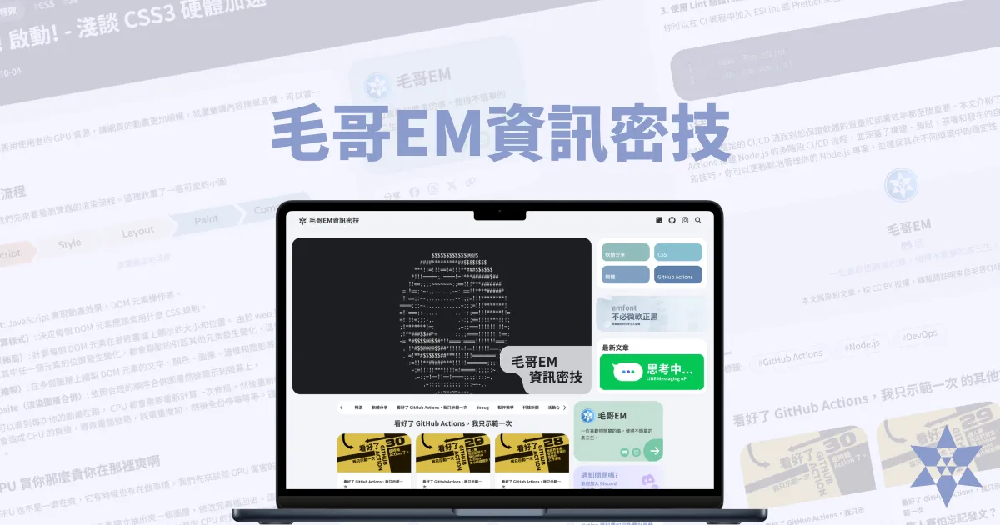

# emtech(EM's Tech Blog) 

https://emtech.cc

  

**emtech** is a blog I started during the COVID-19 pandemic in junior high school. My passion for 3C (computer, communication, and consumer electronics) products since childhood has driven me to accumulate rich skills and creative experiences through self-learning. Noticing that many excellent software and tools lack Chinese-language resources—often offering only English documentation that is hard to understand—I decided to create a personal blog. My goal is to share how to use these tools in simple and accessible language, enabling even those unfamiliar with programming to get started with ease.

This blog has been running since junior high school and has remained active for nearly four years, featuring original works such as self-developed tools and development techniques. It boasts over **1.4 million words** (equivalent to 2.6 volumes of *Records of the Grand Historian*), drawing attention from educators, students, and enterprises across Taiwan. I frequently receive inquiries from readers, assisting them in solving real-world development challenges.

---

## emblog

In the blog's early days, I used **Hugo** as the generator. However, in pursuit of ultimate performance, lightweight design, customizability, and security, I decided to develop my own blog generator from scratch—**emblog**. This self-made generator supports modern **SEO requirements** and achieves a seamless **Single Page Application (SPA)** experience without relying on frontend frameworks. Pages load instantly, animations run smoothly, and it integrates all the features I need, meeting extremely high standards for customization.

> Learn more about emblog: [emblog - A Unique Blog Generator](https://emtech.cc/p/emblog)

Currently, emblog is specifically tailored to emtech and lacks many generic features for broader customization. For this reason, it is not yet available for public use. However, all code is released under the **Apache 2.0 license**, and you are welcome to modify and use it. When I have time in the future, I plan to develop a version accessible to everyone. Stay updated by following my [GitHub](https://github.com/Edit-Mr/emtech).

---

Although **emtech** is not as famous as well-known blogs, its articles consistently help students, teachers, and professionals overcome technical challenges. Search engines even recommend the site actively. Every time I assist someone struggling with technical difficulties, it reinforces my motivation to maintain this platform. With around **1,000 daily visits**, the current ad revenue is sufficient to cover all server and domain expenses for my open-source projects, achieving fully independent operation.

> *Holding a pen, I want to write something*  
> *Thinking it's a weapon to uphold justice*  
> *No one cares, but it doesn't matter*  
> *At least I still have you*  
> —*No Party for Cao Dong, "Damn"*