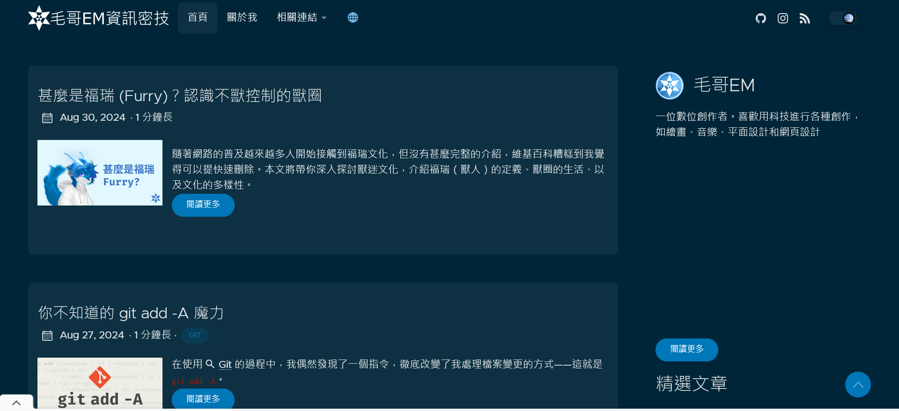

# emtech

毛哥EM資訊密技

<https://emtech.cc>



## How to deploy?

### Prerequisites

- Node.js (version >= 14)
- Git
- A platform that supports static website deployment, such as GitHub Pages, Netlify, or Vercel

### Deployment Steps

#### 1. Clone the Repository

First, clone the repository to your local environment:

```bash
git clone https://github.com/your-username/your-repo.git
cd your-repo
```

#### 2. Install Dependencies

If your project requires any tools to convert or display Markdown files (e.g., Docusaurus, MkDocs, or Docsify), follow these steps to install the necessary dependencies.

For example, if you are using Docsify:

```bash
npm install -g docsify-cli
```

#### 3. Local Preview

You can preview your Markdown files locally using Docsify or another tool.

To preview with Docsify:

```bash
docsify serve docs
```

This will start a local server, and you can view the documentation in your browser at `http://localhost:3000`.

#### 4. Deploy to GitHub Pages

If you wish to deploy the files to GitHub Pages, follow these steps.

##### 4.1 Create the gh-pages Branch

You need to deploy the documentation to the `gh-pages` branch for GitHub Pages:

```bash
docsify init ./docs
```

##### 4.2 Automate Deployment

You can automate the deployment process using GitHub Actions. Here’s a simple GitHub Actions configuration. Place it in `.github/workflows/deploy.yml`:

```yaml
name: Deploy to GitHub Pages

on:
  push:
    branches:
      - main # Deploy when changes are pushed to the main branch

jobs:
  deploy:
    runs-on: ubuntu-latest

    steps:
      - name: Checkout repository
        uses: actions/checkout@v2

      - name: Setup Node.js
        uses: actions/setup-node@v2
        with:
          node-version: "20"

      - name: Install Docsify
        run: npm install -g docsify-cli

      - name: Build and Deploy
        run: |
          docsify init ./docs
          docsify serve
        env:
          GITHUB_TOKEN: ${{ secrets.GITHUB_TOKEN }}
```

#### 5. Deploy to Other Platforms (e.g., Netlify or Vercel)

If you prefer to deploy your documentation to other platforms like Netlify or Vercel, follow these steps.

##### 5.1 Deploy to Netlify

1. Sign in to [Netlify](https://www.netlify.com/) and connect your GitHub account.
2. Select your project repository.
3. Set the `build command` to `docsify serve docs`, and set the `publish directory` to `docs`.
4. Click **Deploy**.

##### 5.2 Deploy to Vercel

1. Sign in to [Vercel](https://vercel.com/) and connect your GitHub account.
2. Select your project repository.
3. Set the `build command` to `docsify serve docs` and the `output directory` to `docs`.
4. Click **Deploy**.
