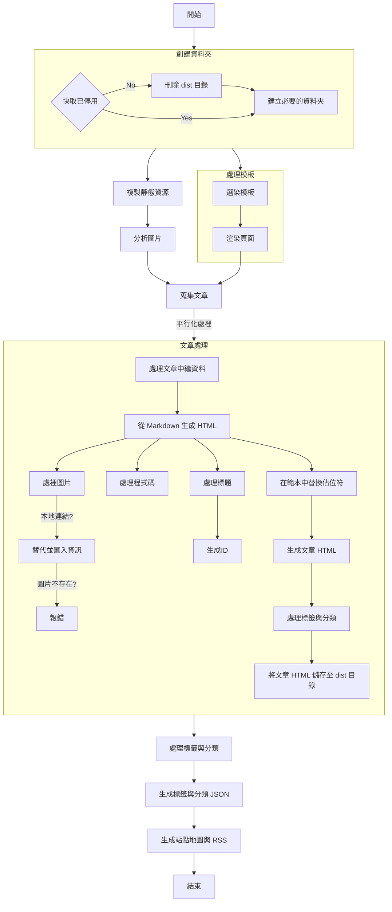

# 毛哥EM資訊密技

<https://emtech.cc> | [英文版 README](README.en.md)

  

毛哥EM 資訊密技是我毛哥EM 在國二疫情期間開始的部落格。從小對 3C 產品的熱愛，讓我在自學中累積了豐富的技能與創作經驗。由於發現許多優秀軟體和工具缺乏中文資源，官方文件多為英文且不易理解，我決定創辦個人部落格，以淺顯易懂的語言向大眾分享如何使用這些工具，即使是對程式設計不熟悉的人也能輕鬆上手。

這個部落格從國中開始運營，至今已持續更新近四年，內容涵蓋自製工具、開發技術等稀有的原創作品，累積超過 140 萬字（相當於 2.6 本《史記》）。吸引了全台教師、學生、與企業的關注，經常收到讀者的來信詢問，協助解決實際開發中的挑戰。

## emblog

部落格初期使用 Hugo 作為生成器，但為了追求效能極致、輕量化、可定制性與安全性，我決定從零開始開發屬於自己的部落格生成器 - emblog。這款自製生成器支援現代的 SEO 要求，並透過無前端框架實現了單頁應用（SPA）的流暢體驗，達成零等待載入頁面，動畫順暢，還內建了我所需的各項功能，達到極高的客製化標準。

> 閱讀更多關於 emblog 的資訊：[emblog - 一個不一樣的部落格生成器](https://emtech.cc/p/emblog)

emblog 目前不管是從設計到裡面的核心皆是為毛哥EM 資訊密技打造，缺少許多自訂功能，所以目前尚未對外開放使用。不過所有程式碼皆以 Apache 2.0 授權條款釋出，歡迎自行修改使用。等我之後有空應該會做成能讓大家使用的部落格生成器。歡迎關注我的 [GitHub](https://github.com/Edit-Mr/emtech) 以獲取最新消息。

「毛哥EM 資訊密技」雖然名氣不如知名部落客，但文章總能幫助到面臨技術挑戰的學生、老師和社會人士，也讓搜尋引擎主動推薦本站文章。每當能夠幫助到一位獨自在技術困境中掙扎的朋友，便是我持續維護這個平台的最大動力。每日有約千次瀏覽，現有的廣告收益足以支持我所有開源專案的伺服器和網域費用，實現了自主運營。

> 拿著筆 想寫點東西  
> 以為是武器能伸張正義  
> 沒人理也沒關係  
> 至少我還有你  
> -草東沒有派對《但》

