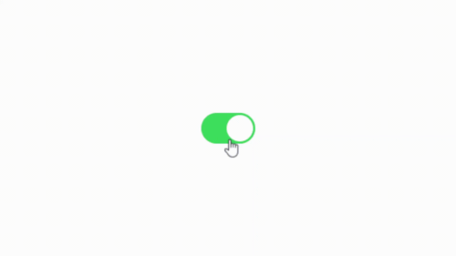

# Day14 今天我想來點… 純 CSS 的開關

在手機開關的設定裡面通常不是 checkbox，而是這種 toggle 開關。因為比較好看，且更有開關的感覺。


廢話不多說，今天就來把它做出來吧

## 原理

開關本身還是 checkbox 勾選框，但是我們把原本勾勾的隱藏起來，然後用圓形開關代替。當被勾選時白色的圓形移動到右邊，而背景顏色漸變成綠色。

寫 checkbox 的 CSS 時因為

- `input` 是插入一個元素，而不是一個範圍，所以不能使用 `::before` 和 `::after` 來做。
- checkbox 顯示一定是正方形，如果設置為其他長寬比塊白的地方還是可以點擊。
  
- checkbox 無法設定背景顏色

問題那麼多，因此我們只需要 input 幫我們掛名存狀態，然後把它藏在角落裡面就好了。

我們需要用其他元素來做開關的外觀。可以讓 checkbox 隱藏在 HTML 較前面的部分，然後用其他元素來控制 checkbox 的狀態。而能夠遠端遙控 checkbox 的元素叫做 `label` 。我們可以用 `label` 來控制 checkbox 的狀態。只需要點擊 `label` checkbox 也會感覺到。

## 開始製作

HTML 如下，我想用這個開關來控制背景顏色。

```html
<input type="checkbox" id="switch" />
<label class="toggle" for="switch"></label>
<div class="light"></div>
```

先簡單切版

```css
*,
label::after {
    margin: 0;
    padding: 0;
    transition: all 0.3s;
}
#switch {
    display: none;
}
label {
    width: 3.5rem;
    height: 2rem;
    background: #e9e9eb;
    border-radius: 1rem;
    position: relative;
    cursor: pointer;
}
body {
    display: flex;
    justify-content: center;
    align-items: center;
    min-height: 100svh;
}
.light {
    position: fixed;
    width: 100%;
    height: 100%;
    left: 0;
    top: 0;
    z-index: -1;
    background: #444444;
}
label::after {
    position: absolute;
    left: 0.15rem;
    top: 0.15rem;
    content: "";
    width: 1.7rem;
    height: 1.7rem;
    border-radius: 50%;
    background: #fff;
    pointer-events: none;
}
```


這樣你會得到一個非常簡單的版面。而按鈕是在框框範圍都可以點選的。

接著我們讓按鈕被勾選時，背景顏色漸變成白色。我們為了讓元素可以抓到勾選框的狀況，`<input>`需要被放在所有元素的前面。因為我們有選擇器`+`選擇後面的一個元素，`~`選擇所有後面的元素。

```css
input:checked + label {
    background: #34c85a;
}
input:checked + label::after {
    left: 1.65rem;
}
input:checked ~ .light {
    background: #fff;
}
```

最後成果如下

https://codepen.io/edit-mr/pen/KKbZjOq



```html
<input type="checkbox" id="switch" />
<label class="toggle" for="switch"></label>
<div class="light"></div>
```

```css
*,
label::after {
    margin: 0;
    padding: 0;
    transition: all 0.3s;
}
#switch {
    display: none;
}
label {
    width: 3.5rem;
    height: 2rem;
    background: #e9e9eb;
    border-radius: 1rem;
    position: relative;
}
body {
    display: flex;
    justify-content: center;
    align-items: center;
    min-height: 100svh;
}
.light {
    position: fixed;
    width: 100%;
    height: 100%;
    left: 0;
    top: 0;
    z-index: -1;
    background: #444444;
}
label::after {
    position: absolute;
    left: 0.15rem;
    top: 0.15rem;
    content: "";
    width: 1.7rem;
    height: 1.7rem;
    border-radius: 50%;
    background: #fff;
    pointer-events: none;
}

input:checked + label {
    background: #34c85a;
}
input:checked + label::after {
    left: 1.65rem;
}
input:checked ~ .light {
    background: #fff;
}
```

以上就是我今天的分享，你可以根據你的喜好增加陰影或其他動畫效果。歡迎在 [Instagram](https://www.instagram.com/emtech.cc) 和 [Google 新聞](https://news.google.com/publications/CAAqBwgKMKXLvgswsubVAw?ceid=TW:zh-Hant&oc=3)追蹤[毛哥EM資訊密技](https://emtech.cc/)，也歡迎訂閱我新開的[YouTube 頻道：網棧](https://www.youtube.com/@webpallet)。

我是毛哥EM，讓我們明天再見。
