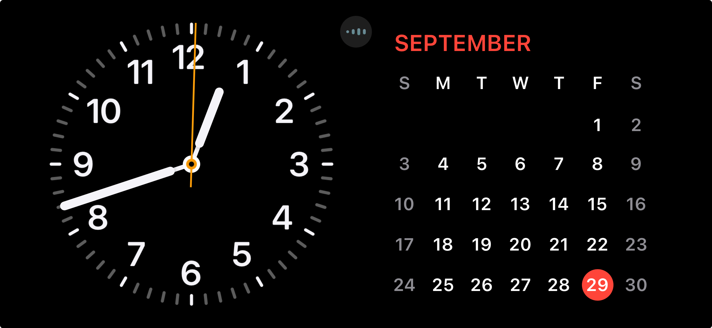
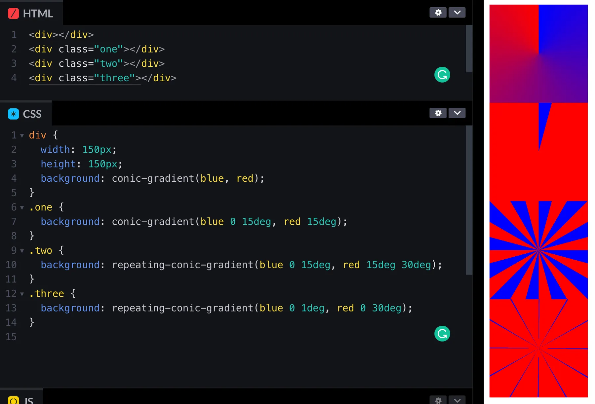
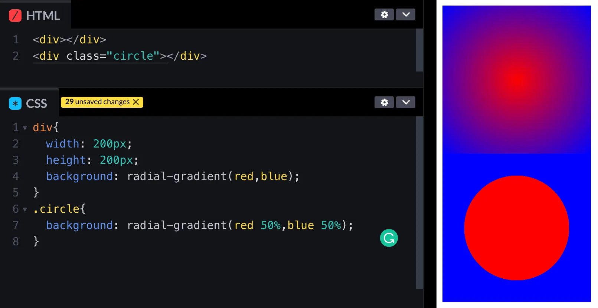
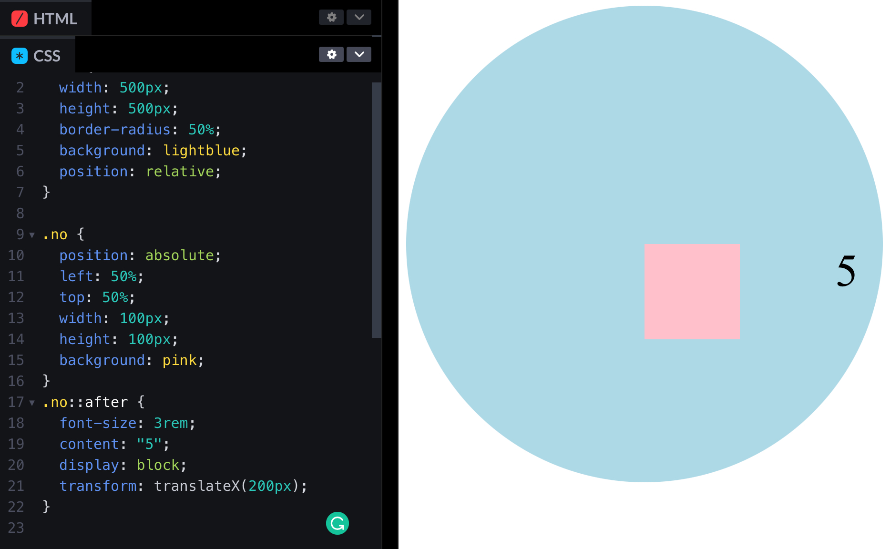
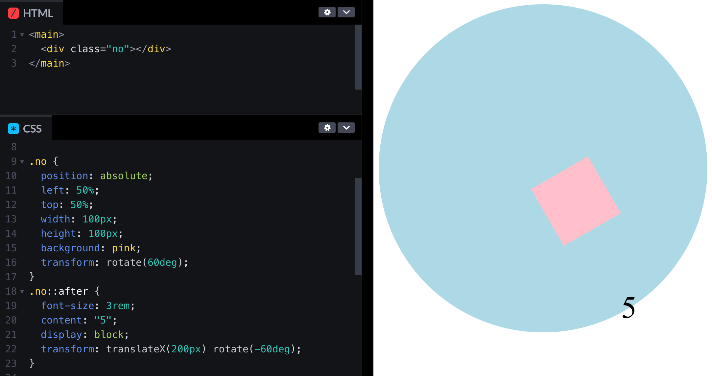
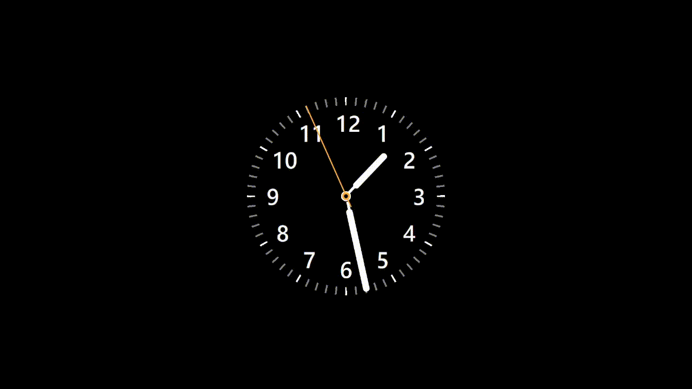

# Day16 今天我想來...欸現在幾點？- CSS 畫出 iOS 時鐘

今天我們要來製作一個時鐘。不使用圖片，只使用 CSS 來繪製。我的目標是可以做出類似於 Apple iOS17 StandBy 的時鐘效果。



## HTML

首先是 HTML，非常老實。一個時鐘，裡面 3 個指針，兩個中間的裝飾軸圓圈，以及 12 個數字。度數和數字分別用 CSS 變數和 HTML 屬性存放。當然你要都用 CSS 也可以，我只是想示範怎麼使用。

```html
<div class="clock">
    <div class="hour-hand"></div>
    <div class="minute-hand"></div>
    <div class="second-hand"></div>
    <div class="clockCenter"></div>
    <div class="clockCenterCenter"></div>
    <div class="digit" style="--deg: 0;" data-digit="12"></div>
    <div class="digit" style="--deg: 30;" data-digit="1"></div>
    <div class="digit" style="--deg: 60;" data-digit="2"></div>
    <div class="digit" style="--deg: 90;" data-digit="3"></div>
    <div class="digit" style="--deg: 120;" data-digit="4"></div>
    <div class="digit" style="--deg: 150;" data-digit="5"></div>
    <div class="digit" style="--deg: 180;" data-digit="6"></div>
    <div class="digit" style="--deg: 210;" data-digit="7"></div>
    <div class="digit" style="--deg: 240;" data-digit="8"></div>
    <div class="digit" style="--deg: 270;" data-digit="9"></div>
    <div class="digit" style="--deg: 300;" data-digit="10"></div>
    <div class="digit" style="--deg: 330;" data-digit="11"></div>
</div>
```

## CSS

CSS 要怎麼畫出時鐘呢？我們會需要幫這個 `div` 添加幾個漸層。

### 時間刻度 - conic-gradient

為了方便大家比較我把圖放在一起。



`conic-gradient` 的語法和其他漸層語法很相似。繞一圈跑，可以設定開始和結束的角度，沒寫角度就自動平分。比如說第一個：

```css
div {
    width: 150px;
    height: 150px;
    background: conic-gradient(blue, red);
}
```

如果你這樣打會得到一個錐形。和 `linear-graient` 的圖形原理相同，就是不給他過度的區域。

```css
.one {
    background: conic-gradient(blue 0 15deg, red 15deg);
}
```

設定開始結束角度就可以改成 `repeating-conic-gradient` 讓他重複。記得是 `repeating` 不是 `repeat` 喔～

```css
.two {
    background: repeating-conic-gradient(blue 0 15deg, red 15deg 30deg);
}
```

最後把角度條寫一點就可以囉～

```css
.three {
    background: repeating-conic-gradient(blue 0 1deg, red 0 30deg);
}
```

### 圓形 radial-gradient

`radial-gradient` 會從裡到外。一樣原理，不給他地方漸層就會出現圓形。~~讓他原形畢露~~



```css
div {
    width: 200px;
    height: 200px;
    background: radial-gradient(red, blue);
}
.circle {
    background: radial-gradient(red 50%, blue 50%);
}
```

這樣就可以把時鐘中間的部分挖出來囉。

### 旋轉時間

這個也蠻有趣的。首先在時鐘的中間放一個 `div`，用為元素在右邊放數字。



```html
<main>
    <div class="“no”"></div>
</main>
```

```css
main {
    width: 500px;
    height: 500px;
    border-radius: 50%;
    background: lightblue;
    position: relative;
}

.no {
    position: absolute;
    left: 50%;
    top: 50%;
    width: 100px;
    height: 100px;
    background: pink;
}
.no::after {
    font-size: 3rem;
    content: “5”;
    display: block;
    transform: translateX(200px);
}
```

旋轉方塊裡面裡面數字也會跟著轉。


```css
.no {
    position: absolute;
    left: 50%;
    top: 50%;
    width: 100px;
    height: 100px;
    background: pink;
    transform: rotate(60deg);
}
```

不過這樣數字就歪了！沒事，偽元素轉回來就好了。



```css
.no::after {
    font-size: 3rem;
    content: “5”;
    display: block;
    transform: translateX(200px) rotate(-60deg);
}
```

你會發現因為我們剛才所有元素定位點都是靠上對齊所以有點偏移，沒關係最後再校正回歸就可以了。

### 指針

指針就跟剛才的粉紅正方形一樣，只是長一點而已。選轉定位點記得放在中間上面喔，這樣才能指對方向。

```css
transform-origin: center center;
```

### 在一起

把以上所以的和在一起吧。

```css
body {
    display: flex;
    align-items: center;
    justify-content: center;
    min-height: 100svh;
    background: #000;
    font-family: system-ui;
    font-weight: 800;
}
.clock {
    width: 300px;
    height: 300px;
    background:
        radial-gradient(#000 65%, transparent 10%),
        repeating-conic-gradient(
            from -0.5deg,
            #fff 0 1deg,
            transparent 0deg 30deg
        ),
        repeating-conic-gradient(
            from -0.5deg,
            gray 0 1deg,
            transparent 0deg 6deg
        );
    border-radius: 50%;
    position: relative;
}
.digit::before {
    content: attr(data-digit);
    display: block;
    transform: rotate(calc(var(--deg) * -1deg));
    text-align: center;
}
.digit {
    position: absolute;
    top: calc(50% - 15px);
    left: calc(50% - 16px);
    width: 1em;
    height: 1em;
    font-size: 2em;
    color: #fff;
    transform: rotate(calc(var(--deg) * 1deg)) translateY(-115px);
    transform-origin: center center;
}
.clockCenter,
.clockCenterCenter {
    position: absolute;
    top: 50%;
    left: 50%;
    transform: translate(-50%, -50%);
    width: 12px;
    height: 12px;
    background: #ffaf3f;
    border: 0.1em solid #fff;
    border-radius: 50%;
    display: block;
}
.clockCenterCenter {
    background: #000;
    border: none;
    width: 6px;
    height: 6px;
    z-index: 10;
}
.hour-hand,
.minute-hand,
.second-hand {
    position: absolute;
    top: 50%;
    left: 50%;
    background-color: #fff;
    transform-origin: top center;
}
.hour-hand,
.minute-hand {
    width: 10px;
    height: 70px;
    margin-left: -5px;
    border-radius: 5px;
}
.minute-hand {
    height: 128px;
}
.hour-hand::after,
.minute-hand::after {
    transform: translateY(-0.7em);
    display: block;
    content: "";
    width: 4px;
    margin-left: 33.333333%;
    height: 50px;
    background-color: #fff;
}
.second-hand {
    width: 2px;
    height: 168px;
    margin-left: -0.7px;
    background-color: #ffaf3f;
    border-radius: 2px 2px 0 0;
    transition: transform 0.2s;
}
```

## JavaScript

JavaScript 沒有什麼難的。就是小學數學題算時鐘走幾度。比如說秒針一分鐘走一圈，所以一秒走 360 除以 60 等於 6 度。

需要注意一下的是因為指針的定位點在中間上面，所以一開始是在 6 點鐘方向。你可以把指針改成從中間下面對齊，或著是度數直接加半圈。

```js
const hourHand = document.querySelector(”.hour-hand“);
const minuteHand = document.querySelector(”.minute-hand“);
const secondHand = document.querySelector(”.second-hand“);
function updateClock() {
  const now = new Date();
  const hours = now.getHours();
  const minutes = now.getMinutes();
  const seconds = now.getSeconds();
  const hourRotation = ((hours % 12) * 360) / 12 + ((minutes / 60) * 360) / 12 + 180;
  const minuteRotation = ((minutes % 60) * 360) / 60 + ((seconds / 60) * 360) / 60 + 180;
  const secondRotation = ((seconds % 60) * 360) / 60 + 180;
  hourHand.style.transform = `rotate(${hourRotation}deg) translateY(18px)`;
  minuteHand.style.transform = `rotate(${minuteRotation}deg) translateY(20px)`;
  secondHand.style.transform = `rotate(${secondRotation}deg) translateY(-18px)`;
}

setInterval(updateClock, 1000);
updateClock();
```

正當你以為終於結束的時候，你無意間看到了這個畫面…


結果對了，方法錯了。因為角度降回 180，結果他還真的轉回去。


想要讓他一直轉下去就要提醒他莫忘初衷，把之前轉的度數都加進去即可。

```js
const hourHand = document.querySelector(".hour-hand");
const minuteHand = document.querySelector(".minute-hand");
const secondHand = document.querySelector(".second-hand");
function updateClock() {
  const now = new Date();
  const hours = now.getHours();
  const minutes = now.getMinutes();
  const seconds = now.getSeconds();
  const hourRotation =
    ((hours % 12) * 360) / 12 + ((minutes / 60) * 360) / 12 + 180;
  const minuteRotation =
    ((minutes % 60) * 360) / 60 +
    ((seconds / 60) * 360) / 60 +
    180 +
    hours * 360;
  const secondRotation =
    ((seconds % 60) * 360) / 60 + 180 + （hours * 60 + minutes） * 360;
  hourHand.style.transform = `rotate(${hourRotation}deg) translateY(18px)`;
  minuteHand.style.transform = `rotate(${minuteRotation}deg) translateY(20px)`;
  secondHand.style.transform = `rotate(${secondRotation}deg) translateY(-18px)`;
}

setInterval(updateClock, 1000);
updateClock();
```

終於成功啦！有個 87% 像吧 w

https://codepen.io/edit-mr/pen/wvRXMLG



以上就是我今天的分享。我有看到有人是算了第一個角度之後就每秒固定加上去度數。不過萬一你有延遲或者是卡頓他的時間就會跑掉了，所以我還是建議每次都重新抓時間做計算。歡迎在 [Instagram](https://www.instagram.com/emtech.cc) 和 [Google 新聞](https://news.google.com/publications/CAAqBwgKMKXLvgswsubVAw?ceid=TW:zh-Hant&oc=3)追蹤[毛哥EM資訊密技](https://emtech.cc/)，也歡迎訂閱我新開的[YouTube 頻道：網棧](https://www.youtube.com/@webpallet)。

我是毛哥EM，讓我們明天再見。
