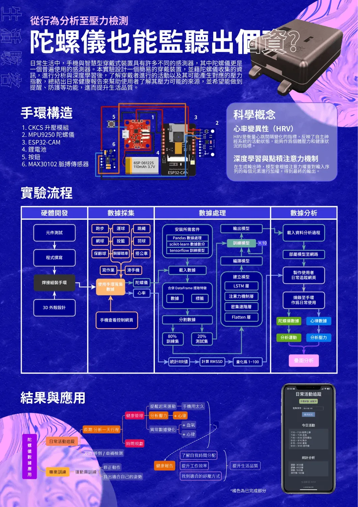

# 2024 仰望盃心得

在 2024 年 5 月 4 日我們生活駭客團隊參與了【2024 仰望盃全國科學 HomeRun 實作大賽】決賽，並獲得了銅牌獎。雖然多少有些遺憾，但真的是十分難得的經驗。仰望盃是一個十分新的科學競賽，過程中有許多早知道就好的事情，因此這次就來分享一下我的心得以及一些注意事項。

{{notice}}
溫馨提醒

這篇文章撰寫時是以 2024 年的比賽為主。從第一屆到第二屆就有非常大的變化，因此可能有些內容在未來的比賽中會有所改變。這裡有我們的[作品說明書](https://phys5.ncue.edu.tw/2024science/word/202410.pdf)提供參考。

{{noticed}}

## 仰望盃到底在做甚麼？

根據官網的活動目的：

> 推行 STEM 教育學習模式，鼓勵學生思考設計專題實作。利用 Arduino、ESP、Micro-bit 系列開發板，探索自然科學問題，整合不同學科知識，進行探究與實作設計，推動科學專題研究。
>
> 科學實作競賽活動，目的在研究自然科學。以團隊合作的方式，結合電子科技與工程結構，透過程式運算思維，妥善運用科技工具，培養學生動手實作，以所學科學概念解決科學問題。

當時我們的理解是要使用科學概念來解決問題，並且使用開發板來製作一個專題。不過從結果上可以看出這個比賽不是黑客松那種專題開發競賽，而是科學實驗競賽。你使用開發版製作的是一個實驗裝置，而不是一個應用程式。

## 容易踩到的坑

以下是一些我整理出來我們或是其他隊伍在比賽中踩到的坑：

### 1. 參賽作品至少需包含 2 種科學概念。

科學概念不是感測器原理，而是在你的作品中有使用到的科學知識。數量可以超過兩項。

### 2. 作品須使用 Arduino、ESP 或 Micro-bit 系列之開發板作為控制板，其使用開發板之數量 1 片或多片。

意思是說你只能使用這三個廠牌，不能使用其他開發版。

- 使用一塊 Arduino UNO + 一塊 ESP32-CAM 是可以的。
- 使用 ESP-32 + 樹莓派是不可以的。
- 使用 Raspberry Pi Pico 來代替 Arduino Nano 是不可以的。

### 3. 每件作品材料及開發板成本限額 4000 元 (大會不補助)。

要列出到多具體沒有寫得很清楚，像是行動電源，3D 列印機等等，到底算不算在內。但你就大概列一下材料的費用即可。會有人來稍微簡單確認一下。

> 若作品有使用到網際網路，提供網路的設備不計入作品設計費，該設備只作為提供網路給作品使用。決賽時並請提供「作品設計支出明細表」(如附件四)。

雖然是這樣說，但洪連輝教授表示使用雲端運算資源不受此限。所以如果你把一個 Arduino 接上 WiFi，後面接了 NVIDIA H100 超過 45 萬的顯卡，還是符合 4000 元的限制。

無論如何，這一次的比賽是一個很好的經驗。雖然結果沒有想像中好，但我們對於我們自己的作品很滿意，也了解問題在哪裡。最後來分享一下我們的作品：

## 我們的作品

由於現代學生不管從課業還是人際關係都有著不少的壓力，因此我們結合了物理、生物、深度學習、3D 列印以及各種開發技術設計了一款適合日常配戴的手環，能夠自動採集陀螺儀與心律數據，利用感測數據分析心率變化來量化使用者的壓力指數，並分析整天的壓力變化，識別壓力來源。

我們基於手部陀螺儀數據，成功訓練出一個小於 300 KB 的運動分析模型。只需要使用不到 300 元的自製手環、蒐集 3 秒的數據，就能達到 97% 的準確率。

整個過程從數據採集到分析結果，皆以網頁互動式圖表控制與呈現，讓使用者操作更為簡單。我們的研究不依賴昂貴的硬體資源，而是使用樹莓派來完成所有步驟，為未來的運動監測與健康管理提供了新思路。

在這次實驗中，我們採用了敏捷式開發，不斷疊代手錶設計，從元件架構、列印材質到模型訓練方式，前後經歷了十幾個版本，甚至燒壞了 4 塊 ESP-32 cam。在此過程中，我不僅提升了焊接技能，對深度學習的應用也有了更深入的理解，包括如何將資料轉為 DataFrame、應用 LSTM 和注意力機制來幫助模型更好地理解數據的關鍵部分，並選擇合適的優化器、損失函數與評估指標。

## 心得

诶們整個作品的技術含量絕對是高的，但可以明顯得看得出來它探究的成分偏少，因此在比賽中沒有得到最高的分數。當時會這樣做除了比賽較新所以網路上的資料也比較少，每年比賽規則的變動蠻大的，看以往的作品也大多是開發。但希望這篇文章能夠幫助到你，讓你在比賽中少走一些彎路。

最後要來感謝我 [SYTV](https://sytv.scaict.org/) 的隊友 [OWEN](https://github.com/OWEN2222)、[魏均翰](https://github.com/789sw)、[趙昱凱](https://github.com/yukaichao1029)。也要感謝我們的指導老師張雨勝老師、賴怡旬老師、師丈、還有拿鐵。以及在背後支持我們的班導洪苑玲老師、符德馨老師、以及林彥呈主任。

如果你有任何問題都可以在 IG 留言，也歡迎在 [Instagram](https://www.instagram.com/em.tec.blog) 和 [Google 新聞](https://news.google.com/publications/CAAqBwgKMKXLvgswsubVAw?ceid=TW:zh-Hant&oc=3)追蹤[毛哥EM資訊密技](https://em-tec.github.io/)。

> 封面圖我很努力找了但每一張圖片都有人渣眼。
