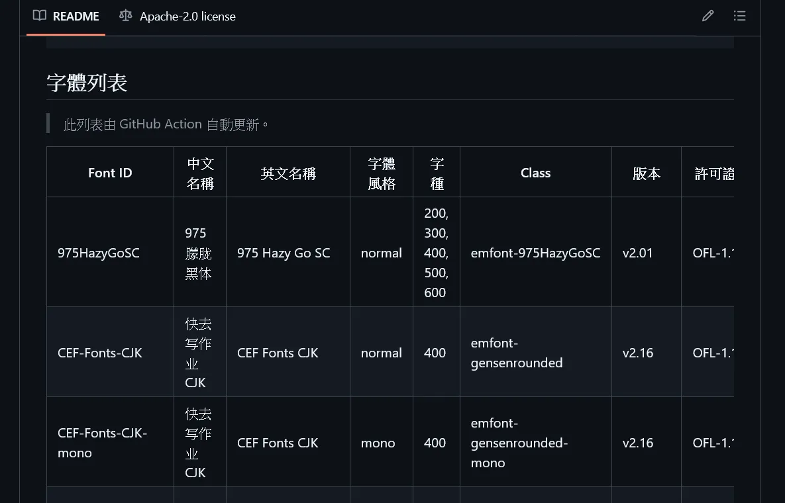

# 渲染 Markdown 文件 - 自動生成和更新項目文檔

> 司馬遷如果使用 GitHub Actions 就可以自動更新《史記》了。

在這篇教程中，我們將探討如何使用 GitHub Actions 自動生成和更新 Markdown 文件。

我們要使用 Actions 自動從 `fonts.json` 文件中生成一個格式化的字體列表並更新 `README.md` 文件。這包括讀取 JSON 文件內容、生成 Markdown 表格，以及在 README 文件中更新這些內容。

> 今日範例程式：<https://github.com/Edit-Mr/2024-GitHub-Actions/tree/main/20>

## 1. 背景與目標

emfont 是一個免費的繁體中文 Web Font 服務。在之前字體列表存放在 `Database/fonts.json` 文件中，我們希望自動更新 `README.md` 文件中的字體列表。這樣可以確保文檔始終保持最新狀態，並且減少了手動更新的工作量。



> emfont GitHub: <https://github.com/emfont/emfont>

今天我們要來復刻這個專案。首先請你準備 `fonts.json`。你可以透過上面的 GitHub 連結下載。這個 JSON 文件包含了字體的詳細信息，例如名稱、風格、字種、版本、許可證和來源。以下是 JSON 文件的一部分內容：

```json
{

    "975HazyGoSC":{
        "name": { "zh": "975 朦胧黑体", "en": "975 Hazy Go SC" },
        "style": "normal",
        "weight": [200,300,400,500,600],
        "class": "emfont-975HazyGoSC",
        "version": "v2.01",
        "license": "OFL-1.1",
        "source": "https://github.com/lxgw/975HazyGo"
    },
    "CEFFontsCJK":{
        "name": { "zh": "快去写作业 CJK", "en": "CEF Fonts CJK" },
        "style": ["normal","mono"],
        "weight": [400],
        "class": "emfont-CEFFontsCJK",
        "version": "v2.16",
        "license": "OFL-1.1",
        "source": "https://github.com/Partyb0ssishere/cef-fonts-cjk "
    },
    "ChenYuLuoYan":
    {
        "name": { "zh": "辰宇落雁體", "en": "ChenYuLuoYan Thin" },
        "style": "normal",
        "weight": [400],
        "class": "emfont-ChenYuLuoYan",
        "version": "v1.0",
        "license": "OFL-1.1",
        "source": "https://github.com/Chenyu-otf/chenyuluoyan_thin"
    },
```

接下來我們要來準備 README.md。這個文件將會包含字體列表。我們將在 `<!-- fonts table start -->` 和 `<!-- fonts table end -->` 之間插入 Markdown 表格。

```markdown
# emfont

免費的繁體中文 Web Font 服務。

> 如果你喜歡這個項目，認同我們的理念，歡迎在 GitHub 給我們 ⭐ 一顆星星，分享給你的朋友，或是留下你寶貴的意見。

## 字體列表

<!-- fonts table start -->

<!-- fonts table end -->
```

## 設定 GitHub Actions

我們將設定 GitHub Actions 自動更新 `README.md` 文件。當 `Database/fonts.json` 文件有變動時，工作流程會自動執行，生成新的 Markdown 表格並更新 README 文件。

### 步驟 1：創建 GitHub Actions 工作流程

在 `.github/workflows` 目錄下創建一個新的 YAML 文件，例如 `update-font-list.yml`，並添加以下內容：

```yaml
name: Update Font List

on:
    push:
        paths:
            - "Database/fonts.json"
    workflow_dispatch:

jobs:
    update-readme:
        runs-on: ubuntu-latest

        steps:
            - name: Checkout repository
              uses: actions/checkout@v3

            - name: Set up Node.js
              uses: actions/setup-node@v3
              with:
                  node-version: "20"

            - name: Update README.md
              run: node src/workflows/update-readme.js

            - name: Check for changes
              id: git-diff
              run: |
                  git diff --quiet || echo "::set-output name=changes::true"

            - name: Commit and Push Changes
              run: |
                  if [[ "${{ steps.git-diff.outputs.changes }}" == "true" ]]; then
                    git config --local user.email "action@github.com"
                    git config --local user.name "GitHub Actions"
                    git add .
                    git commit -m "📋 Update font list"
                    git push
                  else
                    echo "No changes to commit. Skipping push."
                  fi
```

這個工作流程會在 `Database/fonts.json` 文件發生變更時自動執行，並更新 `README.md` 文件中的字體列表。

> 今天沒有要使用第三方套件，所以不需要安裝，也不需要設定 GitHub Secrets。

### 步驟 2：編寫生成 Markdown 的腳本

在 `src/workflows` 目錄下創建 `update-readme.js` 文件，並添加以下內容：

```javascript
import fs from "fs";
import path from "path";
import { fileURLToPath } from "url";

// Convert __dirname to work with ES modules
const __filename = fileURLToPath(import.meta.url);
const __dirname = path.dirname(__filename);

const fontsFilePath = path.join(__dirname, "..", "..", "Database", "fonts.json");
const readmeFilePath = path.join(__dirname, "..", "..", "README.md");

// Read and parse the fonts.json file
const fontsData = JSON.parse(fs.readFileSync(fontsFilePath, "utf8"));

// Function to convert JSON data to a markdown table
function generateMarkdownTable(data) {
	const headers = ["Font ID", "中文名稱", "英文名稱", "字體風格", "字種", "Class", "版本", "許可證", "來源"];
	const rows = Object.entries(data).map(([id, details]) => {
		const { name, style, weight, class: className, version, license, source } = details;
		return [id, name.zh || "", name.en || "", style || "", weight.join(", ") || "", className || "", version || "", license || "", source || ""].join(" | ");
	});

	const table = [headers.join(" | "), headers.map(() => "---").join(" | "), ...rows].join("\n");

	return table;
}

// Generate the markdown table
const markdownTable = generateMarkdownTable(fontsData);

// Read the current README.md file
const readmeContent = fs.readFileSync(readmeFilePath, "utf8");

// Update the section of the README.md file where the table should be inserted
const updatedReadmeContent = readmeContent.replace(/<!-- fonts table start -->[\s\S]*<!-- fonts table end -->/, `<!-- fonts table start -->\n${markdownTable}\n<!-- fonts table end -->`);

// Write the updated README.md file
fs.writeFileSync(readmeFilePath, updatedReadmeContent);

console.log("README.md has been updated");
```

### 腳本解析

- **讀取 JSON 文件**: 腳本從 `Database/fonts.json` 讀取字體數據。
- **生成 Markdown 表格**: `generateMarkdownTable` 函數將 JSON 數據轉換為 Markdown 格式的表格。
- **更新 README 文件**: 腳本讀取 `README.md` 文件，並將生成的 Markdown 表格插入到標記為 `<!-- fonts table start -->` 和 `<!-- fonts table end -->` 之間的區域。

## 小結

通過今天的教程，我們探討了如何使用 GitHub Actions 自動生成和更新 Markdown 文件。我們通過編寫腳本來從 JSON 文件生成 Markdown 表格，並將其更新到 `README.md` 文件中。這樣的自動化流程能夠確保文檔始終保持最新狀態，並且減少了手動更新的工作量。
