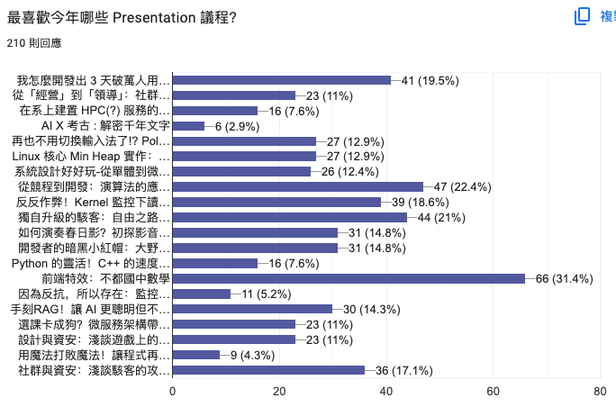

# SITCON 2025 心得與 Q&A

今年 SITCON 一樣很好玩。活動很順暢，設計很酷，很多地方看到很令人驚艷。雖然很多朋友來不及遇到但還是很開心。好多議程都好精彩，有幾個來不及聽到一定會去回放補一下。

回到我的議程「前端特效：不都國中數學」，這次有機會在中研院人文科學館主堂 R0 與大家分享我的開發經驗真的十分驚喜，很高興能和各位渡過這段美好時光。

這次的議程我們講了很多關於前端特效的思維、技巧、與實例。因為時間有限很多內容沒辦法講的太詳細以及回答所有的問題，因此這裡整理出來當天 Slido 大家的提問，並作比較完整的回答。

> 哦對了你們打錯字或沒有遵循中文文案排版指北的我~~一率懶得回答~~順便就幫你們修正了。

## 學習資源

> 今年高三，有九年網頁經驗，不就國小就開始寫？好強👍👍可以分享自學的訣竅嗎？

> 如想學更多那以可參考哪里的資料

現在相關書籍很多，網路上的資源很豐富，找有興趣的主題搜尋都很多文章或影片。最簡單的就是去找一系列鐵人賽的文章讀完跟著做，就能學到很多東西了。

我的部落格有一些以前不專業的 [基礎語法](https://emtech.cc/category/%E7%A8%8B%E5%BC%8F%E6%95%99%E5%AD%B8) 和 [去年鐵人賽的教學文章](https://emtech.cc/category/%E7%B6%B2%E9%A0%81%E9%96%8B%E7%99%BC)，可以給你做參考。其他議程提到的資源可以參考 [這次議程的 GitHub Repo](https://github.com/Edit-Mr/SITCON2025)。

> 要怎麼學會國中數學

國中我不確定有沒有補校。你可以去找身邊的國中生教你，或著是去參考書店買自修（？

## 技術問題

###  可以教怎麼用網頁寫履歷嗎？

如果你是要問怎麼用網頁製作紙本履歷，這問我的好朋友 [Riley](https://github.com/rileychh) 他比較熟。

如果是問怎麼用網頁製作網頁履歷，最簡單就是找你喜歡的開發者看看他們是怎麼排版製作的然後照著去修改。如果你是想知道我的個人網頁是怎麼做的可以參考 [GitHub 原始碼 README](https://github.com/Edit-Mr/intro)，我有整理出來裡面用到的技術。

###  講師有在用tailwindcss嗎，可以只用tailwindcss寫動畫嗎？

###  那個文章無感切換怎麼做的，為什麼都沒有頁面切換載入的感覺？

###  美感很爛怎麼做動畫

###  高斯模糊特效要怎麼優化，才不會有閃爍的問題

###  請問要如何配合Figma設計出好看的網頁，包跨轉場動畫那些等，可以直接轉成html嗎

###  假設一個一個網站的登入頁面，網頁渲染登入狀態你會推薦在伺服器端渲染好，還是讓頁面在client再另外用post去request 

###  想學前端做網頁，該從哪裡開始，有推薦的教學資源嗎

###  等等 我可以塞圓形在那邊？？？？？要怎麼那樣堆東西啊 

###  在這個到處都是 JS 框架的年代看到這麼純的 CSS 好感動 🥺

真的現代的前端框架越來越多越來越重。[大佬 Tonsky 最近寫了一篇文章](https://tonsky.me/blog/js-bloat/)統計各個網頁的 JavaScript 檔案大小。現在即使是簡單的網頁應用程式，也攜帶龐大且不必要複雜的 JavaScript。

## 個人問題

###  我要準備個申 想寫個個人網頁 請問怎樣可以驚艷教授

如果是要用「視覺」或是「技術難度」驚艷經驗豐富教授有一定的難度。要讓你的專案給教授留下深刻的印象十分考驗技巧。關於怎麼做備審可以參考我的 [特殊選才備審資料／學習歷程檔案怎麼做？](https://emtech.cc/p/srecruit-cv)。

###  要怎麼考上交大 🛐 -By Ching

[我的部落格 #特殊選才](https://emtech.cc/tag/%E7%89%B9%E6%AE%8A%E9%81%B8%E6%89%8D) 有整理出每一間學校的面試問題以及準備的建議，希望對你們有幫助。

> 其實我比較想問 Ching 大佬怎麼從交大轉到台大 🛐

###  想問是 BambooFox 社員嗎？怎麼會幫忙寫前端？

是

###  講師有藝術方面的經驗嗎？想做好的動畫是不是美感很重要

###  用什麼管道來認識很強的UI設計師？

###  請問你的部落格做了多久

###  Waterfox好用嗎？🥺

###  你都直接手搓css動畫還是會使用套件之類的？還是視專案情況而定？

###  毛哥會開課教前端嗎

###  做網頁會被 AI 取代嗎🥹

###  美感很爛的話有什麼簡單的 CSS 小密技嗎

###  如何當上 Awwwards 的常態評審？可以分享整個過程嗎？

###  簡報的Time duration怎麼設定

###  簡報用什麼做的

###  簡報怎麼這麼順

###  how to center a div

###  講師有獸裝嗎，有的話明年能穿來講課嗎!!!

目前還沒有。SITCON 已經佔兩次名額了明年應該不會再講了。明年應該會去開發組或製播組吧（如果我沒有又忘記按送出表單。）

