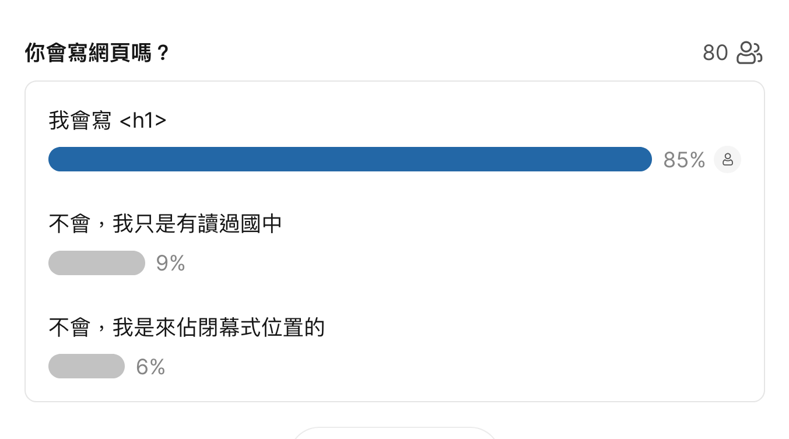

# SITCON 2025 心得與 Q&A

今年 SITCON 一樣很好玩。活動很順暢，設計很酷，很多地方看到很令人驚艷。雖然很多朋友來不及遇到但還是很開心。好多議程都好精彩，有幾個來不及聽到一定會去回放補一下。

回到我的議程「前端特效：不都國中數學」，這次有機會在中研院人文科學館主堂 R0 與大家分享我的開發經驗真的十分驚喜。這次的議程我們討論了很多關於前端特效的思維、技巧、與實例。因為時間有限很多內容沒辦法講的太詳細以及回答所有的問題，因此這裡整理出來當天 Slido 大家的提問，並作比較完整的回答。

> 哦對了你們打錯字或沒有遵循中文文案排版指北的我~~一率懶得回答~~順便就幫你們修正了。

{{notice}}

相關資源

這次議程的簡報、Credit、和相關資源都整理在 [GitHub Repo](https://github.com/Edit-Mr/SITCON2025) 裡面。

{{noticed}}

## 統計

在議程開始的時後我開了一個投票問各位有沒有開發經驗，看來真的有是來佔閉幕式座位的。



接下來就是所有的問答了。

## 學習資源

> 今年高三，有九年網頁經驗，不就國小就開始寫？好強👍👍可以分享自學的訣竅嗎？

> 如想學更多那以可參考哪里的資料

> 想學前端做網頁，該從哪裡開始，有推薦的教學資源嗎

> 毛哥會開課教前端嗎

在寫書了，再等我個半年一年吧。

現在相關書籍很多，網路上的資源很豐富，找有興趣的主題搜尋都很多文章或影片。最簡單的就是去找一系列鐵人賽的文章讀完跟著做，就能學到很多東西了。

我的部落格有一些以前不專業的 [基礎語法](https://emtech.cc/category/%E7%A8%8B%E5%BC%8F%E6%95%99%E5%AD%B8) 和 [去年鐵人賽的教學文章](https://emtech.cc/category/%E7%B6%B2%E9%A0%81%E9%96%8B%E7%99%BC)，可以給你做參考。其他議程提到的資源可以參考 [這次議程的 GitHub Repo](https://github.com/Edit-Mr/SITCON2025)。

> 要怎麼學會國中數學

國中我不確定有沒有補校。你可以去找均一的影片、找身邊的國中生教你、或著是去參考書店買自修（？

## 技術問題

### How to center a div

```css
margin: auto;
```

### 可以教怎麼用網頁寫履歷嗎？

如果你是要問怎麼用網頁製作紙本履歷，這問我的好朋友 [Riley](https://github.com/rileychh) 他比較熟。

如果是問怎麼用網頁製作網頁履歷，最簡單就是找你喜歡的開發者看看他們是怎麼排版製作的然後照著去修改。如果你是想知道我的個人網頁是怎麼做的可以參考 [GitHub 原始碼 README](https://github.com/Edit-Mr/intro)，我有整理出來裡面用到的技術。

### 講師有在用 Tailwind CSS 嗎，可以只用 Tailwind CSS 寫動畫嗎？

自己的專案不會用。Tailwind CSS 有提供一些動畫的 class，但是如果要做比較複雜的動畫可能就要自己寫 CSS 了。

### 那個文章無感切換怎麼做的，為什麼都沒有頁面切換載入的感覺？

額，因為真的沒有切換頁面 (？

這叫做 SPA（Single Page Application）單頁應用程式，透過 JavaScript 動態載入內容，不會重新載入整個頁面。這樣的好處是可以提升使用者體驗，不會有頁面閃爍的感覺。剩下的就是控制好圖片等檔案大小、減少 [CLS（Cumulative Layout Shift）](https://web.dev/articles/cls?hl=zh-tw)、Prerender 等等的性能最佳化。然後加點動畫轉移一下你的注意力就可以了。

### 美感很爛怎麼做動畫

建議可以先找覺得好看的網站來模仿。Awwwads 有很多很棒的網站可以參考。

### 美感很爛的話有什麼簡單的 CSS 小密技嗎

不要寫 CSS，本身就是一個 RWD 做好、SEO 做好的網頁了。

哦建議可以把新細明體改掉、然後圖片不要太大就還行了。

```css
body {
	font-family: system-ui;
}

img {
	max-width: min(100%, 500px);
}
```

### 高斯模糊特效要怎麼最佳化，才不會有閃爍的問題

CSS 高斯模糊（`backdrop-filter: blur()` 或 `filter: blur()`）在某些情況下可能會出現閃爍或性能問題，特別是在動態變化的場景（如 hover、scroll、動畫等）。

這裡簡單講幾個你可以做的事：

- [買一台比較好的電腦](https://emtech.cc/p/win-macbook)
- 不要用這麼多 (減少半徑、用 `overflow:hidden`、`clip-path` 等等屬性控制範圍)
- [騙瀏覽器啟動 GPU 硬體加速](https://emtech.cc/p/2023ironman-20) (`will-change`、`transform3D`)

### 請問要如何配合 Figma 設計出好看的網頁，包跨轉場動畫那些等，可以直接轉成 HTML 嗎

可以。你能做得出來，性能能接受，開心就好。

### 假設一個一個網站的登入頁面，網頁渲染登入狀態你會推薦在伺服器端渲染好，還是讓頁面在 client 再另外用 Post 去 request

這個問題其實是 SSR（Server Side Rendering）和 CSR（Client Side Rendering）的問題。這兩種方式各有優缺點，可以從速度、SEO、CDN 能不能幫你加速等等不同面相來討論。網路上的相關討論很多，我自己兩個都會使用。

### 等等 我可以塞圓形在那邊？？？？？要怎麼那樣堆東西啊

你應該是說內圓角。那個圓形比較像是示意圖。如果要在一個正方形的 `<div>` 或 `::after` 等元素上面疊內切四分之一圓形有很多方法，比如說你可以使用 `background-image`、`border-radius`、`clip-path` 等等。我很喜歡的開發者 [chokcoco 曾經有寫過一篇文章探討這個問題](https://github.com/chokcoco/iCSS/issues/271)，你可以參考看看。文章探討這個問題，你可以參考看看。當然你也可以直接 F12 看看我這個網站是怎麼做的。

### 在這個到處都是 JS 框架的年代看到這麼純的 CSS 好感動 🥺

真的現代的前端框架越來越多越來越重。[大佬 Tonsky 最近寫了一篇文章](https://tonsky.me/blog/js-bloat/)統計各個網頁的 JavaScript 檔案大小。現在即使是簡單的網頁應用程式，也攜帶龐大且不必要複雜的 JavaScript。你看 Google，沒有特效，沒有動畫，就只是顯示一堆超連結，可以花 9 MB 的 JavaScript。

> 哦當然還有各種「讓你上網體驗更好」的追蹤器。

## 個人問題

### 我要準備個申 想寫個個人網頁 請問怎樣可以驚艷教授

如果是要用「視覺」或是「技術難度」驚艷經驗豐富教授有一定的難度。要讓你的專案給教授留下深刻的印象十分考驗技巧。關於怎麼做備審可以參考我的 [特殊選才備審資料／學習歷程檔案怎麼做？](https://emtech.cc/p/srecruit-cv)。

### 要怎麼考上交大 🛐 -By Ching

[我的部落格 #特殊選才](https://emtech.cc/tag/%E7%89%B9%E6%AE%8A%E9%81%B8%E6%89%8D) 有整理出每一間學校的面試問題以及準備的建議，希望對你們有幫助。

> 其實我比較想問 Ching 大佬怎麼從交大轉到台大 🛐

### 想問是 BambooFox 社員嗎？怎麼會幫忙寫前端？

是。高三參加 AIS3 Club 時加入的。

### 講師有藝術方面的經驗嗎？想做好的動畫是不是美感很重要

額，我有上過國小、國中、高中美術課這樣算嗎？美感好重要，但更重要的是要先學會去觀察。觀察身邊的物理現象，觀察其他的是怎麼做的，甚至是觀察設計師畫出來的設計圖是怎麼想的。

### 用什麼管道來認識很強的 UI 設計師？

[Google](https://google.com/search?q=網頁設計師)、[Awwwards](https://www.awwwards.com/)、[LinkedIn](https://tw.linkedin.com/)、[Threads](https://www.threads.net/?hl=zh-tw)、實體活動，緣分到了就會認識了。

### 請問你的部落格做了多久

右下角有寫。

### Waterfox 好用嗎？🥺

我是用 Firefox Developer Edition，因為我覺得他的開發者工具很好用，_然後我喜歡狐狸 (所以我才會去交大嘛)_。我把新分頁顯示的文字改成 Waterfox 只是因為 Firefox Developer Edition 的 Logo 藍藍的所以取了這個綽號，沒想到後來發現[還真的有這個東西](https://www.waterfox.net/)。

### 你都直接手搓 css 動畫還是會使用套件之類的？還是視專案情況而定？

手搓，主要是現在搓得很快。

### 做網頁會被 AI 取代嗎

會，別學，別搶我工作。去學 Webflow、去學 WordPress。

至少目前每間公司都還有職缺對吧。但差別在於現在的公司比較會想找 Senior 搭配 AI 就可以完成絕大部分的事了。從今年 SITCON 找贊助找很辛苦，甚至是賠錢就可以看出來了。

### 如何當上 Awwwards 的常態評審？可以分享整個過程嗎？

做好看的網站，填申請，等幾個月，然後就變評審了。

## 關於簡報

這些問題每次演講完都要被問一次。

### 簡報用什麼做的

GitHub 的版本是 Markdown + Marp。演講時以及 PDF Release 的版本是 PowerPoint。

### 簡報的 Time duration 怎麼設定

切換到動畫轉單，右上角就是了。

### 簡報怎麼這麼順

> ~~[因為我用的是 MacBook Pro。](https://emtech.cc/p/win-macbook)~~

為了在連續講的內容中畫面不要讓畫面突然變很多來干擾思考，我用了很多 Transition。設計視覺動線，物件移動的方式，讓內容有連貫性。

然後就是花幾十個小時來做。macOS 上面的 PowerPoint 真的很難用。

## 講師有獸裝嗎，有的話明年能穿來講課嗎!!!

目前還沒有。SITCON 已經佔兩次名額了明年應該不會再講了。明年應該會去開發組或製播組吧（如果我沒有又忘記按送出表單。）

終於寫完了，明年見。或著也許我會去今年暑假的 SITCON Camp，再看看吧。
