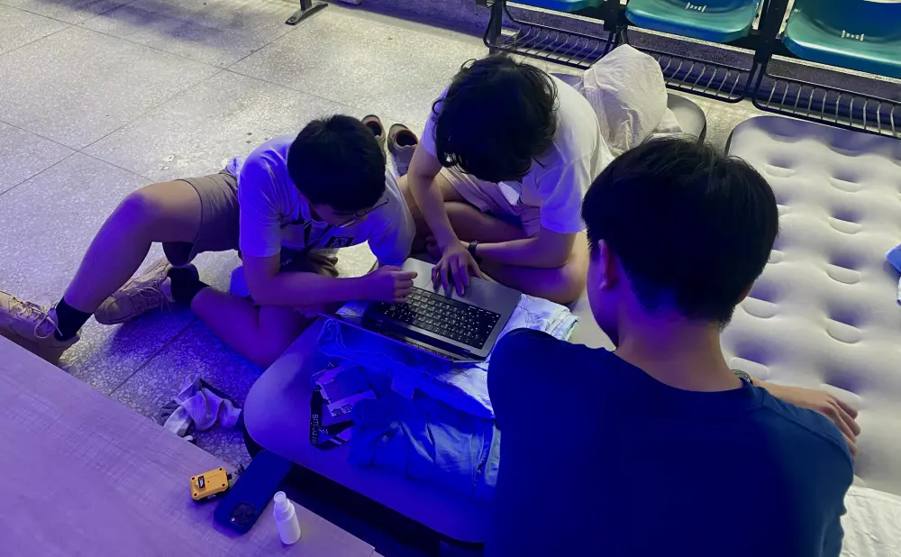
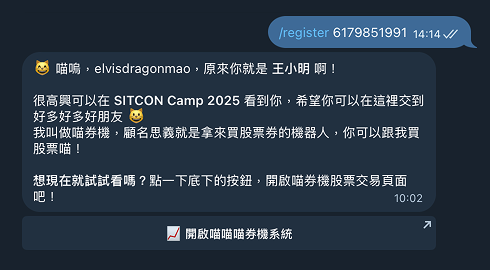
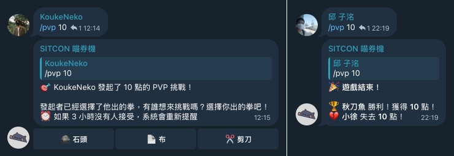
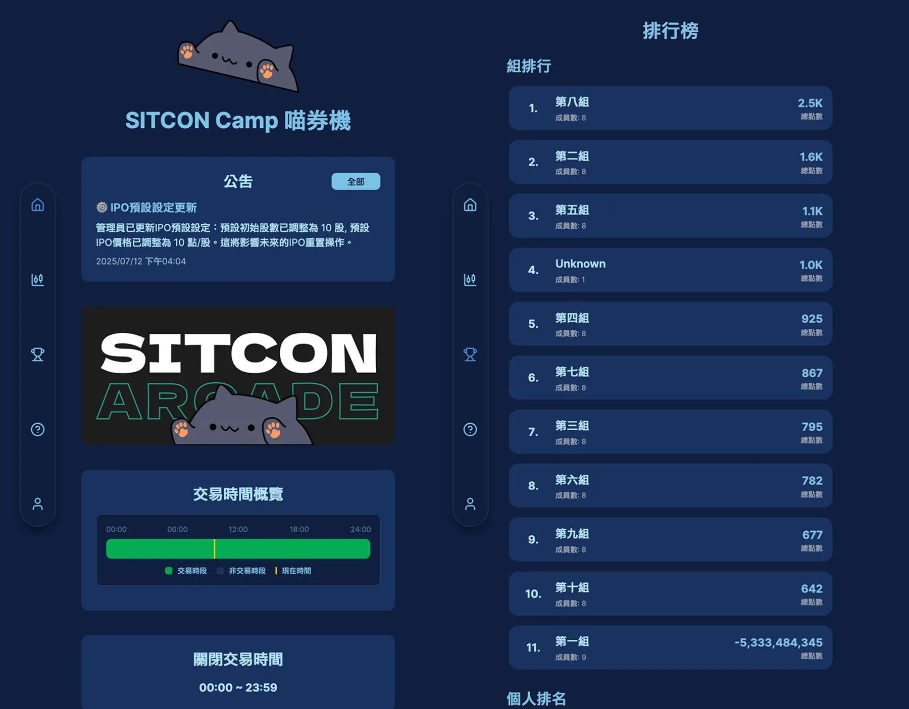
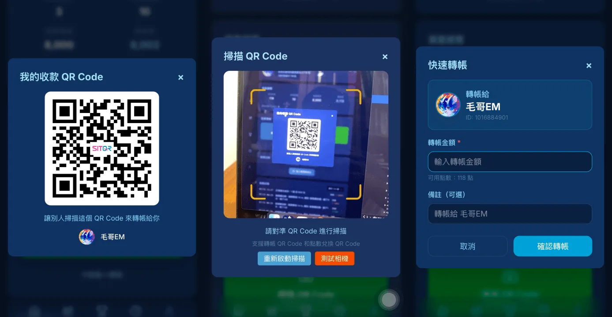
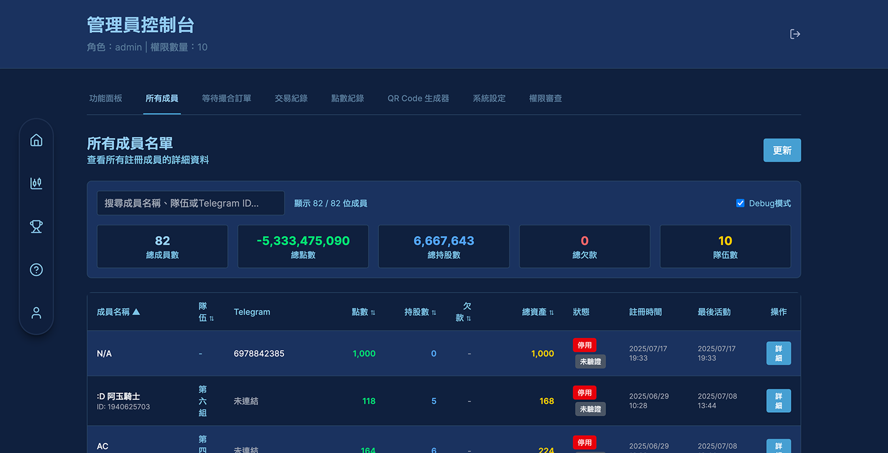
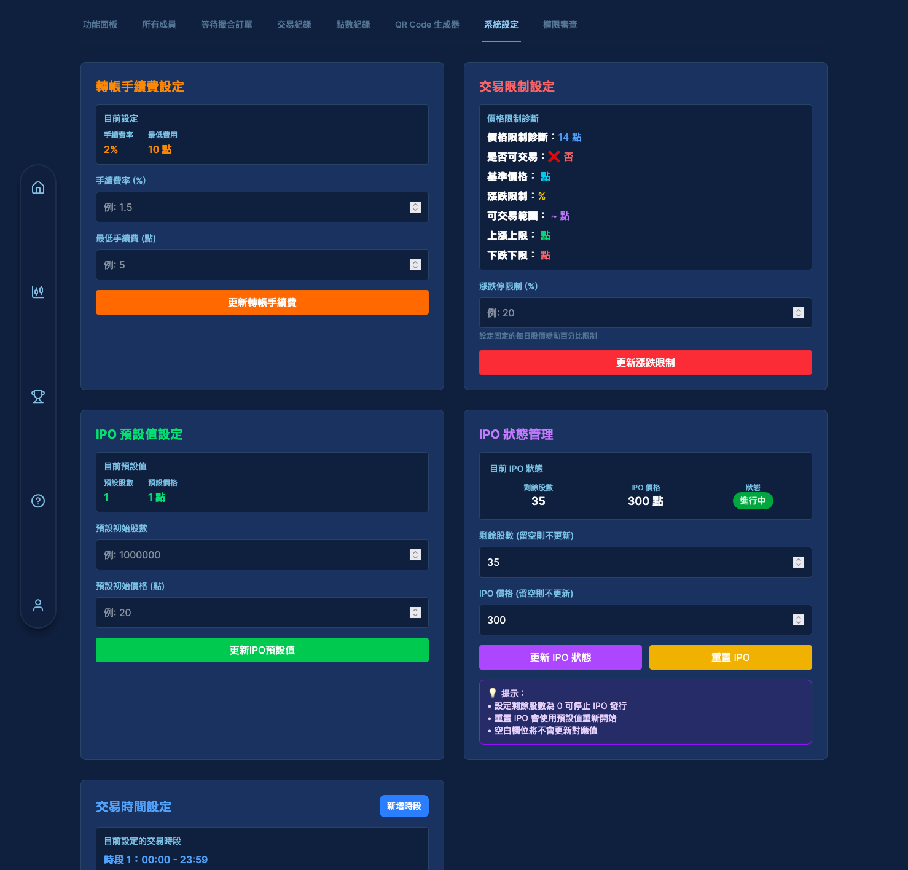
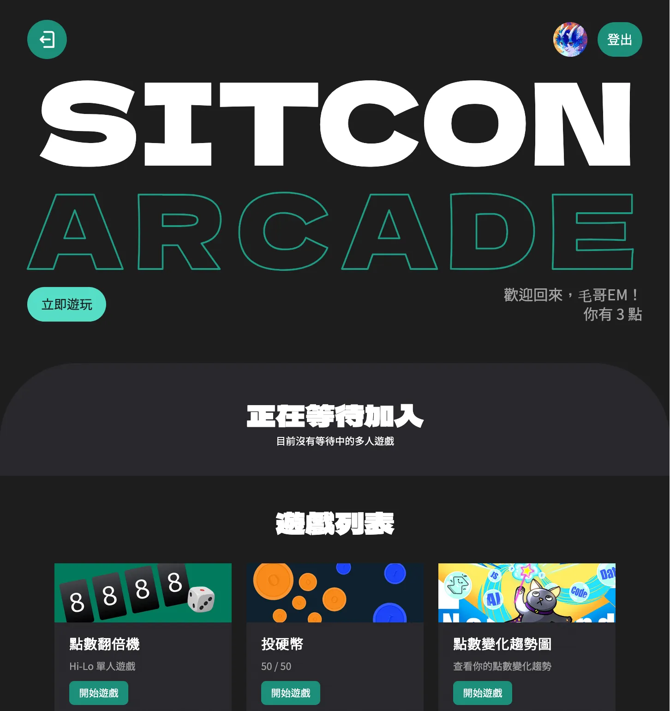
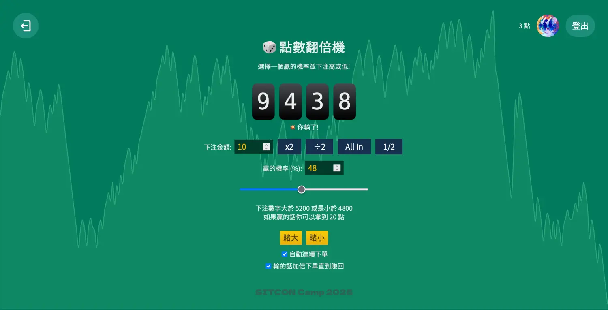
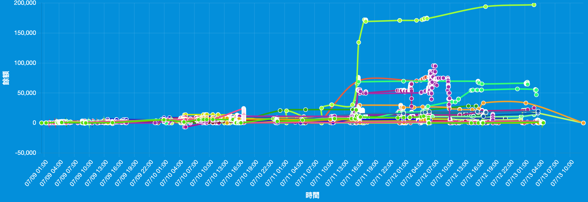

# SITCON Camp 2025 - 連續五天的黑客松，我們搞出了一套股票博弈系統！

上個禮拜我們一群熱血的學生在交大舉辦了一個禮拜的 SITCON Camp —— 學生計算機年會夏令營。我們資訊組雖然沒辦法參加到所有有趣的活動和課程，但是這次我們做了很多有趣的東西，用了很多有趣的架構。

## 我們怎麼渡過這幾天的

營隊的前兩天本來都需要到現場，叫做 -1 天和 0 天。但由於 -1 天星期一是颱風假，風雨很大所以只有必要得人到場。我是活動第一天早上才上新竹，一大早搭國光客運完全沒有人，沒想到客運搭成了 Uber。

{{notice}}

客運冷知識

你知道基本上各家客運的長途路線都會有廁所嗎？統聯客運絕大部分，和欣所有的國道線都有廁所，大多在安全門旁，或是在後方出口放行李的地方。

國光如果是左邊兩個位子，右邊一個位子的國光號就有。廁所位置在緊急逃生出口那個樓梯下去，看起來只是逃生出口但你仔細看會發現其實右邊有一個小小的門把可以進去小廁所。少部分較舊的車輛則是在車輛的最後一排座位旁邊。如果是四排座的中興號通常是短途車或是無障礙班次，這樣就沒有。但如果很急還是可以跟司機商量在休息站下一下。

{{noticed}}

那天早上還是在下大雨，我就手提著一大袋行李，還有五十幾本的營隊手冊爬了 20 分鐘的交大山坡。這幾天因為我們大家常常有新的酷想法所以我們資訊組一直在黑客松做新功能。這幾天每天的行程差不多：

- 在地下室寫程式，還有補眠
- 和學員一起上課，協助解決問題
- 吃午餐、晚餐、宵夜
- 到處玩一下
- 每天熬夜黑客松到五點

當然每個人稍微有點不一樣，像是 Wolf 本身也是隊輔所以每天都得早起。我是白天都不會睡，去營隊前兩個月我幾乎都是十點多睡所以精神都還不錯。

### 無線電

這次是我今年年初考到三級無線電之後第一次在活動中使用。一開始花了半天設定沒成功，才知道原來不只頻率要對，還有「亞音頻」這個東西要設定。簡單來說就是一個頻道裡面還可以開很多房間，如果在不同房間就可能會聽不到或收不到。

本來出門前一天還想去買個耳機，但已經很晚了，然後在小北百貨找了老半天找不到。到了才發現原來總召康喔有幫我們大家準備送給我們。他不是一般像蘋果耳機 EarPods 這種硬硬的耳塞式耳機，是有軟軟塑膠的入耳式耳機，不過他不是像一般耳機那樣發聲體在耳朵旁邊。這種耳機叫做空導。他的喇叭在脖子的地方，然後會用一條細細的水管把聲音送到你的耳邊。所以長時間配戴起來都不會不舒服。（感謝總召）

不過唯一的問題是他實在有點隔音，所以容易聽不清楚外面的人說話。甚至我和別人說話都用兩倍的音量。還有就是少了一邊的聽力我發現我的平衡感會變差一點，會有點小暈，但習慣了就還好。

之後上大學有空再把它改成無線藍牙的好了，然後看音質能不能救一下。需要往身上繞這麼多線叫什麼「無線」電？

這幾天就是 Coding，然後早上大家很貼心都會讓我們資訊組睡久一點，有時在地下室有時在宿舍。起來就繼續修 bug。不過我白天是都醒著讓他們休息，這樣至少有臨時情況可以即時處理。這幾天如果聽到無線電在 call 我通常都大事不妙了。

講了這麼多，我們到底做了什麼？

這次資訊組有我、[Wolf](https://wolf-yuan.dev/)、[德生](KoukeNeko)、和 [Tony](https://tony2100.xyz/)。這次我們重點在官網以及點數系統。

## 官網

首先先來講講官網吧。這次的官網主要是 Kiki 設計的，然後我接著加了幾筆來設計資訊組。這裡簡單講幾個有趣的地方：

### 框架 - [Astro](https://astro.build/)

這次我們使用 Astro 來作為架構。這次我第一次使用 Astro，被 Wolf 推坑。實際上真的超好用，完全符合我對一個框架的想像和需求。甚至現在我的網站 [elvismao.com](https://elvismao.com) 也完全是 Astro 作為框架。基本上你只要會寫 HTML, CSS, JavaScript 你五分鐘就學會了。

因為這個專案有找國外贊助所以也有英文版網頁。但 Astro 目前的套件沒有很完整的。我們使用的是 [astro-i18n-aut](https://github.com/jlarmstrongiv/astro-i18n-aut)，還是需要寫一些路由跟翻譯的處理。

### 泡泡 - [q5.js](https://q5js.org/home/)

這是背景的泡泡特效。本來沒有預計要做，某一天晚上不知道怎麼滑到這個函式庫的所以就加上去了。

### 課程活動 - 不規則的容器

這裡的背景看起來很複雜，實際上其實還好。每個框框都是一樣的矩形容器 `display: flex`，偶數 `flex-direction` 反過來。絢麗的框框是幾個偽元素疊在後面。大小用百分比如 130% 這樣來確保能蓋過。同時如果是形狀角度比較大的會在後面再疊一層純色的矩形，避免文字跑出去。

你仔細看會發現奇數個數的背景都是單純的矩形，偶數的是我半夜隨便拉的不規則形。

### 字體 - emfont

最後是字體，使用的是我和 Each Chen 做的中文網頁字體服務 [emfont](https://font.emtech.cc/)。這次使用也讓我順便找到一些可以最佳化的地方。當然，也歡迎大家一起使用。

## 點數系統

營隊的過程中小組可以累積點數，最後一天可以用點數來競標盲盒獎品。每組都只能選一包盲盒所以其實就是點數比較多可以先選。

以前用的點數系統好像用了 7 年還是 4 年都沒變，是 Denny 簡單寫的，但這次我們增加了一個股票系統還有一些小遊戲。目的是為了鼓勵組員認真參與活動累積點數，以及鼓勵成員互相互動。_雖然我覺得純粹只是總召康喔想炒股而已。_

### 架構

我們每個服務是分開部署的，然後用 reverse proxy - Caddy 來控制路由。

- **後端：** Fast API，所有資料都會經過後端。
- **Telegram Bot：** python-telegram-bot，就是一隻機器人。
- **股票網站：** Next.js，線上買股票和看趨勢圖。
- **Arcade 網站：** Express.js，賭博網站。
- **MongoDB：** 資料庫。
- **MongoDB 自動備份腳本：** 一個會一直自己跑的 bash 腳本。

一開始是部署在 [Zeabur](https://zeabur.com/?referralCode=Edit-Mr) 上面，把 OSS Planet 的機器綁定上去，但後來因為這台機器週末突然要系統維護所以我們臨時趕快搬去 GCP 使用 Pterodactyl。很明顯感受到 Zeabur 好用很多，比如說 Rollback 以及不中斷更新，但因為翼龍純粹是同樣的 Docker 所以 git pull 重開很快。

### 加入系統

首先第一步是要先加入系統。我在營隊前一天晚上有先寄給每一位學員一封信，裡面有一些注意事項以及他們每個人自己專屬的註冊碼。註冊方式是要先添加 Telegram Bot 的好友，然後輸入指令註冊：`/register 000000000`。

接下來你就可以使用指令來進行各種功能，像是查詢點數、交易紀錄、買賣股票、轉帳、和玩 PVP。

### PVP

你可以在大群使用指令 `/pvp <金額>` 來發起一個 PVP。一開始是剪刀石頭布，後來就是直接隨機跑輸贏。

### 網頁

我們做了一個網頁來顯示股票、營隊資訊和進行一些操作。

### 儀表板

儀表板使用 Telegram 登入。沒錯，Telegram 其實有 OAuth。在裡面可以看到關於你的資訊，交易紀錄，以及可以進行轉帳。

### 轉帳

你可以使用指令轉帳，或是使用網頁儀表板。我畫了一個「SITQR」的 Logo，可以像是銀行的 TWQR 一樣掃描來轉帳，或是直接搜尋使用者。

### 管理員介面

每個人都會有不同的權限，都可以在後台設定。如助教可以發點數，總召可以設定股票發行量和手續費等等。

發點數這次有幾個不同的方式，你可以直接搜尋、直接選擇人名或小隊發送點數，或是你可以生成一次性的 QR code。這個 QR code 可以讓學員掃描來獲得點數。這樣在課程中十分的方便，不用搜尋還有一個個問名字。

### 股票

我們自己做了一個假的股票叫做 SITC。股票可以線上查看 K 線圖，五檔報價，以及交易紀錄等資訊。

很有趣的圖，大家玩得很開心。一開始發行的時候應該是 10 元還是 20 元。因為股票有限，但我們一直在發點數，再加上沒有人好賣低所以點數一直在通膨。

但通膨太快不是好事。要怎麼平衡呢？額，我們開了個娛樂城讓學員賭博來回收點數。

### Arcade

這個網站出現一開始是為了要促進學員交流，所以想說做一些井字遊戲之類的小遊戲。但後來都是在做有趣的點數翻倍遊戲（aka 賭博遊戲）。其中一個很大的目的是為了回收一些點數，避免股票的通膨太嚴重。

最後主要在玩的遊戲是 Hi-Lo，賭大賭小的遊戲。每次賭你可以決定金額，然後會出現一個 0 到 9999 的數字。你可以設定贏的機率，然後會有對應的贏的範圍。比如說如果你設定贏的機率 50%，賭大，然後出來的數字是 6000，這樣你就贏了可以贏得獎金。

底下還有一個按鈕可以設定自動~~破產~~投注，同時可以開啟馬丁投注法。這個遊戲是我在高一就在某個比特幣賭博網站玩到的，當時是看到某個 YouTuber 介紹。到了高中懂了期望值才知道這東西本來期望值就是負的，而且馬丁策略遲早會讓你破產。

> 延伸閱讀：[必輸策略：馬丁格爾投注法，用程式證明給你看！](https://emtech.cc/p/martingale)

會有 3% 的莊家優勢，在後端計算。不過前端會顯示，而且機率完全是真的。

他在前面的版本有一個 bug 是在給獎金的時候不小心忘記把下注的金額拿回去，造成期望值是超級高的。還好在上線前在晚上的組長會議大家有先測試玩過才躲過這個危機。

還有一個問題是最後出金的金額是四捨五入，這樣如果控制好投注的金額也可以讓期望值是正的。這算是一種平常會看到的資安問題，有時候在虛擬貨幣平台交易會看到。

比如說：1% 信用卡消費回饋。那麼花 100 元可以拿回 1 元。如果花 50 元可以拿到 0.5 元，四捨五入 1 元。最後你花兩個 50 元你就可以拿到 2% 回饋了。這就是為什麼許多活動會用五捨六入，或是直接無條件捨去。這也是還好當時就有發現。

回頭來看，這個回收點數的計劃有成功嗎？我們來看看我最後一天畫的點數趨勢圖：

可以很明顯的看到有很多學員直接破產。

而點數飆很高的學員 Dong 是一開始狂買股票，然後在 1000 點左右全部賣出。同時他們組也都很認真參與活動。再加上在最後一晚我下了公告說如果能破解這個股票系統我就送 20000 點，而他在晚上成功破解了。因為有一些功能寫得很臨時所以驗證沒有做好，他成功用攔截「傳回本地」的封包進入了後台系統，並一一破解。

最後我請他用他自己破解的 QR code 生成漏洞自己給自己生成一個兩萬點的 QR code。這次的故事說明了 Code Review 的重要性，以及半夜四點不要提新需求。

這次我們很多功能都是零時趕出來的，做了很多新的嘗試，但很高興都能順利運行。

## 心得

SITCON Camp 是一個很硬的營隊，沒有營火晚會。連續五天全部都是很硬的課程和活動，甚至連闖關活動都是資訊和資安相關。每天上課到晚上九點半，回到宿舍還要繼續弄黑客松。但所有人都充滿了熱情，來這裡不只是來玩，每個人都是帶著滿滿的知識和寶貴的經驗回家。

身爲資訊組長每天活動結束之後我們還需要開檢討會議。測試系統、確認細流、處理當天發生的各種奇妙爛事。有人把其他人電腦重置（`rf -rf /`），房間有老鼠蟑螂，一大群人半夜偷跑出去，學員有抽煙需求...每天的活動和計劃都需要臨時調整，需要想一堆方案。十分感謝所有工作人員一起努力。

感謝資訊組的 [Wolf](https://wolf-yuan.dev/)、[德生](KoukeNeko)、和 [Tony](https://tony2100.xyz/)，我們一起做出這個神奇的系統。尤其是德生，感謝他這兩個月一直在熬夜到五六點幫我們點數系統寫新功能，幫我們守夜擋下半夜甲方的攻擊。謝謝 [GCP](https://cloud.google.com/?hl=zh-TW) 免費讓我們薅了一堆羊毛。感謝 [Fearnot](https://github.com/fearnot221) 外送食物給我們資訊組，還有每天幫大家訂咖啡。感謝橘子這麼用心照顧這麼多學員。感謝 [Nelson](https://nelsongx.com/) 的網路線，還有幫我們找出四捨五入的大 bug。感謝 [康喔](https://kangjw.me/) 半夜 DDoS 和大量賭博，讓我們能即時調整架構和邏輯，才沒有任何學員卡頓或賺大錢。感謝紀錄組超快的出圖速度。感謝 [Ricky](https://ricky.place/) 的飲料和雞排。感謝隊輔還有 [Denny](https://denny.one/) 陪伴學員們一同爆肝完成專案。

很高興這次的營隊十分的順利，也留下了許多非常有趣的會議。我們還有 oloo 做了康喔的車，用神奇的方式投了籃，做了很多金融交易...

Camp 結束之後 SITCON 2026 的籌備如火如荼的展開了。接下來我們又要來寫些酷東西。開發組跳坑 2025/08/25 截止，歡迎 [填表單](https://forms.gle/vJ95QC479vXTc2kh8) 加入！
