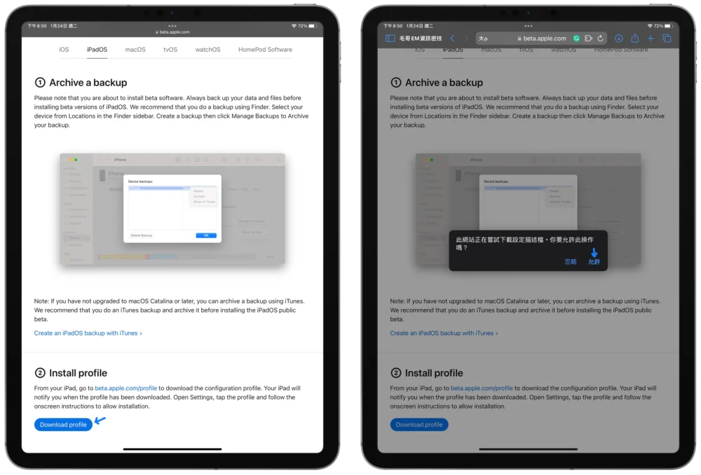

# 【iOS】進入/退出 Apple Beta 的世界 搶先體驗新功能

iOS、iPadOS、還有所有 Apple 的系統在正式發布之前都會向部分的使用者提供搶先版 (Beta Version) 讓使用者體驗，來蒐集回饋包括問題回報或是功能建議。這篇文章會教你如何加入 Apple 的 Beta 計畫，以及如果不適應要如何離開。

請注意 Beta 版可能還會有一些問題（閃退、耗電等），但也可以反過來說原本有的 Bug 在 Beta 會先修復。（我有裝置有問題升到 Beta 就好了過）

首先請到 Apple 官網登入 Apple 帳號 來加入 Beta 計畫。如果沒有加入過 beta 請點選 Sign Up，反之 Sign In

並下載對應裝置的描述檔。下載時記得按同意下載描述檔

接著請到設定，在最上面就可以看到「已下載描述檔」。點擊安裝還有同意後後可能會須要重新啟動，這樣就成功加入 Beta 計畫啦。

到設定的一般 - 軟體更新就可以看到可以更新的最新版本囉（通常是 beta 結尾）

如果想要退出 Beta 的話只要把描述檔刪除就好囉！
