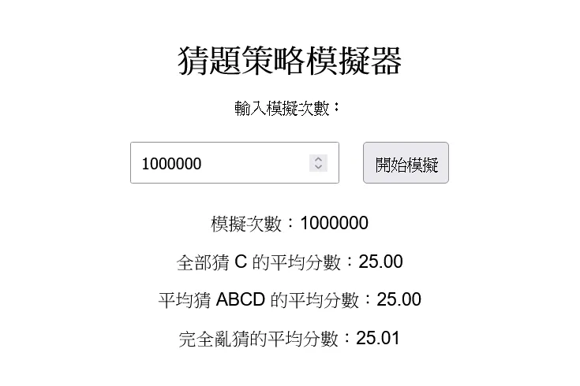

# 全部猜 C 分數會比較高嗎？考試猜題策略用程式跑給你看！

身為英文小老師幾乎每天都在登記小考成績。有的時候看到同學認真寫完整張考卷最後只有十幾分不免會想說「你就算全部猜 C 分數也不會這麼慘好嗎？」但是仔細想想，一方面考卷的 ABCD 其實大多都是平均分布的，另一方面如果你全部亂猜還有機會全對，但全部猜 C 頂多了不起對個 25% 而已。所以到底怎麼樣的猜題策略才是最好的呢？

## 選擇題與猜題策略

假設每題有 A、B、C、D 共四個選項，其中只有一個是正確答案。當考生不知道正確答案時，通常會採用以下三種猜題策略：

1. **全部猜 C**：在所有題目中選擇同一個固定選項（例如 C）。
2. **隨機猜 ABCD**：平均猜 ABCD 四個選項，每個選項的機率相同。
3. **完全亂猜**：與「隨機猜 ABCD」類似，但其實數量變大後，每個選項的機率會趨近於均勻分布。

> 實經過了這麼多的考試經驗，不難發現 A、B、C、D 的分布通常是均勻的，所以今天不考慮人性，不假設 C 出線機率比較高的情況。

## 數學推導：猜題策略的期望分數

因為每個題目都是獨立的，而且每個選項的機率相同，所以不管你採用哪種猜題策略，每題的期望分數都是相同的。

我們可以用小學四年級都學過的機率知識來計算期望值。

1/4 的機率猜對，得 1 分；3/4 的機率猜錯，得 0 分。所以每題的期望分數是：

1/4 _ 1 + 3/4 _ 0 = 1/4 = 0.25

不論使用哪種猜題策略，考生在多題測試中的平均分數是相同的。以 100 道題目為例，平均分數為 25 分。

## 程式模擬

{{notice}}

猜題策略模擬器

<https://elvismao.com/code/c-strategy/>

{{noticed}}

為了進一步驗證數學結果，我們可以使用 JavaScript 模擬上述三種策略。以下是模擬器的功能：

1. 輸入模擬次數，重複進行測試。
2. 根據不同的猜題策略計算分數。
3. 顯示每種策略的平均分數，讓使用者觀察結果。

### 程式碼

以下是模擬器的核心程式碼，包含三種猜題策略的函數：

```javascript
// 策略 1: 全部猜 C
function strategyAllC(correctAnswers) {
	const guess = 2; // 選項 C 對應索引 2
	return correctAnswers.filter(answer => answer === guess).length;
}

// 策略 2: 隨機猜 ABCD
function strategyRandom(correctAnswers) {
	return correctAnswers.filter(answer => answer === Math.floor(Math.random() * 4)).length;
}

// 模擬函數
function simulate(numQuestions, simulations, strategy) {
	let totalScore = 0;
	for (let i = 0; i < simulations; i++) {
		const correctAnswers = generateCorrectAnswers(numQuestions, 4);
		totalScore += strategy(correctAnswers);
	}
	return totalScore / simulations;
}
```

完整的程式碼包含 HTML、CSS 和 JavaScript，可以生成一個互動網頁，讓使用者自行選擇模擬次數和策略。你可以在 [這裡](https://github.com/elvisdragonmao/Edit-Mr.github.io/tree/main/code/c-strategy) 查看完整的原始碼。



我們直接寫一百萬張考卷，然後用三種策略來看看平均分數。你可以看到，不管是全部猜 C、平均猜 ABCD 還是完全亂猜，平均分數都是 25 分。

## 其他策略

據說著名心理學家、《快思慢想》的作者康納曼（Daniel Kahneman）用了這個策略考過了駕照筆試。

> - 秘訣 1：按照「對—錯—對—錯」的順序選擇答案。
> - 秘訣 2：實在不知道就選「對」。
> - 秘訣 3：有四個選項選 B；有五個選項選 E。
> - 秘訣 4：答案選項中有「以上都對」或「以上都錯」，就選這兩個。
> - 秘訣 5：選擇題裡最長的選項更有可能是正確答案。
> - 秘訣 6：不合群的答案通常不正確。
> - 秘訣 7：你覺得正確的答案更有可能是正確的。

因為這些策略都牽扯到人性和心理學，所以我們就不用程式來驗證了。

## 結論

結論就是，好好去讀書吧。無論你全部猜 C、平均猜 ABCD 還是完全亂猜，你的平均分數都一樣爛。但如果你有在 [Instagram](https://www.instagram.com/em.tec.blog) 或 [Google 新聞](https://news.google.com/publications/CAAqBwgKMKXLvgswsubVAw?ceid=TW:zh-Hant&oc=3) 追蹤[毛哥EM 資訊密技](https://em-tec.github.io/) 分數搞不好會變高喔 w
