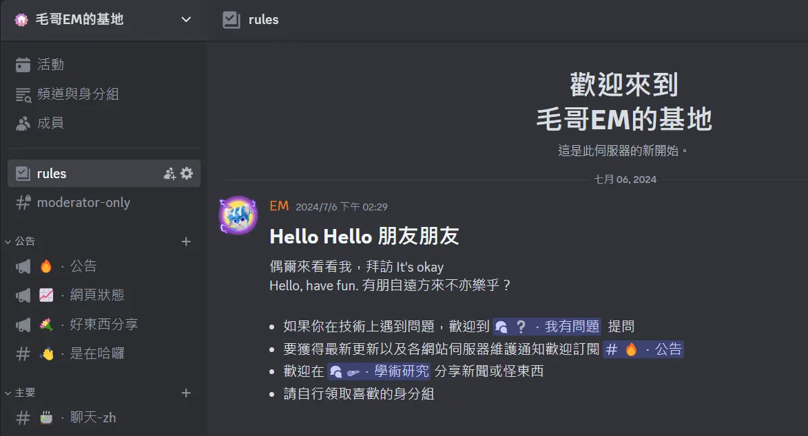
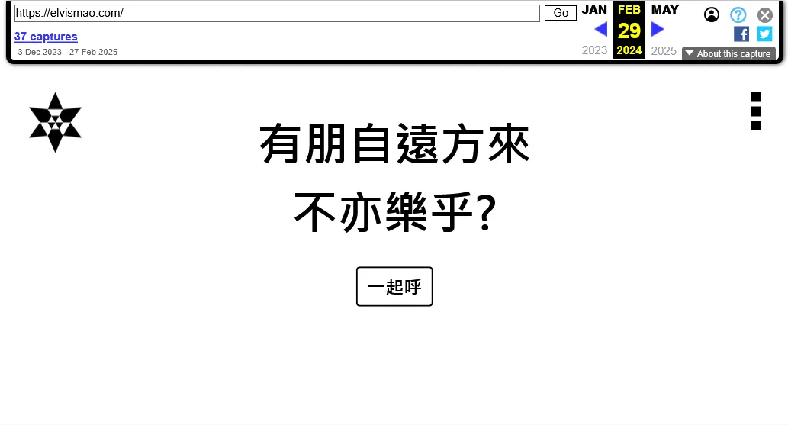

# 我最喜歡的名言：有朋自遠方來，不亦樂乎？

如果你問我人生的座右銘是甚麼，那絕對是「有朋自遠方來，不亦樂乎？」跟我熟的人應該都到這句話出現在我很多地方。

像是 [我 Discord 伺服器](https://dc.elvismao.com/) 的歡迎頁：

以及我上一個版本的[個人網頁](https://elvismao.com/)（來自 [Archive.org](https://web.archive.org/web/20240415000000*/elvismao.com)）：

這句話出自《論語》的整本書的第一句，大家從小都朗朗上口。也許你會覺得說「這句話不就是個『你好』，有甚麼大道理？」但對我來說「有朋自遠方來，不亦樂乎」不僅代表了對朋友來訪的欣喜，更是一種待人接物的哲學。如何面對合作和變化，如何看到他人的力量給自己所帶來的改變。

## 以開放的心態面對世界

在現代社會，我們的生活節奏緊湊，很多人不願意被打破原有的步調，甚至對於需要花費時間和精力接待來訪者感到抗拒。然而，孔子的這句話提醒我們，當有朋友願意千里迢迢來訪時，這是一件值得高興的事情，因為這代表了人與人之間的聯繫與共鳴。

## 甚麼是來自遠方的「朋」？

朋友這個詞每個人都有不同的解釋。

> Juicy 朱熹在《四書章句集注》中說：「朋，同類也。」

> 孔子在《禮記》說「同門曰朋，同志曰友」你和我同一師門，我們算朋，你和我志向一樣，稱為友。

> 孔子在論語還說：「君子喻於義，小人喻於利。」真正的友誼應建立在共同理念和價值觀的基礎上，而非單純的利益關係。以利益相交，利盡則散；以勢相交，勢去則傾；唯有以心相交，才能長久。

誰是你的朋友都是自己界定的。我認為世界上這麼多人，能夠有緣分讓我們能相處本身就是一件多麼難得的一件事。台灣這麼小一個，台北這麼小一個，你見到過張家寧幾次？這個遠方可能來自網路，可能是人生的過客。我們講不分貴賤的車笠之交、煉銅的忘年之交、一個甲追著直男不放的管鮑之交，也許很多人只是點頭之交，但我們不僅應該對遠道而來的朋友感到欣喜，也應該對生活中遇到的一切人事物保持開放的態度。將世界視作朋友，以包容和樂觀的精神面對變化，這樣的心境能讓我們更容易接受新事物，並在人生的旅途中獲得更多成長與啟發。有的時候我們不能決定要遇到怎麼樣的人，和怎麼樣的人相處。但這種文化與思想的碰撞，不僅能夠拓展我們的視野，也讓我們在彼此的影響下成長。

「有朋自遠方來，不亦樂乎」不只是對於舊友重逢的歡喜，更是一種對於人生中各種相遇的珍視。

## 學而時習之

論語這整句話的原話是「學而時習之，不亦樂乎？有朋自遠方來，不亦樂乎？人不知而不慍，不亦君子乎」。其實這句話是連貫的。「學而時習之」說的是如何面對生活中的困難，「有朋自遠方來」講的是如何面對合作和變化，最後一句，「人不知而不慍，不亦君子乎」，講的是修為的境界。

「不亦」白話文翻譯不就是「不就…嗎」，這是一個反問句式。你可以想想看孔子說這句話時的背景。為什麼會有這樣的說法呢？顯然是因為有很多人持反對態度。有的人不喜歡複習、有的人不喜歡社交、有的人整天 Po 限動。所以孔子才會說：「不也是快樂的嗎？」

首先我們先來看看前面的學而時習之。這道理大家都能懂，很多道理是需要反覆閱讀思考才能理解的。但有趣的是這裡的「時」我有看到一種說法說這並不是指時常，而是該這麼做的時間點。比如說你和前任痛苦的回憶，我們不該要完全忘掉這個過去，但要能從中學到經驗，能夠體會其中得精隨。

## 樂與悅

我們姑且先相信不是寫論語的筆記抄錯是真的是這樣念。樂與悅有所區別，樂是喜形於色，對周圍人會產生影響和感染；而悅是自己暗爽，悄無聲息的愉快之態。

延續前面的學而時習之。在學習的過程中，朋友是驗證我們學習成果的重要一環。我們透過與朋友的交流，深化對知識的理解，也在這種互動中提升自我。因此，真正的快樂不僅來自於學習本身，也來自於與他人共享知識與智慧的過程。

當我們學有所成，名聲遠揚，吸引到志趣相投的夥伴時固然開心。我們能夠彼此交流、共進，這種學習與成長的過程也令人欣喜。但這句話闡述了孔子傳播傳授知識的前提條件。若你來虛心請教，那我很高興，很樂於教你。若你不識貨，不來請教，我還要求你學？不爽不要來。

> 《易經·蒙卦》：「匪我求童蒙，童蒙求我」

> 《孟子．盡心下》：「夫子之設科也，往者不追， 來者不拒 。

而最後的「人不知而不慍，不亦君子乎」是有難度的修養，是我們要努力學習的方向。

## 結語

有朋自遠方來就算到交通發達，甚至可以網路通訊的今天依然是一件讓人發自內心感動和開心雀躍的事。更何況是交通不便，戰亂時的春秋時期。我們為遇到不同的人而感到焦慮，這意味著有緣人，願意靠近你。我們應該用開放的態度去迎接世界，並且珍惜每一個與他人交流的機會。無論是朋友的來訪、合作的機會，還是學習與成長的過程，都值得我們用歡喜的心去擁抱。當我們能夠以這樣的態度對待人生，便能在每一次相遇與變化中，發現快樂與意義。

## 參考資料

* 工商時報 - [樊登解讀《論語》：學而時習之 應對人生中的痛苦](https://www.ctee.com.tw/news/20211115700494-431001)
* 江上小堂 - [論語漫讀（2）：有朋自遠方來，不亦樂乎？—「王道政治」的自大與保守](https://vocus.cc/article/6540bf2cfd89780001f7453a)
* 一號課堂 - [學而時習之](https://classone.cwgv.com.tw/course/detail/M2018011504161782521)
* 共产党员网 - [有朋自远方来，不亦乐乎（详解版）](https://www.12371.cn/2021/04/07/VIDE1617801302708897.shtml)
* 台北市氣功文化學會 - [為什麼孔子說「學而時習之，不亦說乎？」](http://www.chikung.org.tw/txt/life/za130228-1.htm)
