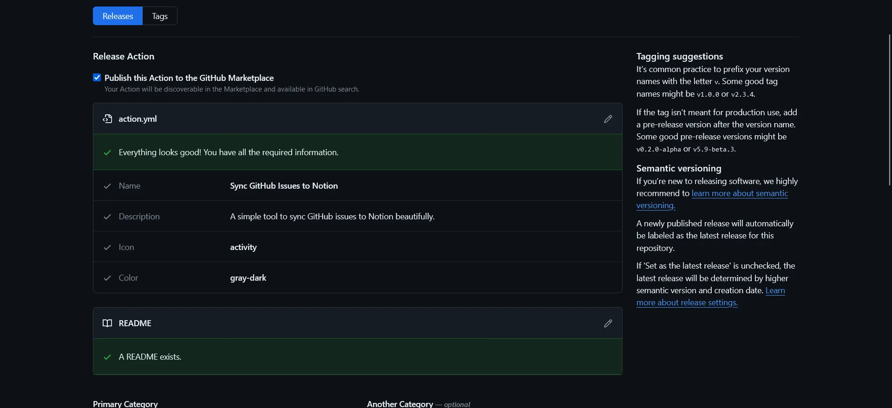
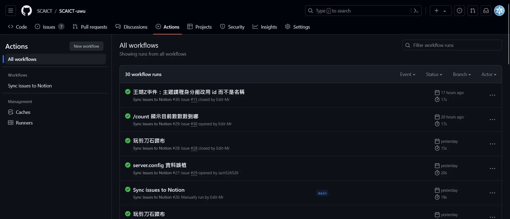

# 如何自製 GitHub Action 並上架至 Marketplace

GitHub Action 是 GitHub 提供的一個 CI/CD 服務，可以讓你在 GitHub 上自動化你的工作流程，幫你生成文件、測試安全性、部署應用程式等等。而 GitHub Marketplace 則是一個集成了 GitHub Action 的地方，你可以在這裡找到各種各樣的 Action 來幫助你的專案。在這篇文章中，我將教你如何自製 GitHub Action 並上架至 Marketplace。

<!--more-->

今天我的範例是要使用 Node.js 製作一個可以將 GitHub Repository 中的 issue 同步到 Notion 的 Action。

> 成果倉庫: [GitHub-issue-2-Notion](https://github.com/Edit-Mr/GitHub-issue-2-Notion)

{}

我們今天因為目標是要上架至 Marketplace，所以步驟相對於製作一般的 Action 比較不一樣一點。

{}

## 步驟一：創建一個 Repository

首先，你需要在 GitHub 上創建一個 Repository ([點我](https://github.com/new))。這個 Repository 將用來存放你的 Action 代碼，以及一些必要的文件。我們會使用 Node.js 來實現這個 Action。

> `.gitignore` 建議不要選擇 `Node`，因為這樣會忽略 `node_modules` 資料夾。

## 步驟二：撰寫 Action

### 創建 Action 設置文件

在你的 Repository 中，創建一個 `action.yml` 文件，這個文件是用來描述你的 Action 的。這裡是一個簡單的例子：

```yml
name: Sync GitHub Issues to Notion
author: Elvis Mao
description: A simple tool to sync GitHub issues to Notion beautifully.
branding:
  color: gray-dark
  icon: activity
inputs:
  repo:
    description: "The GitHub repository name."
    required: true
  NOTION_API_KEY:
    description: "The Notion API key."
    required: true
  NOTION_DATABASE_ID:
    description: "The ID of the Notion database."
    required: true
runs:
  using: "node20"
  main: "index.js"
```

這個文件中包含了 Action 的名稱、作者、描述、輸入參數、運行環境等等。你可以根據你的需求修改這個文件。branding 中的 color 和 icon 是用來設置 Action 在 Marketplace 上的顏色和圖標的。你可以在 [GitHub Actions Branding Cheat Sheet](https://haya14busa.github.io/github-action-brandings/) 這個實用的工具中找到更多的顏色和圖標。

### 創建 Action 代碼

在你的 Repository 中，創建一個 `index.js` 文件，這個文件是用來實現你的 Action 的。這裡是我節錄的一部分代碼：

```js
const core = require("@actions/core");
// const request = require("request");
// const { markdownToBlocks } = require("@tryfabric/martian");

async function main() {
  const repo = core.getInput("repo");
  const notionToken = core.getInput("NOTION_API_KEY");
  const notionDatabaseId = core.getInput("NOTION_DATABASE_ID");

  // ...
}

main().catch((error) => {
  console.error(error);
  process.exit(1);
});
```

這個文件中最上面引入了 `@actions/core` 這個庫，這樣就可以安全的讀取使用者設定的 GitHub Action Secrets 了。裡面可能是你的 API Key 或者其他敏感信息。這裡我們使用了 `core.getInput` 來讀取使用者設定的參數。底下我因為程式需要呼叫 API 所以引用了 `request` 以及 `@tryfabric/martian` 這兩個庫。你可以根據你的需求修改，因為不是必要的所以我註解掉了。

底下我們主要的程式放在 `main` 函數，裡面我們讀取了使用者設定的參數，然後進行一些操作。最後我們使用 `main().catch` 來捕獲異常，並且退出程序。

### 創建 Readme 文件

建議在 Repository 中，創建一個 `README.md` 文件，這個文件是用來描述你的 Action 的。讓其他人在使用你的 Action 的時候可以知道該如何使用。以下是我的範例

```md
# GitHub-issue-2-Notion

A simple tool to sync GitHub issues to Notion beautifully

一個簡單的工具，將 GitHub 的 issue 優雅的同步到 Notion


## Features

- [x] Sync issue to Notion
- [x] Sync State to Notion
- [x] Sync labels to Notion
- [x] Sync URL to Notion
- [x] Sync content to Notion with full markdown support
- [x] Won't repeat recreating the same issue
- [x] Update status if exists
```

這樣我們的 Action 就完成了。請將整個 Repository 推送到 GitHub 上 (當然，你的權杖和測試文件記得 ignore)。

## 部屬到 Marketplace

### 創建 Release

在你的 Repository 中，點擊 `Releases`，然後點擊 `Create a new release`。


在這裡，你可以填寫 Release 的標題和描述，然後點擊 `Publish release`。

### 創建 Release

請勾選 Publish this Action to the GitHub Marketplace 這個選項。你會需要同意一些條款，然後 GitHub 會確認你的文件有設置正確，最後填入 tag 版本號以及標題，然後點擊 `Publish release` 就完成上架囉。



這樣你的 Action 就上架到 Marketplace 了。

## 使用

在你的 Repository 中，創建一個 `.github/workflows` 文件夾，然後創建一個 `.yml` 文件。檔案名稱可以隨意，比如說我取叫 `sync.yml`。這個文件是用來描述你的工作流程的。這裡是一個簡單的例子：

```yml
name: Sync issues to Notion

on:
  issues:
    types: [opened, edited, deleted, closed, reopened]
  workflow_dispatch:
jobs:
  sync:
    runs-on: ubuntu-latest
    steps:
      - name: Notion GitHub Issues Automation
        uses: Edit-Mr/GitHub-issue-2-Notion@main
        with:
          repo: ${{ github.repository }}
          NOTION_API_KEY: ${{ secrets.NOTION_API_KEY }}
          NOTION_DATABASE: ${{ secrets.NOTION_DATABASE_ID }}
```

這個文件中包含了工作流程的名稱、觸發條件、工作、步驟等等。這裡我們使用了 `Edit-Mr/GitHub-issue-2-Notion@main` 來引入我們的 Action。

觸發條件中包含了 `issues` 和 `workflow_dispatch`，這樣當有 issue 被打開、編輯、刪除、關閉、重新打開的時候，或者手動觸發的時候，這個工作流程就會被觸發。常見的觸發條件還有 `push`、`pull_request`、`schedule` 等等，你可以在 [GitHub Actions Documentation](https://docs.github.com/en/actions/using-workflows/events-that-trigger-workflows) 中找到更多的觸發條件。

`with` 中包含了我們的參數。我們讀取了 repo 名稱並帶入使用者設定的 Secrets 來保護我們的敏感信息。你可以根據你的需求修改這個文件。

這樣我們的 Action 就完成了。你可以在你的 Repository 中的 `Actions` 頁面中看到這個工作流程的運行情況。



希望這篇文章能夠幫助到你。如果你有任何問題都可以在 IG 留言，也歡迎在 [Instagram](https://www.instagram.com/emtech.cc) 和 [Google 新聞](https://news.google.com/publications/CAAqBwgKMKXLvgswsubVAw?ceid=TW:zh-Hant&oc=3)追蹤[毛哥EM資訊密技](https://emtech.cc/)。
