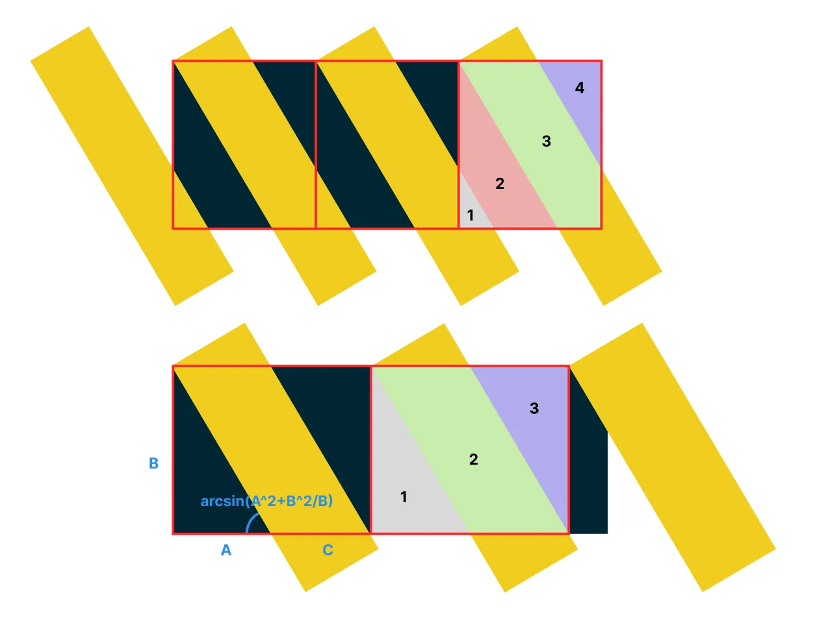

# 用 CSS repeating-linear-gradient 實現警示條

熟悉 console 的人都知道你可以在 `console.log` 裡面用 `%c` 來放 CSS。比如說：

```js
console.log("%cHello, world!", "color: red; font-size: 20px;");
```

你就會獲得一個紅紅大大的 `Hello, world!`。很多網站都會放一些警示和提醒。


有一天我突然想到覺得把我這個部落格弄成這樣挺有趣的：


但我們不能使用 background-image 來放圖片，所以我們得用 CSS 來做出這個簡單的效果。

> 其實絕大部份能用 CSS 漸層解決的事我都不會想用 SVG，甚至是 PNG。不過需要注意有時候線條放大看會模糊，尤其是在 Fireox 上。

## linear-gradient

首先很多人應該跟我一樣直覺想到的是 `linear-gradient`，然後使用 `background-repeat: repeat-x` 來實現這個效果。

```css
background-image: linear-gradient(
    45deg,
    #ebc405,
    #ebc405 20px,
    #000 20px,
    #000 40px,
    #000 40px
);
background-size: 40px 100%;
```

黃色一半，黑色一半對吧？

然後你就會得到：


慘不人賭。怎麼調整就是一堆三角形。

我用 Figma 簡單畫一個示意圖。如果我們希望 `background-repeat` 可以連接好，前後一定要相連。你至少會需要三層顏色，甚至是四層、五層。你還需要算點三角函數確保這個角度跟長度是完全可以拚上的。



~~對於你們這群讀高職的人來說~~實在非常麻煩，而且很難調整。但也不是不行，如果我們採取最簡單的情況，就是旋轉 45 度，大概會長這樣。

```css
div {
    height: 100px;
    background-image: linear-gradient(
        45deg,
        #ebc405 33%,
        #000 33% 66%,
        #ebc405 66% 100%
    );
    background-size: 202px 100%;
}
```

算了一整個小時的三角函數之後我突然想到...

## 使用 repeating-linear-gradient

這個屬性可以讓你更方便地做出這個效果。

```css
div {
    height: 100px;
    background-image: repeating-linear-gradient(
        45deg,
        #ebc405 0px 20px,
        #000 20px 40px
    );
}
```

就這樣這麼簡單。你可以注意我們的漸層屬性單位是使用絕對單位 px 而不是百分比。這樣結束之後它為自己幫你重複。

你也可以把寬度設定成變數來更簡單的調整。

```css
div {
    height: 100px;
    --width: 20px;
    background-image: repeating-linear-gradient(
        45deg,
        #ebc405 0px var(--width),
        #000 var(--width) calc(var(--width) * 2)
    );
}
```


[Codepen 範例](https://codepen.io/edit-mr/pen/XJJYEZa)

## 動畫

接下來你甚至可以玩一些動畫:

我們讓它動起來：

```css
div {
    animation: move 1s linear infinite;
    width: calc(100% + var(--width) * 4);
}

@keyframes move {
    from {
        background-position: 0px;
    }
    to {
        background-position: calc(var(--width) * sqrt(2) * -2);
    }
}
```

注意這裡我們把背景再拉大一點，不然後面會是空白的。然後我們使用 `background-position` 來移動背景。

移動背景的距離是 `var(--width) * sqrt(2) * -2`，這是因為我們的漸層是 45 度，所以斜斜的看是 `var(--width)`，那麼平著看就是 `var(--width)` 乘以根號二。要乘以 2 是因為如果只有 1 的畫只會移動到黃黑交換。而要乘以 -1 是因為我們希望它能夠往左移動。


我們甚至可以讓它旋轉起來：

```css
div {
    margin-top: 40vh;
    height: 100px;
    font-size: 40px;
    --width: 20px;
    --deg: 45;
    background-image: repeating-linear-gradient(
        calc(var(--deg) * 1deg),
        #ebc405,
        #ebc405 var(--width),
        #000 var(--width),
        #000 calc(var(--width) * 2),
        #000 calc(var(--width) * 2)
    );
    animation:
        move linear 1s infinite,
        spin linear 8s infinite;
    animation-composition: accumulate;
    width: calc(100% + var(--width) * 4);
}

@property --deg {
    syntax: "<number>";
    initial-value: 45;
    inherits: false;
}

@keyframes move {
    from {
        background-position: 0px;
    }
    to {
        background-position: calc(var(--width) * sqrt(2) * -2);
    }
}

@keyframes spin {
    from {
        --deg: 0;
    }
    to {
        --deg: 360;
    }
}
```


[Codepen 範例](https://codepen.io/edit-mr/pen/qEEQMMp)

好了頭已經有點暈了。
