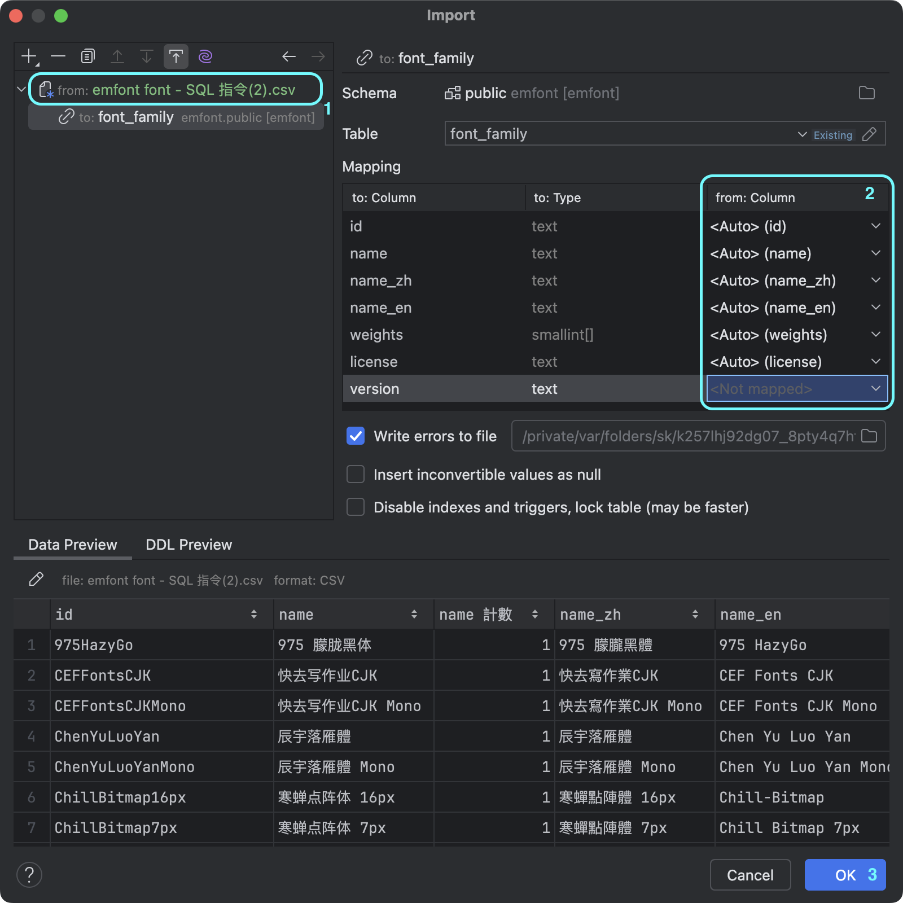

# 如何在 DataGrip 中匯入 CSV 到資料庫？

DataDrip 是 JetBrains 的一款資料庫 IDE，支援多種資料庫的操作，包括 MySQL、PostgreSQL、MongoDB 等等。我覺得很好看，摸了一下還蠻容易上手的，而且學生完全免費。它有一個很方便的功能，就是可以直接匯入 CSV 檔案到資料庫中。因為我要匯入的原始資料是先在 Google Sheets，所以我可以直接下載成 CSV 檔案，然後再匯入到資料庫中。不需要再字串組合寫一堆 SQL 指令來建立資料表了。

這裡簡單分享一下步驟：

## 1. 選擇要匯入的資料庫

在 DataGrip 中，選擇要匯入的資料庫，然後右鍵點擊選擇 `Import/Export`、`Import Data from File`。

## 2. 選擇要匯入的 CSV 檔案，然後點擊 `OK`。

你懂的。如果是使用 Google Sheets 的話，可以選擇 `檔案`、`下載`、`逗號分隔值 (.csv)`，這樣就可以把 Google Sheets 的資料轉換成 CSV 檔案了。如果是 Excel 的話，選擇 `檔案`、`另存新檔`、`CSV (逗號分隔)(*.csv)`。

建議第一行是欄位名稱，這樣 DataGrip 匯入的時候會自動幫你對應資料表的欄位名稱。或著是沒有的話也可以自己按順序排，或是到 DataGrip 裡面再調整。

這裡要注意一下如果是 Array 的話記得要根據資料庫的格式來調整。像是 PostgreSQL 的話，Array 的格式是 `{1,2,3}`，而 MySQL 的話是 `[1,2,3]`。就直接把整串字串放進去就好了。

## 3. 在 `Import Data` 對話框中，進行資料設定。

這裡我們要做三件事。第一件事是設定把第一行當成欄位名稱。第二件事是設定對應的欄位。最後匯入即可。

### 設定把第一行當成欄位名稱

點擊右上角的 csv 檔案來進入設定畫面，然後勾選 `First row is header`，這樣 DataGrip 就會把第一行當成欄位名稱了。

你可以看到 DataDrip 甚至很聰明的發現我的標題 name 不小心在前面多打了一個空白，他自己幫我修正了。

### 設定對應的欄位

這裡可以選擇要匯入的資料表，然後對應欄位。DataGrip 會自動幫你對應欄位名稱，如果沒有對應到的話可以手動選擇。比如說 Version 這個欄位是我的程式會自己偵測填入的，我把它設成 `<not mapped>`，這樣 DataGrip 就不會把它匯入到資料庫中了。

確定底下 Preview 看起來沒問題之後就可以點擊 `OK` 開始匯入了。

以上就是在 DataGrip 中匯入 CSV 到資料庫的步驟。這樣就可以輕鬆地把 CSV 檔案中的資料匯入到資料庫中了，省去手動寫 SQL 指令的麻煩。
