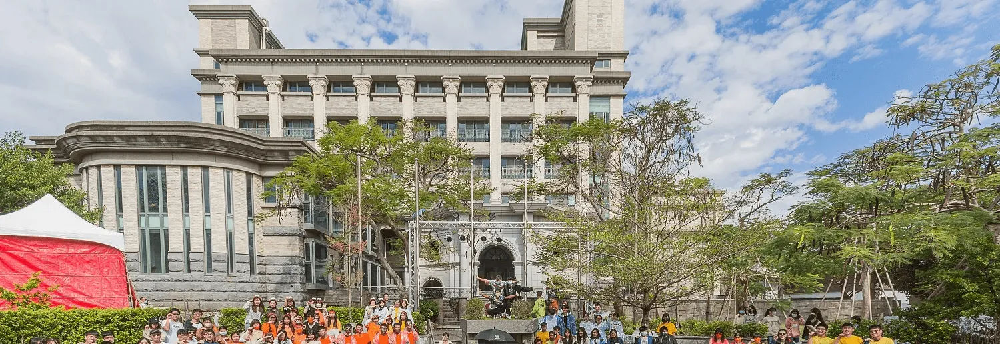

# 2025 忠信英文辯論邀請賽心得

昨天參加完忠信文教基金會新竹英文演講及辯論公開邀請賽。是從網路上看到的比賽，看到獎金蠻多的，還免費提供午餐和保險，所以我們幾個下個月要去打 World Schools 的朋友 (Jessica, Jamie, Ban, 和我) 就去了。雖然跟我們之後比賽的賽制完全不同，但就打好玩。

第一名有 10000 元，第二名 8000 元，這在英文辯論比賽真的很少見。這個禮拜其他幾個朋友要去薇閣打的沒有獎金還要繳 3000 塊報名費。師大的也是沒有獎金，還要付餐費。

一隊兩人，總共兩隊，我們還在開玩笑說萬一到時候我們匹配到怎麼辦 XD

## 準備

因為這個辯題跟去年 NSDA 一樣，所以我只有跟我的隊友 Jessica 只有閒聊兩個小時，基本上完全沒準備。實際上寫稿是比賽前十分鐘發現我沒有 Final Focus 所以才簡單整理一下的。

哦 BTW 這次比賽是我們幾個第一次現場見面。

## 環境

忠信的位置還蠻偏的，我需要先搭火車到新竹，然後再轉火車到新豐。到了之後還需要走半小時才到。所以很感謝 Ban 朋友的媽媽載我們從新豐火車站過去。也超感謝 Jessica 爸媽載我去車站搭車，讓我提早兩個半小時回家。

忠信學校從進校門之後沒有一個角落會讓你覺得這是一間學校。

我應該多拍點照片的但反正這是他們教室的一樓：

這是他們的廁所：

整座山都是它們的校園，還有很多噴水池，步道，游泳池等等。就完全不像一間學校，怎麼看都像一間私人住宅。感覺我們來這邊比賽比較像是來郊遊的，就算沒有贏來參觀和吃免費午餐也蠻開心的。

[這裡還有一些照片可以看。](https://2020-cesv.chhs.hcc.edu.tw/21892333913034023416327222987222659.html)

## 過程

所有人至少打四場，原本時程表是像 NSDA 一樣早上三場，但實際上早上只打兩場，十點半就結束了，就直接去吃午餐。

好吃。我還拿了幾個泡芙跟蛋塔當下午茶。

四場裡面我們贏了三場，一場輸了。聽評審說的原因基本上是因為他是另一隊的教練。

> 你想先聽我得結果嗎？我投反方。反方的論點解釋得很爛，Final Focus 很糟，Summary 也很糟。但正方的論點雖然反方沒有問，但我沒聽到解釋，然後我沒看但我覺得你們的證據是唬爛的。

但輸了一場沒差，還是進到冠亞軍賽。

然後尷尬的事發生了，是我們自己人兩對互打。但也不能怪評審，畢竟我們四個人其實都不同學校，而且都已經是決賽了。

很幸運的，我們抽到我比較喜歡的反方。最後贏了，拿到了冠軍。我們幾個拿了一萬八回家，大概夠我們之後兩天住宿吧。

## 總結

這次比賽我們都玩得很開心，如果之後學弟妹想打還蠻推薦的。

之後畢竟雖然我已經上大學了就不會來打了，但可以來當個評審玩玩。蠻好笑的我去報到的時候他們就以為我是評審了。收入一局 1000 雖然比第一名少，但也不錯。
