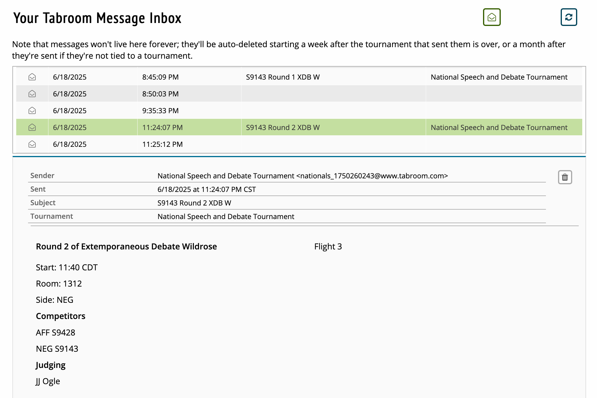
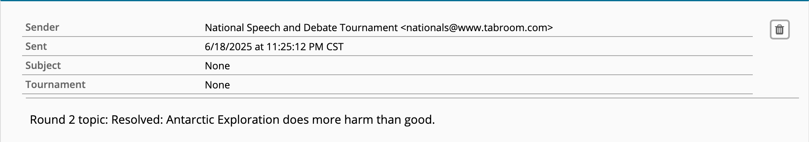

# Extemporaneous Debate - 台上兩分鐘，台下半小時

Extemporaneous Debate (簡稱 Extemp) 是一種節奏十分快速的英文辯論賽制。一對一單人辯論，選手在比賽前三十分鐘才知道辯題，並由系統隨機指定正反方。這是 NSDA（美國全國中學生演講與辯論聯賽）設計的補充賽制，就是當你原本比的被淘汰了就可以來玩這個。而我們今年在美國...很幸運可以體驗到這個特別的賽制。

## 比賽規則

你可以把它理解成非常短的 Public Forum Debate（公共論壇，非政策性辯論。）

* 一對一單人辯論。
* 每輪一題，題目涵蓋國內外公共議題，連續多輪不重複。
* 系統會自己指派正反方。
* 你可以用自己電腦上網，甚至沒有 prep room，你可以去找隊友和老師一起討論。

流程如下：

階段 | 時長 | 英文
--- | --- | ---
賽前準備 | 至少 30 分鐘 | 
正方立論 | 2分鐘 | Prop. Constructive 
反方質詢 | 1分鐘 | Cross-Examination of Prop.
反方立論 | 2分鐘 | Oppo. Constructive
正方質詢 | 1分鐘 | Cross-Examination Oppo.
強制準備 | 1分鐘 | Mandatory Prep Time
正方第一反駁 | 2分鐘 | Prop. Rebuttal
反方第一反駁 | 2分鐘 | Oppo. Rebuttal
強制準備 | 1分鐘 | Mandatory Prep Time
正方第二反駁 | 2分鐘 | Prop. Rebuttal
正方第二反駁 | 2分鐘 |  Oppo. Rebuttal

---

以下我用我這次在 NSDA 比賽的過程來講解，畢竟這賽制發明就是為了這個比賽。

## 公布辯題

在比賽開始的大概 35 分鐘前會先公布正反方以及比賽的教室。我們都是使用編號而不是姓名，原因我也不清楚，我只知道很多人會看錯，然後很難對。

因為同時比賽的有幾百人，所以都是好多層樓的教室，每次都要找。雖然教室很多但人真的太多了，所以會需要輪流進去。這叫做 "flight"，意思就是你是第幾個比。一局大概二十分鐘，所以 Flight 3 大約等於有 `30+20+20=70` 分鐘。不過這也不會不公平，因為你的對手也有相同的準備時間。雖然我這局是 Flight 3 但第一局的時候我就應該要在門口等了，因為如果這一局有人沒出現的話（比如說在學校迷路）就會往後替補。

時間到了就會公布辯題。

每人至少比四場，當天我打的辯題如下：

1. Resolved: The United States should implement a universal basic income.  
   美國應實施全民基本收入。
2. Resolved: Antarctic Exploration does more harm than good.  
   南極探勘弊大於利。
3. Resolved: Elected offices should have a maximum age limit.  
   民選公職應設有最高年齡限制。
4. Resolved: On balance, economic globalization has done more harm than good.  
   整體而言，經濟全球化帶來的害處多於益處。

## 準備

接下來就進入了半小時的準備時間。基本上大家都是自己準備，但同一方的會寫在同一份 Google 文件的不同分頁裡，這樣可以參考別人的論點，也可以知道對方可能會說什麼。可以跟老師討論，或是拿你以前比過的稿和資源來用。

這時候你一定會想問：「我可以用 AI 來寫嗎？」

可以。甚至 Perplexity 是這次的贊助商，直接送我們三個月 Perplexity Pro，比賽過程還推播手機通知廣告叫我們用。但它只是一個快速幫你產生想法和找資料的工具。不管立論還是反駁你都只有兩分鐘的時間。而且還有質詢，大部分的工作都要在極短甚至是沒有準備時間完成，要單憑 AI 處理完全不可能，甚至完全沒有影響也不大。尤其是大家的英文程度都很好，甚至大多是母語人士。GPT 味大家都聽得出來。

## 內容

如果需要的話先簡單講定義，然後丟論點 (Contention)。跟 PF 一樣用 CWI 格式：先明確主張（claim），接著用邏輯或證據說明原因（warrant），最後解釋其重要性（impact）。

通常只會講兩到三個 Contention，Rebuttal Speech 通常不會也不建議有新論點冒出來。

因為只有兩分鐘，你能解釋的有限，所以必須非常精準的打擊，且很考驗語言表達能力。建議你不要講太多太深需要點時間解釋和理解的東西，比如說在講全民基本收入的時候我不太應該去談 AI 世代下全球產能過剩的問題，因為有太多東西需要解釋他是什麼，以及為什麼很有可能會發生。

{{notice}}

### AI 世代產能過剩的問題

Elon Musk 等科技領袖從 2016 就認為，當 AI 讓生產力極大提升、工作機會大幅減少時，政府不管你有沒有工作都會給你「全民基本收入」（Universal Basic Income, UBI）。

* 以前工業革命是機器取代工作，但 AI 世代是取代人。他學得比你快，做得比你好，大家都會失業。
* AI 種出一堆食物，但沒有人買得起食物。
* 商人反而希望政府給你錢花，他才能賺到錢。
* 美國現況從 0.2% 富人多課個 1% 的稅其實就可行了。

延伸閱讀：['There Will Be Universal High Income' — Elon Musk Predicts With 80% Certainty That 'None of Us' Will Have Jobs, But Bill Gates Says It's Too Soon - Benzinga](https://finance.yahoo.com/news/universal-high-income-elon-musk-160056830.html)

{{noticed}}

再加上有些評審完全是 Speech 的評審，沒有辯論背景（基本上大部分的評審都沒在做筆記 flow，都是坐在那裡當在 Threads 上看人吵架一樣。），因此肢體語言，口音，~~總族~~，甚至是預設立場都很容易影響評審的判決。

## 總結

Extemporaneous Debate 結合了 PF 和 Policy 縝密的邏輯與演講的臨場魅力。短時間內要完成研究、構思、組織與說服，既考驗知識廣度，也鍛鍊思維深度。透過良好的資料庫事前建置、科學化的 Prep Time 分配，以及針對性強的質詢與反駁策略，即可在每場僅 20 分鐘的快節奏對決中脫穎而出。
