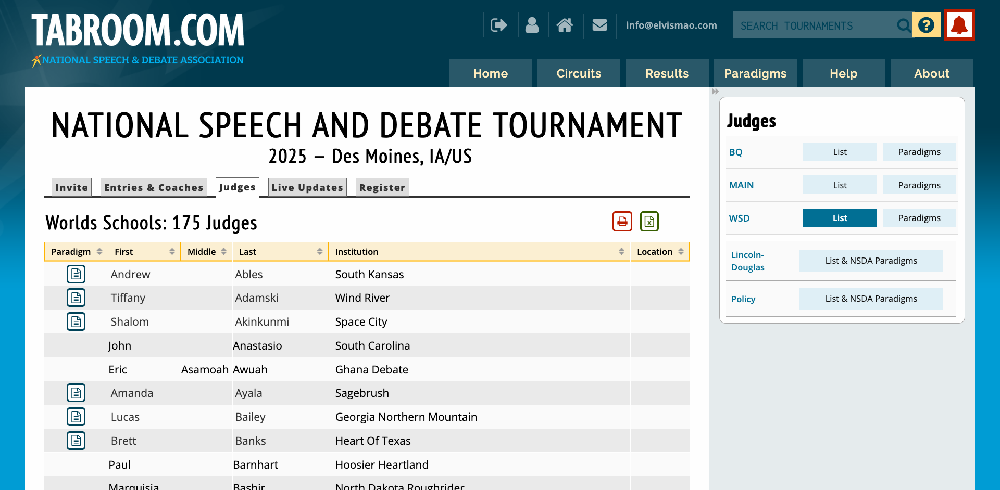
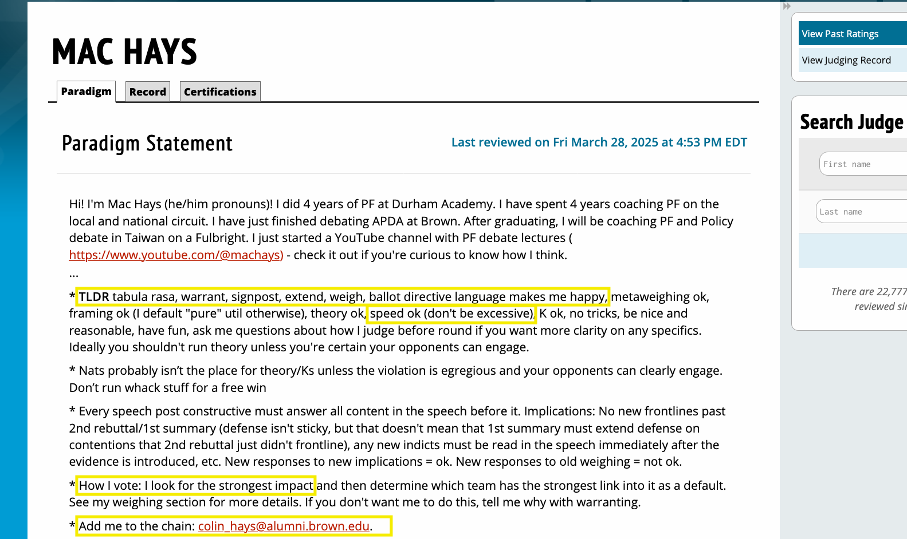
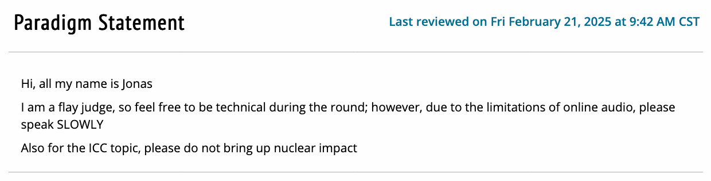

# 辯論技巧：搞懂裁判類型，讓你比賽場上少走冤枉路

「憑什麼他可以這樣判？」、「他知道辯論的規則嗎？」、「他有沒有在聽我在講什麼？」、「你以為這是演講比賽喔？」

有時候打完辯論比賽之後你會想打評審，然後再跟他辯論。但到頭來就算評審沒有辯論經驗，就算對方講的全是謬論，辯論就是在講說服，你沒說服就是沒說服。不論你自認打得多精彩，如果裁判聽不懂、跟不上、或不買單你的論點，那就白費了。如果我們能夠先了解裁判的偏好，那麼在賽場上我們就能夠更有效率地 turn on 他，進而贏得比賽。

本篇文章將帶你了解一些名詞，常見的裁判類型（Lay、Flow、Flay、Tech，以及Panel多裁判情境），如何判斷**他們是哪一種**，以及**如何根據他們的偏好調整講法**，真正做到「看臉色說話」。

## 上 Tabroom 看看

首先如果你比的是 [Tabroom](https://www.tabroom.com/) 上的比賽，可以上那個很難用的網站看看裁判的 Paradigm（頻判標準）。有點像是簡單的自我介紹，裡面會寫他們的辯論背景和喜好。這些資訊能幫助你了解他們的風格與偏好。

比如說這是我下個月要美國愛荷華比的 World Schools 的裁判，點擊左邊 Paradigm 底下的 icon 就可以查看。

{{notice}}

你在 [Tabroom Judge Paradigms](https://www.tabroom.com/index/paradigm.mhtml) 上可以搜尋 Elvis Mao 或[點擊此連結](https://www.tabroom.com/index/paradigm.mhtml?search_first=Elvis&search_last=Mao)查看我的 Paradigm 喔！

{{noticed}}

比如說這是我的指導老師 Mr. Hays 他的 Paradigm（節錄）：

我們可以看到他可以接受什麼（比如說讀很快），希望看到什麼，不能接受什麼。以及他會如何決定誰贏（比如說他很重視影響力 impact）。

最後你還可以到他的 email，目的是在傳送證據卡時也可以把他加進 email chain 裡面（寄一份副本給他。）

而這是另外一位[曾經判我們輸的評審](/post/debate-chungHsin#過程)。

你可以看到他說他是一位 Flay Judge。那麼這些是什麼意思呢？

## Lay Judge（非專業裁判）

也是指國民法官。這類裁判通常沒有辯論經驗，對辯題的內容、辯論術語和流程不熟悉。他們更注重所謂的「文組邏輯」，而不是辯論的技巧或深度。

通常就是自以為很懂辯論的評審（在師大很常見。）他們可能有點辯論背景（比如說額...上過一天培訓？），自以為很有邏輯。

### 怎麼判斷？

- 當你知道他是英文老師而不是辯論專業。
- 當他們說「我對這個議題不熟」。
- 當他們沒寫 Paradigm。
- 比賽開始前沒有給你們提問。
- 當他們說我更重視邏輯（通常都沒什麼邏輯）。
- 如果他們沒有在認真做 flow 筆記。

### 如何應對？

- **當作這是一場演講比賽。**
- **講慢一點**，咬字清楚。
- **避免術語**，像是“non-unique”、“turn”、“delink” 等等）。
- **不要走末日劇本（low-probability, mega-death）**，如核戰、滅絕。他們更在意真實性而非推論深度。
- **講故事，講邏輯，畫大餅**，用簡單的說法讓他們知道你贏在哪裡。

這種評審在台灣本地的比賽非常常見，很難應對，很難預測。有時候有一些評審（尤其是師大英辯）會有他們自己*有趣*的邏輯：

- 不重視 weighting，數你打了幾個點，對方回了幾個點。
- 看你有沒有看起來很努力。
- 會自己加入 debate，挑戰對方根本沒問的問題。
- 判自己的學生贏。

## Flow Judge（記錄型裁判）

專業評審，通常是有比賽經驗。了解辯論結構，能跟上中等偏快語速，理解基本術語。

### 怎麼判斷？

- 他們說自己以前也是辯士。
- 他們的 paradigm 提到 “weighing”、“line-by-line”、“speed preference” 等等辯論的關鍵字。

### 如何應對？

- **這是一場辯論比賽。**
- 可以講快一點（但不要 spread 狂飆）。
- 最好回應對方講的細節 (line-by-line)，但大結構也要清楚。
- 可使用一般術語（delink, turn, weighing），但避免太進階的詞（像是 K、theory 等）。
- 注意論點要有後續延伸（impact），邏輯清楚。

## Flay Judge（介於 Lay 和 Flow 之間）

Flay Judge 是最可怕的。顧名思義就是介於 Lay 和 Flow 之間的評審。同時重視表達跟邏輯，有大致做筆記 (flow) 的能力，但不太完整，也容易主觀介入。

### 怎麼判斷？

跟 Flow 比較稍微接近一點，可能會稍微比較難區分。

- 如果他說自己以前有辯論經驗，但你看他也沒得什麼獎。
- 如果他的 paradigm 上出現我有「某某評審資格」等等不等於好評審的履歷。
  - 我上過某個培訓課程。
  - 我是英文老師。
- 如果是其他類型的辯論（Policy, LD）的評審來判 PF 很有可能是 Flay Judge。

### 如何應對？

- **這同時是一場演講比賽和辯論比賽**。兼顧flow 與整體 narrative，不能只贏其中一邊。
- **語速比面對 flow judge 慢一點**，確保他們聽得懂。
- **視情況調整術語使用**，觀察他們的反應。
- **重視延伸與一致性**，不要讓他們有自己理解的空間。
- 注意**肢體語言**，如 eye contact。

## Tech Judge（技術型裁判）

### 是誰？

- 通常是辯論教練、全國冠軍等等很會辯論的人。
- 能處理很快的速度與進階論證，支持「技勝於真」理念。

### 怎麼判斷？

- 他們是教練、冠軍級的辯士，那麼他們*很有可能*是 Tech Judge。
- 如果他們的 paradigm 寫了很多術語。

### 如何應對？

- 基本上**可以用很快的語速**（只要他們沒說不行）。
- 大部分的評審會在意你有沒有回應每個論點（line-by-line）。
- **進階術語與框架都可以上**，他們大多可以理解。
- 每次上台 link/impact 都要清楚地說明。
- 評審能夠理解你的假設框架，所以你可以模擬許多極端的場景和後果。
- **收斂很重要**，後段演講要縮小戰場，挑一兩個大點猛打。
- 基本上絕大部分的人只會接受第二次 rebuttal 或 summary 以前的論點。**不要在final focus丟新論點**，後面的他們會直接忽略。
- **weighing 很重要**。

## 多裁判 Panel

靠近後面的決賽決賽可能會出現三人（或甚至更多）的評審，由投票多數決定勝負。

### 如何應對？

- **若三人風格相同**（如都是lay），就照那風格打。
- **若有兩個相近，一個不同**，優先爭取那兩票。
- **三人全不同**，找共同點，如速度較慢、強調邏輯等。
- **你只需拿下兩個人的心即可。**

## 結語：勝負只看裁判，策略決定勝利

辯論比賽講白了就是演給裁判看的一場戲，我通常都說是 stand up comedy。觀眾開心喜歡就好。從準備到比賽每一步都要思考：「我這樣講，他聽得懂嗎？他會記住嗎？他會投我嗎？」

- paradigm 能看就先看，沒有 paradigm 就一定要先問。
- 講話太快時，**如果裁判放下筆，那你就該慢下來**。
- 最後，無論裁判背景如何，都要保持尊重。

以上是我多年來的經驗與觀察。技巧可以練，資料可以準備，但「見人說人話，見鬼說鬼話」的能力，才是真正讓你從好辯士邁向勝利者的關鍵。
