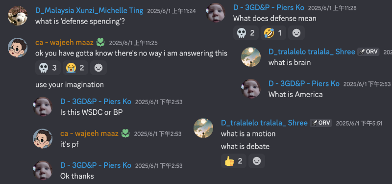
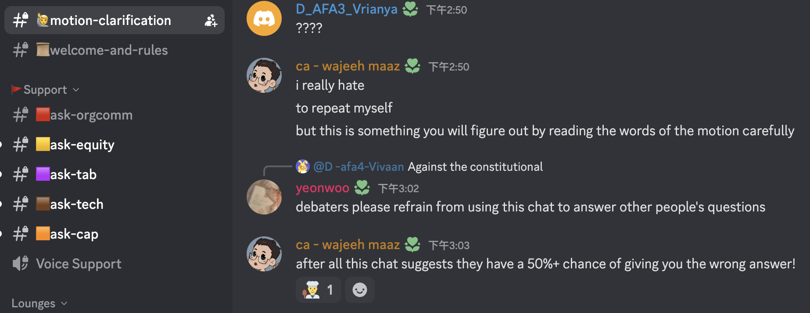
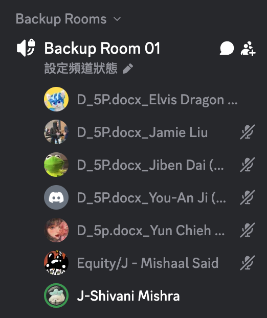
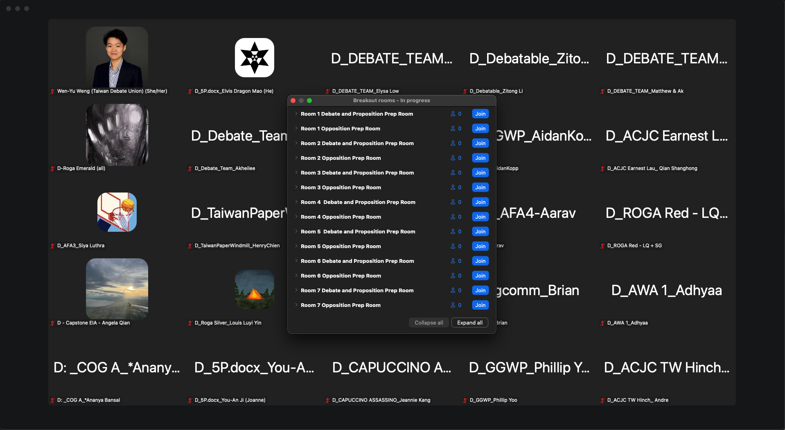
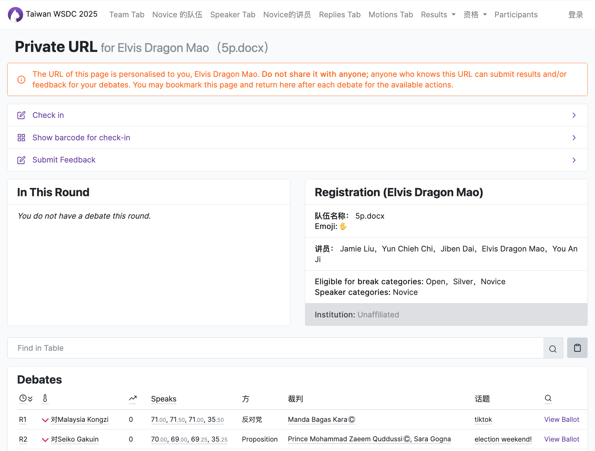
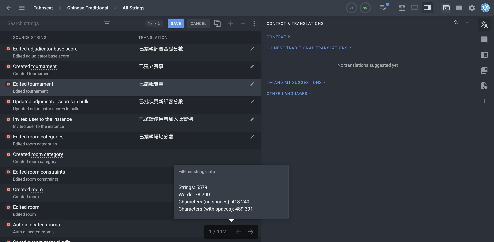

# 用 Discord 的線上國際辯論比賽？Taiwan WSDC 心得

上禮拜我們 5P.docx（要去美國打 [Nats](https://www.speechanddebate.org/national-tournament-2025/) 的五個 Player）報名了第一屆由 Taiwan Debate Union 舉辦的 Taiwan WSDC 募款活動賽事來當作練習。這是我第一次參加線上的英文辯論比賽，雖然沒有得名但十分有趣。

> 5P 是來自以前打 Policy（政策性辯論）通常會使用 1AC, 2AC 來代表 1st affirmative constructive speech。那麼我們在想 Public Forum（公共論壇）和 World Schools 的 pro constructive speech 是不是 1PC？所以是 1P, 2P, 3P？

## 比賽的國家

比賽的隊伍有 60 隊，來自以下這些國家：

- 🇧🇩 Bangladesh
- 🇨🇳 China
- 🇭🇰 Hong Kong
- 🇮🇳 India
- 🇯🇵 Japan
- 🇰🇿 Kazakhstan
- 🇲🇾 Malaysia
- 🇲🇦 Morocco
- 🇳🇵 Nepal
- 🇵🇰 Pakistan
- 🇵🇭 Philippines
- 🇸🇬 Singapore
- 🇰🇷 South Korea
- 🇹🇼 Taiwan
- 🇺🇸 United States
- 🇿🇼 Zimbabwe

所以比賽的這兩天就是口音炸彈，基本上每場都很嚴重。真的不知道他們怎麼聯絡到這麼多人的，而且如果加上評審來自的國家那更多了。

對於習慣 YouTube 印度噴麥程式教學的我來說沒有到太吃力，但好幾個人講論點跟反駁的時候口音跟笑容真的很賤很欠揍。然後很多人螢幕逆光，基本上整張臉全黑，認真起來有點可怕。

## 賽制

正如其名，他是走 World Schools Debate 的風格。每局會在比賽前一個小時公布辯題，不能上網，全隊五人可以一起準備，然後三對三打。

輪流講，沒有質詢，前三個 speech 8 分鐘，最後一個 4 分鐘。所以你可以知道一局至少 `(8×4+4)×2=72` 分鐘，再加上換人、測試麥克風、評審討論、休息時間，兩天比賽都是早上十點半開始打到晚上十一點才結束。

## Discord

在比賽之前就會先要求加入一個 Discord Server。會在這裡公告辯題，討論，還有提問。

### Motion Song

辯題公告的方式很有趣。會在正式題目出來之前的幾分鐘先給幾首 "Motion Songs"。比如說辯題：

> THBT feminist movement should oppose the commercialisation of reproduction (e.g. sale of ova, commercial surrogacy)

> 本院認為女性主義運動應該反對生殖商業化（例如卵子的買賣、商業代理孕母等）。

Motion song 是 [Justin Bieber - Baby](https://youtu.be/kffacxfA7G4?si=3acU7wXFnSClZzpB)。

> THBT the U.S should pay Panama significant per-capita subsidies for detaining and repatriating migrants within the Darién Gap.

> 本院認為 (This house believes that)，美國應該向巴拿馬支付可觀的人均補助金，以補償其在達連隘口拘留並遣返移民的行動。

Motion song 是 [攬佬 - 八方來財 因果](https://youtu.be/XD6ASbQtKxw)。

其他的 Motion Song 我就看不懂了。

### Motion Clarification

當辯題出來之後如果你對於題目有問題可以提出來。比如說有一個辯題是：

> THW break up Apple

這就很多可以解釋的。比如說 Apple 是什麼？break up 是什麼意思？要怎麼切？我們吃蘋果會先切過？

其實大多數的問題都是看清楚辯題，然後可以自己定義決定的，而大部分都是很蠢的問題。

> 在這則訊息之後我說的話有 50% 可能是錯的！

然後當然也有其他聊天的頻道給他們閒聊。

### 語音頻道

比賽過程是使用 Zoom 來視訊。Discord 的語音他們開了 35 個，不過是供 Zoom 壞掉的話緊急使用的，以及過程中出事要帶去小房間。

像是我們有被帶去小房間，因為我們覺得另一對有作弊。他很清楚的講出很多小國家的 GDP 等等很精確的數據，覺得他應該有上網查。公平團隊有把我們叫去討論一下，雖然最後結果怎麼樣我沒有 follow 到。

## Zoom

比賽開幕，閉幕，準備，和比賽都是在 Zoom。他們開了超級多的小房間。配對公布之後大家就可以自己去自己的房間準備，時間到了再去 Pro 的那一邊比。比完之後評審可能會在 Pro 或是 Con 的那邊討論，如果他們想在 Pro 討論就會先把我們先趕去大廳。

## Tabbycat

這次比賽是使用一個叫做 [Tabbycat](https://tabbycat.readthedocs.io/) ([GitHub](https://github.com/TabbycatDebate/tabbycat)) 的開源軟體。你可以想像這是一個開源免費的 Tabroom。

我們在比賽前會先收到一個專屬的私人 URL 來進入自己的頁面，我們可以在這個網頁簽到，查看分組，要打誰，要去哪個房間，查看每組或每人的積分...甚至是每局打完之後可以填寫評審的滿意度調查表，寫你對頻審的想法建議以及勾選你是否同意他的判決。

可以看到他的翻譯只有簡體，而且只翻了一些，看了實在有點難受。畢竟是個不錯的開源專案所以我開了個 [issue](https://github.com/TabbycatDebate/tabbycat/issues/2661) 協助繁體中文翻譯。今天早上他把我邀進 Crowdin，然後我翻譯了七十幾句之後發現不對勁。

總共有七萬八千句話要翻，坐飛機沒事的時候再翻吧。

> 這果然是一個 tech guy 的 Blog。

## 心得

這是我第一次參加這種線上的辯論比賽，甚至應該是我第一次參加 World Schools 比賽。World Schools 真的是一個很有趣的賽制，應該是我目前打過最考驗思辨能力的賽制。因為準備時間很短還不能上網，講的時間超長，比賽過程中又沒有 prep time。所以你要在短時間建立清楚的邏輯架構，不同組員間要有很好的溝通合作。不像是 PF 是那種我們把砲都擺好等敵人來就開轟，而是像 Call of Duty 你自己帶好你的武器，把你丟在開放地圖裡，然後看你們互打。

辯題方面 World Schools 可以是 Policy 的政策討論，PF 的議題討論，甚至是「上帝存不存在」、「某某人做這件事道不道德」這種很哲學的議題。應該是最容易看到題目後想說「蛤？」的賽制，但挺有趣的。

這禮拜週末還要打一場線上賽，是芬蘭的 Helsinki Schools Open。同樣也是使用 Discord 跟 Zoom，十分期待。這次光是繳報名費就是一個困難了，到時候如果有趣的話再寫一篇心得。

> 封面：大合照。他們的 Logo 沒有 svg 我還花了二十分鐘重畫一次。
