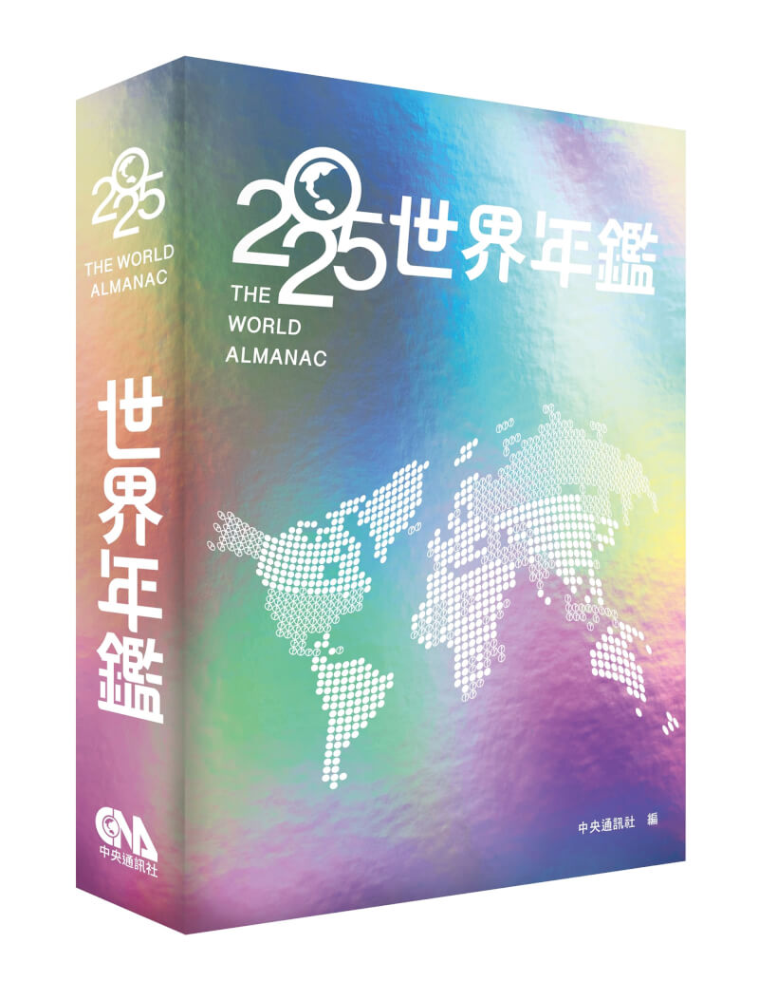

# World Schools Debate: 不只要證據，我要你解釋為什麼

你以為辯論只是在比誰的證據比較多，誰的研究比較好？在 World Schools Debate 裡，你丟資料，我只想問一句：那又怎樣？

World Schools Debate（WSDC）是一種結合亞洲議會制與澳洲制的國際高中英文辯論賽制，廣泛用於世界各國的國際與國內比賽。這是我今年參加 NSDA（美國全國中學生演講與辯論聯賽）比的項目，今天來和大家簡單介紹一下。

> 今年醫學系最佳辯士事件打的就是台大舉辦的 World Schools Debate 比賽。

## 比賽規則

### 隊伍組成

- 每隊3至5人，每場比賽由 3 人上場發言，其餘隊員可以一起準備但是比賽過程不能用任何方式參與。
- 比賽分為 Proposition（正方）與 Opposition（反方）兩隊。

### 發言順序與時間

簡單來說就是三個人輪六上來講八分鐘，最後 4 分鐘總結。

| 發言順序         | 時長 |
| ---------------- | ---- |
| 1. 正方 第一主辯 | 8分  |
| 2. 反方 第一主辯 | 8分  |
| 3. 正方 第二主辯 | 8分  |
| 4. 反方 第二主辯 | 8分  |
| 5. 正方 第三主辯 | 8分  |
| 6. 反方 第三主辯 | 8分  |
| 7. 反方 Reply    | 4分  |
| 8. 正方 Reply    | 4分  |

Reply speech 必須由第一或第二主辯擔任，且由反方先講，正方後講。

### Points of Information（POI，質詢點）

在每個8分鐘主辯的第2到第7分鐘（發言的第1分鐘和最後1分鐘為保護時間），對方可提出POI。通常會站起來或舉手喊（POI, Point, 或 Points of Information）發言者可選擇接受或拒絕，每場通常接受2次是最剛好的。被接受後你可以講大約 15 秒內的話，可以是質詢問題也可以單純只是講講。

比如說：

講者：「社群媒體能過夠增近情侶感情...」
反方：「POI!」
講者：「請說」 （通常會說：I'll take your point）
反方：「我們的資料指出 1/3 的情侶因為社群媒體分手，你要怎麼解釋？」

在對方講到一個段落時提比較不會打擾到他，也比較不會被拒絕。有時候也會在對方誤解或扭曲你的觀念時馬上提出想要做澄清。

#### 類型與範例

舉幾個例子：

- 你實際上要怎麼執行這個計劃 "How exactly would your side enforce that?"
- 語言澄清 "We are saying that..."
- 嘴砲 Zinger "Are you saing that..."
- 舉證責任 "This is a 'would' motion, so we don’t need to prove it exists now."
- 自我矛盾 "But your first speaker said that..."

### 評分方式

- 主辯發言：每人60-80分
- Reply speech：30-40分

贏得隊伍分數加總會比較高。

## 辯題類型

WSDC 題目可依內容分為三大類：

- Fact（事實型）：「有沒有發生」，例如：「全球暖化是否造成海平面上升」
- Value（價值型）：「該不該」，例如：「民主是否優於威權」
- Policy（政策型）：「要不要做」，例如：「是否該對富人加稅」

辯題多為國際性議題，涵蓋政策、價值、倫理、經濟、環境等。但有時候也會指定國家，如「美國應該禁止...」題目都會以 "This house" 開頭。我來隨便舉幾個例子：

### This House Believes That（THBT）

討論某一主張是否正確或成立。例如：

> This House believes that satire, as a form of political commentary, does more harm than good.  
> 本院認為，諷刺喜劇（薩泰爾）作為一種政治評論形式，弊大於利。

### This House Would（THW）

「政策型」辯題，要求正方提出具體行動方案，反方則反對該行動（想要替代方案或維持現況）。有時候是 "This House Believes That...should..."。例如：

> This House Would grant legal rights to anime waifus and husbandos.  
> 本院將授予動漫老婆與老公法律權利。

### This House Regrets（THR）

「後悔型」辯題，討論是否應該對某現象、政策、趨勢等感到遺憾或否定。簡單來說就是如果世界上沒有發生這件事會更美好。例如：

> This House regrets the viral popularity of the song 八方來財 on social media.  
> 本院後悔八方來財這首歌在社群媒體爆紅。

### This House Supports（THS）

表示支持某一政策、行動或理念，通常和「believes」類似，但更強調立場表態。例如：

> This House Supports affirmative action policies that multiply Indigenous students’ entrance exam scores by 1.35.  
> 本院支持將原住民學生入學考試成績提高 1.35 倍的平權行動政策。

### This House Prefers（THP）

比較兩種選擇，討論哪一種更可取。例如：

> This House prefers a post-COVID society.  
> 本院偏好後疫情所形成的世界。

> This House Prefers being fluffy to being smart.  
> 本院偏好毛茸茸勝過聰明。

有時候會用上面寫的大寫縮寫，如：_"THW replace Taiwan national anthems with Nightcore remixes."_

## 現場即席

辯題分為「Prepared Motion」（賽前數週公布，充分準備）與「Impromptu Motion」（現場即席，僅有30-60分鐘準備）。

### Prepared Motion

賽前數週至數月公布，隊伍可無限制利用任何時間和資源準備。

### Impromptu Motion

- 現場公布辯題後，給予30-60分鐘準備時間。
- 準備期間，僅限本隊3-5人討論，不可與教練或外人聯繫。
- 僅可攜帶紙本字典、單卷百科、或是年鑑（Almanac），甚至連自己的筆記都不行。禁止使用任何電子設備。
- 準備結束後，進入比賽現場，3位上場選手不得再與場外溝通。

{{notice}}

#### 年鑑 Almanac

年鑑是一本像是雜誌的書，裡面會記錄這一整年全球的重大新聞，以及各國的情況。對於要找一些範例以及快速了解一個國家很有用。

圖片來源：[中央社](https://www.cna.com.tw/news/ahel/202412180060.aspx)

{{noticed}}

兩種賽制進入比賽現場後都不能使用任何電子產品，但整隊可以用一隻手機來計時。

## 稿怎麼寫？

第一位上台的會解釋我們的整體架構（case），稿會先寫好。後面的講者會寫一些零散可能會講到的，但大多還是即席。

架構其實和 PF 很像，四位講者的分工相同如下：

- 第一位講者通常會講兩個論點（Substantive）
- 第二位講者會做反駁（Rebuttal）然後講第三個 Substantive。很像 Rebuttal Speech。
- 第三位講者會做一些反駁、總結、爭點交鋒（clash）、以及比較（weighing）。很像 Summary Speech。
- Reply Speech 就是 Final Focus。帶評審審視整場比賽，總結為什麼你贏。

第一主辯（1st Speaker）的一辯稿架構通常包含以下主要部分：

### 1. Hook / Introduction（引入）

開場約15-45秒，可以用故事、數據、名言或問題引出辯題，用以吸引評審與觀眾注意。

> 我的朋友上個月搬離這個社區了，因為他們家...因此本院非常自豪的主張...

> 我非常討厭打疫苗，因為很痛。因為為了我的健康我還是會去。而這個政策如同這個國家的疫苗。

### 2. Framing（框架設定）

解釋辯題，為整場辯論設定公平的討論範圍。

- **定義（Definitions）**：清晰界定辯題中關鍵詞彙，避免誤解或爭議，並確保雙方公平辯論。
- **觀察（Observations, characterization）**：對辯題背景或現象的簡短說明。對於不同人來說他們遇到什麼問題，在乎什麼問題。
- **責任（Burdens）**：說明對方需證明的核心責任，如「證明該政策/主張是正確且可行的」。
- **標準（Standards）**：設定評判辯論勝負的標準，例如「最大化社會福利」、「尊重人權」等。
- **計畫模型（Models/Counterfactuals）**：如果有政策方案，簡述方案內容及其運作方式。通常會在 Substantive 裡面說明。

### 3. Case Split（分工說明）

簡述本隊三位辯手的分工，通常一辯負責兩個主要論點，二辯負責第三論點，三辯負責反駁與延伸。

### 4. Substantive Arguments（實質論點）

從「原則層面」（如倫理、價值觀）與「實際層面」（如政策可行性、效果）來思考這個辯題。

你可以從各個面向結構性的解釋你的論點。明確表達論點主張（claim），論述原因與邏輯（warrent），並說明該論點有多大的影響（impact），對辯題的影響有多大（implication），為何能決定勝負。

與 PF 不同的是這裡的 warrent 你需要解釋因為什麼原因，因此很有可能會發生什麼事，造成什麼結果。用邏輯以及大家都知道的範例來說服評審，而不是單純用數據和*英國研究指出*。

### 5. Conclusion / Summary（結論）

以上。

### 6. Handling Points of Information（POI）

一辯需在演講過程中適時接受並回應對方提出的POI。不過太多會顯得你的 Case 寫的很不完整，完全不接顯得你很不自信（或是很跩很欠揍。）兩個剛剛好，也有評審嫌我們接太多過。

有的人會選擇在段落最後面一起接，類似演講完有 QA 時間，這樣比較不會中間被打斷。

> "Now I'll take a POI / your point."

第一次遇到的時候對方說

> "Now I'm open for POI. Three two one. No engagement. Now back to my..."

## 總結

World Schools Debate 強調國際視野、團隊合作、邏輯思辨與現場互動。不像 PF 一樣強調證據卡，研究和數字丟在你面前你沒什麼好說的。在 World School 中你丟數據我反而可以完全不接受：

> 「我要聽你的 Mechanism。背後的邏輯和因果關係是什麼？」

這就是為什麼你會有 8 分鐘來解釋你的整個邏輯架構。十分考驗知識深度，也考驗臨場反應與溝通能力，是很不一樣的訓練。
