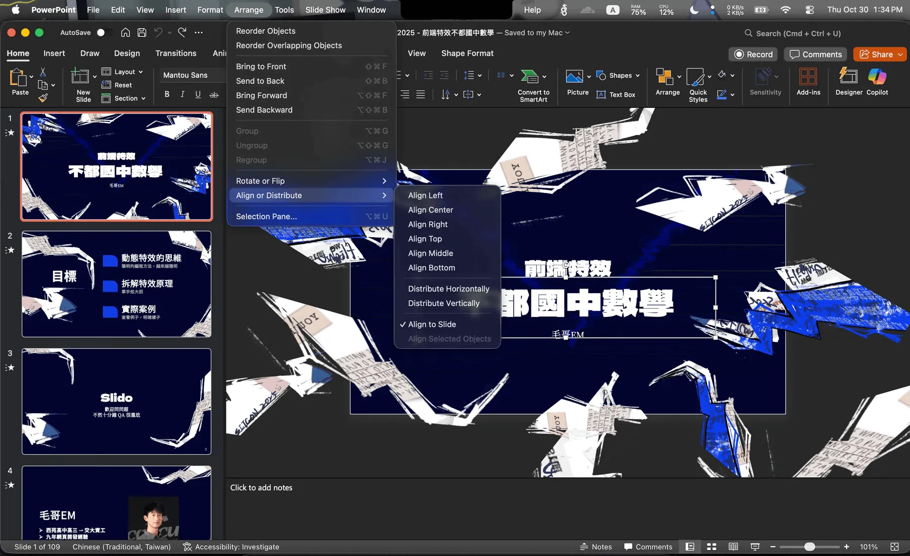

# 如何在 PowerPoint／Keynote 設定置中快捷鍵？

平常在製作簡報的時候我會超級大量的使用置中對齊的功能，無論是文字方塊、圖片、圖案等等都會需要置中對齊。不過用滑鼠來拉不但效率緩慢，在許多時候很容易不小心拉歪，被別的奇奇怪怪的磁鐵吸走。

這時候你得要到右上角 Format，裡面的 Arrange 裡面找到 Align，然後選擇 Center。如果你同時在改文字的話就要一直來回切換，非常的不優雅。

這時如果你上網去找官方給的快捷鍵列表，每個都有好幾十個，但竟然連個置中都沒有。好吧，既然蘋果跟微軟不給你快捷鍵，我們就自己設定吧！

## Windows PowerPoint

首先我們先來講 Windows 上面的 PowerPoint。我們需要設定自訂功能區。

請你打開 PowerPoint，然後點選「檔案」>「選項」>「自訂功能區」。

你可以從「圖形工具」標籤裡面找到置中對齊物件，其中一個是水平置中，另一個是垂直置中。你可以把這兩個功能加入到「自訂快速存取工具列」裡面。建議你用方向鍵把它改到最上面。

接下來你可以按下「確定」，這樣子你的 PowerPoint 視窗上方的快速存取工具列就會多出你剛剛加入的置中對齊功能了。

接下來你就可以用快捷鍵 `Alt + 1`（如果你把它放在第一個位置的話）來快速置中對齊物件了。第二個快捷鍵就是 `Alt + 2`，以此類推。

因為上一步有 `Ctrl + Z`，儲存有 `Ctrl + S`，所以我們把比較好按的位置留給這兩個功能。

## macOS PowerPoint／Keynote

在 macOS 上面你確實也可以設定 Quick Access Toolbar...但是沒有快捷鍵，你還是得要用滑鼠點選，還是不夠優雅。不過其實 macOS 本身就有提供一個方法可以讓你自己設定應用程式所有按鈕的快捷鍵。

首先請你確認你要的指令的名稱。比如說我沒打開 Powerpoint 的話，我可以在選單列上面看到「排列」>「對齊或均分」>「置中對齊」跟「垂直對齊」。而英文是「Align Center」跟「Align Middle」。

接著請你打開「系統設定」，並搜尋「鍵盤快速鍵」。如果你是英文可以搜尋「cut」點選「Keyboard shortcuts」。這時你會看到你可以設定的各種快捷鍵。

> 注意不是「快捷鍵」是「快速鍵」。可能會出現好幾個，隨便選一個喜歡的都行。

這裡我們選擇「App 快捷鍵」（App Shortcuts），然後按下「+」新增一個新的快捷鍵。

我們設定要的應用程式，打入剛才看到的指令名稱，接著綁定快捷鍵。

> 這裡要注意要避開 `Option` 鍵，因為他搭配子母本質上是輸入特殊符號的功能，Keynote 會天真的以為你想要輸入文字。

這裡我用常見的 `V` 跟 `H` 來代表垂直 Vertical 跟水平 Horizontal 置中。

全部設定完長這樣：

這樣你回到 PowerPoint 或 Keynote 裡面，就可以直接使用你設定的快節鍵來水平跟垂直置中囉！
