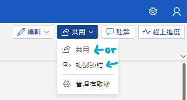
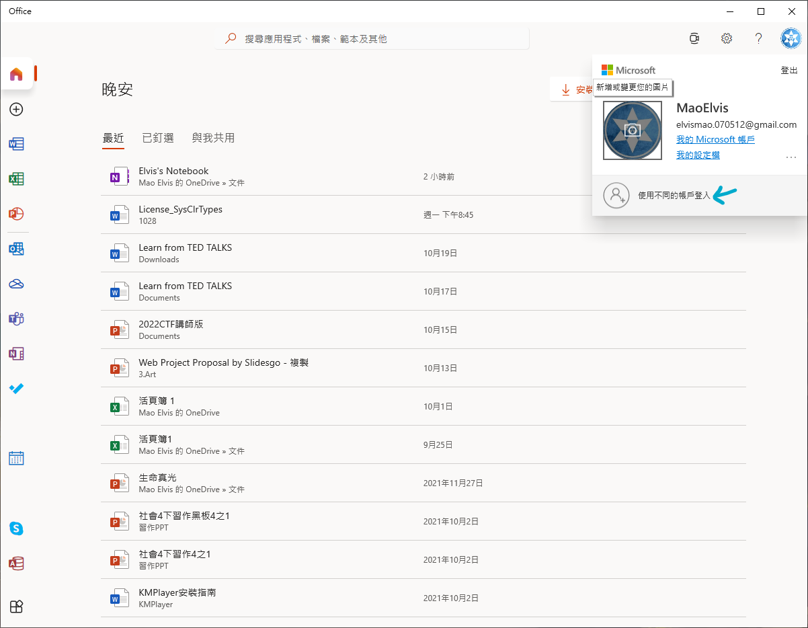
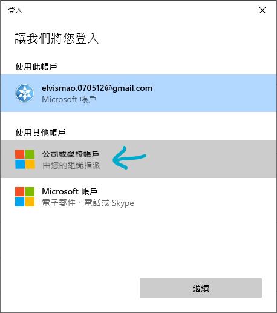
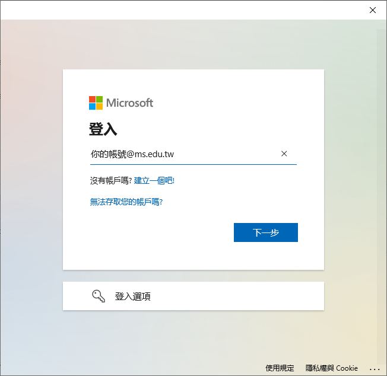
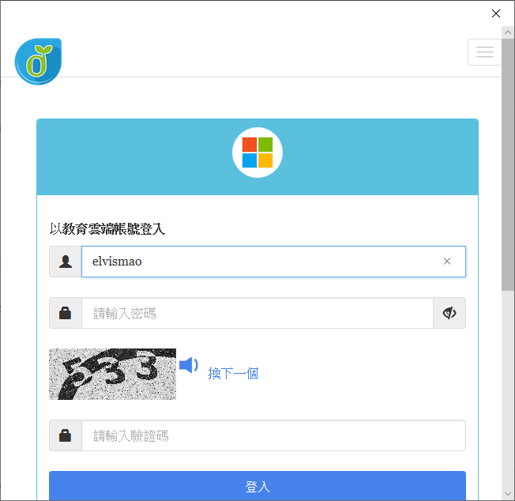

# 【學生】免費全球學校 Wifi & Office365 教育版

你知道學生在在學期間於全世界皆可使用免費 Wifi Eduroam 還有 Office365 嗎？這裡提供完整的操作說明！這是一個知道的人不會願意告訴你的祕密...

## 註冊教育雲

要使用這些服務要先到[教育體系單一簽入服務](https://www.sso.edu.tw/register)註冊帳號，必須填真實資料。電子郵件名稱可以自己設定，最後都是`自訂英文@mail.edu.tw`。如果發現已經註冊過可能是國中時就有使用了，忘記密碼就重新設定。

{{notice}}
教育體系單一簽入服務

-   開發者：教育部
-   程式類型：官方網站
-   網址:<https://www.sso.edu.tw/register>
    {{noticed}}

### 啟用 Eduroam

註冊登入成功看到個人資料底下有一個啟用 Eduroam。點擊即可在全台學校免費使用 Wi-Fi。帳號就是 mail，密碼就是剛才設的。

## 微軟 Office 365 教育版

到[微軟 Office 365 教育版雲端服務啟用網站](https://o365.k12cc.tw/)啟用 Office365。登入即可使用。Office 的網站是<https://www.office.com/>

記得 Office 的帳號是`自訂英文@ms.edu.tw`而不是`自訂英文@mail.edu.tw`喔！

建立檔案即可線上編輯共用。共用鍵在右上角藍色按鈕。可輸入共用者 Email 或直接複製連結

### 在自己電腦上登入 (Windows)

因為學校的帳號其中的用處是讓學校可以集中管理限制某些功能，而學校當然管不到你自己的電腦，所以你可能沒辦法正常登入。

請到內建軟體 Office 登入學校帳號。

### 連接 Wi-Fi

我們學校有一些地方連得到有些地方連不到，圖一圖二我是確定可以的。要教室的無線基地台是**方形**的才能連 eduroam 喔

{{notice}}
Eduroam

-   開發者：泛歐洲科研與教育網路協會
-   服務地區：全球
-   程式類型：官方網站
-   官網:<https://eduroam.org/>(不用到這裡)
    {{noticed}}

#### iPhone & iPad / Windows 10 & 11

1. 「設定」→「Wi-Fi」，找到「eduroam」訊號
2. 如果帳密正確，ios 加入後可能會出現憑證的畫面，按「信任」就 OK 了

#### Android

-   「設定」→「Wi-Fi」，找到「eduroam」訊號
-   「安全性」應該已自動選取「802.1X EAP」
-   「EAP 方法」請選擇「PEAP」
-   「階段 2 驗證」選「MSCHAPV2」(目前選「無」也可以過)
-   「CA 憑證」選「不進行驗證」(手機可能會說阿很危險 bluhbluh 不用理他)
-   「身分」請填「`自訂英文@mail.edu.tw`」
-   「匿名身分」空白即可

#### Windows7

有億點點複雜，真的有需要再問我或老師
