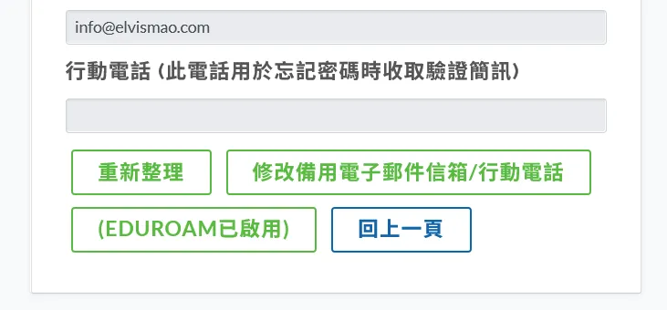
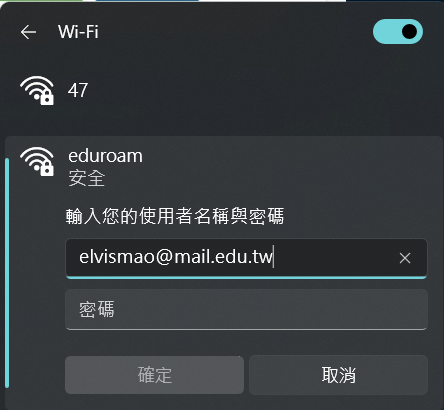

# 如何連上校園免費 Wi-Fi eduroam？

eduroam 是一個來自歐洲的計畫，讓全球的科研和教育機構可以免費使用 Wi-Fi 網路。在台灣絕大部分的高中、大學和研究機構都有加入 eduroam 計畫，所以只要你是學生或教職員，就可以在校園內使用 eduroam 網路。

## 註冊教育雲帳號

在開始連接之前，請你先到[教育體系單一簽入服務](https://www.sso.edu.tw/register)註冊帳號，必須填真實資料，還可以自己設定電子郵件名稱 (`自訂名稱`@mail.edu.tw)。如果你國中學校就有使用但你不知道密碼的話可以點擊忘記密碼。

註冊網址：<https://www.sso.edu.tw/register>

[教育部電子郵件 mail.edu.tw](https://mail.edu.tw) 很慢，UI 很醜，常常檔信，不建議一般正常使用。但是很多軟體如果使用這個教育電子郵件可以獲成很多優惠或升級。也有一些軟體是一定要使用自己學校的信箱 (如 `@g.sysh.tc.edu.tw`)

## 啟用 eduroam

註冊完之後請你在[同一個網站](https://www.sso.edu.tw/login)登入帳號，並滑到最下面，點選 `啟用 eduroam`。如果你的畫面跟我一樣看到 (EDUROAM 已啟用) 代表你已經成功了。

## 連接 eduroam

接下來你就可以開啟你的手機或電腦的 Wi-Fi 設定，選擇 `eduroam` 並輸入你的剛才信箱和密碼，就可以連上了。

### iPhone

1. 「設定」→「Wi-Fi」，找到「eduroam」訊號。
2. 如果帳密正確，iOS 加入後會出現憑證的畫面，按「信任」就完成了。

### Android

- 「設定」→「Wi-Fi」，找到「eduroam」訊號
- 「安全性」應該已自動選取「802.1X EAP」
- 「EAP 方法」請選擇「PEAP」
- 「階段 2 驗證」選「MSCHAPV2」(目前選「無」也可以過)
- 「CA 憑證」如果有「不進行驗證」這個選項的話可以選。或著比較安全可以輸入 `Wi-Fi.sso.edu.tw` 或是你們機構提供的網域
- 「身分」請填「`自訂英文@mail.edu.tw`」
- 「匿名身分」空白即可

### Windows 10 & 11

1. 點選右下角的 Wi-Fi 圖示，選擇 `eduroam`。
2. 輸入你的帳號和密碼，點選 `連線`。
3. 會跳出提醒問你要不要看看憑證，點選 `確定`即可。

## 為甚麼 eduroam 那麼慢？

我在剛搬到我們高中這棟新大樓的時候速度可以跑到七百多 Mbps，前兩天在 `git clone` 也是二十多 MB/s 在跑。但是一直都不太穩定。原因可能是因為大家都在用，所有的辦公室、電腦教室、還有你們的裝置都在共用。而像是我們學校整間的網路加起來就 2 Gbps，所以當大家都在用的時候就會變得很慢。

當然也有可能是你們學校的設定問題，比如說沒開 6 GHz、甚至是 5 GHz 的頻段，或是沒有設定好 IP 位置等等。如果你覺得慢到不合理的話可以跟負責的老師討論看看。

## 結語

這樣你就可以在全台灣的學校免費使用 Wi-Fi 了。如果你有任何問題可以去問看看你們學校圖書館負責的老師。
