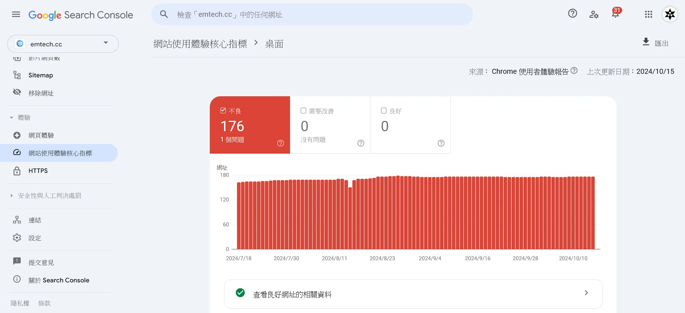
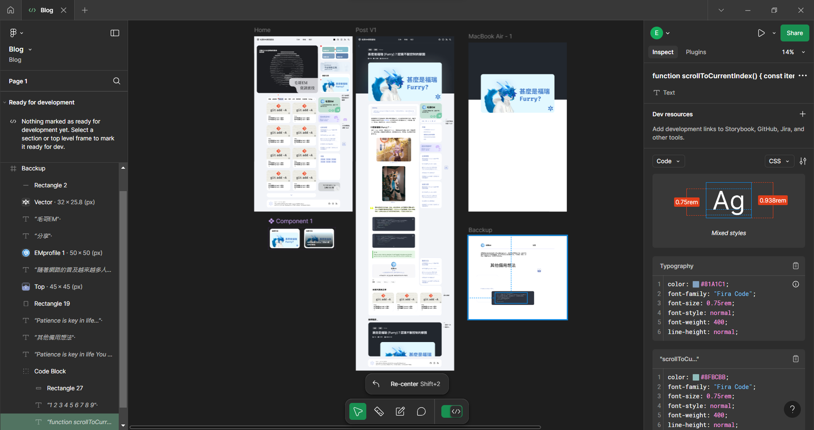
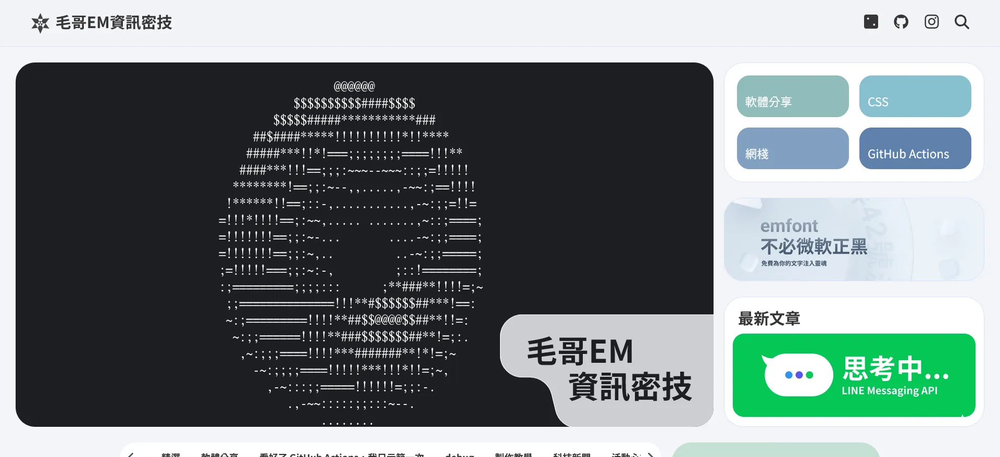
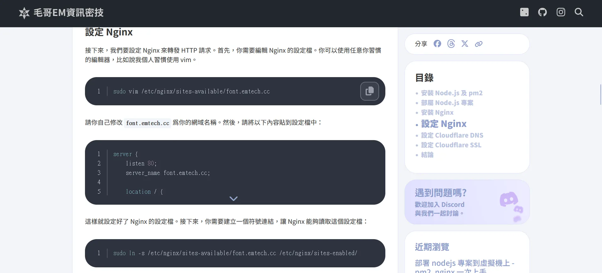
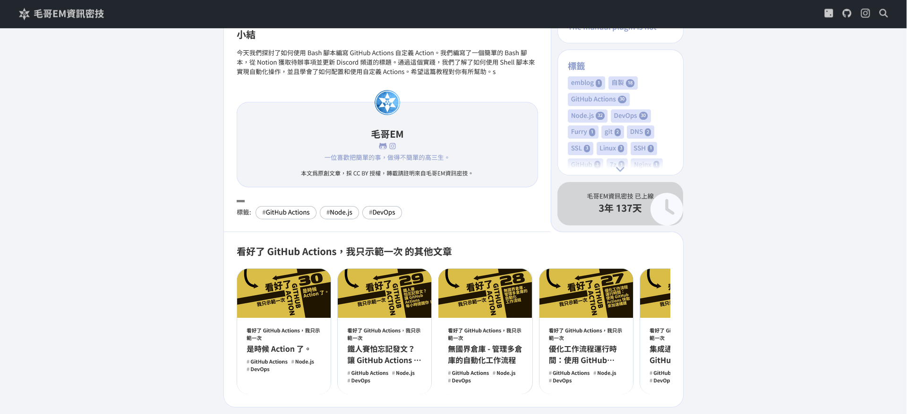

# emblog - 一個不一樣的部落格生成器

emblog 是一個十分特別且強大的部落格框架，專為毛哥 EM 資訊密技設計。可以在幾秒內生成出漂亮的靜態單頁式部落格。

## 背景

毛哥 EM 資訊密技從我國二開始一直是使用 [Hugo](https://gohugo.io/) 作為部落格框架。搭配 GitHub Pages 使用 [Hugo Clarity](https://github.com/chipzoller/hugo-clarity) 主題進行部屬。雖然 Hugo 本身是一個很穩很快的部落格生成器，但 Hugo Clarity 用久了發現有蠻多小問題的。除了有些頁面看起來很詭異以外很多問題是圍繞在中文編碼問題導致 SiteMap 跟搜尋功能會有問題。

另外我希望我的部落格可以獨一無二。而如果要創建一個符合我要求 Hugo 主題基本上裡面的核心都會需要被我動大刀。想說部落格生成器不就是 markdown 轉 HTML 套進模板而已嗎？所以我就天真的決定自己動手做一個部落格框架。前後從構思到開發大概花了一年的時間（實際開發大概花了一個月。）

emblog 是基於 Node.js，除了使用 `markdown-it` 進行基本的 Markdown 解析，`highlight.js` 處理程式碼語法高亮這兩個自己就算花時間做也不一定做的好的函式庫以外不使用任何框架。整個 UI 和 SPA 都是自己手工設計，維持 emblog 的輕量級和高效性。

本來想要藉機學學 Go 語言，但考慮到學習的週期以及平台的支援度，最後還是選擇了自己的母語 Node.js。

## 設計

emblog 的每一個細節從頁面轉場動畫、像抖音一樣的內容懶加載、細心的 SEO 優化、到 RSS Feed 都是經過精心設計的，以確保最終生成的部落格具有最佳的性能和使用體驗。有一些功能因為時間關係還沒有實現，但我會持續更新，也歡迎各位透過 [GitHub](https://github.com/Edit-Mr/emtech) 向我反饋意見。

emblog 你只需要簡單逛一下就會發現它其實只有兩個頁面，一個首頁和一個文章頁。~~絕對不是因為其他頁懶得做~~。有一些小細節原本有規劃但還沒來的及上限，之後有空會慢慢加上去。

### 轉場

先來講講轉場。頁面與文章間的轉換應該是整個部落格最特別的部分。裡面的動畫是我自己設計的，除了希望讓畫面之間的轉換更加流暢，也可以讓文章與圖片在載入時畫面不會出現等待中空白的尷尬。

而在返回到首頁時的效果讓我十分傷腦筋。試了各種效果，結果搞得像小學生或老教授做的簡報一樣花俏不自然。最後是參考了 Material Design 文檔的介紹裡面提到 Apple 的做法做出這種 Parallax (滾動視差) 效果。

而如果你讀完一篇文章繼續往下滑，會繼續看到下一篇文章並逐漸放大。當然你也可以往上滑回到上一篇文章。

### 首頁

左邊黑底的地方是設計用來放一些主視覺。如果有甚麼有趣的動畫或做的甚麼小遊戲都可以放這裡。右邊有一些簡單的按鈕主要就是把畫面填滿。

往下滾是文章列表。可以看得出來目前還是個半成品，但還算堪用。考慮到以前這個國中生做的縮圖不只一堆梗圖以外而且還都是 1:1 的。如果填滿會被切到，但留白又覺得怪怪的。所以我在生成部落格的過程中會統計分析圖片中的主要顏色，然後根據主要顏色生成一個漸層背景色。除了可以填滿空白以外也可以讓圖片載入完之前不會有一大片空白。

> emblog 生成需要幾秒的時間除了 Node.js 本身沒 Go 快，主要就是分析統計每張圖片比較費力一些。

### 文章

文章元素的設計大致就是簡潔明瞭，但帶有一點設計感。圖片底下會有從 alt 文字提取出來的 figcaption。

程式碼高亮我是使用 Nord 主題。除了可以複製以外，如果超過五行的話會自動折行。複製按鈕點擊之後如果複製成功會變成一個勾勾。這是我還蠻堅持的點。

右邊 aside 有一些簡單的分享按鈕，目錄，以及近期瀏覽。近期瀏覽是使用 localStorage 來記錄的，只會保存在本地。除了為了方便讀者返回以外也是為了讓底下的推薦文章不要重複。

最底下的系列其他文章這部分的圓角 CSS 比較難刻。基本上就是各種偽元素拚拚湊湊疊出來的。

## 為我打造

撰寫文章的流程基本上是以我目前覺得最舒服的方式。文字第一段會被自動當成 description，第一個一級標題會被自動當成文章標題。文字自動會格式化，標籤有沒有空白，大小寫、雙引號...我自己也搞不清楚，所以都做防呆了。如果任何一篇文章有問題生成失敗不會直接給我報錯卡住，還是會繼續生成。

## 自己玩玩

如果你想要在本地自己玩玩研究的話你可以直接從 [GitHub](https://github.com/Edit-Mr/emtech) 下載。記得留下顆星星喔！

1. 確保你已安裝 Node.js。
2. 執行 `yarn` 來安裝所需的依賴包。
3. 執行 `yarn build` 來生成靜態網站。
4. 最終的靜態網站將生成在 `dist/` 資料夾中。

## 版權

emblog 目前不管是從設計到裡面的核心皆是是為毛哥 EM 資訊密技設計，缺少許多自訂功能，所以目前尚未對外開放對外使用。不過所有程式碼皆以 Apache 2.0 授權條款釋出，歡迎自行修改使用。等我之後有空應該會做成能讓大家使用的部落格生成器。歡迎關注我的 [GitHub](https://github.com/Edit-Mr/emtech) 以獲取最新消息。
