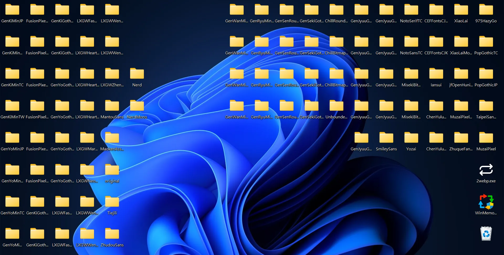
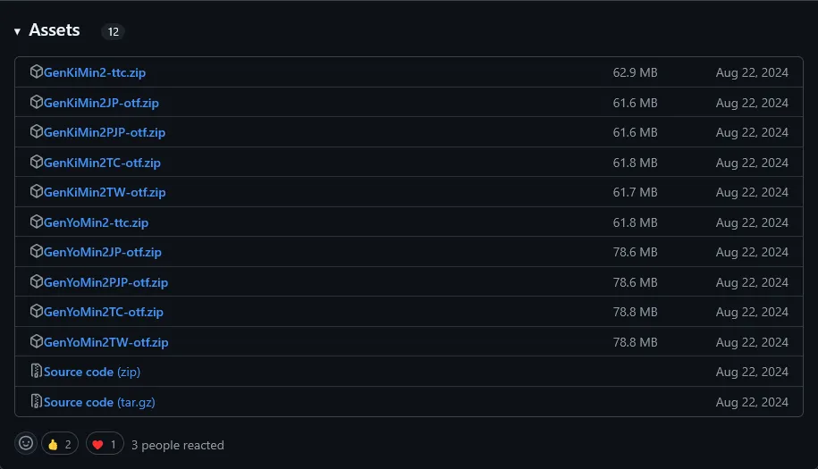

# 中文字體標示解析：字體中的 TC、TW、GB、P 是什麼意思？

昨天在整理我和奕其作的 Webfont 服務 [emfont](https://font.emtech.cc/) 的字型，手工從 GitHub 上下載了很多的字體 (具體來說是 404 個)。

但在下載時你可能會注意到許多字體名稱後面帶有特定的標示，例如 GB、TC、CL、MN、P、TC、Plus 等等。這些標示通常代表字體的語言、地區、用途或風格。我整理了一些目前看到的標示代表的意義以及如何選擇，希望能幫助你選擇適合的字體。

## 不同字重

首先我們先來談一下簡單的字重。字重是指字體的粗細程度，通常分為以下幾種：

| 數值 | 常見名稱                  |
| ---- | ------------------------- |
| 100  | Thin (Hairline)           |
| 200  | Extra Light (Ultra Light) |
| 300  | Light                     |
| 400  | Normal (Regular)          |
| 500  | Medium                    |
| 600  | Semi Bold (Demi Bold)     |
| 700  | Bold                      |
| 800  | Extra Bold (Ultra Bold)   |
| 900  | Black (Heavy)             |
| 950  | Extra Black (Ultra Black) |

數據實際上可以從 1 到 1000，但是實際上大多情況只會使用 [OpenType 規定](https://learn.microsoft.com/en-us/typography/opentype/spec/os2#usweightclass) 的 100 到 900 這幾種。且字體由時候會縮寫成一兩個字母，比如說 Blod 會縮寫成 B，Semi Bold 會縮寫成 SB。

### Normal 與 Regular

Normal 和 Regular 通常都是指一般的字重 400。不過有時候有些字體會同時有這兩個，比如說思源黑體 (Adobe 叫他思源黑體 Source Han Sans，Google 叫他 Noto Sans CJK)。

據 Google 的官方說明之所以有兩個如此接近的字重，是因為 Regular 用來跟 Google 其他語系的開源字體產品線 (Noto Sans / Roboto) 搭配較佳，而 Normal 相信跟 Adobe 的開源英文字體搭配視覺上較佳。不過簡單來說 Normal 會比 Regular 稍微細一點點，在 emfont Normal 會以 `font-weight: 350` 來表示。

> 思源黑體共包含 7 種字重：ExtraLight 250、Light 300、Normal 350（Noto Sans CJK 中稱為 Demilight）、Regular 400、Medium 500、Bold 700、Heavy 900。

## 繁體中文字型 - TC、TW、HK

**TC（Traditional Chinese）：** 表示該字體適用於繁體中文，符合 CNS 11643 編碼。

**HK（Hong Kong）：** 指的是符合香港特區標準的繁體中文字形，通常根據 HKSCS（香港增補字符集）設計。

**TW (Taiwan)：** 表示該字體專為台灣地區的排版習慣設計，或是按照台灣教育部的書寫風格。比如說台灣學生愛用的 [芫荽 GitHub 頁面](https://github.com/ButTaiwan/iansui) 有註明：

> 此專案「芫荽」則是嘗試盡可能調整字形貼近教育部標準字體，並補充台客語用字，貼近台灣需求，並適合學齡教育使用（如童書、國字習作等）。

有些字體會同時有傳統鉛字寫法的 TC（丹版）和現代通用寫法的 TW（月版）的版本（比如說這個部落格毛哥 EM 資訊密技使用的源樣黑體就是使用比較傳統的印刷風格）。但如果只有一種字體，或是只有 TC 的話你可能需要自己注意一下字體實際的風格。

## 簡體中文字型 - GB、SC、CL、MN

**SC (Simplified Chinese):** 表示該字體是為簡體中文設計的，通常用於中國大陸市場。

**GB (Guóbiāo，國標):** 表示該字體是依照中國大陸的「國家標準」（GB2312、GBK、GB18030）設計的，主要用於簡體中文環境。

**CL**：參考早期鉛字印刷字形常見寫法，回歸舊式印刷字形。類似於繁體中文中的 TC。

**MN**：兼顧現代書寫方法以及部分傳統寫法的折中印刷字形。有時候也是指 Mongolian，表示該字體包含蒙古文（蒙文）擴展字符，適用於內蒙古自治區使用的雙語排版。

## 日文和韓文字型 - JP、KR

因為韓文和日文字體通常也包含部分的中文字型，所以有時候大家也會拿來用或是當作基底來延伸開發。

**JP (Japanese):** 表示該字體包含日文漢字（Kanji）與日文字母（Hiragana、Katakana），並符合日本標準（JIS X 0208、JIS X 0213）。

**KR (Korean):** 表示該字體包含韓文漢字（Hanja）與韓文字母（Hangul），適用於韓國市場。

## 調合字 P 與等寬字 Mono

通常中文都是正方型的等寬字體 (Monospace)，但有時候也會有專門為印刷設計的調合字版本 (Proportional) 的字體，主要針對 英文、符號、數字的寬度進行微調，使閱讀體驗更佳。例如「i」就會比較窄，「W」就會比較寬。

比如說劉韋辰和林立宇的自主學習計畫製作的手寫字型[【辰宇落雁體】](https://github.com/Chenyu-otf/chenyuluoyan_thin/tree/main)在版本 2.0 就是不等寬的，這樣可以更有手寫的味道。

再比如說 Windows 內建的新細明體 (PMingLiU) 就是調合字體，而細明體 (MingLiU) 就是等寬字體。

有時候會和前面的字型標示結合，比如說「GenYouMin2PJP」就是指第二代日文版「GenYouMin」的 Proportional 版本。

## Plus 擴充版

有些字體一開始只有設計簡體中文或繁體中文，但後來是出了 Plus 版本，表示該字體包含更多的字符集 (如繁體字或較不常用的生僻字)。檔案會大一點點但可以支援夠多的文字。

## Beta 測試版

中文字那麼多，製作字體十分耗費時間跟精力。有些字體會有 beta 版本，表示該字體還在測試階段，可能會有一些問題。

如基於 Adobe 所開發、發布的思源黑體改作而成的台北黑體叫做 Taipei Sans TC Beta。

## 冠明版

字體開發是一件非常辛苦耗時的工作，因此有些字體會和企業合作贊助。不過合作結束之後可能會有後續開發的版本 (如添加更多字)，因此有些會用檔案名稱來區分。

比如說无界黑就分成「无界黑」 (UnboundedSans) 以及「标小智无界黑」(LogoSCUnboundedSans)。

## 其他版本

有些字體家族會設計許多不同細微變化的版本。比如說從思源黑體改造的圓體字型思源柔黑體除了原本的版本以外又分為特別圓的 X 版本 (思源柔黑體 X) 以及沒麼圓的 L 版本 (思源柔黑體 Y)。

這樣字體三個版本、又有 Mono 版跟調合字版總共這樣就分成了 9 種字型：

- Gen Jyuu Gothic
- Gen Jyuu Gothic L
- Gen Jyuu Gothic Mono
- Gen Jyuu Gothic Mono L
- Gen Jyuu Gothic Mono X
- Gen Jyuu Gothic P
- Gen Jyuu Gothic PL
- Gen Jyuu Gothic PX
- Gen Jyuu Gothic X

然後每種字型又分成 7 種字種 (Font Weight)，這樣就是 63 個檔案了，安裝起來實在很麻煩。不過現在透過變形字體 (Variable Font) 以及 OpenType 格式 (如 OTF) 來解決這個問題，可以把不同的字型放在同一個檔案裡面。

> 你可以看看 [justfont](https://github.com/justfont) 每年愚人節都會製作的各種有趣字型。比如說自動把文字縮成簡語的[簡語生活體](https://github.com/justfont/AbbrFesFont/tree/main)、將所有生肖的相近音漢字，全部替換成生肖本字的[諧靈附體 AllPunType](https://github.com/justfont/AllPunType)。

## 總結

以上就是目前我看到常見的字型命名方式。不過最終還是建議實際比較看看哪個比較符合你的設計。不知道怎麼選的話最簡單就是直接選 TW，沒有的話就選 TC。希望這篇文章可以幫助你選擇最適合的中文字體，讓成果好看不缺字。
