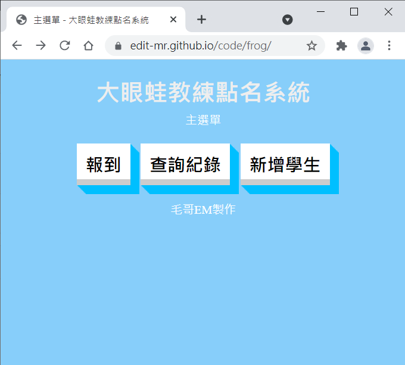
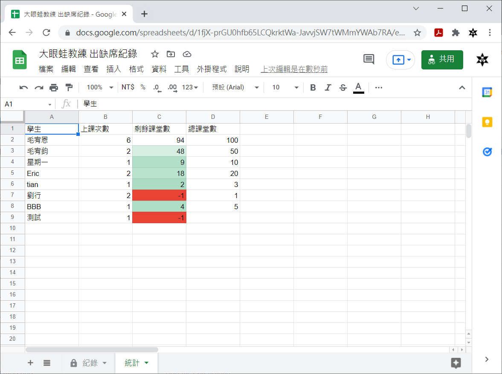
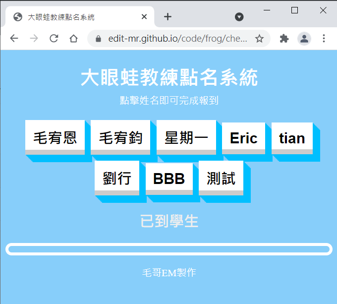
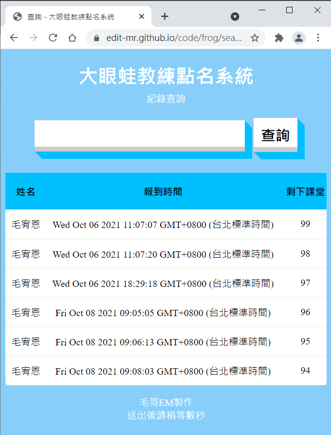

# 【Google Apps Script】自製點名系統

大眼蛙教練的課程是以堂數做計算，也就是來一次算一次，而不是一段時間。因此每次學生上課都需要簽到，最後還需要人工來統計。因此我做了一個簡單的點名系統，讓電腦來做統計和計算的工作。

{{notice}} 大眼蛙教練點名系統這篇文章出乎意料地幫助到許多人，因此我在 2023 年重新寫了一次，比上次更容易製作和操作，也更好看一些 (我覺得啦)。

建議閱讀這篇文章：<https://emtech.cc/post/rol-call/> {{noticed}}

 {{notice}} 大眼蛙教練點名系統

- 開發者:毛哥EM(我)
- 類型：網站
- 網址：[EM's Base](http://edit-mr.github.io/code/frog) {{noticed}}

## 功能

### 新增學生

 輸入名稱並按新增即可。<br /> 電腦會自動在 Google Sheet 建立好欄位。教練只需要到試算表設定學生的課程數就好了。如果沒有課了會用紅色表示，而未設定會被判斷為沒有課程。  {{notice}} 超重要提醒

- 學生姓名不可以有空格，如果有空格會自動刪除
- 要刪除學生請刪除整列，不可留一整列空白 {{noticed}}

### 點名

 網站會從表單取得學生名單並顯示。只需要點擊名稱即可完成報到。

完成報到後會使用 Line Notify 通知完成報到的學生和報到時間到指定的群組。

 {{notice}} 提醒

- 為了配合不同螢幕大小，沒有限制每行出現的學生數。盡可能多顯示一些，比較容易找到。
- 為避免重複點名，報到後學生會隱藏。重新整理頁面即可顯現
- 下方方框會顯示自開啟網頁後已完成報到的學生。 {{noticed}} 在試算表的「紀錄」可以看到之前學生的報到紀錄。當天的會以綠色做標記。  {{notice}} 超重要提醒
- 如果要刪除記錄（如誤按到）請**務必**要「**刪除整列**」。不可留空 {{noticed}}

### 查詢記錄

 如果要查詢之前報到的紀錄，請到查詢頁面並輸入姓名。

## 教學

我們分成三個步驟：

1. 建立試算表 (Google Sheet)
2. 生成 Line Notify 仗權 (若不需要 Line 通知可省略)
3. 創建 API(Google Apps Script) 來處理資料、發送訊息、以及更新試算表
4. 建立一個漂亮的網站方便操作

### 建立試算表 (Google Sheet)

我分成兩個表格，分別叫做`紀錄`和`統計`。為了方便辨識第一排插入標題

#### 紀錄

| 編號 | 姓名 | 時間 | 剩餘課堂數 |
| ---- | ---- | ---- | ---------- |
|      |      |

#### 統計

| 學生 | 上課次數 | 剩餘課堂數 | 總課堂數 |
| ---- | -------- | ---------- | -------- |
|      |          |

接著請你複製這個試算表的 ID，也就是網址`https://docs.google.com/spreadsheets/d/`和`/`之間那一串 (如`1fjX-prGu0hfb65LCQkrktWa-JavvjSz7tWMmYWAb7RA`)。等一下會用到。

### 生成 Line Notify 仗權

Line Notify 是個比較冷門但是非常好用的工具。我們可以透過他來從第三方 (如你的網站、或是 ios 捷徑) 無限量的廣播訊息到指定的群組，或是單獨發給你。我們會在報到成功後請 Line 用 Line Notify 來在群組裡廣播提醒。

請依照圖片步驟建立一個仗權，要給 Line 看這一串他才知道要傳送信息到哪裡。使用 Line Lontify 而不是 Line 機器人的原因是免費版的官方帳號一個月只能傳送 500 則訊息，但老師的學生數量大，可能會吃不消；且 Line Notify 設定較簡單。

### 建立 API(Google Apps Script)

想要讓網站編輯試算表需要透過 Google Apps Script 來完成。我們要建立四個 API，分別用來：

1. 紀錄出缺席
2. 獲取學生列表 (以進行報到)
3. 查詢紀錄
4. 新增學生

到時候我們建立的網站會向這四個 API 發送請求來更新試算表或獲取資料

{{notice}} 提示 [google 官方文件 spreadsheet method](https://developers.google.com/apps-script/reference/spreadsheet/sheet)，裡面有非常詳盡的介紹，包括可以讀取欄位、讀取資料、排序資料、插入資料等等的功能，其實某方面來說算是功能齊全的類資料庫了。有興趣可以點開來看裡面文件。

文件裡面 method 一大堆，還是直接實作比較快。 {{noticed}}

#### 出缺席紀錄

請建立一個新的專案並貼上以下內容。記得貼上 excel 那段 ID {{notice}} 小叮嚀為避免程式碼站太多空間，可能會部分隱藏。請記得展開或直接複製。 {{noticed}}

```js
function doGet(e) {
	var params = e.parameter;
	// 可以針對你帶入的資料變化   params.xxxxxx   xxxxx = 你帶進來的 key 值
	var name = params.name;
	var time = params.time;
	var remain = params.remain;
	//將 Sheet 指定為"資料庫"試算表   SpreadSheet = 試算表，貼上 excel 那段參數
	var SpreadSheet = SpreadsheetApp.openById("XXXXXXXXXXXXXXXXXXX");
	//取得頁籤:"工作表 1"    Sheet = 頁籤
	var Sheet = SpreadSheet.getSheets()[0];
	//取得有資料的最後一行的"行數"(目的要在最後一行插入新資料)
	var LastRow = Sheet.getLastRow();
	// 編號為行數 (如要輸入編號 2 時裡面已經有 2 行了)
	var orderNum = LastRow;

	//開始寫入資料 擋住沒填時間 不給寫入資料，防止被亂撞 api
	if (time !== undefined) {
		//在最後一行的下一行寫入資料
		Sheet.getRange(LastRow + 1, 1).setValue(orderNum);
		Sheet.getRange(LastRow + 1, 2).setValue(name);
		Sheet.getRange(LastRow + 1, 3).setValue(time);
		Sheet.getRange(LastRow + 1, 4).setValue(remain);
		return ContentService.createTextOutput(true);
	}
	// 被亂撞 會回吐這段文字給前端
	return ContentService.createTextOutput("別亂撞我～ :)");
}
```

在這個程式當中，我們說當我們拿著資料到這個應用程式時，將我們給的姓名、時間、剩餘課堂數、以及編號寫入到試算表第一頁最後一行的下一行。但是這樣還沒結束，會後我們還要請 Line Notify 幫我們廣播。請在`return ContentService.createTextOutput(true);`之前插入以下程式碼。記得填入剛才生成的仗權。

編輯完成後請按執行。第一次執行時系統會要求你登入 Google，請登入現在使用的帳號並提供編輯試算表的權限。Google 會告訴你不安全因為這是是你自己製作的應用程式，沒有經過 Google 審查。直接點選進階，並繼續前往即可。成功部署後請保存應用程式的網址，之後網站就會傳送資料到這個網站來寫入和讀取資料。<br /> 完成後可能會看到紅色警告說無法執行，因為我們直接執行了程式，沒有給資料（學生名稱）。因此請建立一個程式碼檔案叫做`debug`，並貼上以下內容：

```js
//呼叫
function debug() {
	var Result = doGet({
		parameter: {
			name: "測試先生",
			time: "2021/10/10 22:46:00",
			remain: 10
		}
	});
	Logger.log("Result: %s", Result);
}
```

執行後你應該會看到底下顯示執行完畢，且表單多出了一列如下

| 編號 | 姓名     | 時間                | 剩餘課堂數 |
| ---- | -------- | ------------------- | ---------- |
| 1    | 測試先生 | 2021/10/10 22:46:00 | 10         |


做好了之後點擊執行▶️，你會需要授予你的程式讀取資料的權限。因為你寫的程式沒有被 Google 驗證過所以會顯示不安全，但我相信你不會把你的帳號搞爆，對吧

接下來我們要部署它，讓它成為一個網站來讓我們抓。這裡選擇網頁應用程式，所有人都以你的身份讀取。按下部署就可以囉

這裡我們把部署的網址複製起來。如果要做修改除了按儲存之外要記得重新部署成新版本才會更新喔 {{notice}} 小叮嚀若發布後還有做修改，既得要再次發布且要發布為新版本。 {{noticed}}

#### 學生列表

學生列表不需要輸入，直接讀取內容就好了。這裡使用的輸出格式是 JSON。JSON 就是 ios 捷徑 APP 裡的辭典，簡單來說就是一個對照表。比如說你想要紀錄一個人的基本資料如下

```json
{
	"姓": "毛",
	"名": "宥鈞",
	"性別": "男",
	"年齡": 15,
	"住址": {
		"路名": "大馬路",
		"city": "台中市",
		"國家": "台灣",
		"郵遞區號": "40763"
	}
}
```

我們可以輕鬆的讓 JavaScript 讀懂它。請以相同方式建立以下 API

```js
function doGet(e) {
	var id = "XXXXXXXXXXXXXXXXXXX"; //抓取表單
	var spreadsheet = SpreadsheetApp.openById(id); // Sheet id
	var sheet = spreadsheet.getSheets()[1]; // 要第幾個 sheet？1 就是第 2 個
	var rowLength = sheet.getLastRow() - 1; //取行長度
	var columnLength = sheet.getLastColumn(); //取列長度
	var data = sheet.getRange(2, 1, rowLength, columnLength).getValues(); // 取得的資料
	var dataExport = {};
	// 一個個加入 json
	for (i in data) {
		if (data[i][0] != "") {
			dataExport[i] = {
				name: data[i][0],
				left: data[i][2]
			};
		}
	}
	// 回傳 JSON
	var dataExportFormat = JSON.stringify(dataExport);
	return ContentService.createTextOutput(dataExportFormat).setMimeType(ContentService.MimeType.JSON);
}
```

在這段程式當中，我們一列一列的把試算表的資料塞進 JSON 裡，最後再回傳給我們。

#### 查詢紀錄

這裡使用 Post 來傳送而不是 Get。其實都可以，只是想說換一個方式。差別在於使用 Get 時資料是存在網址當中，而 Post 像是還有一個附件。因為資料量很小，所以都可以使用。

```js
function doPost(e) {
	var params = e.parameter;
	// 可以針對你帶入的資料變化   params.xxxxxx   xxxxx = 你帶進來的 key 值
	var name = params.name;
	var SpreadSheet = SpreadsheetApp.openById("XXXXXXXXXXXXXXXXXXX"); //抓取表單
	var Sheet = SpreadSheet.getSheets()[0];
	var LastRow = Sheet.getLastRow();
	var data = [];
	var listAll = Sheet.getSheetValues(1, 2, LastRow, 4);
	// 把符合的抓出來
	for (var i = 0; i < listAll.length; i++) {
		if (listAll[i].indexOf(name) === 0) {
			data.push({ data: listAll[i], index: i + 1 });
		}
	}
	// 回傳 JSON
	return ContentService.createTextOutput(JSON.stringify(data)).setMimeType(ContentService.MimeType.JSON);
}
```

在這段程式當中雖然一樣是回傳資料，但是在塞進 JSON 前先判斷一下姓名是否符合。直得注意的是我們是從第 2 欄開始抓，因為使用者不需要知道這是所有資料當中的第幾筆資料。

#### 新增學生

```js
function doGet(e) {
	var params = e.parameter;
	// 可以針對你帶入的資料變化  params.xxxxxx      xxxxx = 你帶進來的 key 值
	var name = params.name;
	//將 Sheet 指定為"資料庫"試算表   SpreadSheet = 試算表，貼上 excel 那段參數
	var SpreadSheet = SpreadsheetApp.openById("XXXXXXXXXXXXXXXXXXX");
	//取得頁籤:"工作表 1"              Sheet = 頁籤
	var Sheet = SpreadSheet.getSheets()[1];
	//取得有資料的最後一行的"行數"(目的要在最後一行插入新資料)
	var LastRow = Sheet.getLastRow();
	var now = LastRow + 1;
	//格字內加入函式統計課程數
	var his = "=COUNTIF('紀錄'!B:B,A" + now + ")";
	//格字內加入函式計算剩餘課程數
	var less = "=D" + now + "-B" + now;
	if (name !== undefined) {
		//在最後一行的下一行寫入資料
		Sheet.getRange(LastRow + 1, 1).setValue(name);
		Sheet.getRange(LastRow + 1, 2).setValue(his);
		Sheet.getRange(LastRow + 1, 3).setValue(less);
		return ContentService.createTextOutput(true);
	}
	// 被亂撞 會回吐這段文字給前端
	return ContentService.createTextOutput("別亂撞我～ :)");
}
```

我們在其中一個儲存格中插入了一個叫做`COUNTIF`的函式。他會統計在紀錄當中有幾筆資料的姓名和他左邊的姓名一樣。而剩餘課堂數就是全部課堂數減統計出來已經上的課堂數。

### 建立網站

最後，讓我們來做一個的簡單漂亮的網站吧。請選一個地方建立以下幾個純文字檔案

- check-in.html
- search.html
- sign-up.html
- index.html
- style.css

HTML 是網頁的檔案，有點像 Word 檔，而 CSS 是用來裝飾 HTML 的。你可以用它來決定字要多大、什麼顏色、間距要多少等。

而我們在 HTML 檔中還插入了一些 JavaScript 來傳送和讀取資料和顯示資料。我使用了一個叫做 jQuery 的 JavaScript 函式庫，它可以讓程式變得更簡略。記得把傳送到的網址改成你剛才建的 Google Apps Script 的網址，其他你可以直接複製貼上。

#### index.html

```html
<!doctype html>
<head>
	<meta charset="utf-8" />
	<title>點名系統</title>
	<!-- 網站資訊 -->
	<meta name="description" content="使用Google sheet的api紀錄出缺席" />
	<meta name="author" content="毛哥EM" />
	<!-- 讓網址正常顯示以及裝飾 -->
	<meta name="viewport" content="width=device-width, initial-scale=1" />
	<meta name="theme-color" content="00BFFF" />
	<link rel="stylesheet" type="text/css" href="style.css" media="screen" />
</head>
<body>
	<main>
		<h1>點名系統</h1>
		<p>主選單</p>
		<button onclick="window.location='check-in.html';">報到</button>
		<button onclick="window.location='search.html';">查詢紀錄</button>
		<button onclick="window.location='sign-up.html';">新增學生</button>
		<p><a href="https://Edit-Mr.github.io">毛哥EM</a>製作</p>
	</main>
</body>
```

#### sign-up.html

```html
<!doctype html>
<head>
	<meta charset="utf-8" />
	<title>新增學生 - 點名系統</title>
	<!-- 網站資訊 -->
	<meta name="description" content="使用Google sheet的api紀錄出缺席" />
	<meta name="author" content="毛哥EM" />
	<!-- 讓網址正常顯示以及裝飾 -->
	<meta name="viewport" content="width=device-width, initial-scale=1" />
	<meta name="theme-color" content="00BFFF" />
	<link rel="stylesheet" type="text/css" href="style.css" media="screen" />
	<!-- 載入 jQuery -->
	<script src="https://cdnjs.cloudflare.com/ajax/libs/jquery/1.11.1/jquery.min.js"></script>
</head>
<body>
	<main>
		<h1><a href="index.html">點名系統</a></h1>
		<p>新增學生</p>
		<input type="text" class="form-control" id="name" />
		<button type="button" id="sendOrder">新增</button>
		<p>
			<a href="https://Edit-Mr.github.io">毛哥EM</a>製作<br />
			送出後請稍等數秒 勿重複新增
		</p>
	</main>
	<script>
		$(function () {
			// 監聽 按鈕點擊

			$("#sendOrder").click(function (e) {
				// 姓名

				var name = $("#name").val();

				$("input").focus(function () {
					$(this).css("border", "");
				});

				// 擋住不填資料

				if (name == "") {
					$("#name").css("border", "1px solid #ff0000");
				} else {
					var name = name.replace(" ", "");

					var data = {
						name: name
					};

					$.ajax({
						// 這邊用 get type

						type: "get",

						// api url - google appscript 產出的 url

						url: "https://script.google.com/............",

						// 剛剛整理好的資料帶入

						data: data,

						// 資料格式是 JSON

						dataType: "JSON",

						// 成功送出 會回頭觸發下面這塊

						success: function (response) {
							console.log(response);

							alert("新增成功!!");
						}
					});
				}
			});
		});
	</script>
</body>
```

#### check-in.html

```html
<!DOCTYPE html>
<head>
 <meta charset="utf-8" />
 <title>報到 - 點名系統</title>
 <!-- 網站資訊 -->
 <meta name="description" content="使用Google sheet的api紀錄出缺席" />
 <meta name="author" content="毛哥EM" />
 <!-- 讓網址正常顯示已經裝飾 -->
 <meta name="viewport" content="width=device-width, initial-scale=1" />
 <meta name="theme-color" content="00BFFF" />
 <link rel="stylesheet" type="text/css" href="style.css" media="screen" />
 <!-- 載入 jQuery 和學生列表 -->
 <script src="https://cdnjs.cloudflare.com/ajax/libs/jquery/1.11.1/jquery.min.js"></script>
</head>
<script>
 //用 Get 讀取資料
    window.onload = () => {
     // api url - google appscript 產出的 url
        let requestURL = "https://script.google.com/.........";
        let request = new XMLHttpRequest();
        request.open("GET", requestURL);
        request.responseType = "json";
        request.send();
        //收到資料後輪流做成按鈕
        request.onload = function () {
            let student = request.response;
            for (var i in student) {
                var now = student[i];
                var stu = now.name;
                var left = now.left;
                --left;
                var but = '<button id="' + stu + '">' + stu + "</button>";
                console.log(but);
                $("#students").append(but);
                var iden = "#" + stu;
                var click = 'to("' + stu + '", ' + left + ");";
                $(iden).attr("onclick", click);
            }
            //載入完成後更改副標題
            $("#header").text("點擊姓名即可完成報到");
        };
    };
    function to(name, have) {
        var currentdate = new Date();
        var filltime = currentdate.getFullYear() + "/" + (currentdate.getMonth() + 1) + "/" + currentdate.getDate() + "  " + currentdate.getHours() + ":" + currentdate.getMinutes() + ":" + currentdate.getSeconds();
        // 打包 要的資料
        var course = have;
        console.log(course);
        var data = {
            name: name,
            time: filltime,
            remain: course,
        };
        var tag = name;
        $.ajax({
            // 這邊用 get type
            type: "get",
            // api url - google appscript 產出的 url
            url: "https://script.google.com/.........",
            // 剛剛整理好的資料帶入
            data: data,
            // 資料格式是 JSON
            dataType: "JSON",
            // 成功送出 會回頭觸發下面這塊
            success: function (response) {
                var msg = response;
                alert("報到成功！還剩" + course + "堂課");
            },
        });
        //報到完成的顯示在下方框框並將按鈕隱藏
        $("#ed").prepend("<li>" + tag + "</li>");
        var id = "#" + tag;
        $(id).fadeOut();
    }
</script>
</head>
<body>
 <main>
  <h1><a href="index.html">點名系統</a></h1>
  <p id="header">載入中</p>
  <div id="students"></div>
  <h2>已到學生</h2>
  <p class="ed" id="ed"></p>
  <p><a href="https://Edit-Mr.github.io">毛哥EM</a>製作</p>
 </main>
</body>
```

#### search.html

```html
<!doctype html>
<head>
	<meta charset="utf-8" />
	<title>查詢 - 點名系統</title>
	<!-- 網站資訊 -->
	<meta name="description" content="使用Google sheet的api紀錄出缺席" />
	<meta name="author" content="毛哥EM" />
	<!-- 讓網址正常顯示以及裝飾 -->
	<meta name="viewport" content="width=device-width, initial-scale=1" />
	<meta name="theme-color" content="00BFFF" />
	<link rel="stylesheet" type="text/css" href="style.css" media="screen" />
	<!-- 載入 jQuery -->
	<script src="https://cdnjs.cloudflare.com/ajax/libs/jquery/1.11.1/jquery.min.js"></script>
</head>
<body>
	<main>
		<h1><a href="index.html">點名系統</a></h1>
		<p>紀錄查詢</p>
		<input type="text" id="name" />
		<button type="button" id="send">查詢</button>
		<!-- 顯示查詢結果的表格 先隱藏 -->
		<table class="table table-striped" style="display: none;">
			<thead>
				<tr>
					<th>姓名</th>
					<th>報到時間</th>
					<th>剩下課堂</th>
				</tr>
			</thead>
			<tbody id="dataView">
				<!-- 查詢到的資料會插入到這裡 -->
			</tbody>
		</table>
		<p>
			<a href="https://Edit-Mr.github.io">毛哥EM</a>製作<br />
			送出後請稍等數秒
		</p>
	</main>
	<script>
		//當傳送按鈕被點擊
		$(function () {
			$("#send").click(function (e) {
				var status = true;
				var name = $("#name").val();
				$("input").focus(function () {
					$(this).css("border", "");
				});
				//擋住沒有輸入姓名
				if (name == "") {
					$("#name").css("border", "1px solid #ff0000");
				} else {
					var data = {
						name: name
					};
					//Post 到前面做的 API，記得更改網址
					$.ajax({
						// 這邊用 post type
						type: "post",
						// api url - google appscript 產出的 url
						url: "https://script.google.com/...........",
						data: data,
						dataType: "JSON",
						success: function (response) {
							var content = "";
							//把資料一行行做出表格
							response.forEach(element => {
								var [name, time, remain] = element.data;
								var index = element.index;
								content += `<tr>
                <td>${name}</td>
                <td>${new Date(time)}</td>
                <td>${remain}</td>
              </tr>`;
							});
							//如果有資料的話顯示表格，否則提示查無資料
							if (content) {
								document.getElementsByClassName("table-striped")[0].style.display = "table";
							} else {
								alert("查無資料");
							}
							var dataView = document.getElementById("dataView");
							dataView.innerHTML = content;
							$("#name").val("");
						}
					});
				}
			});
		});
	</script>
</body>
```

#### style.css

```css
@charset "utf-8";
/*按鈕
-----------------*/
button {
	outline: 0;
	font-size: 1.5em;
	font-weight: 600;
	background: #fff;
	border: none;
	margin: 5px;
	padding: 0.5em;
	transition: all 0.3s ease-out;
	box-shadow:
		inset 0 -8px 0 0 rgba(0, 0, 0, 0.2),
		1px 1px 0 0 deepskyblue,
		2px 2px 0 0 deepskyblue,
		3px 3px 0 0 deepskyblue,
		4px 4px 0 0 deepskyblue,
		5px 5px 0 0 deepskyblue,
		6px 6px 0 0 deepskyblue,
		7px 7px 0 0 deepskyblue,
		8px 8px 0 0 deepskyblue,
		9px 9px 0 0 deepskyblue,
		10px 10px 0 0 deepskyblue,
		11px 11px 0 0 deepskyblue,
		12px 12px 0 0 deepskyblue;
}
button:hover {
	color: #444;
	box-shadow:
		inset 0 -4px 0 0 rgba(0, 0, 0, 0.2),
		1px 1px 0 0 deepskyblue,
		2px 2px 0 0 deepskyblue,
		3px 3px 0 0 deepskyblue,
		4px 4px 0 0 deepskyblue,
		5px 5px 0 0 deepskyblue;
}
button:active {
	color: #222;
}
/*其他
-----------------*/
a {
	color: white;
	text-decoration: none;
}
a:hover {
	text-decoration: underline;
}
.ed {
	padding: 5px;
	border: 5px white solid;
	border-radius: 10px;
}
input {
	outline: 0;
	font-size: 1.5em;
	font-weight: 600;
	background: #fff;
	border: none;
	box-shadow:
		inset 0 -4px 0 0 rgba(0, 0, 0, 0.2),
		1px 1px 0 0 deepskyblue,
		2px 2px 0 0 deepskyblue,
		3px 3px 0 0 deepskyblue,
		4px 4px 0 0 deepskyblue,
		5px 5px 0 0 deepskyblue;
	margin: 5px;
	padding: 0.5em;
	transition: all 0.3s ease-out;
	box-shadow:
		inset 0 -8px 0 0 rgba(0, 0, 0, 0.2),
		1px 1px 0 0 deepskyblue,
		2px 2px 0 0 deepskyblue,
		3px 3px 0 0 deepskyblue,
		4px 4px 0 0 deepskyblue,
		5px 5px 0 0 deepskyblue,
		6px 6px 0 0 deepskyblue,
		7px 7px 0 0 deepskyblue,
		8px 8px 0 0 deepskyblue,
		9px 9px 0 0 deepskyblue,
		10px 10px 0 0 deepskyblue,
		11px 11px 0 0 deepskyblue,
		12px 12px 0 0 deepskyblue;
}
body {
	background-color: lightskyblue;
	color: white;
}
main {
	position: relative;
	margin: auto;
	width: 100%;
	height: 100%;
	text-align: center;
}
h1 {
	margin-bottom: -10px;
}

table {
	margin-top: 30px;
	color: black;
	border-spacing: 1;
	border-collapse: collapse;
	background: white;
	border-radius: 6px;
	max-width: 100%;
	width: 100%;
}
table * {
	position: relative;
}
table td,
table th {
	padding-left: 8px;
}
table thead tr {
	height: 60px;
	background: deepskyblue;
	font-size: 16px;
}
table tbody tr {
	height: 48px;
	border-bottom: 1px solid #e3f1d5;
}
```

這樣就完成囉
