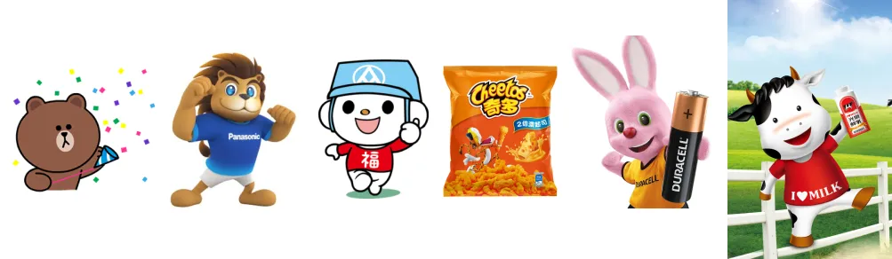
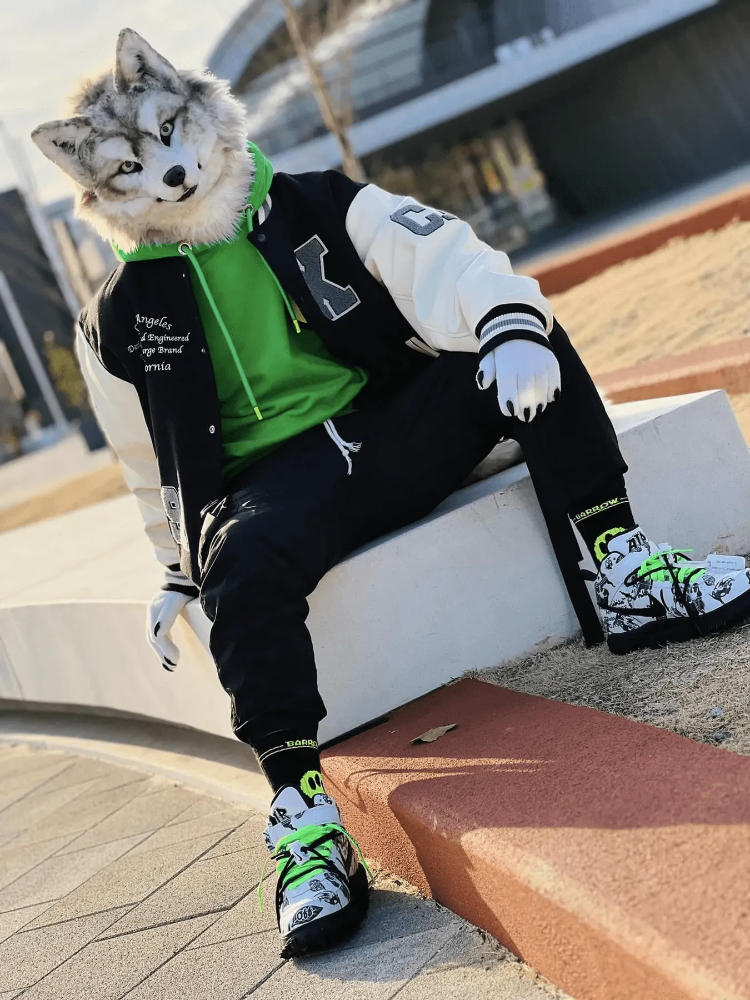

# 甚麼是福瑞 (Furry)？認識不獸控制的獸圈

隨著網路的普及越來越多人開始接觸到福瑞文化，但沒有甚麼完整的介紹。[維基百科](https://zh.wikipedia.org/zh-tw/%E7%8D%B8%E8%BF%B7)的介紹糟糕到我覺得可以提[快速刪除](https://zh.wikipedia.org/wiki/Wikipedia:%E5%BF%AB%E9%80%9F%E5%88%A0%E9%99%A4%E6%96%B9%E9%92%88#G3)。本文將帶你深入探討獸迷文化，介紹福瑞（獸人）的定義、獸圈的生活、以及文化的多樣性。

> 維基百科：快速刪除方針 G3. 純粹破壞，包括但不限於明顯的惡作劇、錯誤資訊、人身攻擊等。

{{notice}}

溫馨提醒

- 以下內容部分包含我個人的觀點，可能與部分人的看法不同。
    - 如果你不同意的話我完全不在乎。
- 你往下會看到越來越多各種不獸控制的圖片，請自行斟酌閱讀。

{{noticed}}

## 什麼是福瑞 (Furry)？

福瑞（Furry）這個詞，源自英文的“furry”，意指毛茸茸的動物。福瑞，或者說獸人，指的是擁有人類特徵的動物角色，例如能站立行走、會說話、擁有豐富表情的動物形象。

我們日常生活中其實經常與福瑞形象相遇。比如說你走進全聯看到奇多老虎、光泉的乳牛、Panasonic 的獅子，打開手機的 Line 熊大，迪士尼幾乎所有的動物，這些都可以算作是福瑞的例子。為了能讓你之後還能正常的走進便利商店我就不舉更多例子了。

然而這些吉祥物一看就知道不是獸控畫的，比如說下面是台中市政府的吉祥物石虎 - [來虎](https://pagamo.fandom.com/zh-tw/wiki/%E4%BE%86%E8%99%8E)。

而這是[唬爛 (Vikulan Blue)](https://www.facebook.com/vikulan.vinky/posts/pfbid02JaZkWzq3yvtRKqhvEVGjcq9ae17z5xy82FNf5D8MZ24o2AeMMad4QsGADHF8JSrrl) 畫的一隻懶懶的豹。

在獸圈中，這些形象通常經過更為個性化的設計，具有人性化特徵，並且展現了更多的情感和個性。

在獸圈內，每個人對於福瑞的定義和喜好各有不同。某些人可能更偏好擬人化的動物形象，另一些則可能傾向於更接近真實動物的表現形式。這種多樣性也使得福瑞文化充滿了創造力和包容性，但通常的共識是獸耳娘不是福瑞。

有的人說寫程式寫到最後都會變獸控，這完全沒有科學根據，~~但我完全同意~~。看看這些在中研院[演講的人](https://www.youtube.com/watch?v=yZYOL8Ybdm4)和[工程師們](https://www.facebook.com/share/p/DoATaGrjWavMGwot/)。

> 有的人說伊隆·馬斯克是獸控，不過他是沒有公開承認的。

{{notice}}

福瑞控

著名迷因版版主好色龍完全無法接受「福瑞控」這個詞。furry 的定義是「喜歡擬人化動物並對獸文化有認同的人」，它指的是「獸人愛好者」而不是「獸人」。作為 furry 的直接音譯，說自己是福瑞控，這語感就像在說「我好喜歡蘿莉控喔」。不過我是覺得沒甚麼問題。

{{noticed}}

## 獸圈內的生活

在獸圈，參與者通常會有自己的「獸設」（Fursona），這是一個代表他們的虛擬角色，類似於一個遊戲中的角色或皮膚。這些獸設通常是個人創作的，有時候人們會尋求專業繪師的幫助來設計這些角色，或者購買他人設計好的角色。

如以下是曾是名警察，現在是肥宅全端工程師[熱點](https://www.facebook.com/re.dian.502123)很完整的獸設。

### 獸裝

一些福瑞愛好者還會製作或委託專人製作獸裝（Fursuit），這些獸裝可以在線下活動中穿戴，或是拍照發社群媒體，進一步表達自己的獸設。

圖：[果糖含糖](https://x.com/Fructose_c/status/1766419617575309383/photo/1)

獸裝有時後被稱作毛毛。和外面常看到布偶裝不同，基本上所有的獸裝都是手工良身定做的。除了因為獸設每個人都是獨一無二的，製作工藝十分繁瑣，需要全身掃描或包膜測量才能完全符合穿戴著的身材。製作時間通常都需要等半年以上。因此價格從幾萬到幾十萬都是很合理的價格。

有人問說大夏天在戶外出毛（穿獸裝出門）不熱嗎？怎麼說呢，

> 當核彈炸到廣島時那是 6000 多度的高溫啊。

通常出毛都會配戴風扇，通常是長條狀的可以從嘴巴吹入，但一定還是很熱，而且視野也很差。和騎重機一樣，都是為了自己熱愛的事物燃燒自己。不過當然有一些機械的大佬會搞眼部追蹤、內顯示屏（像 Vision Pro）、水冷系統之類的，不過還是偏少數，一般頂多只會有頭內風扇。

圖：[凌汐 Jeffrey](https://x.com/Jeffrey86334455/status/1820775013324390436/photo/1)

獸圈的線上和線下活動都非常活躍。線上比較有趣的是每週五，社群平台上會出現大量使用 #FursuitFriday 標籤的獸裝照片，展示著各式各樣的創意。而在台灣，福瑞愛好者每年都會參與多場實體活動，這些活動通常舉辦在酒店或市立圖書館等場地。這些活動類似於同人活動，充滿了貼紙、卡片、繪畫的交換、朋友之間的交流，還有一些有趣的比賽和遊戲。如每年在麗寶樂園福容飯店舉辦的 [Infurnity](https://www.infurnity.com/)、與高雄市政府合辦的[以茶會毛](https://www.furryteaparty.com/)等。

圖片來源：[Cheetahpaws](https://www.facebook.com/photo?fbid=1260602801837889)

福瑞文化之所以能吸引這麼多人，與其包容性有很大關係。在這個圈子裡，不論你的背景、興趣，還是身份，都能找到一個可以安心做自己的空間。對於許多人來說，獸設是他們理想中的自己，因為在獸設或網路身份的掩護下，他們能更真實地表達自己，甚至是放大某些平日難以展示的特質。

## 福瑞文化的多樣性

福瑞文化內部有著豐富的多樣性，從獸設的風格到藝術風格，都展現了參與者們的創造力與個性。以下是我自己簡單的分類：

### 半獸 / 純獸

「半獸」指的是那些擁有人類軀幹並站立行走的福瑞角色，這類角色通常擁有更多的擬人化特徵。而「純獸」則更接近真實動物，通常是四腳走路。

圖片來源：[火龙果](https://x.com/HLG7777/status/1741555481771114915/photo/1)

圖片來源：[楓不轉陸轉](https://www.facebook.com/photo/?fbid=3508574829425849&set=a.1378228892460464)

### 寫實派 / 可愛派

在福瑞藝術中，寫實派的福瑞通常在外觀上更接近真實的動物，不論是五官還是毛髮的色澤。而可愛派的福瑞則會放大某些可愛特徵，例如更大的眼睛或更圓潤的面部比例。

如以下是來自日本比較偏寫實派的毛毛：[れいじー うるふ（Galfar）](https://www.facebook.com/permalink.php?story_fbid=pfbid0E4u6ndPD3RHnf557wVP7f8CNNCL8um1foW4JXXzRg7ucASGu2aUMvpCgfXKU88dJl&id=100082328874967)

喔對了，這種穿搭方式叫做「半裝」，是一種比較輕便的獸裝，通常只有頭套和手套或會加上尾巴。相對來說比較便宜、容易穿脫、也更方便活動 (跳一些 breaking 之類的)。

### 美系 / 日系 / K 系

獸裝可以簡單分為美系 / 日系 / K 系。「美系」獸裝通常顏色鮮豔，五官明顯，類似於迪士尼風格的角色，也是刻板印象最容易出現的獸裝。「日系」獸裝則在風格上更柔和，通常更符合日本動漫的審美，簡單來說基本上所有物種看起來都像狗。而「K 系」獸裝則是一個相對~~邪教~~特別的風格，這種風格的獸裝類似於日本藝妓的形象，臉超白、沒有毛髮。我個人是覺得稱不太是獸裝也不太理解但尊重，我就不放圖了。

[大助喵](https://x.com/daisukechen_tw/status/1819732291431944664/photo/1)和[山松](https://x.com/MountainPineTW)於 COSCUP 2024。就說資工最後都是獸控，當天中電喵的貼紙全部被搶光了。

### 種族創意

在福瑞文化中，沒有任何種族的限制，創意是無限的。你可以創造出任何你想要的角色，比如雪地狐狸、上古神獸，或是不同物種的混合體，如章魚貓。有的人甚至當狐狸當累了跑去當狗。

啊不對這是微軟 GitHub 的吉祥物 [Octocat](https://octodex.github.com/)。這個才對。

圖片來源：[黃小龍](https://www.facebook.com/photo.php?fbid=297520523106943&set=pb.100085469918735.-2207520000&type=3)

## 常見的刻板印象與誤解

福瑞有蠻多刻板印象和誤解的。早年，美國奧克拉荷馬州曾因一則假新聞，差點立法禁止福瑞進入校園，這則新聞聲稱大學校園允許福瑞愛好者在學校使用貓砂盆（？）。然而，網路的普及使得福瑞文化得以快速傳播，也使得越來越多人開始了解並接受這一群體。

{{notice}}
冷知識：穿獸裝的人如何上廁所？

這聽起來很抽象但大家通常會脫下來再去上。

{{noticed}}

當然如同前面說的獸圈相對可以匿名的特性，也是有一些少數的人會過度開放或越界。正所謂好事不出門，壞事傳千里。你看看 LGBTQ 群體現在的情況就懂了。有的論文說獸圈是 Gay 或有奇怪僻好的比例比較高，但我覺得這只是因為社群比較開放造成常見的統計謬誤和倖存者偏差而已。不過大部分的統計數據都是表示男性比例比較高。

> 蘇裔非推薦影片：[I'm Gay and I Dislike the LGBT Community...](https://www.youtube.com/watch?v=WjKjCqfMrHE)

## 結語

希望這篇文章能讓你對福瑞文化有一個更全面的理解。福瑞文化充滿了創造力和包容性，不僅僅是喜愛動物角色的人們的聚集地，更是一個讓人們能真實表達自我、找到歸屬感的社群。如果你對這個群體感興趣，歡迎你的加入。
