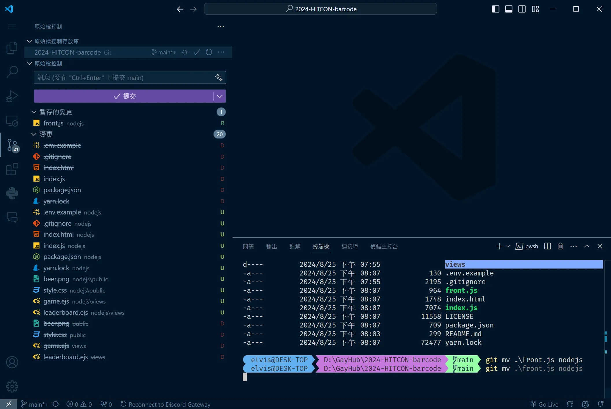
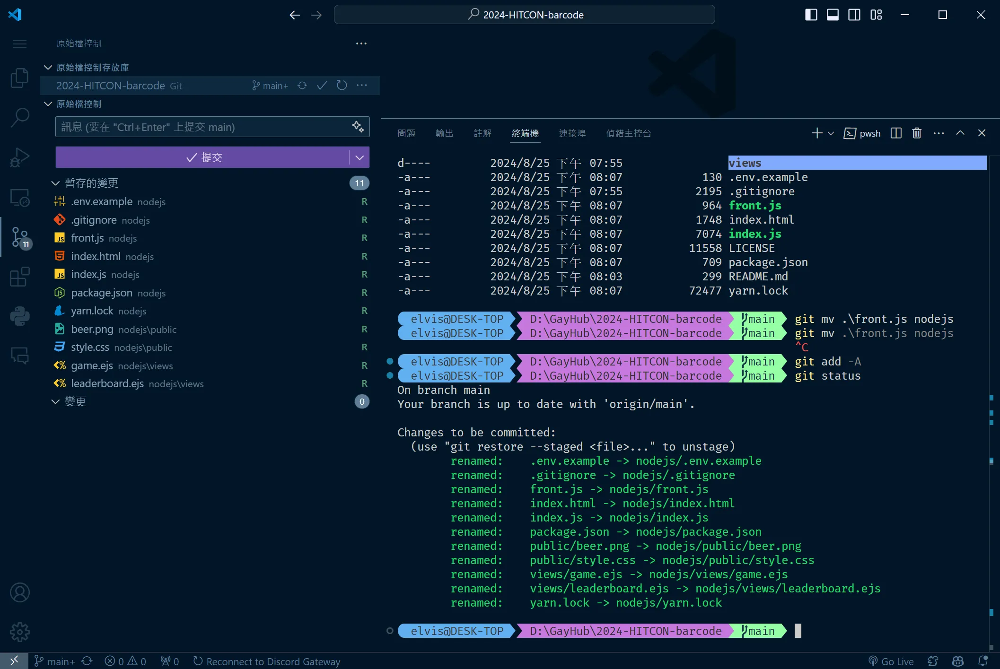

# 你不知道的 git add -A

在使用 Git 的過程中，我偶然發現了一個指令，徹底改變了我處理檔案變更的方式——這就是 `git add -A`。

<!--more-->
## Git 中的檔案移動問題

作為一名開發者，移動檔案是再也平常不過的事情了。這有甚麼難的？拖曳過去不就好了？

有趣的事來了。當你使用 `mv` 指令或拖曳來移動檔案時，Git 會將這一操作視為刪除舊檔案並新增新檔案。這意味著，即使你只是將檔案從一個目錄移動到另一個目錄，Git 也會將其視為完全不同的檔案，這會導致提交記錄變得混亂。如果是稍微大一點的二進至檔案，那你的 `.git` 資料夾就會變得很大。

當然這也不是甚麼大問題。你可以使用 `git mv` 指令來移動檔案，這樣 Git 就會正確地追蹤檔案的移動。你可以看到在 `git status` 中，Git 會顯示檔案的移動，而不是刪除和新增。

## 遇見 `git add -A`：解決檔案移動問題

一個檔案還好，但當你處理多個檔案時，手動使用 `git mv` 來移動檔案就變得有點麻煩了。這時，我偶然發現了 `git add -A` 這個指令。這個指令的作用是將所有變更（包括新增、修改和刪除的檔案）添加到暫存區。這意味著，當你使用 `git add -A` 時，Git 會自動追蹤所有檔案的變動，包括檔案的移動，無需額外的手動操作。

## `git add` 指令詳解及適用場景

既然發現了 `git add -A` ，我開始探索 Git 中的其他 `git add` 選項，並發現每個選項都有其獨特的功能和適用場景。不同的 `git add` 選項可以幫助你更精確地控制變更，提高工作效率。以下是一些常見的 `git add` 選項及其適用場景：

不同的 `git add` 選項有不同的用途，以下是一些常見選項的解釋及其適用場景：

1. **`git add .`**
   - **功能**：將當前目錄及其子目錄中的變更添加到暫存區，但不包括已刪除的檔案。
   - **適用場景**：當你只需要提交特定目錄下的變更，而不想影響其他部分時，這是理想的選擇。

2. **`git add -A`**
   - **功能**：將所有變更（包括新增、修改和刪除的檔案）添加到暫存區。
   - **適用場景**：當你需要確保所有變更都被追蹤，並避免遺漏任何檔案時，這是最佳選擇。

3. **`git add -n` 或 `--dry-run`**
   - **功能**：預演添加操作，顯示哪些檔案會被加入，但不實際添加。
   - **適用場景**：當你想確認哪些檔案會被添加而不執行實際操作時，這是一個很好的選擇。

4. **`git add -i` 或 `--interactive`**
   - **功能**：進入互動模式，逐步選擇要添加的變更。
   - **適用場景**：當你需要精細控制要提交的變更，並希望逐步選擇要添加的部分時，這個選項非常有用。

5. **`git add -p` 或 `--patch`**
   - **功能**：逐行審查每個變更並決定是否添加。
   - **適用場景**：當你只想提交部分變更，或需要對變更進行詳細審查時，這是理想的選擇。

6. **`git add -f` 或 `--force`**
   - **功能**：強制添加被 `.gitignore` 忽略的檔案。
   - **適用場景**：當你需要加入那些本應被忽略但仍然想要追蹤的檔案時，這個選項非常有用。

7. **`git add -N` 或 `--intent-to-add`**
   - **功能**：將檔案標記為將來會添加，但不實際添加內容。
   - **適用場景**：當你計劃在未來的提交中逐步添加檔案，可以先標記它們為「將要添加」。

8. **`git add -e` 或 `--edit`**
   - **功能**：允許你編輯變更清單，手動調整要添加的變更。
   - **適用場景**：當你希望在提交前對變更進行手動調整時，這是一個很好的選項。

9. **`git add --ignore-errors`**
   - **功能**：忽略添加檔案時發生的錯誤，繼續處理剩下的檔案。
   - **適用場景**：當你需要批量添加檔案且不希望因為個別錯誤而中斷整個過程時，這個選項很有用。

10. **`git add --renormalize`**
    - **功能**：強制重新規範化檔案，通常用於處理行結尾的問題。
    - **適用場景**：當你處理不同操作系統間的行結尾問題時，這是一個有效的選擇。

## 結語：找到最適合的 Git 指令

每個 `git add` 指令都有其獨特的應用場景，了解這些選項並靈活運用，能夠讓你的版本控制更加精確和高效。不管是精細控制變更，還是確保所有變更被正確追蹤，選擇合適的指令將大大提升你的開發體驗。希望這篇文章能幫助你更好地掌握 Git，讓你的工作流更加順暢。如果你有任何問題都可以在 IG 留言，也歡迎在 [Instagram](https://www.instagram.com/em.tec.blog) 和 [Google 新聞](https://news.google.com/publications/CAAqBwgKMKXLvgswsubVAw?ceid=TW:zh-Hant&oc=3)追蹤 [毛哥EM資訊密技](https://em-tec.github.io/)。