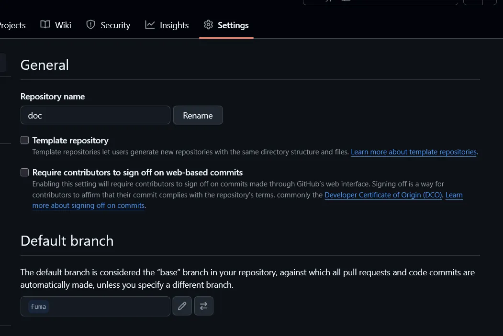

# GitHub 如何更改預設分支 (default branch)

## 背景

最近在弄 [emfont](https://font.emtech.cc) 的文檔，整個專案架構大改。從 [Yarn](https://yarnpkg.com/) 改到 [pnpm](https://pnpm.io/zh-TW/)，框架也從 [Docusaurus](https://docusaurus.io/) 變成 [Fumadocs](https://fumadocs.vercel.app/)，因此是從頭到尾重新弄。

為了重新整理，我創建了一個全新沒有父母 (Parent，之前的 commit 紀錄) 的孤兒 (orphan) 分支名叫 `fuma`（額我不確定是不是這樣翻但我都這樣說。）

```bash
git checkout --orphan fuma
```

> 以前的做法會是先生一個兒子再把父母斷頭讓他變成孤兒。
> ```bash
> echo ref: refs/heads/newbranch > .git/HEAD
> ```
> 但這實在有點暴力，現在 Git 1.7.2 之後可以用 `git checkout --orphan` 來做。

創了新分支之後就可以砍掉重來了。

```bash
git rm -rf .
```

接著就是 `pnpm install` 那些的了。都做好之後就可以正常 push 了。

## 如何更改預設分支

確定換好了之後我想要把預設分支改成新創的 `fuma`。你可以在專案的 `Settings` 裡面找到 `General` 的 `Default branch` 來更改。



## 如何更改遠端預設分支

改好了之後，如果你的本地有 clone 這個專案，你還需要把遠端預設分支也改成新的 `fuma`。

```bash
git branch -m main fuma
git fetch origin
git branch -u origin/fuma fuma
git remote set-head origin -a
```

但這時你目錄的檔案還會是舊的，且你會發現 `git pull` 時會失敗。

```bash
$ git pull
fatal: refusing to merge unrelated histories
```

我們直接 `git reset --hard` 來重置本地分支即可。

```bash
git reset --hard origin/fuma
```

這樣就大功告成啦！
