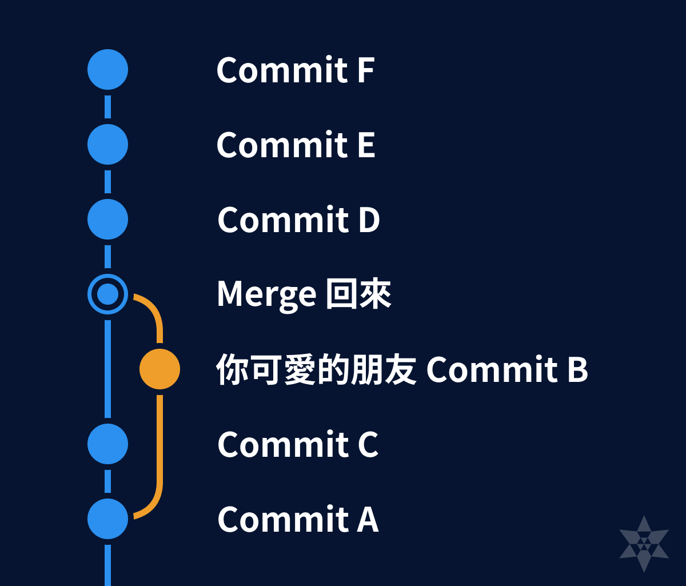
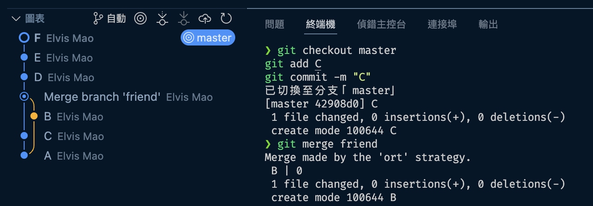
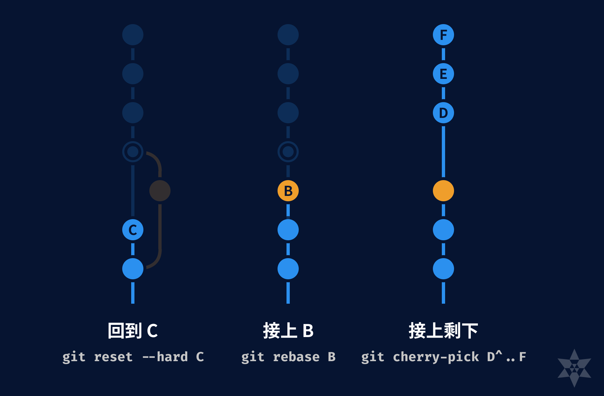
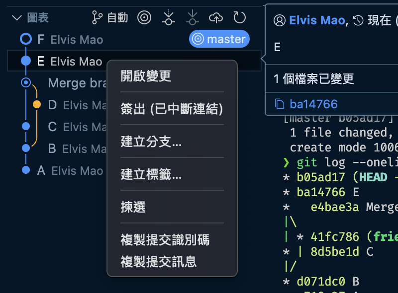
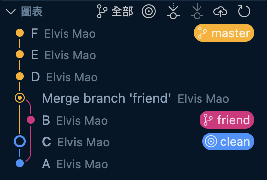
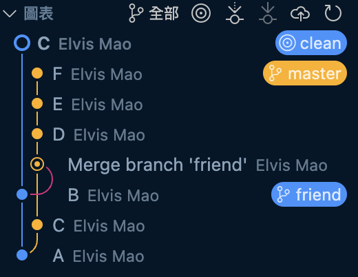
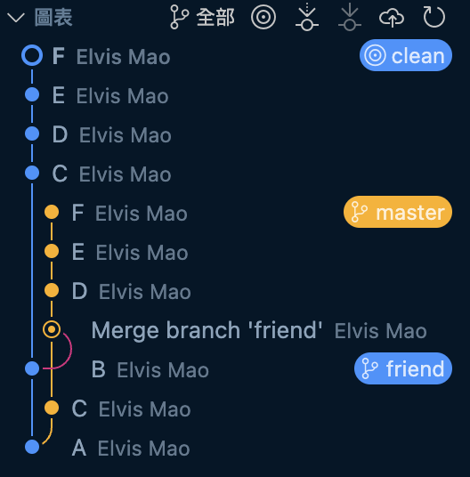
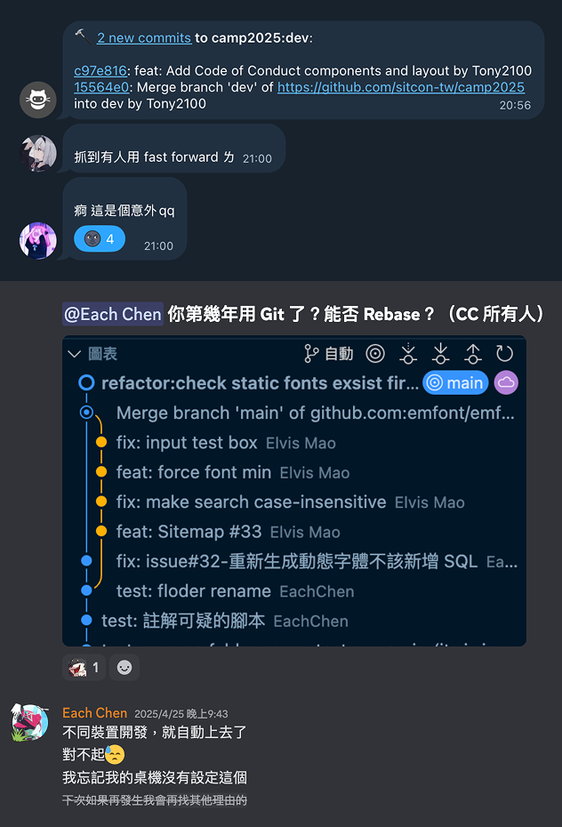

# 如何把 Merge 地獄整理成乾淨的 Commit

當我們使用 Git 在本地 commit 然後 `push` 的時候有時候會發現其他人在過程中已經先 `push` 過了。這時候你會需要把兩個版本合併起來。問題是 VS Code 預設會自動幫你使用 `merge`（或是你自己這樣設定），導致 commit 的歷史變得很亂。



很明顯這應該要是一條簡單的直線，但卻變成他幫你搞得像你開了一個新分支。這時候我們可以使用 `reset`, `rebase` 和 `cherry-pick` 來清理 commit 的歷史。

{{notice}}

想要根治這個問題嗎？

延伸閱讀：[如何設定 VSCode 和 Terminal Git pull 使用 rebase 而不是 merge](https://emtech.cc/p/vscode-git-pull)

{{noticed}}

## 製作範例

我們先來製作一個範例，讓我們可以清楚的看到這個過程。首先我們在本地建立一個新的 repo：

```bash
git init git-merge-revert
cd git-merge-revert
```

一次創好六個檔案：

```bash
touch A B C D E F
```

接下來我們來按照順序 commit 這六個檔案：

```bash
git add A
git commit -m "A"
```

創一個新的 branch，模擬你的朋友的電腦。

```bash
git checkout -b friend
git add B
git commit -m "B"
```

接下來我們回去 master 再 commit 一個檔案：

```bash
git checkout master
git add C
git commit -m "C"
```

這個時候如果你已經 push 上去了，你的朋友想 push 的時候 Git 會告訴你有衝突，所以你有意或是無意的使用了 `merge`。

```bash
git merge friend
```

輸入完之後會跳出你的文字編輯器。ˋ直接存檔關閉即可（在 Vim 中是 `:wq`）。

然後我們再假裝什麼都沒發生，再 commit 幾個檔案：

```bash
git add D
git commit -m "D"
git add E
git commit -m "E"
git add F
git commit -m "F"
```

這時候我們的 commit 紀錄就會變成這樣：



你可以在終端機中輸入以下指令來查看 commit 紀錄：

```bash
git log --oneline --graph --all
```

```bash
* 56087b4 (HEAD -> master) F
* 0400e01 E
* b888188 D
*   74cadf6 Merge branch 'friend'
|\
| * 0241188 (friend) B
* | 42908d0 C
|/
* 2bd3683 A
```

這樣我們的混亂就完成囉！

## 清理 commit 紀錄

我畫了一個簡單得圖來解釋這個過程。我們要回到混亂之前，然後依序把 merge 以外的 commit 接上去。



如果你是跟著上面的步驟製作本地的混亂的話，在開始處理我們先創立一個新的 branch 來操作（因為本來的混亂版本要留著，這樣我們才能從裡面選我們要的合併）。而如果你是從別的 repo clone 下來的話，你可以直接在原本的 repo 上操作不用創建新的 branch，因為我們可以參考遠端的 commit 紀錄。

```bash
git checkout -b clean
```

### 1. 回到正常的狀態

使用 `reset` 回到 merge 前最後 master 的 commit：

```bash
git reset --hard <commit id>
```

這句話的意思是說請你回到過去 (reset)，然後把所有的檔案都回到那個 commit 的狀態 (hard、這樣就不是我跟你當作回到過去，是真的回到過去)。

你可以使用剛才的指令 `git log --oneline --graph --all` 來找到這個 commit id。你也可以使用 VS Code 的 GUI 圖表（左邊數下來第三格 Git 分頁的左下角）來找到這個 commit id。滑鼠放在 commit 上面會出現一個小視窗，裡面會有這個 commit 的 hash 可以複製，或是你也可以對著這個 commit 右鍵選擇「複製提交識別碼」。



以我的範例來說就是 C。

```bash
git reset --hard 42908d0
```

> 你要輸入完整 hash 或是前面幾個字母都可以，Git 會自動幫你補齊。



### 2. Rebase

接下來我們要把 friend 的 commit 接上去。

```bash
git rebase <commit id>
```

我們這次要找的是右邊那個冒出來的最後一個 commit id，也就是 merge 之前的最後一個 commit。以我的範例來說就是 B。

```bash
git rebase 0241188
```

> 這時候理論上不會，但萬一有衝突（Git 接不上去）。你可以自己解決，然後 `git rebase --continue`。



## 3. Cherry-pick

接下來我們要把 merge 之後的 commit 接上去。這時候我們就可以使用 `cherry-pick` 了。

你也許會想說 `rebase` 不是可以接上去嗎？因為 `rebase` 會把 commit 的歷史整個疊上去...包括 merge 的 commit。好我們繞了一圈又回到原點了。

使用 `cherry-pick` 的把某一個單獨的 commit 接到後面去。以我們的範例來說就是 D、E 和 F。

```bash
git cherry-pick <commit id>
```

以我們的範例來說你需要打這兩個指令：

```bash
git cherry-pick b888188 #D
git cherry-pick 0400e01 #E
git cherry-pick 56087b4 #F
```

但如果你後面的歷史很多，一個個慢慢打實在太累了。這時我們可以使用 `^..` 符號來選擇一整段範圍。

```bash
git cherry-pick <merge 後面下一個 commit id>^..<最後一個 commit id>
```

以我們的範例來說就是：

```bash
git cherry-pick b888188^..56087b4
```

我們現在的 commit 紀錄長這樣：



## 4. Force push

左邊這條是我們修好的 commit 紀錄，右邊那條是原本的 commit 紀錄。你可以看到我們的 commit 紀錄已經變得很乾淨了，但是 hash 會長得不一樣。

> 這個概念就是你像韓國人一樣把人家小孩搶走，然後給他一個新的父母 (`cherry-pick`)。這時這個小孩雖然外觀上感覺沒變化（commit 的內容一樣），但其實已經有點不一樣了（hash 計算出來的不同）。

我們剛才等於是在竄改歷史（把 `merge` 這個不乾淨的歷史事件從課本中移除）。這時你要讓別人接受得要用點武力。我們直接 `force push` 上去：

```bash
git push -f
```

這樣就完成了！

其他人在 `git pull` 的時候建議可以先確保本地沒有其他 commit，否則衝突處理會很麻煩喔！

## 總結

這個問題是很常見的，尤其是如果你是一位 Vibe Coder 或習慣 GUI Git 的人。



我以前的 git log 也都是長得像聖誕樹一樣充滿各種顏色，我還覺得很好看，纏來纏去很好玩。不過如果之後要維護起來就會很麻煩了。

這次我示範的情況是最棘手的，就是過了很久之後要回去清理 (像上面這個)，所以不是直接 `reset --soft` 回去然後重新 commit 就可以解決的事 (像下面這個)，因為後面還有很多 commit 要接上。有的人的做法是使用 `git squash`，但這樣會把後面的 commit 紀錄都變成一個 commit，這樣就可以 reset 回去然後重新 commit 了，但這樣會失去 commit 紀錄的意義。

希望這篇文章能夠幫助到你們清理 Git commit 紀錄，讓 commit 紀錄變得乾淨一點。這樣在之後的維護上會比較方便。
