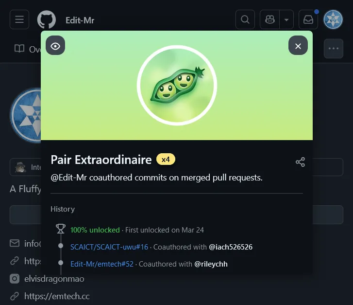
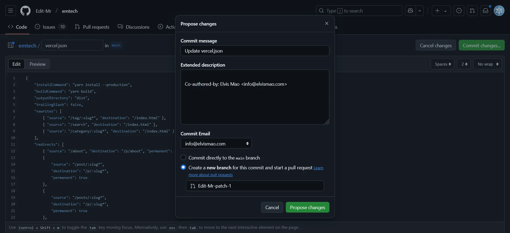
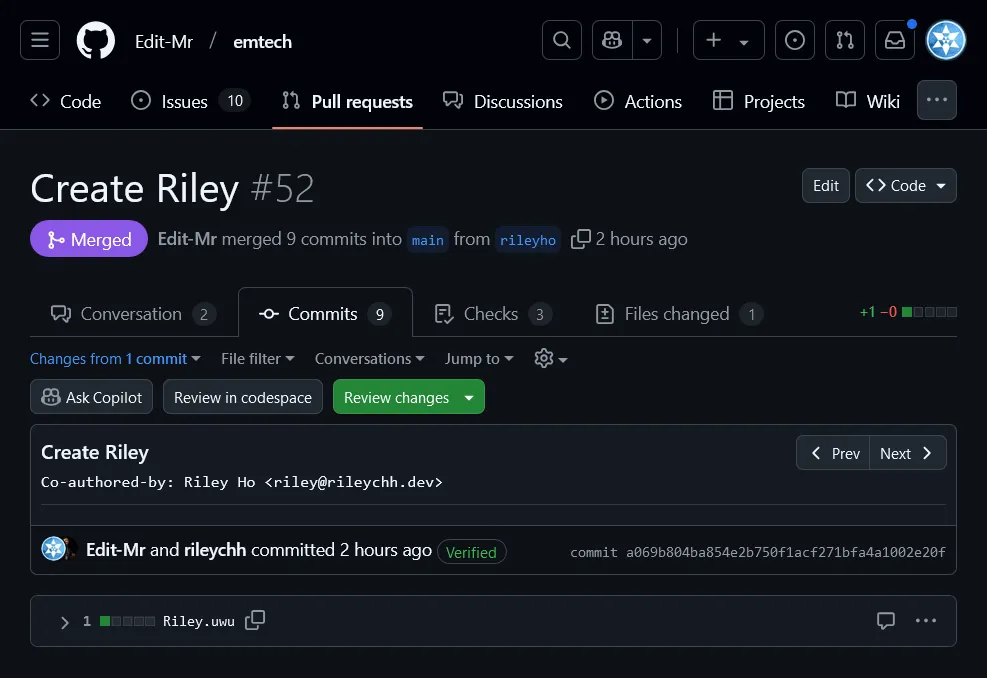

# 如何快速取得 GitHub 成就 Pair Extraordinaire 金色徽章

你可以在 GitHub 藉由完成特定的動作來解鎖徽章。而 **Pair Extraordinaire** 需要與他人共同提交（Co-authored）並建立拉取請求（Pull Requests）。今天我要來和你分享如何快速達成這個目標，並取得金色的 Pair Extraordinaire 獎牌。



## 如何獲得 Pair Extraordinaire

首先請你先 clone 或是打開你的專案並編輯任意檔案。這裡為了簡單示範直接用網頁版。



接著在 commit 的時候加上 `Co-authored-by` 註解，這樣就能夠記錄到協作者。記得要 push 到一個新的 branch，然後建立一個拉取請求（Pull Request）。

比如說：

```
Co-authored-by: Elvis Mao <info@elvismao.com>
```

如果你是用 git commit 的話，步驟如下：

```bash
git checlout -b new-feature
echo "Hello, World!" > hello.txt
git add hello.txt
git commit -m "Add new feature" -m "Co-authored-by: Elvis Mao <info@elvismao.com>"
git push --set-upstream origin new-feature
```

最後建立一個拉取請求（Pull Request）並合併，這樣就能夠解鎖 **Pair Extraordinaire** 成就。



這個成就有四個不同的級別，從最基本的彩色到金色獎牌。

- **一般 (Basic)**: 提交 1 個 Pull Request
- **銅色 (Bronze)**: 提交 10 個 Pull Request
- **銀色 (Silver)**: 提交 24 個 Pull Request
- **金色 (Gold)**: 提交 48 個 Pull Request

每當你與其他人共同提交 Pull Request 時，你的 GitHub 頭像旁邊會顯示一個「Co-authored-by」的註解，這樣 GitHub 就會認定你參與了協作，並累積相應的成就。

### 快速取得 Pair Extraordinaire 金色獎牌

平常會用共同 commit 的機率就很小了，還會拿來開 Pull Request 根本在我人生中沒發生過。如果你想要快速的取得 **Pair Extraordinaire** 金色獎牌，我們只需要寫一個 bash 來自動編輯檔案、commit、建立 PR、然後自己 merge，這樣就能夠快速的達成目標。

#### 1. 安裝 GitHub CLI

首先請你先確保你有安裝 [GitHub CLI](https://cli.github.com/)。如果你還沒有安裝，可以參考 [這裡](https://github.com/cli/cli#installation) 來安裝。

#### 2. 使用 Bash 腳本

接著請你下載我的 [Bash 腳本](https://github.com/elvisdragonmao/SSS/blob/main/github/PairExtraordinaire.sh)。你可以手動下載或是直接 curl 這個檔案。

```bash
git checkout -b elvismao
for i in {1..10}
do
    git checkout elvismao
    git fetch origin main
    git merge origin/main --no-ff --no-commit
    echo "" > emtech.cc
    git add emtech.cc
    git commit -m "Create EM" -m "" -m "Co-authored-by: Elvis Mao <info@elvismao.com>"
    git push --set-upstream origin elvismao
    gh pr create --title "Create EM" --body "Create EM" --base main --head elvismao
    gh pr merge --squash --auto

    rm emtech.cc
    git add emtech.cc
    git commit -m "Delete EM" -m "" -m "Co-authored-by: Elvis Mao <info@elvismao.com>"
    git push
    gh pr create --title "Delete EM" --body "Delete EM" --base main --head elvismao
    gh pr merge --squash --auto
done
```

接著只需要執行這個腳本，就能夠快速的刷 Pull Request 了。

```bash
bash PairExtraordinaire.sh
```

你可以調整這個腳本來符合你的需求，比如說增加或減少提交的次數，或是修改 commit 的內容。這個腳本一次會提交兩次，一次是新增檔案，一次是刪除檔案，所以如果你想要刷 10 次那麼你只需要修改 `{1..10}` 成 `{1..5}` 就好了。

## 總結

使用自動化腳本可以讓你快速的生成與合併 Pull Request。只要按照上面的方法進行操作就能夠快速的解鎖 **Pair Extraordinaire** 金色獎牌。如果你想要快速蒐集的話希望這篇文章對你有幫助。
