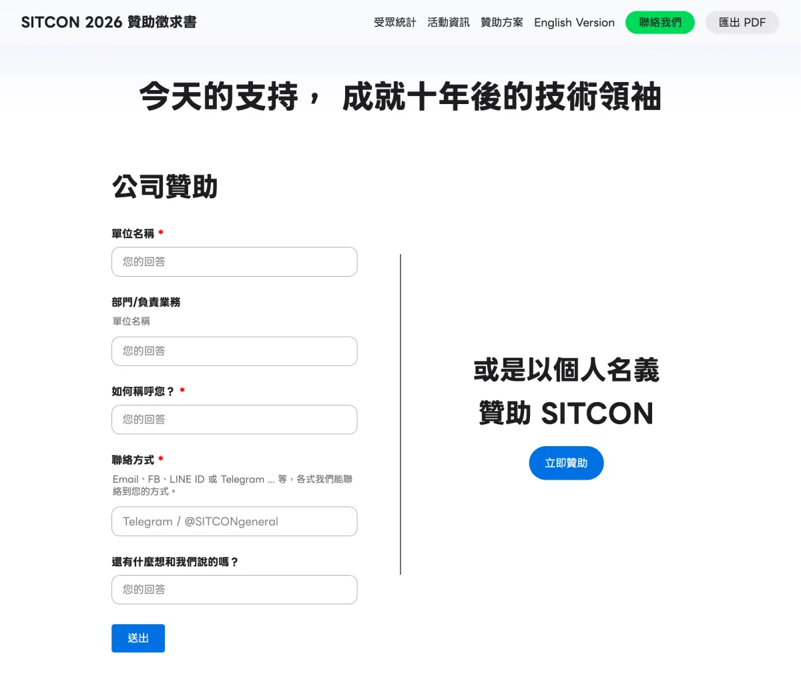

# 嫌 Google Forms 太醜？把它當表單後端吧

有時候你想在你的網頁中放一個表單，不過如果這只是個靜態網頁的話為了一個表單開個後端，再架個資料庫實在太浪費了。但是放個 Google 表單又有失專業醜到不行。這時其實你可以把 Google Forms 當作表單的後端，模擬填入資訊送出表單。方便你放在 GitHub Pages、Netlify、Vercel、Zeabur、或任何純前端網頁。

## 為什麼不用 Google Forms？

實際上會用到這個是因為今年我們 SITCON 的贊助徵求書是網頁版的，因此會需要搜集有興趣的聯絡廠商的聯絡方式。



## 🧩 步驟一：建立 Google 表單

1. [新增一個空白 Google 表單](https://form.new)
2. 建立幾個問題，例如：

   * 單位名稱
   * 部門
   * 稱呼
   * 聯絡方式
   * 留言
3. 不用設計太花俏，填好即可。


---

## 🧭 步驟二：找到 `entry.xxxxx` 欄位 ID

Google Form 的每個問題都有一個隱藏的編號（`entry.XXXXXXXX`），
這是送資料時要用的。

找法如下：

1. 按 **右上角三點 → 預覽**
2. 用開發者工具（F12）開啟檢查器
3. 點選表單中的輸入框
   會看到像這樣的 HTML：

   ```html
   <input type="text" name="entry.1867519928">
   ```
4. 把這些欄位的 `entry.xxxxx` 編號抄下來

例如：

```
單位名稱 → entry.1867519928
部門 → entry.363990418
稱呼 → entry.1660888396
聯絡方式 → entry.1209239304
留言 → entry.65159086
```

---

## 🧱 步驟三：撰寫 HTML 表單

在你的網站專案中建立一個檔案 `index.html`：

```html
<!DOCTYPE html>
<html lang="zh-Hant">
<head>
  <meta charset="UTF-8" />
  <title>靜態表單示範</title>
  <style>
    body { font-family: sans-serif; max-width: 600px; margin: 3rem auto; }
    label { display: block; margin-top: 1rem; }
    input, textarea { width: 100%; padding: 0.5rem; }
    button { margin-top: 1rem; padding: 0.5rem 1rem; }
    span#form-message { display: block; margin-top: 0.5rem; color: red; }
  </style>
</head>
<body>
  <h1>聯絡我們</h1>

  <form id="contact-form">
    <label>單位名稱<input name="organization" required /></label>
    <label>部門<input name="department" /></label>
    <label>稱呼<input name="name" required /></label>
    <label>聯絡方式<input name="contact" required /></label>
    <label>留言<textarea name="message"></textarea></label>

    <button type="submit" id="submit">送出</button>
    <span id="form-message"></span>
  </form>

  <script src="form.js"></script>
</body>
</html>
```

---

## ⚙️ 步驟四：撰寫 `form.js`

建立 `form.js`（放同一資料夾），這是表單提交邏輯：

```js
const apiUrl =
  "https://docs.google.com/forms/d/e/1FAIpQLSftAam5nJJQU925yOzuMoome-XY3MEs7idtbd56eqMDRrPKGw/formResponse";

const form = document.getElementById("contact-form");
const submitButton = document.getElementById("submit");
const messageElement = document.getElementById("form-message");

// 對應 Google Form 欄位
const entryMap = {
  organization: "entry.1867519928",
  department: "entry.363990418",
  name: "entry.1660888396",
  contact: "entry.1209239304",
  message: "entry.65159086",
};

form.addEventListener("submit", (event) => {
  event.preventDefault();
  messageElement.textContent = "";

  // 組成 Google Form 的資料格式
  const formData = new FormData();
  Object.entries(entryMap).forEach(([key, entryKey]) => {
    const value = form.querySelector(`[name="${key}"]`).value;
    formData.append(entryKey, value);
  });

  submitButton.disabled = true;
  submitButton.textContent = "送出中…";

  fetch(apiUrl, {
    method: "POST",
    mode: "no-cors", // 避免 CORS 錯誤
    body: formData,
  })
    .then(() => {
      form.reset();
      messageElement.textContent = "✅ 已成功送出，感謝您的填寫！";
    })
    .catch((err) => {
      console.error("Submit error:", err);
      messageElement.textContent = "⚠️ 發生錯誤，請稍後再試。";
    })
    .finally(() => {
      submitButton.disabled = false;
      submitButton.textContent = "送出";
    });
});
```

---

## 📦 步驟五：部署上去！

你可以把這個網頁：

* 放在 **GitHub Pages**
* 或直接丟到 **Netlify / Zeabur / Vercel**

開啟網址後測試：

1. 填寫表單
2. 點送出
3. 前往 Google 表單 → 回應頁籤 ✅ 就會看到資料進去了！

---

## 🧠 延伸技巧

| 功能           | 方法                                |
| ------------ | --------------------------------- |
| ✅ 必填驗證       | HTML 加上 `required` 屬性             |
| 🚫 防止開頭為 "=" | JS 中檢查 `value.startsWith("=")`    |
| 🎨 美化樣式      | 使用 Tailwind 或 Bootstrap           |
| 🔒 安全性       | 不放機密欄位、不要公開 API Key               |
| 📩 自動回覆      | 用 Google Sheets + Apps Script 發郵件 |

---

## 🎯 結語

這種方式雖然簡單，但非常實用：

* 不用架伺服器
* 不用額外帳號
* 送出的資料都進 Google Sheets，自動統計
* 適合個人網站、社團報名頁、贊助表單、意見回饋

---

要我幫你附上這篇的 **Markdown 版本（可直接貼進你的 GitHub README）** 嗎？
那樣整篇會自動有標題層級、語法高亮和段落格式。

