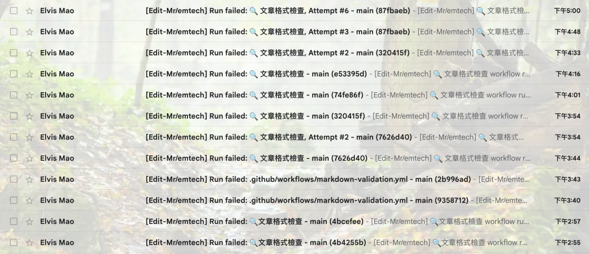
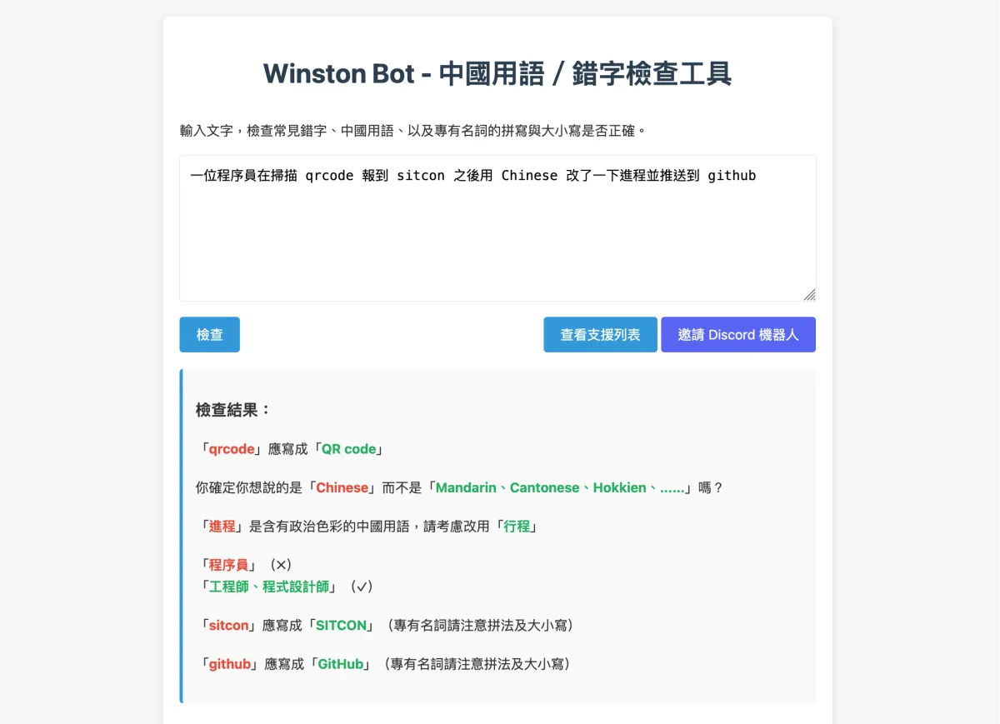
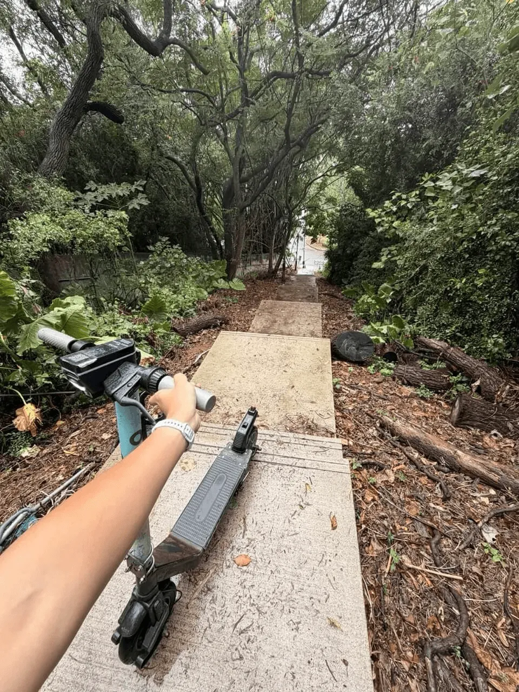

# test 123

> 這是我的電子報 Hmmm，如果你也想交個朋友，每個月收到的話歡迎可以 [來這裡](https://elvismao.com/zh-Hant/hmmm/) 訂閱！

這封信應該有發出去對吧。

這裡是毛哥EM。

這是第一封 Hmmm，十分感謝你訂閱還點開這份電子報。

## 為什麼有這封電子報？

原因很簡單：

- 我平常不喜歡 Po 限動和貼文。
- 你們年輕人和老人和年紀和我差不多的人又不會用 RSS。

所以有這個電子報。目前預計是每個月會出來叫一次表示我還活著（作為一個 [金絲雀聲明？](https://emtech.cc/p/canary-statement)）

我希望可以有一個健康的管道可以分享一些我的近況，想法，還有分享一些好東西。

喔比如說我現在手上有一大疊 New York Times 小遊戲的兌換碼塞在我宿舍抽屜，可以有一整年免費的會員，但我實在不知道給誰。所以如果你很喜歡玩 Wordle 或是你讀雙語學校十分熱愛 Spelling Bee 的話（如果你不知道這是什麼的話，這是一個超級好玩的遊戲），歡迎你可以回覆這封電子郵件，我會把兌換碼發給你，他會直接進我的信箱。同時如果這裡有什麼你強烈不同意的觀點或有什麼想說的也都歡迎直接回覆，我可以跟你吵架，我 [應該還算是有經驗](https://emtech.cc/category/%E8%8B%B1%E6%96%87%E8%BE%AF%E8%AB%96)。

關於社群媒體是不是個毒瘤、[為什麼你該開始用 RSS](https://emtech.cc/p/rss) 我們之後再來談。但今天我想先講講電子郵件。

## 你各位應該正確的使用電子郵件

一打開你的電子郵件軟體你會進到「收件匣 inbox」。我今天查字典才知道原來那個字念 ㄒㄧㄚˊ xiá。這個地方相當於你家門口的信箱。如果你這裡有好幾百篇信，有的看過有的沒看過，那你這個行為很噁心。

就是你相當於每天打開你的信箱，把所有信拿出來，選擇幾封看過之後又全部塞回你的信箱。你也不知道哪些你看過，就越積越多，只能頻印象。這樣除了每次你要一直重複看以外也很可能錯過重要信息。

### 我又沒有每一封信都想看

如果你的信箱裡有任何你沒興趣的東西，請你**取消訂閱**。像是廣告信，社群媒體的信，這些你人生中基本上不可能會打開。

### 封存，封存

任何你看過的信都請你**封存**。這個的意思是說把信從你的收件夾拿出來放到一個箱子叫做「封存」。這樣你就不會再看到它了，但你還是可以搜尋到它還有在所有郵件看到。當然你也可以刪除，但 Email 檔案很小，刪除其實沒有什麼必要。

有的人像是我的朋友 Each 會把他們做分類，但我覺得完全沒有意義。因為你要找某封信的時候你可以直接用搜尋，如果是代辦事項你應該放待辦事項，如果是行事曆你應該放行事曆。頂多你覺得短時間內你會回來看的可以先打星號標記，事情弄完再取消標記。

## 回覆學弟妹的問題

這封電子信你可能是從我的網站訂閱的，或是在西苑高中聽我男性說教半小時後留下了你的 Email。[訂閱的網站](https://elvismao.com/hmmm/) 我有做 i18n（中文繁體、簡體、英文版），但其實我目前也只有打算發中文的，所以是不是其實沒什麼意義（？

其中一位學弟在「歡迎在這裡留下你平常會使用的電子郵件」的文字欄位回了一個 Okk。很遺憾，他可能收不到這封 Email。

回歸正題來回答問題：

- **哈囉學長！我常常在自然這科付出很多時間最後卻沒有考到理想中的成績，想問問你平常的讀書方法還有讀書習慣～**
  - 這需要深入聊我才知道問題是什麼，但簡單來說就是：
    - 我平常習慣不讀書。
    - 高二選文組。
- **想知道特殊選才需要俱備什麼能力，有限定的領域嗎**
  - 領域不確定是什麼意思，~~極速領域嗎？~~ 需具備...該科系專業。你會需要對於要申請的的科系很有熱誠，而且因為名額很少所以需要到最頂尖。當然在現在的世代如果你有跨領域的能力會更好。
- **辯論能力怎麼培養**
  - 可以練習保持 [批判性思考](https://zh.wikipedia.org/zh-tw/%E6%89%B9%E5%88%A4%E6%80%A7%E6%80%9D%E7%BB%B4)，多看線上線下辯論比賽，或是參加學校的辯論社團。我們學校每年寒假都會有營隊，也歡迎到時候可以報名。或是你可以加入我的 [Discord 伺服器](https://dc.elvismao.com) 來跟我們聊聊。
- **沒有了謝謝**
  - 好。
- **升學和程式**
  - _？_ 這我不知道怎麼回，如果你們有什麼想法可以回覆這封信告訴我，我再轉達給學弟。

> 欸等等我發現他就是 Okk 學弟。好吧看來他收不到了。

## 前端工程師是個幸福的職業

> 以防你不知道前端是什麼，一句話來說開發網頁時分為前端跟後端。前端寫你看到的畫面，後端寫伺服器。

前端工程師是一個快樂的工作。我們先不講技術難不難，因為所有工程師都能夠把簡單的事搞得很複雜。但前端就是看起來沒事就是沒事，如果有問題的話讓他看起來沒問題就沒問題了。後端你就真的會花幾十個小時卡在一個問題，然後還是不知道問題在哪。在團隊在處理資料庫外洩、伺服器掛掉的時候，我可以把按鈕變成綠色。

如果是 DevOps 工程師那就更慘了，如果你不知道這是什麼的話... 大概就是這樣。

就，就算你是文組的，沒寫過程式。這看起來很糟對吧。

上個月弄 SITCON 官網體驗了一次，而我昨天又體驗了一次這個痛苦。今天下午我決定翻出我高中放棄寫的 Code 把它修好，然後這一個幾十行的程式我弄了整個下午。

具體來說我幫 Winston Bot 串了 CI。Winston Bot 是一個中文檢查工具，可以檢查拼寫錯誤、專有名詞大小寫、中國政治色彩用語等問題。原本他有 Discord Bot 跟網頁、現在我幫他串了自動程式檢查，就是檢查我寫的網頁裡面的文字有沒有問題。

串起來之後我花了兩個小時才把我這五年寫的爛文章修好，很多名詞之前一直都打錯。

- ❌ `身份證` → ✅ 身分證
- ❌ `優惠卷` → ✅ 優惠券
- ❌ `Google Doc` → ✅ Google Docs
- ❌ `數據庫` → ✅ 資料庫

歡迎你們可以使用和給我一些意見。在寫報告、備審、Email 等等正式場合很實用。你也可以把它 [邀請進你的 Discord 伺服器](https://discord.com/oauth2/authorize?client_id=1342364253486846032)。

Winston Bot 網址：[winston.emtech.cc](https://winston.emtech.cc)

## Rand0m Thought

- 這裡故名思議這裡就是隨便放點東西。Rand0m 這個單字是來自 g0v 這個組織他們很喜歡這樣寫。其實就只是 random（還是其實有什麼故事我不知道？）但我常常喜歡這打，就蠻酷的…
- 這禮拜是我第一次搶到國光客運回家的票！之後我一定會來寫個交大交通指南。
- 補充前面沒講 [金絲雀聲明是什麼](https://www.cloudflare.com/zh-tw/learning/privacy/what-is-warrant-canary/)。這個東西的來源是之前礦工都會帶一隻金絲雀進礦坑，如果有毒氣的話金絲雀會先死掉，這樣人就可以趕快逃跑。金絲雀聲明通常是來自大公司，説「欸我沒有賣過你們的個資喔！」，如果哪天這行公告不見了...你就知道發生什麼事了。之前在 Stand up comedian 藍恩（同時也是微軟軟體工程師）的電子報中看到他的 Random Thoughts 説「如果有自殺傾向時很難開口向人求助，人類有沒有可能用類似的方式隱晦的求救？」，感覺蠻酷的所以我也弄了一個。
- 上個禮拜我是搭客運到清大，然後騎 Oloo（電動滑板）滑上山到交大。我正在高興我搶到最後一台車的時候我又又又走錯路。騎上山了，不過是清大的另一座山。這時我打開 Google Maps 他建議我往前走一樣可以抵達，於是我就又繼續往前...然後我面前就出現了一條很長的樓梯。

  _來都來了_，每分鐘都還在計費。於是 Oloo 就騎著我爬上了這五十幾階的樓梯。上完樓梯之後沒想到因為坡太斗了，所以 Oloo 也騎不上去。只好牽它上交大。

  

---

最後宣傳一下：[SITCON 學生計算機年會開始徵稿了！](https://sitcon.org/2026/cfp/) 如果你對於資訊工程有興趣的話歡迎可以投稿。你可以在中研院演講。很酷。還能交到很多電神朋友。

---

以上是這個月的 Hmmm。

如果有任何建議、或想說的話都歡迎直接回覆這封信給我。

下個月見，Happy Halloween！
