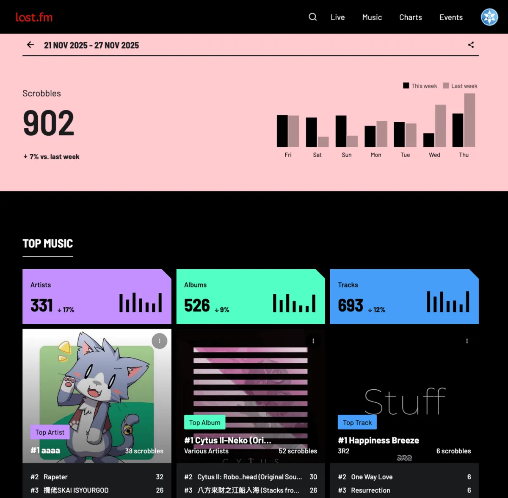
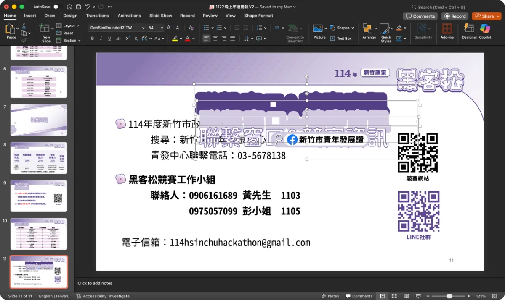
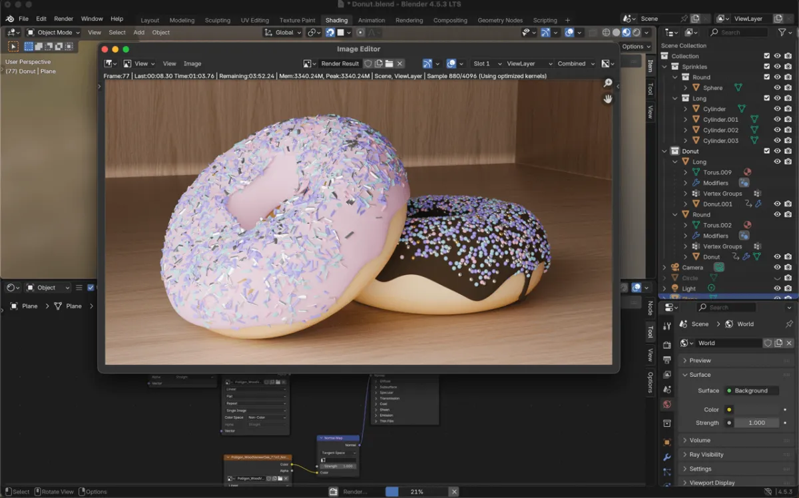

# 我該繼續買大便化的 Spotify 嗎？

哈囉 {{ .Subscriber.Name }}，這裡是毛哥EM，十分感謝你點開這份電子報。

本來上個月的計劃是每個月的最後一天發文，這樣算是一整個月的 rewind，沒想到才一個月就破功了。就把這當作 11/31 吧。

## Spotify

昨天讀到 Ted 的 [ㄏㄊ電子報](https://substack.com/@tedlu) 時又有提到 Spotify 的大便化，所以想說來講講。

你平常都怎麼聽音樂呢？記得小學跟國中的時候歌單都放在 YouTube，然後用 MixerBox、YouTube Vanced 來去廣告。或是下載下來到我的 MP3 還有手機上，當時會使用 y2mate.com（現在已經被國際唱片業協會下架了），然後後來都使用 yt-dlp 下載。MP3 裡面還會把作者資訊跟封面都加進去，很不錯。

後來開始會使用 Spotify，雖然要聽點廣告而且手機不能選歌但還算能接受。每過幾個月 Spotify 都會送的幾個月免費可以爽一下。

但是網路上其實有很多抵制 Spotify 的聲音（也許只是我身邊的小圈圈， ~~看我高中同學大部分是跟本買不起。~~）原因有幾個，[Wiwi 的 Blog](https://wiwi.blog/blog/why-streaming/) 講的蠻清楚的，我簡單整理一下：

### 串流平台地圖炮

- 你得訂閱，連網才能聽。你未曾擁有音樂。
- 你真的愛的音樂沒那麼多。你失去了每張 CD 專輯聽幾十次這種「認真聽音樂」的快樂，並且被演算法洗腦。[Jaron](https://www.jaron.tw/blog/why-i-quit-spotify/) 則是有提到 Spotify 演算法不再推薦他會感興趣的音樂。
- Spotify 品質參差不齊。
- **創作者拿到的錢很少：**&#x5177;體來說 Spotify 的分潤是把總收入按所有播放數按比例分掉。而更糟糕的是現在他們會灌大量他們自己 AI 生成的音樂放在那些 Lo-Fi Playlist，這樣小創作者拿到的錢又更少了（延伸閱讀：[Wiwi.blog - Spotify 的影子藝術家](https://www.jaron.tw/blog/spotify-ghosts-artist/)）。
- 因此你應該要建立「自己真正喜愛的」音樂資料庫。

### 大便化

這種以前你很愛的軟體變得越來越難用，越來越商業的情況有個專有名詞，叫做「[Enshittification](https://en.wikipedia.org/wiki/Enshittification)」（大便化、變爛化）。是作家 [Cory Doctorow](https://pluralistic.net/) 提出的，用來描述網路平台和軟體服務的生命週期：

- **💕 第一階段，對使用者好**：軟體剛推出時，超好用、超乾淨、使用者體驗極佳。
- **💰 第二階段，對商業客戶好**：累積了大量用戶並將他們綁架後，平台開始對廣告商好，到處狂塞廣告，使用者體驗開始大幅下降。
- **🪓 第三階段，收割韭菜**：等到商業客戶也被綁架後，平台開始兩面通吃，從所有人身上榨取最大價值。這時產品會變得超爛，但因為大家都用習慣了，資料都在上面、朋友都在用、流量都靠它，[根本跳不走](https://wiwi.blog/blog/switching-cost)，就只能咬牙忍受。
- **🪦 第四階段，平台死亡**：平台變得實在太爛、太貴、太煩人，最終被新的競爭對手取代，重新開始第一階段的循環。

記得在去年年底剛用文化幣買下了童年回憶專輯 Alan Walker - Different World 的我的時候我聽了十分認同，於是取消了我的 Spotify 學生方案，開始搜集我的音樂庫。

### 自架之旅

我自己架設了一個音樂串流服務叫做 Navidrome，有很好用的網頁版，也有很多開源第三方的 client。

根據今年一月我寫給 Wiwi 的信中理由如下：

1. 音質更好，肯定的。
2. 我喜歡聽的電子舞曲 NCS、TheFatRat 都有提供免費載點，讓我下載高品質的音檔。同時還能下載純伴奏的版本讓我好好品味它的細節。我還為了批量下載 NCS 的音樂製作了一個 [NCS-Downloader](https://github.com/Edit-Mr/NCS-Downloader) 可以快速搜尋下載 NCS 的音樂、作者資訊、以及縮圖並自動合併成 mp3。（沒想到九個月以前的我還在用 yarn XD）
3. 平常在工作時我喜歡聽音樂維持節奏，這時候其實比起那種幾百首歌的 lofi music 播放清單我更喜歡反覆聽一首歌或是一張專輯。
4. 如果我只是要臨時聽一下某首歌打開 YouTube 就好了。
5. 偶爾聽古典音樂覺得 Spotify 的品質大多真的很糟。
6. 不會出現 [Apple Music 忘記更新 TLS 證書造成把自己服務殺了](https://www.landiannews.com/archives/106537.html) 這種爛問題。
7. 支持創作者。
8. Spotify 上的創作者有時候會因為各種版權或金錢原因下架自己的作品。下載下來就不用擔心了。

當時我的評價是：

> 自己架串流的好處除了可以把自己最愛的音樂收藏帶著走，同時裝置可以自動同步下載離線聽。而且這個下載是我真的可以讀到檔案沒有 DRM。這幾天使用我上台用的監聽耳機聽這些高品質無廣告的音樂真的每天都覺得很幸福，而且每首歌都像是我收藏的 CD 的感覺。

然後...兩個月後我就打臉我自己乖乖訂回 Spotify 了。

現在我是用家庭方案，一個月五十塊，可以在 iTune Store 買...一首歌。

> 學生方案的話是 88。如果你不在乎播放紀錄，每三個月開個 Email，永遠免費。

幾首固定的歌反覆播放根本不符合我實際的聆聽習慣。根據 last.fm 的統計我光上個禮拜就聽了來自 331 個創作者的 693 首歌曲。音樂常常是陪伴我工作、運動、讀書，協助分擔一部分的壓力和讓工作沒那麼痛苦，這時候我十分需要新鮮感陪伴我度過這些時光。串流平台是你想聽什麼可以馬上聽到最方便的做法。同時 Spotify 的推薦都十分合我胃口，也確實讓我發覺許多新的好音樂好創作者。像是這個月我花了很多時間在回味童年音遊時光 [Cytus II](https://open.spotify.com/album/4Ppdruw7TAOg4066ZY41Go?si=f91abf57f2464300) 的原聲帶，最近很喜歡 [AAAA](https://open.spotify.com/artist/6NVMzVjhJiHrjpx6yyNQ5i?si=pXB8OTT_RIC0Rl0RfIdCvg)，還有一些中國的饒舌歌手 [Rapeater](https://open.spotify.com/artist/4lp5luwXaH7oYwU1aoOmUy?si=bSB15i-MQDGFhBddynyHJA)、[華雲龍KLE](https://open.spotify.com/track/1R2ID1L2MjOX6mB9pQuCAh?si=9b87c489744944e7)。

### 音樂哪裡買

雖然我平常聽音樂還是會用 Spotify，但還是架著 Navidrome 放我的收藏。在平常音樂都是當 BGM 又加上是藍牙耳機的情況下 Spotify 的無損音質已經很夠了，不過就跟 CD 一樣，比較多還是收藏價值，還有用實際行動支持作曲者。比如說在去打辯論的飛機上 [草東](https://zh.wikipedia.org/zh-tw/%E8%8D%89%E6%9D%B1%E6%B2%92%E6%9C%89%E6%B4%BE%E5%B0%8D) 陪我度過了愉快的寫稿時光。

Jaron 是在 iTune Store 購買，但我大多是在 Bandcamp。iTune Store 的優點是 Apple Music 自動同步，Bandcamp 的優點是便宜、無損（如果你聽得出來的話）、而且創作者能拿到更多錢。那似乎對於我來說後者完全是比較好的選擇。

## AirPods Pro 3

這個月我買了一台最新的 AirPods Pro 3。記得今年蘋果發佈會是和交大軟體開發社的朋友們一起熬夜看到三點的（隔天還有早八體育啊！不過對於高中時期的我這也睡太多了。）當時覺得都還好沒特別有感，然後就陸續買了 iPhone 17 跟 AirPods Pro 3，年初還買了 M4 Pro 的 MacBook Pro。不過我不是腦粉，手錶用的是小米，上一台手機是我爸留給我的 i11。除了卡以外螢幕完全壞掉不會顯示、震動馬達壞掉、鏡頭跟 Face ID 都是看心情工作。喔然後跟我媽一起自己換螢幕的時候聽筒也弄壞了。而筆電這是我的第一台，高中三年都是用學校的。

當時會決定買 MacBook 最主要是考慮到可能會想開發 iOS APP 還有被 Windows 噁心到，會買 iPhone 是為了使用者體驗還有我買了 MacBook。會買 AirPods 是為了使用者體驗...還有因為我用 iPhone 跟 MacBook。以前一直聽不懂什麼是被生態系綁住，沒想到真的是如此。他能夠自動跨裝置切換真的很爽，就是比如說我用電腦播 Spotify 時，手機點開 YouTube 影片他會自己把電腦的 Spotify 暫停聲音切過去。點一下就能切回來。他的通透模式也非常好，不過預設有點大聲，像助聽器，帶比沒帶還清楚。不過可以去設定調整音色和音量。平常開自適應你可以感覺像是在用喇叭播，就是完全聽得清楚外面的所有聲音但是音樂也很清楚。

在重新買無線耳機之前簡單來說舊的都壞了，然後我就都在戴入耳式的。雖然音質很好但是去健身房等等時候真的不太方便。然後在客運還有學校有時候周圍的噪音都很多，雖然入耳式多少有物理降噪，但很容易外了蓋過所以調大聲，久了還是不太好。

當時我在選耳機的考慮的就只有音質跟降噪，所以有排出的名單有 Bose QC Ultra II 9F、Sony WF-1000XM5、Sennheiser TW4、Technics AZ1000。後面兩支沒機會聽到，前面兩隻聲音跟降噪都比較喜歡 Bose QC Ultra II 9F，不過因為生態系考量所以還是決定用 AirPods，音質跟降噪雖然都比預期低但還可以接受。雖然黑五看價格差不多但 AirPods 光是有 Find My 就贏所有耳機了，我超會弄丟東西的。現在我兩個水壺丟在學校都還沒找回來。

## Ramd0m

- 平常比起說廁所我比較習慣說化妝室，稍微聽起來好聽高級一點（？化妝室、washroom、bathroom 還能理解，但我一直不知道「restroom 休息室」跟廁所有什麼直接的關聯。看到的一個說法是能讓你「refreshing oneself（自我恢復）」的地方，另一個是 19 世紀末到 20 世紀初的美國百貨公司、劇院等公共場所是真的有叫做 rest room 的房間給你休息、補妝、喝水、洗手。裡面通常有沙發、椅子，甚至女傭服務。後來才把廁所設在同一區域旁邊，於是整區都被叫 restroom。畢竟對於那些穿長裙的貴婦在沒有空調的百貨公司待一整天確實需要貴婦休息區。

  查了一下發現原來每個國家都有自己的說法，像是德文的「00」由來是飯店裡廁所常常是走廊上的第一個房間，因此被編號為 00（第一個真正的房間是 01）。瑞典語的「dass」只是個定冠詞（像是 the），有點像是說「我要去那個」。

- 這個月打掃房子我的耳機星野 2 跟無線電對講機都找回來了！
- 上禮拜去比新竹黑客松，他們的簡報為了做出多層編框效果竟然是疊了好幾層，我覺得很好看。不過現在的年輕人都不會用 PowerPoint 了吧。

  

- 最近在重新好好研究 Blender 跟 Fusion 360，學習的曲線真的都好陡峭。Fusion 360 我研究了兩個小時才搞懂怎麼「把文字往上移 10 公分」。給你們看我到一半中途放棄的甜甜圈。期末考完再來繼續好好研究。

大就這樣吧。

11 月過得很快，12 月理論上會長一點（大概一天）。

年末將近，是期末考與壓力疊加季節。但至少在這疲倦的日子裡，我們還能挑幾首喜歡的歌、戴上耳機，暫時穩住心跳的節奏，逃離世間的紛擾。

下次見，
毛哥EM