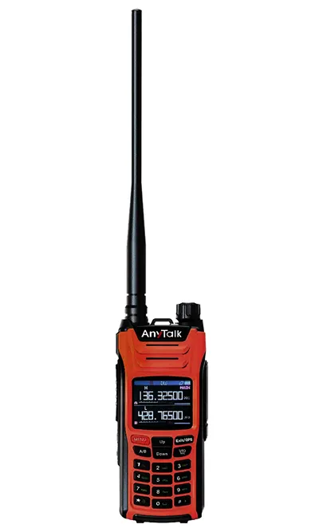
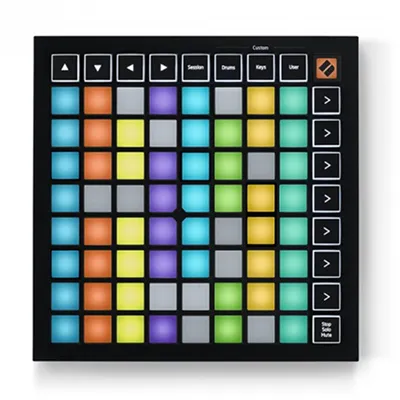
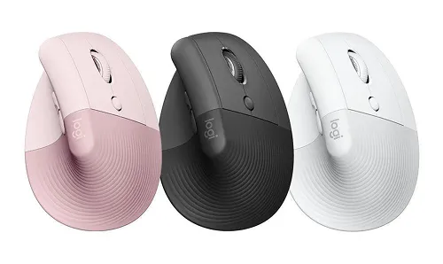

# 馬斯克要我們一起畫色圖？今年我買了哪些怪東西

> 首先先一件重要的事，還有兩個小時文化幣過期。328 我沒辦法花掉，所以如果有人想到可以趕快跟我說。

> 這是我的電子報 Hmmm，如果你也想交個朋友，每個月收到的話歡迎可以 [來這裡](https://elvismao.com/zh-Hant/hmmm/) 訂閱！

快速講一下現在 X（推特）發生的事：

1. 馬斯克突然新增了一個功能，任何人都可以直接用 AI 編輯別人發的圖片，例如換衣服、角色、身材，甚至是去浮水印跟文字，直接轉動畫。
2. 雖然馬斯克說是要讓大家把照片加上聖誕老人用的，但眾繪師跟粉絲氣炸，一邊詛咒他一邊揚言要跳槽到別的平台。（例如 Bluesky）
3. 有人發現做成 GIF 不能被編輯。
4. 有人還發現色色的圖也不能被編輯。
5. 大家開始慫恿彼此畫色圖。

今天我們要來聊聊這個功能。同時也來個年度回顧：我今年我把錢都浪費在哪。

我是毛哥EM，這是每個月一次的 Hmmm 電子報，很高興你點開了這封信。

## X 的 AI 編輯圖片功能

網路我是沒有看到有人超愛這功能。主要簡單分為氣炸的繪師跟無感的一般使用者。

大家氣的點主要分為這幾個：

- 著作權侵害，你不用經過原作者同意就可以編輯
- 點一下就把你亂改的圖發在評論噁心作者
- 別人花錢的委託圖你直接改成你想要的角色
- 現在 AI 生成的 AI 味還是蠻明顯的（更何況 Grok 的生成我覺得都很 AI 味也很難用）。看到 AI 圖就夠氣了，看到自己的圖被亂改更不爽
- 問題不僅限於繪師，真人照片、新聞媒體相片等所有圖像都可被任意修改，造成造假與深度偽造的風險
- 色圖現在有時能生有時不行（產出一張壞掉／無法讀取的圖，之後整個改圖結果會自動消失），且沒有對未成年做任何限制，小朋友也可以拿來亂用（我是不知道這是不是個大問題，感覺嚴重的基本上是小玉那樣。）

儘管編輯後的圖片會標示為「已編輯」並可點擊查看對比，但繪師與創作者普遍認為這不足以形成保護。

### 創作者的具體離去行動

網路上馬上就出現了大規模的「繪師逃難潮」。著名漫畫家 Boichi 在 12 月 24 日宣布暫停在 X 發布漫畫與插畫內容，聲明「当面の間，X での漫画およびイラストの公開を中断する」。美國繪師 Iomaya 發文表示「我準備離開這裡，可能也會很快把這邊的所有作品全部刪除，這實在噁心到我連用文字都無法形容的程度，藝術已死」。創作者大規模轉向 Bluesky、Mastodon 與 Threads 等替代平台。Bluesky 因為對創作者友好的設定與內容自主權受到特別歡迎。從開源去中心化的角度好像也是一件好事，不過我是還沒開始深入研究。如果有人一直有在使用歡迎可以跟我分享心得。

之前 X 修改使用條款允許無條件擷取創作者內容進行 AI 訓練之後已經很多藝術家不爽了，現在又來了一個來噁心人。很多人說「這已經完全不是我認識的 Twitter 了。」

### X 官方的響應與平台慣例

值得注意的是，X 在推出此功能時採取了低調推出的策略，沒有正式公告，而是在使用者介面中悄然上線。這延續了 X 在馬斯克領導下的「先踩線再調整」作法慣例，過去搜尋結果廣告、聊天機器人性格改動等爭議功能都採取過類似策略。X 的使用條款明言平台可以自由處理、改變、修改、公開使用者投稿內容。儘管創作者後台可以關閉與 Grok 的互動資料，但這不影響 X 對公開資料的使用權。

### 我的看法

一開始我是抱持中立的態度。因為 AI 改圖已經不是新鮮事了，[小玉 Deepfake 換臉事件](https://zh.wikipedia.org/zh-tw/%E5%B0%8F%E7%8E%89Deepfake%E6%8F%9B%E8%87%89%E4%BA%8B%E4%BB%B6)也已經是五年前的事了。雖然你可以說馬斯克在助長這種行為，但是他本來就只是讓本來就會發生的事情更浮出水面而已。

但身邊的朋友們紛紛刪圖離去讓我感覺到事情的嚴重性。我開始認真思考這個問題。

換一個例子，偷拍早就存在對吧？如果手機原廠直接內建「無聲快門 + 一鍵匿名上傳」功能，還說「我們只是提供工具，用來拍風景的🙂」這個說法你可以接受嗎？

> 平台把一個原本灰色／邊緣／私下的行為，變成一鍵、官方、零成本的時候，責任是否改變？

### 對於 AI 繪圖的想法

正好趁這個機會來聊聊我對於 AI 繪圖的想法。我很常拿 AI 繪圖來比喻攝影。19 世紀中期攝影術出現（1839 年達蓋爾攝影法公開）後，畫家、評論家、藝術學院普遍出現幾種反應，跟今天 AI 生圖的爭論幾乎一模一樣。

當年反對攝影的核心論點（對應今天 AI）有以下幾個：

#### 1. 這不是藝術，只是機械複製

很多畫家認為：

- 相機只是物理、化學反應
- 不需要技巧、不需要審美
- 按快門就好，沒有人的靈魂

這個論點是不是超耳熟？

> 「AI 只是算機率」「你只是打 prompt」

#### 2. 這會毀掉真正的技藝

當時的肖像畫家非常恐慌，因為：

- 以前畫一幅肖像要好幾天、甚至幾週
- 攝影可以幾分鐘搞定，而且更像

結果是什麼？

**大量肖像畫家失業或轉行**

所以他們的憤怒不只是美學，而是現實生存危機。

這點也完全對應現在：

- 接案插畫
- 商用概念圖
- 廣告視覺

身邊的許多繪師朋友都在擔心這個問題。有的開始尋找其他的價值（如品牌價值），有的抱持著能再畫一天就畫一天的心態。

#### 3. 這是在偷自然，不是創作

有些評論家認為攝影是：「自然自己在畫畫，人只是旁邊的技術工」

意思是：

你沒有「詮釋」，只是把現實偷走。

這跟現在說：

> 「AI 是在吃別人的圖」
> 「它沒有創作，只是在拼貼」

結構上是同一套焦慮。

甚至有官方藝術機構直接否認攝影是藝術。19 世紀很長一段時間：

* 攝影不能參加藝術沙龍
* 不能算「美術作品」
* 只能算技術或工藝

直到後來出現一批攝影師，開始強調構圖、光影、拍攝時機、人的選擇與判斷，攝影才慢慢被承認為藝術。

但其實如果懂技術的都知道要生出喜歡的照片要花很多時間精力。要怎麼下 prompt，怎麼精確的表達你的想法，構圖，風格。要用什麼架構、參數、模型，甚至是怎麼 fine tune，怎麼訓練屬於自己的 AI 模型。不過就像現在的相機一樣，手機裡都有舉起就能自動對焦，各種濾鏡。這些技術門檻會隨著時間降低。

罵 AI 畫得不夠好，有哪些露餡一眼看得出來，這些都是每過幾個月都會完全洗牌的。我在這方面是很看好 AI 的，甚至理解情感我覺得其實也不遠了。因此繪圖的意義如同肖像不再只是為了寫實，有更深遠的意義需要被挖掘。

### AI 生圖，不只停在「歷史會重演」

但是攝影 vs AI，有一個本質差異：

* 拍的是「現實中存在的一刻」
* 作者必須到場
* 作品和「被拍攝者」有直接關係

而 AI 生圖：

* 不需要現實世界存在任何東西
* 可以直接模仿風格、取代畫風
* 訓練過程涉及大量未授權資料（這是攝影沒有的問題）

**所以「當年也有人罵攝影」是真的，但 不能因此直接推論「現在罵 AI 的人一定是守舊」。**

相機剛出來時，藝術家確實大喊過藝術已死。
但攝影最後成為藝術，是因為它重新定義了「人做了什麼」。

問題是，AI 生圖目前還沒回答清楚這件事。我也覺得我不應該要自己去下一個結論，我們可以靜觀接下來的發展。

回到這件事。我不反對工具，也可以看出這就是一種宣傳方式，還大量的製造話題。但對創作者造成的傷害是真的。我覺得對於非藝術家的老闆來說可以理解，但不是我會做的手段。而一個去中心化的社群平台 Bluesky 確實是一個值得透過這個機會被放大的平台。

對了講到 AI 生圖我還想順便講一件事。就是中國網站現在的驗證碼很多雖然還是「點出所有的紅綠燈」那種，但是他所有的圖片都是 AI 生成的，那你還真的是在防機器人？雖然通常驗證碼的目的不是「只看圖辨識」，而是綜合判斷人與機器（比如說輸入間隔、停留時間、滑動速度等使用者交互特徵）等等，但這還是一件蠻有趣的事。而且搞不好還真的就只是判斷你有沒有選對呢！

## 2025 年度回顧：我把錢都浪費在哪？

這裡我想列出一些今年我花比較多錢買的一些東西。最近我花錢是真的三千塊以內不扎眼，三千塊以上扎一下然後花下去。喔然後我還辦了三張一模一樣的信用卡喔！等一下後面再來講。

按照購買的時間排序。

### 實體

#### 無線電對講機 FT-388 GPS

年初看大家都在讀學測所以想說我也來找個東西來考好了。於是學測第一天去談戀愛，第二天和幾個朋友相約去 NCC 把執照考下來。所有人都拿到了三級業餘無線電執照。

後來過了幾個月和 Each 一起把二級也考下來了。也沒有為了要幹嘛，就好玩解個成就。

昨天因為共軍圍台演習有火腿（業餘無線電玩家）去用無線電嗆共軍所以又上新聞。不過我的對講機放在新竹所以也沒有特別追他們的對話。

#### MacBook Pro M4 Pro 14 吋

非常好筆電，讓我的程式旋轉。

過了一年十分確定選 MacBook 真的是十分正確的選擇。CP 值我不敢講，但我的使用絕對不能離開 Windows 或 macOS，這時 MacBook 就是最好的選擇。這一年我基本上沒用過行動電源，也幾乎沒有卡過。

> 延伸閱讀：[從 Windows 轉到 MacBook 的心得](https://emtech.cc/p/win-macbook)

#### Launchpad Mini MK3

從小就很想買的做音樂的小玩具，選的最便宜的 Mini MK3。這次為了做高中的畢業歌所以就買下去了。不過現在的我應該不會選這麼便宜的版本，因為沒有壓力檢測。

#### JLab JBuds ANC 3 藍牙耳機

買他是為了去美國比英文辯論的飛機上能夠降噪用，結果出發的前一天直接被我忘在台北美國學校圖書館。然後實際上的音質跟降噪也非常普通。不過以這個價錢來說也沒有什麼好挑剔的了。後來因為被我丟洗衣機所以壞了，保固說缺貨直接送了一個當月剛出最新升級款的 JLab JBuds Pods ANC。不過畢竟已經打算買新耳機所以就轉賣給好朋友了。

#### 兩顆 HDD，一顆 SSD

都是給樹莓派的。用文化幣買了轉接頭，然後接了 512 的 M2 SSD 給樹莓派當系統碟。接一顆 3.5 吋的 HDD 當資料碟。

HDD 一顆 6T，一顆 4T。先買了 6T 沒保固，覺得壞了所以又買了一個 4T，用了兩個月發現壞的。然後發現 6T 那顆原來是好的。現在宿舍躺一顆換的 4T 全新的。

#### iPhone 17

上一台手機是我爸留給我的 i11。原本只是震動馬達壞掉、鏡頭跟 Face ID 都是看心情工作，後面螢幕完全摔壞不會顯示。拿剛領到的薪水花點手邊的小錢買手機完全合理吧。本來打算買 Pro 沒想到這次的升級恰到好處，完美符合我的需求 - 螢幕能亮。

#### AirPods Pro 3

跟想像中一樣。雖然音質遠不如手邊有線以及 Bose QuietComfort 消噪耳塞 Ultra，但我真的超常用 Find My 找耳機，所以對於我來說是個正確的選擇。而且麥克風和通透效果也非常讚。

> 延伸閱讀：[Hmmm 2：我該繼續買大便化的 Spotify 嗎？- AirPods Pro 3](https://emtech.cc/p/hmmm-2#AirPods-Pro-3)

其實還有很多是因為進宿舍買的，但因為有不少所以就留一篇一起講吧。

#### 電子書閱讀器 BOOX Note Air4 C

會買主要是因為我把 iPad 留在家裡跟家人看 Netflix，想說我只是要寫寫題看看書用電子書閱讀器應該會是個對眼睛很好的投資對吧...

我用了這幾個月的心得是他就像是一雙筷子（？）。如果你手邊有湯匙（筆電）還有叉子（iPad）了，那你還需要買一雙筷子嗎？

我得說需要買他的客群真的非常的明確，就是你完全不能把他當一台 iPad 作比較。會比較舒服嗎？確實閲讀跟寫字都很爽，但這螢幕更新率，效能，生態系，你能接受嗎？你看書不會複製貼上去 GPT 或翻譯嗎？而且 iPad 最便宜只要 10800，我這台要 15980，最後我還是把 iPad 帶上新竹喔。

這兩個禮拜我會寫一篇更完整的心得，希望可以對於跟我半年前一樣有「買了電子書閱讀器我就會認真讀書吧」的夢想的人有幫助。

> 我今天看，才過幾個月怎麼第五代就出來了 😭

#### 羅技 Lift 人體工學垂直滑鼠

觸控板有時候連續用十幾個小時真的會很酸，所以這時候我們應該要~~走出去休息~~買一顆舒服的滑鼠。

這是一個我高二時候跟主任借回家玩覺得很舒服的滑鼠。但是這次買回去之後拿到手就覺得沒有很好用了。但包裝我一拿到就丟餐廳垃圾桶了也不好退所以就將就用。

不過確實就算是有滑鼠我主要還是會靠觸控板，因為大部分我都是全鍵盤操作所以滑鼠就只有在寫數學和要讀幾十頁的文件時才會用到。而手酸時這個角度確實很舒服，所以還算不錯。

建議大家買滑鼠一定要想辦法找到有實體的門市看看，或是找個朋友借用幾天，通常在百貨公司專櫃比較有機會，燦坤那種通常都沒有展示讓你使用。

### 數位

#### TNS+ 關鍵評論網

我訂閱了一個月的電子報內容。是因為當時在做 [Winston Bot - 中國用語／錯字檢查工具](https://winston.emtech.cc/)，然後想要拜讀 Cr 氏寫的一個系列「[沒有中國用語的一年](https://www.thenewslens.com/column/366days/198935)」。裡面解說了各種用語的由來、歷史脈絡、和正確的使用方式，非常推薦閱讀的內容。雖然現在我也比較開放，像是我覺得「福瑞」，帶來福氣的瑞獸雖然是音譯但比「獸迷文化」聽起來就好聽和可愛很多。

> 延伸閱讀：[甚麼是獸迷文化 (Furry)？認識不獸控制的獸圈](https://emtech.cc/p/furry-intro)

#### Ableton Live 11 Standard

超級好用的編曲軟體。實在受不了 Lite 音軌只能用一點點。而且現在介面有深色模式比國中時看變好看好多。是一個第一眼看有點可怕但其實超好用的軟體。我應該是用學生優惠買的。

#### Proxyman

一個 macOS 的 HTTP 調試工具，簡單來說就是看我的網路用來傳了哪些資料給誰，用來寫程式用。官網沒有寫學生優惠是什麼，但是說可以寫信去跟他們要。一開始我以為會是免費教育授權，結果是 70% 折扣。原本三千塊的東西變成九百塊，確實算是划算啦，而且人家優惠碼都寄來了，錢錢就給他了。

#### [Alcove](https://tryalcove.com/)

一個讓你的 MacBook 瀏海變成動態島的工具。雖然有盜版的但正版也只要 470，可以啦，支持獨立創作者。這工具我覺得不只是提供情緒價值而已（雖然這非常重要），它確實有實用價值。我把它鎖定在 Spotify，這樣內建的播放暫停就算被在播的影片或廣告搶走我也可以輕鬆播放和查看狀態。同時他還有各種貼心的動畫，像是不會擋畫面的調音量等等。反正非常推薦。~~不能只有我花這個錢。~~

#### 委託圖

今年我委託了幾張圖當頭像，就是單純的把錢錢變成喜歡的樣子。很開心，非常值得，拿來做簡報（

#### 虛擬機＆網域

架網站每年的固定支出，不過都很便宜。

---

我也不知道我今年買的東西多不多怪不怪，歡迎回信告訴我。我覺得都還算是非常值得的東西，還是我只是錢花都花了自己洗腦而已（？

## 我辦了三張一模一樣的信用卡

最近我打算辦張信用卡，畢竟就算在學校基本上所有的食物都是 LINE Pay、悠遊卡、街口可以解決，想說找個比較多回饋的。看來看去國泰世華的 Cube 卡好像最通用。結果辦好之後他是先 Email 給我卡號，發現因為我選的 JCB 所以沒有 LINE Pay 的回饋。

這時我就想說那我就掛失這張重新辦一張，沒想到掛失不能重新選發卡組織。就是按下去掛失，他就說你要卡嗎？我直接重新寄給你一張。

所以我前面兩張還沒拿到就都被我掛失了。

現在正在辦第三張，剛補件完。但好像現在甚至根本沒 LINE Pay 回饋了（？

## Ramd0m Thought

* 沒想到我的 Blog 上了好和弦 [Wiwi 的 blogroll 推薦清單](https://wiwi.blog/blogroll)！感謝分享！
* Adblock
* 麥克風真的很重要嗎？上禮拜我跟 OsGa、橘子、YA 一起錄了學生戰鬥機的 Podcast。和以往在台北 OCF 的辦公室不同。沒有 MV7 麥克風，沒有錄音室、甚至沒有麥克風架。我們從頭到尾就是四隻上課老師用的便宜麥克風和一個錄音介面。就這樣，拿了一個小時的手持麥。但是因為是這種~~收音效果不好~~的動圈麥所以反而收不到各種回音雜音。再加上一點 EQ、壓縮器的調整搞不好比之前的音質都還要好。
* 這兩天突然想到我平常都會使用 Warp 來連回學校內網（這東西不只是讓你可以去看小紅書）。今天突然想到既然是 DNS 那是不是可以拿來擋廣告？我對其他都沒意見但 LINE 真的很煩，所以就直接把廣告、LINE Today、Voom 都擋下來了。試了一下確實可以。不過就是他還是會佔著位子說「喔不我會繼續努力給你廣告的」
* 最近開始研究 Blender。B 真的是最讚的快捷鍵。
* 這禮拜上了高中一直很想上的 Google UX Design 線上課程。前一個禮拜免費，我確實成功在一個禮拜內衝刺把證書拿了。不過後面我是直接考試時再來不及慢慢看完，之後再來補回來。
* 今天是 SITCON 開發組的 Deadline，我還沒收到幾位組員的 PR，你們還有兩個半小時。
* 我每次寄 Email 都忘記帳號密碼，現在又在進資料庫改。

以上是十二月份的 Hmmm。現在是晚上九點半，還好我有在今年前把這篇寫出來。今年我總共寫了 48 篇文章，比起去年有 61 篇少點，不過是沒有 30 篇鐵人賽的情況。

2025 過起來感覺不長不短，有一年的感覺。明年還有好多的大計劃以及文章要寫。祝大家新年快樂！
