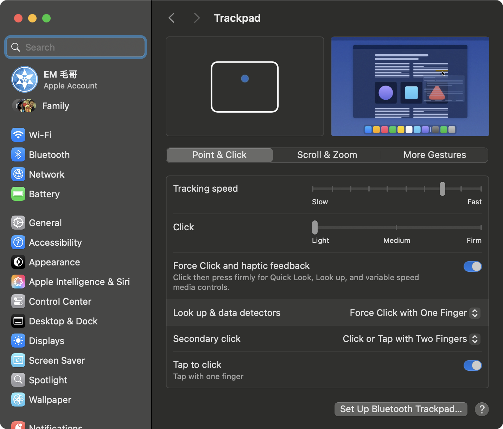
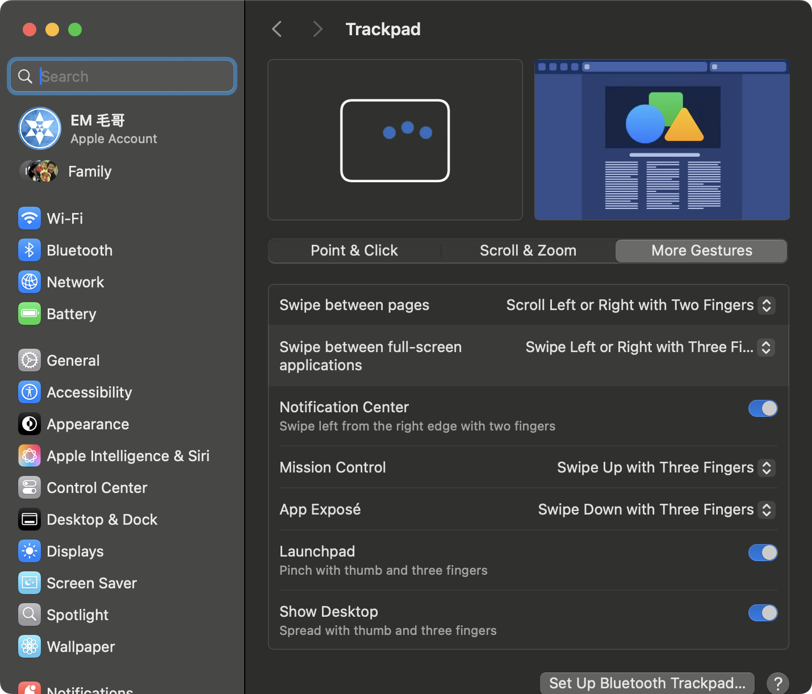
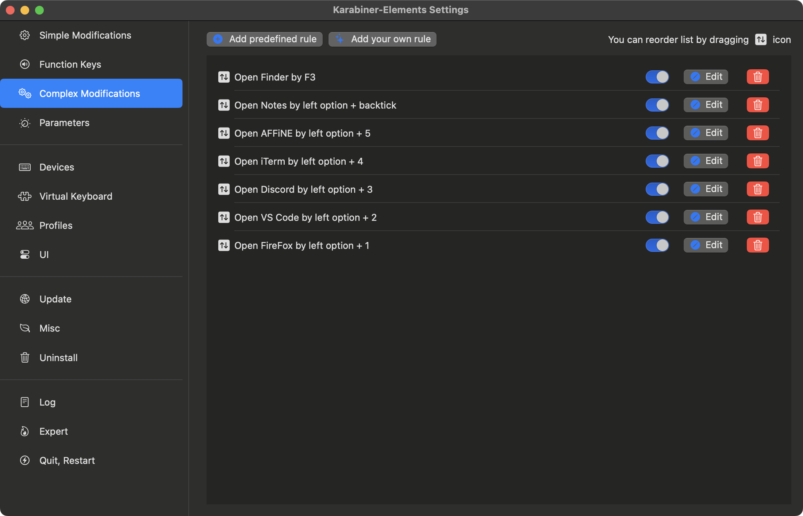

# 毛哥EM的快捷鍵：如何正確使用鍵盤跟觸控板

高中學校老師常常會說「我的電腦在你手上看起來不像我的電腦，我都還沒看清楚你就弄完了。」這除了是因為我平常做很多 [手指運動](https://github.com/Edit-Mr#js-contribution-activity-description) 以及他們真的很慢以外，還有一個原因是我會使用快捷鍵，以及以些長時間累積下來的習慣。

這篇文章不只是會提到我的快捷鍵，還有各方面使用鍵盤滑鼠提升工作效率的方法。

在開始之前先來講一下我個人不專業的看法：

## 所以我要全鍵盤 + CLI 嗎？

今天我們使用鍵盤操作和 CLI 的意義是為了提高效率。如果反而讓你更不方便，要思考一堆指令，慢慢打出來的話那就適得其反。 **學習成本高不一定代表比較好。** 就像你做專案大多不會先考慮用 C，除非你是為了耍帥。

## 如何正確使用滑鼠與觸控板

滑鼠跟觸控板是一個很好用的東西。就像你玩槍戰不會用 `h`、`j`、`k`、`l` 來調整視角，滑鼠的特點是能讓你快速定位到任何不規則位置。如果你不習慣 Vim，或是常進行剪輯或是設計，那麼設定好鼠標會很好用。

如果你的滑鼠用起來很慢的話請你調高滑鼠靈敏度以及加速度。滑鼠加速度是指你可以用力的把滑鼠彈過去，雖然手指移動的距離差不多但位置差很多。**我建議的速度是你要能手腕和其他手指幾乎不動，只動一根食指就能到螢幕所有地方。** 如果你無法的話精準定位的話請去下載 [Aimlabs](https://aimlabs.com/) 或花點時間習慣。



### 觸控板是好東西

要使用鼠標提升效率，或著說要用的舒服的話其中一個很大的前提是要能快速的在滑鼠跟鍵盤中切換。這就是為什麼我喜歡筆電，你的手應該隨時擺在鍵盤下，觸控板兩邊。要用觸控板時你的慣用手往內旋轉約 45 度就夠你用了，用完之後可以馬上轉回來。我用觸控板時大拇指常常會扣在筆電前面側面（MacBook 正好有溝槽讓你放），這樣比較省力，而且你要回來時大拇指拿開反作用力就會彈回來了。這也沒有對不對，只是我自己的習慣。


雖然大多數的 Windows 筆電觸控板沒有 MacBook 好用，但是其實也還行，還是比滑鼠好。MacBook 觸控板的缺點是許多功能（如拖曳）一定需要按下去，不能碰兩下雙擊移動，但 Windows 筆電目前看到的都可以。

熟悉 MacBook 的人會知道 MacBook 的鍵盤是按不下去的，他是用震動來模擬按下去的感覺，所以觸控板的任何地方才都可以輕鬆地按下不會有槓桿原理的問題。建議如上圖把點擊力道改成最輕你就可以輕鬆地按下去了。

### 觸控板手勢

手勢建議設定成三指以內。

- 三指左右滑動 Windows 預設 App 切亂，建議改成桌面切換。四指可以維持或是換成任何你想要的。
- Windows 軟體切換 `Alt + Tab` 是最好用的東西
- MacOS 的 `Cmd + Tab` 除非你要在兩個軟體間切換不然建議別用，大多情況因為視窗可能有好幾個，因此建議三指上滑（Mission Control），同時視窗最大也最好按。如果你用 `Cmd + Tab` 選單會出現，甚至是你需要找是第幾個，那就代表你太慢了，或是太遠了，請用 Mission Control 或下方 Dock。
- MacBook 四指手勢改成「三只或四指都行」。



雖然觸控板很方便，但是用久了手還是會酸。因此建議除了要保持良好得坐姿，如果是要做大量閱讀文檔或是設計類的工作還是建議備個滑鼠。

## 快捷鍵們

這裡我列出了我常使用，以及我自己設定的一些快捷鍵。以各個軟體或功能做分類，以及如何設定。可以自己選擇要用的軟體做參考。

### 國小電腦課會教的

- `Ctrl/Cmd + C` 複製
- `Ctrl/Cmd + V` 貼上
- `Ctrl/Cmd + X` 剪下
- `Ctrl/Cmd + Z` 復原（有時候是 `Y`, `Shift + Z`）
- `Ctrl/Cmd + A` 全選
- `Ctrl/Cmd + F` 搜尋
- `Alt + F4` 關閉視窗（MacOS 是 `Cmd + Q`）
- `Ctrl/Cmd + S` 儲存
- `Ctrl/Cmd + N` 新建視窗或檔案
- `Ctrl/Cmd + O` 開啟檔案
- `Ctrl/Cmd + Shift + N` 新建資料夾
- `Ctrl/Cmd + +` 放大
- `Ctrl/Cmd + -` 縮小

還有一點文字處理，這些要看軟體：

- `Ctrl/Cmd + B` 加粗
- `Ctrl/Cmd + I` 斜體
- `Ctrl/Cmd + U` 底線
- `Ctrl/Cmd + K` 插入連結
- `Ctrl/Cmd + Shift + V` 貼上純文字（不帶格式）
- `Ctrl/Cmd + E`：Word 置中
- `Ctrl/Cmd + L`：Word 左對齊
- `Ctrl/Cmd + R`：Word 右對齊
- `Ctrl/Cmd + J`：Word 兩端對齊
- `Ctrl/Cmd + Shift + >`：Word 增大字體
- `Ctrl/Cmd + Shift + <`：Word 減小字體

### 視窗管理

用軟體之前第一件事是要把它放到對的位址。雖然你把視窗拖到螢幕邊緣就會自動調整大小，但這樣還是太慢了。尤其是如果你有多螢幕，如果你是要拖到很大的投影幕那你會很頭痛。

#### Windows

Windows 很簡單，就是 `Win + 上下左右向鍵` 來快速調整視窗大小和位置。

- `Win + 左`：將視窗填滿左邊螢幕
- `Win + 右`：將視窗填滿右邊螢幕
- `Win + 上`：
  - 如果視窗在中間：將視窗最大化
  - 如果在最大化：填滿上半螢幕
  - 如果視窗在左邊或右邊：將視窗填滿左或右上角
- `Win + 下`：
  - 如果在最大化：將視窗還原到原來大小
  - 如果視窗在中間：將視窗最小化
  - 如果視窗在左邊或右邊：將視窗填滿左或右下角
- `Win + Shift + 左`：將視窗移到左邊螢幕
- `Win + Shift + 右`：將視窗移到右邊螢幕

這樣講有點抽象，反正就是你方向鍵在哪就會跑去哪。

#### MacOS

MacOS 的視窗管理比較麻煩一點，在文章 [從 Windows 轉到 MacBook 的心得](https://emtech.cc/p/win-macbook) 我已經罵過一次雖然 MacOS 有內建的視窗管理功能，但真的看了很難受。你可以使用 `Fn + Ctrl + 方向鍵` 來填滿上下左右，但他不會完全填滿。


而且這是幾兩年才有的功能。以前看過別人使用 [Rectangle](https://rectangleapp.com/) 或 [Magnet](https://magnet.crowdcafe.com/) 這兩個軟體來做視窗管理。但我發現 Raycast 裡面就有內建而且很好用，所以我就不需要再裝其他軟體了。以下是是我設定的快捷鍵：

- `Fn + Ctrl + ←`：將視窗填滿左邊螢幕
- `Fn + Ctrl + →`：將視窗填滿右邊螢幕
- `Option + Z`：將視窗填滿螢幕
- `Option + Shift + Z`：將視窗放到螢幕中間適中大小
- `Ctrl + Cmd + ←`：將視窗移到左邊螢幕
- `Ctrl + Cmd + →`：將視窗移到右邊螢幕

Mac 的全螢幕（`Ctrl + Cmd + F`）請警慎使用。因為如果你進到全螢幕你是不能拉別的視窗過來的，比如說開個 Finder 拉素材。而且來回切換都需要經過絢麗的雲霄飛車轉場動畫，要來回切換時很浪費時間，也很眼花。用 `Option + Z` 來填滿螢幕在很多軟體根本大小相同，只是上下的工具列比較難按而已。

#### 退出軟體

- `Cmd + Q` 退出軟體（Windows 是 `Alt + F4` 來關閉視窗）
- 回到桌面：Windows 是 `Win + D`；MacOS 是 `Fn + F11`，但我更常是直接用四根手指往外綻放（？）來暫時回到桌面。

### 分頁管理

這非常有用，一定要記。而且不只在瀏覽器，很多軟體都適用。

- `Ctrl/Cmd + T` 開啟新分頁
- `Ctrl/Cmd + W` 關閉分頁
- `Ctrl/Cmd + Shift + T` 重新開啟關閉的分頁
- `Ctrl/Cmd + Tab` 切換到下一個分頁
- `Ctrl/Cmd + Shift + Tab` 切換到上一個分頁

順帶一提，視窗沒有要用就關掉，再開很快，也有歷史紀錄（`Ctrl + H`, `Cmd + Y`）。

### 瀏覽器 - 開啟常用網頁

在瀏覽器的網址列同樣也會有 auto complete。通常輸入一到兩個字母就可以按 enter 了，通常只有很深的分頁，或是會忘記的網頁才需要設書籤。


如果你常用的網頁是某個分頁的話在 Firefox 中你可以編輯書簽，並設定關鍵字。比如說我做了以下設定後我只需要輸入 `s, enter` 就可以打開 Google Sheets 了。


### 搜尋 App

所有的軟體還是網站不管是 Windows 還是 MacOS 我都會使用搜尋來開啟，比放工具列和桌面快多了。MacOS 中可以使用 Spotlight (或 Raycast) 來搜尋，Windows 中可以使用搜尋功能。按下 Windows 鍵看似你在開始目錄，但其實這時你可以輸入文字來搜尋。比如說我要打開 Chrome 就是依序按下 `Win, C, Enter`，在 MacOS 上就是 `Cmd + Space, C, Enter`。

> 你的桌面應該要隨時保持乾淨，**只有你暫時需要，用完要丟的東西。** 建議你可以把下載的路徑改成桌面方便你存取，用完就扔。如果很亂的話你可能需要找一張好看一點的桌布。

### 開啟常用 App

在 Windows 當中你的工作列的軟體左到右的快捷鍵分別是 `Win + 1`, `Win + 2`... 可以讓你快速地做視窗切換。同時許多常用的內建軟體也有快捷鍵，如 `Win + I` 開啟設定，`Win + E` 開啟檔案總管。

在 MacOS 當中就沒有這個東西了，我是使用 Karabiner-Elements 來自訂，要用 Raycast 也行：

- F3 打開 Finder
- `option + ~` 打開記事本
- `option + 1` 打開 Firefox（開發時水狐狸還是比 Safari 好用）
- `option + 2` 打開 VS Code
- `option + 3` 打開 Discord
- `option + 4` 打開 iTerm (Terminal)



### 輸入常用個人資訊

要輸入常用的個資如姓名、email、電話，打久了真的很躁。因此手機上我有設定 Apple 內建的替代文字：

- `aaa`: email
- `hhh`: 住址 ...

MacBook 上使用 Raycast 設定快捷鍵，Windows 中則是使用 HotkeyP：

- `option/alt + shift + w`: email
- `option/alt + shift + q`: 電話
- `option/alt + shift + e`: 姓名

### 剪貼簿歷程

在 Windows 中你可以使用 `Win + V` 來開啟剪貼簿歷程，這樣你就可以看到之前複製過的東西。MacOS 中我是使用 Raycast，快捷鍵設定成 `option + shift + v`。這樣我就可以快速地找到之前複製過的東西，像是網址、圖片等等。

### Emoji 鍵盤

在 Windows 中你可以使用 `Win + .` 來開啟 Emoji 鍵盤，但很爛很難用所以我是用擴充功能 [Emoji Add-on](https://www.emojiaddon.com/)。MacOS 中則是使用 Raycast 的 Emoji 鍵盤，快捷鍵設定成 `ctrl + cmd + space`。非常好用，而且不知有 Emoji 還有很多 ASCII 符號可以使用。


### 截圖與螢幕錄影

在 Windows 中你可以使用 `Win + Shift + S` 來開啟截圖工具，然後選擇要截取的區域。

MacOS 中則是使用 `Cmd + Shift + 4` 來截取螢幕的一部分，或是 `Cmd + Shift + 3` 來截取整個螢幕。如果要截取視窗的話可以使用 `Cmd + Shift + 4` 然後按空白鍵來選擇視窗，但我通常會使用 `Cmd + Shift + 5` 然後選成「選擇視窗」來截取視窗這樣就不用按空白可以一個快捷鍵解決。截出來會有陰影，如果不想要的話（95% 的情況）可以在點擊的時候按著 `option` 鍵就不會有陰影了。（如果你用 `4` 的話就是 `Cmd + Shift + 4, space, option + 點擊`）

螢幕錄影 Windows 中可以使用 `Win + G` 來開啟 Xbox Game Bar，然後選擇錄影功能。MacOS 中則是使用 `Cmd + Shift + 5` 來開啟螢幕錄影工具，可以選擇錄製整個螢幕或是選擇區域。

### PowerToys 小工具

Windows 官方有一個很棒的官方工具叫做 [PowerToys](https://learn.microsoft.com/zh-tw/windows/powertoys/install)。它有很多實用的小工具。我常用的有：

- `Win + Shift + C`：開啟顏色選取器
- `Ctrl + Win + Alt + V`：純文字貼上
- `Ctrl + Win + T`：Always on Top（讓視窗置頂）
- `Ctrl + Win + Shift + M`：螢幕尺規

### 其他

- Siri: 右邊的 `cmd` 按兩下。通常拿來設計時器跟找手機。
- 色彩反轉：`Ctrl + Option + Command + 8` (MacOS)，拿來看一些亮色的東西很刺眼時可以把顏色反過來，或是設計時可以拿來看看對比夠不夠等等。
- `ctrl + cmd + shift + c`：內建轉繁體
- `ctrl + cmd + option + shift + c`：内建转简体（超難按）

### Finder

這些是內建的快捷鍵：

- `Cmd + N` / `Cmd + T`：新建 Finder 視窗或分頁（跟瀏覽器和許多軟體一樣）
- `Cmd + W`：關閉 Finder 視窗或分頁
- `Cmd + Q`：關閉 Finder
- `Cmd + Shift + N`：新建資料夾
- `Cmd + Shift + D`：桌面資料夾
- `Cmd + Shift + O`：文件資料夾
- `enter`：對選取的檔案重新命名
- `Cmd + I`：選取的檔案資訊
- `Space`：快速預覽（Quick Look）選取的檔案
- `ctrl + shift + x`：Keka 解壓縮（Keka 內建）
- `ctrl + shift + k`：keka 打開（Keka 內建）

還有一些我設的快捷鍵，括號為設定的軟體。

- `F3（功能鍵）`：開啟 Finder（Karabiner-Elements）
- `Option + Cmd + 9`：把選取的圖片轉成 WebP 格式（設定 > 鍵盤 >快捷鍵，可以參考[這篇文章設定 Automator](https://emtech.cc/p/mac-2webp)）
- `Option + Cmd + 0`：打開 iTerm（Terminal）在當前選取檔案的目錄，或選取的資料夾目錄。（設定 > 鍵盤 >快捷鍵）

### VSCode

內建快捷鍵。有一些 Windows 跟 MacOS 不同，這裡列出 MacOS 我比較常用的：

- `Cmd + P`：快速開啟檔案，或是可以跟 Vim 一樣打 `:20` 來跳到第 20 行
- `Cmd + Shift + P`：快速開啟命令面板
- `Cmd + B`：切換側邊欄
- `Cmd + Shift + E`：切換檔案總管
- `Cmd + Shift + F`：全域搜尋
- `Option + Shift + G`：Git 面板，我改成 `Cmd + Shift + G`
- `Cmd + Shift + D`：Debug 面板
- `Cmd + Shift + X`：擴充功能面板
- `Cmd + `：開啟終端機
- `Cmd + K Cmd + S`：開啟快捷鍵設定
- `Cmd + /`：註解或取消註解選取的程式碼
- `Cmd + L`：選取整行
- `Cmd + D`：選取下一個相同的字串
- `Option + Shift + F`：格式化程式碼
- `F5`：執行程式碼
- `Ctrl + Tab` / `Cmd + W`...：切換分頁／關閉分頁那些視窗管理
- 在 Git 面板中 `Cmd + Enter` 可以 commit，沒有先 `git add` 的話就會幫你 `add` 所有變更的檔案。

我設定的快捷鍵：

- `ctrl + 1`：git pull
- `ctrl + 2`：git push

[emmet](https://emmet.io/) 是一個很棒的功能，可以讓你快速地寫出 HTML、CSS、以及其他軟體。比如說你可以輸入 `div.container>ul>li*5` 然後按 `tab` 就會自動生成一個包含 5 個列表項目的無序列表。

> 延伸閱讀：[Day2 如何打的更快 | Emmet & 預測輸入](https://emtech.cc/p/2023ironman-2)

同時如果你有很常用的指令可以設定成 Code Snippet，這樣就可以快速地插入程式碼片段。比如說我有一個 CSS Code Snippet 只需要輸入 `mid` 然後按 `tab` 可以快速插入：

```css
display: flex;
justify-content: center;
align-items: center;
```

完整的設定如下：

```json
{
	"Center element with flex box": {
		"prefix": "mid",
		"body": ["display: flex;", "justify-content: center;", "align-items: center;"],
		"description": "Center element with flex box"
	},
	"padding-inline": {
		"prefix": "pin",
		"body": ["padding-inline: $1;"],
		"description": "padding-inline"
	}
}
```

HTML：插入假圖

```html
{"Random Image": {
	"prefix": "rimg",
	"body": [
		""
	],
	"description": "Random Image"
}
}
```

### Bitwarden

我的密碼管理器。我是自己架 [Vaultwarden](https://github.com/dani-garcia/vaultwarden)，然後用 [Bitwarden](https://bitwarden.com/) 的擴充功能與 App 來管理密碼、驗證碼、和 Passkey 等資料。

- `Cmd + Shift + L` 自動填入密碼並複製 TOTP
- `Cmd + Shift + 9` 生成並複製隨機密碼
- `Cmd + Shift + Y` 打開 Bitwarden

## iTerm

iTerm 是 MacOS 上非常好用的終端機軟體。快捷鍵主要是視窗管理的那些 `Cmd + W`、`Cmd + T`、`Cmd + N` 等等。但我有設很多自訂的 alias：

```bash
alias pn=pnpm
alias pnf="pnpm front"
alias pnd="pnpm dev"
alias pni="pnpm install"
alias pnr="pnpm run"
alias pnb="pnpm build"
alias pnc="pnpm check"
alias pns="pnpm start"

alias gp='git pull'
alias ga='git add'
alias gaa='git add --all'
alias gb='git branch'
alias gbd='git branch -D'
alias gc='git commit -s -m'
alias gcb='git checkout -b'
alias gd='git diff'

alias cdd='cd Desktop'
```

> 看出我多懶了吧。如果你每分鐘要打三次的話你就會受不了了（應該吧）。

同時我有安裝一些好用的小工具：

- [Auto Complete](https://github.com/marlonrichert/zsh-autocomplete)：自動補全命令
- [The Fuck](https://github.com/nvbn/thefuck)：讓你可以快速修正上一個命令的錯誤
- [Powerlevel10k](https://github.com/romkatv/powerlevel10k)：好看，好理解，心情好。

## 總結

這些是我目前想到在日常工作中常用的快捷鍵，能夠大幅提升我的工作效率，並大幅減少我的煩躁。希望對你也有幫助。如果你有其他很用的快捷鍵也歡迎和我一起分享！
