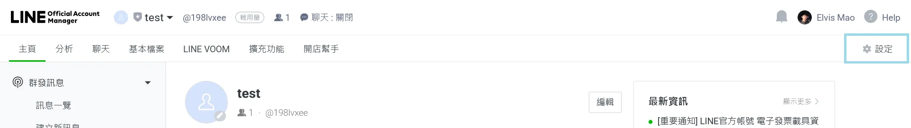

# 自製 Line Bot 轉發群組訊息給自己

你是否有群組充滿著垃圾訊息？或是你是否想同步兩個群組的訊息？今天我要帶你一步步製作一個簡單的 Line Bot 來轉發群組重要訊息給自己或任意聊天室。不用程式經驗，複製貼上就好了。

{{notice}}
Line Notify 停用

兩年前我寫過一篇文章介紹如何使用 Line Notify 來轉發訊息，但由於 Line Notify 的服務是可以免費無限使用的，LINE 賺不到錢，所以已經被棄用。因次我重新撰寫的這篇文章使用 Line Bot 來實現轉發訊息的功能。

不過我記得機器人傳訊息給單一用戶是不會有上限的，所以如果你有需要的話可以使用這個方法來實現。

{{noticed}}


## 原理

機器人在群組收到訊息之後會過濾不要的，再轉傳訊息到群組或私訊給你。我們會使用 Google Apps Script 來實現這個功能。

## 1. 建立 LINE bot

首先請你到 [Line Developers](https://developers.line.biz/console/) 登入帳號並建立一個機器人。

我們要先選擇一個開發者。如果你已經有的話可以直接使用，沒有的話可以新增一個。


接下來我們要新增一個官方頻道，這裡選擇 Create a new channel，然後選擇 Messaging API。


這時候他會請你建立一個官方帳號。點擊連結來建立。


請依序輸入帳號名稱、電子郵件、和類別。類別可以隨便填沒關係。


接下來他會問「你是否要儲值升級官方帳號驗證?」，我們選擇稍後 (下輩子) 進行驗證即可。

接下來他會問你你是否同意和我們蒐集並販賣你的個資與聊天內容，底下只有一個同意按鈕。畢竟你註冊 LINE 時也都同意過了，所以按同意即可。


> 關於 LINE 的條款，[Wiwi 官大為](https://wiwi.blog/blog/line-privacy-policy) 的文章有很有趣的描述，有興趣可以看看。

## 2. 設定 LINE Bot

接下來我們要來做幾個必要的設定。請你點擊螢幕最右上角有一個設定按鈕然後進行以下幾個設定。



### 允許加入群組

在 LINE Official Account Manager 左邊選單的第一個選項「帳號設定」、「功能切換」裡選擇「接受邀請加入群組或多人聊天室」


### 啟用 Messaging API

在 LINE Official Account Manager 左邊選單的第四個選項「Messaging API」並啟用。


晚點我們還會回到這個頁面喔。

### 關閉自動回復與啟用 Webhook

在 LINE Official Account Manager 左邊選單的第三個選項「回應設定」裡，將「自動回覆訊息」關閉，然後將 Webhook 啟用。


這樣我們這邊就暫時設定完了。接下來我們要來寫點程式，不過不用緊張，複製貼上就可以了。

### 複製 Channel access token

接下來我們要複製 Access Token，這是我們的機器人跟 LINE 溝通的密碼。

請你回到 [LINE Developer Console](https://developers.line.biz/console/)，然後在 "Messaging API settings" 裡找到 Channel access token 點擊 issue 生成並複製下來，我們馬上會用到。


## 3. 建立 Google Apps Script

Google App Script 是 Google 提供的雲端工具，讓我們可以在 Google 的服務上寫程式。這裡我們會使用它來接收 Line Bot 的訊息並轉發。

首先請你進入網站 [script.new](https://script.new) 來建立一個專案 (或是你也可以進入 [script.google.com](https://script.google.com) 或是從 Google Drive 新增專案。)

接下來請你**清空所有畫面上的範例程式碼**，然後將以下的程式碼貼上去（可以點擊右上角的複製按鈕）：

```js
const ACCESS_TOKEN = "剛才複製的那一串";

// 這裡定義：哪些人/群組可以轉發，以及要轉到哪裡
const FORWARD_RULES = {
    全部: "廣播"
};

// 底下不用更改
function doPost(e) {
    const json = JSON.parse(e.postData.contents);
    // 簡單判斷是不是訊息事件
    if (json.events && json.events.length > 0) {
        const event = json.events[0];

        if (event.type === "message" && event.message.type === "text") {
            const forwardTarget =
                FORWARD_RULES["全部"] ||
                FORWARD_RULES[event.source.groupId] ||
                FORWARD_RULES[event.source.userId];
            if (forwardTarget) {
                let messageText = event.message.text;
                if (forwardTarget == "廣播")
                    messageText +=
                        "\nUser ID: `" +
                        event.source.userId +
                        "`\nGroup ID: `" +
                        event.source.groupId +
                        "`";
                forwardMessage(forwardTarget, messageText);
            }
        }
    }
    return ContentService.createTextOutput("OK");
}
// 發送訊息給指定ID
function forwardMessage(targetId, text) {
    const url = targetId == "廣播" ? "broadcast" : "push";
    const options = {
        method: "post",
        contentType: "application/json",
        headers: {
            Authorization: "Bearer " + ACCESS_TOKEN
        },
        payload: JSON.stringify({
            to: targetId,
            messages: [
                {
                    type: "text",
                    text: text
                }
            ]
        })
    };
    UrlFetchApp.fetch("https://api.line.me/v2/bot/message/" + url, options);
}
```

請你將剛才的 Access Token 貼上去，然後後面的 `FORWARD_RULES` 我們晚點再設定，我們需要先取得使用者的 User ID 或是群組的 Group ID。

請你按下儲存 (`Ctrl` + `S`)，然後點擊執行。他會轉一下然後要求你登入 Google 帳號，這是正常的。請你登入並授權。


登入完帳號之後他會警告這個程式碼沒有經過驗證 (廢話，是我們自己寫的。) 請你選擇左下角小小的進階，然後前往。


接下來他會求要存取帳戶，不過他底下有列出來他並沒有真的要讀取你的資訊，只是要連接至外部服務 (轉發 LINE 訊息)。


我們選擇繼續即可。接下來冷靜等兩秒他會自己顯示授權成功。

這時候你執行程式一定會出現這個錯誤：

```
TypeError: Cannot read properties of undefined (reading 'postData')
```

原因是我們是直接執行，沒有傳訊息給他它怎麼知道要做甚麼。沒關係我們可以不用管它。我們接下來要來部屬這個程式。

請你點擊右上角的部屬，新增部屬。


然後接下來請你選擇網頁應用程式，並確認右邊底下設定誰可以存取是所有人。

> 不然難道 LINE 要登入你的 Google 帳號來執行嗎？


最後點擊部屬即可。請你複製接下來顯示的應用程式網址 (**記得不是資料庫網址**。)

## 4. 設定 Webhook

接下來我們要回到 LINE 的設定。要在 Developer Console 或是官方帳號管理都可以。我這裡使用我們剛才到過的官方帳號 Message API 設定。請你把剛才我們複製的應用程式網址複製貼上到 Webhook 網址並點擊儲存。


## 5. 取得使用者 ID 及群組 ID

接下來請你把這隻機器人邀請到你想要轉發的群組或聊天室。這時有任何新訊息它都會轉發給你，並且告訴你這個訊息來自哪裡、使用者 ID 是甚麼，請你複製下來。

如果你直接跟機器人說話它只會返回你的使用者 ID，但如訊息來自群組或聊天室它會同時返回使用者 ID 和群組 ID。就看你想要從哪裡轉傳到哪裡。

比如說

- 轉傳群組所有訊息給你: 複製群組 ID、你的使用者 ID
- 轉傳某個人在群組的訊息給你: 複製你跟他的 ID，然後記得邀請機器人。
- 同步某個群組的訊息到另一個群組: 複製你跟他的 ID，然後記得邀請機器人。


## 6. 設定轉傳規則

最後請你回到 Google Apps Script 的程式碼，然後在 `FORWARD_RULES` 裡面設定轉傳規則。

請你把原本的 `全部: "廣播"` 刪掉，然後加入你剛才複製的使用者 ID 和群組 ID。

```js
const FORWARD_RULES = {
    "群組 ID": "你的使用者 ID",
    "使用者 ID": "群組 ID"
    //... 看你要加幾條規則都可以
};
```

> 記得 ID 不包括前後面的 ``` 喔，且文字請在前後加入雙 / 雙引號。

最後我們要來更新部屬。請你點擊右上角的部屬，然後選擇管理部屬。


選擇建立新版本，然後點擊更新，這樣就完成了。網址並不會變所以不用重新設定。

## 總結

這樣我們就完成了。接下來你可以在群組裡面發送訊息，然後看看機器人會不會轉發給你。如果你在使用上遇到任何問題歡迎透過右邊 Discord 伺服器詢問或是右上角 IG 連結聯絡我。


