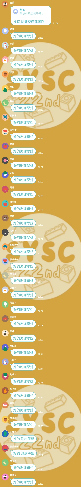

# 【Google Apps Script】用 Line Bot & Line Notify 轉發群組訊息給自己

你是否有群組充滿著垃圾訊息？用 Line Bot & Line Notify 轉發重要訊息給自己！不用程式經驗，複製貼上就好了！

{{notice}} Line Notify 停用

Line Notify 已經停用，請參考我寫的這篇新文章：

[自製 Line Bot 轉發群組訊息給自己](https://emtech.cc/p/line-forward/) {{noticed}}



> [影片教學](https://www.instagram.com/reel/Cp9kNc9DWK1/)

## 原理

機器人在群組收到訊息，過濾不要的，再讓 Line Notfy 轉傳訊息到群組或私訊給你。

### LINE bot

至[Line Developers](https://developers.line.biz/console/) => 新增或選取 Provider => Create a new channel => Message API。

> \* Messaging API 底下的 Webhook 等一下我們要填入，非常重要。

### 生成 Line Notify 仗權

Line Notify 是個比較冷門但是非常好用的工具。我們可以透過他來從第三方 (如你的網站、或是 ios 捷徑) 無限量的廣播訊息到指定的群組，或是單獨發給你。

https://notify-bot.line.me/my/ => 發行權杖 => 把那一串複製下來，等一下要用。

要給 Line 看這一串他才知道要傳送訊息到哪裡。使用 Line Notify 而不是 Line 機器人的原因是免費版的官方帳號一個月只能傳送 500 則訊息，但 Line Notify 則沒有限制。

> \* 記得換成電腦板模式 權杖名稱是顯示在 `【 】` 中的文字，建議越短越好避免洗版

### 建立 API(Google Apps Script)

{{notice}} Google Apps Script

開發者:Google 類型：免費網站（可付費升級）網址：[script.google.com](https://script.google.com) {{noticed}}

請建立一個新的專案並貼上以下內容。記得貼上記得貼上 Line Notify Token。

```js
// 定義一個名為 'doPost' 的函數，該函數帶有一個名為 'e' 的參數。
function doPost(e) {
	// 從傳入的 POST 請求中解析出文本消息。只要是傳給機器人的訊息都會被解析出來。
	var message = JSON.parse(e.postData.contents).events[0].message.text;

	// 從傳入的 POST 請求中解析出使用者 ID。
	var id = JSON.parse(e.postData.contents).events[0].source.userId;

	// 如果沒有 ID，則返回。你可以在這裡加入你的過濾條件。
	if (!id) return;

	// 設定 Line Notify API 的權杖。
	var token = "YOUR_LINE_NOTIFY_TOKEN";

	// 設定 POST 請求的選項。
	var options = {
		method: "post",
		payload: {
			message: id + "\n" + message // 這裡是要傳送的訊息，我們第一行放了發送者的 id，第二行放了訊息本身。可以自行修改。
		},
		headers: {
			Authorization: "Bearer " + token
		}
	};

	// 發送 POST 請求到 Line Notify API。會傳給剛才設定的權杖指定的群組或私人訊息。
	UrlFetchApp.fetch("https://notify-api.line.me/api/notify", options);
}
```

我們在傳送的訊息同時添加了發送者的 id。如果你想要塞選訊息的話請修改第四行 if 裡面的參數

- `!id  - 全部`（預設）
- `id=="某人id"` - 不要某人
- `id!="某人id"` - 只要某人
- `id!="某人id" || id!="某人id"` - 只要某一群人

{{notice}} 小叮嚀 為避免程式碼站太多空間，可能會部分隱藏。請記得展開或直接複製。 {{noticed}}


做好了之後點擊執行▶️，你會需要授予你的程式讀取資料的權限。因為你寫的程式沒有被 Google 驗證過所以會顯示不安全，但我相信你不會把你的帳號搞爆，對吧。執行後會看到錯誤，這是正常的，因為我們直接執行沒有給他訊息。

接下來我們要部署它，讓它成為一個網站來讓我們抓。這裡選擇網頁應用程式，所有人都以你的身分讀取。按下部署就可以囉~

這裡我們把部署的網址複製起來。如果要做修改除了按儲存之外要記得重新部署成新版本才會更新喔。

將這個部屬的網址貼到剛才 Webhook 的地方就完成了
