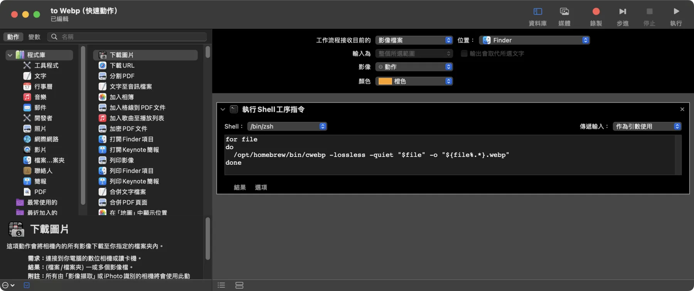

# MacOS 快速把圖片轉成 WebP、影片轉成 GIF

平常在進行網頁開發、甚至是文章撰寫時經常會把 JPG、PNG 這種很大、載入很慢的圖片轉成 WebP 格式，或是把影片轉成 GIF 格式方便發在 Discord、GitHub 訊息當中。這篇文章將介紹如何在 MacOS 的右鍵選單加上一個項目，快速把圖片轉成 WebP、影片轉成 GIF。

## 1. 安裝 ffmpeg

首先我們需要安裝 ffmpeg，這是一個非常強大的影音處理工具，可以用來將影片轉成 GIF。當然如果你只想要把圖片轉成 WebP 的話，使用 cwebp 就好了 (不過底下的程式你需要自己稍作修改)。

這裡我們使用 Homebrew 來安裝 ffmpeg，如果你還沒有安裝 Homebrew 的話，可以參考 [Homebrew 官方網站](https://brew.sh) 的指示安裝。

首先請你打開終端機 (可以從 Launchpad 找到或使用 Spotlight 搜尋)，然後執行以下指令安裝 Homebrew。

```bash
/bin/bash -c "$(curl -fsSL https://raw.githubusercontent.com/Homebrew/install/HEAD/install.sh)"
```

執行完之後你會需要把 Homebrew 加入到 PATH 環境變數中，這樣你才能夠使用 Homebrew 安裝的程式。你可以直接複製終端機畫面上的指令，或是手動加入到你的 shell 設定檔中。

```bash
echo 'eval "$(/opt/homebrew/bin/brew shellenv)"' >> /Users/[你的帳號]/.zprofile eval $(/opt/homebrew/bin/brew shellenv)
```

安裝完 Homebrew 之後，我們就可以使用 Homebrew 安裝 ffmpeg 了。

```bash
brew install ffmpeg
```

如果你只想要把圖片轉成 WebP 的話，可以使用 cwebp 這個工具，安裝方式如下：

```bash
brew install webp
```

## 2. 到 Automator 建立服務

接下來我們要使用 Automator 來建立一個服務，這個服務可以讓我們在右鍵選單中快速把圖片轉成 WebP、影片轉成 GIF。

首先打開 Automator，你可以在 Launchpad 中找到它，或是使用 Spotlight 搜尋。接著選擇「快速動作」。


在這個視窗中，我們選擇「服務」。

接著請你找到並點擊工具程式裡面的「執行 Shell 指令」。

傳遞輸入選擇「作為引數使用」，然後上面的選單可以選擇要出現在那些地方。這裡我選擇「圖片檔案」，顯示於「Finder」。



最後貼上指令，並 `Command` + `S` 儲存即可，名稱可以取為「轉成 WebP」之類的。

```bash
for file
do
  /opt/homebrew/bin/cwebp -lossless -quiet "$file" -o "${file%.*}.webp"
done
```

你可以根據你的需求修改這個指令，例如調整 fps、quality 等等。

如果是使用 cwebp 的話指令如下：

```bash
for file
do
  /opt/homebrew/bin/cwebp -q 80 -quiet "$file" -o "${file%.*}.webp" 
done
```

如果是要把影片轉成 GIF 的話步驟相同，只是指令要改成下面這樣：

```bash
for file
do
  /opt/homebrew/bin/ffmpeg -y -i "$file" -vf "fps=8" "${file%.*}.gif"
done
```


## 3. 測試服務

建立完服務之後，你可以在 Finder 中選擇圖片 (幾張都可以)，然後按右鍵，你會看到剛剛建立的快速動作出現在下拉選單中。


## 4. 維護

如果你之後想要編輯這個服務，你可以在 Finder 的以下路徑找到它，雙擊即可編輯。

```bash
/Users/[你的帳號]/Library/Services
```

你可以使用以下指令打開這個資料夾：

```bash
open ~/Library/Services
```


這樣你就可以快速的在 MacOS 中快速把圖片轉成 WebP、影片轉成 GIF 了。