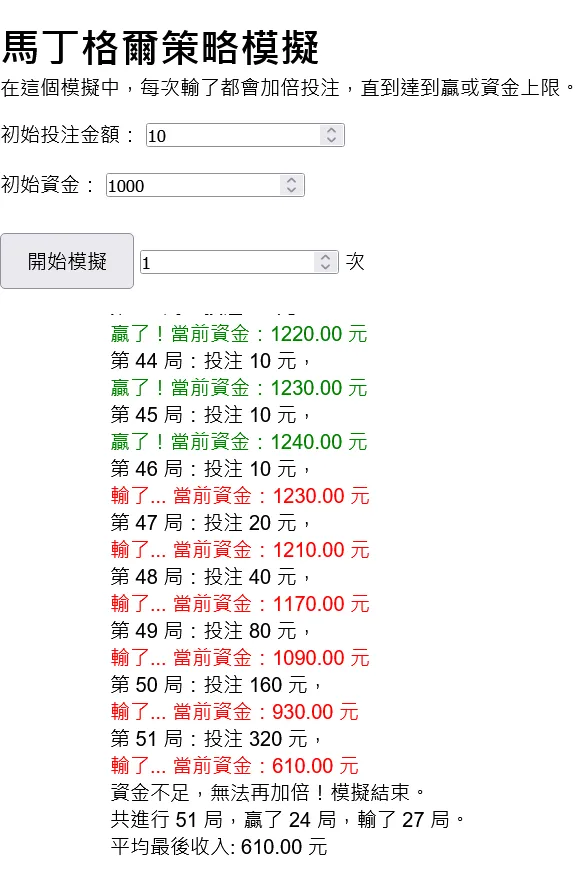

# 必輸策略：馬丁格爾投注法，用程式證明給你看！

馬丁格爾策略是一種常見的賭場策略。同時常被應用在股市、外匯等金融市場。又被稱為虧損加倉、加倍投注。這個策略的核心是：每次輸錢後，下一次的投注金額會加倍。這樣一來，只要贏了一次，就能把之前的虧損全部補回來。之所以會接觸到這個策略是在國中時加密貨幣的線上賭城十分流行，有 YouTuber 在介紹他如何靠這個賺大錢。當時實際操作的結果是不管怎麼玩，只要玩得夠久都會輸。當時還以為是平台在搞鬼，但後來才發現這個策略本來就是必輸的。

## 甚麼是馬丁格爾策略？

馬丁格爾策略其實非常好了解，連當時國一的我都懂了。今天有一個遊戲你贏了的話可以得到兩倍的獎金，輸了的話就會失去你的賭注。在這個遊戲中，你可以自由選擇下注的金額。馬丁格爾策略的規則是：在每一輪遊戲中，你下注的金額是上一輪遊戲中輸掉的金額的兩倍。這樣一來，只要你贏了一輪遊戲，你就能把之前所有的虧損都補回來。

比如說：

我先投注 2 元，結果贏了。我得到 2 _ 2 = 4 元。扣掉之前的 2 元，我現在賺了 2 元。
然後我再投注 2 元，結果輸了。
接著我投入 2 _ 2 = 4 元，結果還是輸了。
再來我投入 4 _ 2 = 8 元，贏了。我得到 8 _ 2 = 16 元。扣掉之前的 2 + 4 + 8 = 14 元，我現在賺了 2 元。

你可以看到，只要你贏了一次，你就能把之前的虧損都補回來。

最近會重新想起這個策略是因為我和朋友的 Discord 群組有一個機器人，你可以跟他玩剪刀石頭布、投骰子之類的遊戲來賺點數。贏得機率確實是 50% 沒有錯。


當時的我就想說，贏的機率有 50%，理論上來說平均兩次我就會贏一次。怎麼可能連續玩個十次都還輸？(1/2)\*10 次方等於 1/512 也太小了吧！那我就來寫一個程式來自動玩遊戲，就可以賺翻了！

問了一下 ChatGPT，他說我會輸得很慘。我不信，你這個文組的懂甚麼數學，我就來寫個程式證明給你看！

## 程式模擬

我寫了一個簡單的 HTML 網頁來模擬馬丁格爾策略。

網址：<https://elvismao.com/code/martingale/>



這裡附上網頁中 JavaScript 程式碼。在這個模擬網站中你可以設定初始資金，初始投注金額。每次輸了都會加倍投注，直到達到贏或資金上限。

```js
let totalRounds = 0;
let finalBalance = 0;
function simulateMartingale() {
    const initialBet = parseFloat(document.getElementById("initialBet").value);
    let balance = parseFloat(document.getElementById("startingBalance").value);
    let bet = initialBet;
    let round = 0;
    let output = "模擬結果：\n";
    let winCount = 0;
    let loseCount = 0;

    while (balance > 0) {
        round++;
        const win = Math.random() < 0.5; // 50% 機率贏
        output += `第 ${round} 局：投注 ${bet} 元，`;

        if (win) {
            balance += bet; // 贏了增加本金
            output += `<div class=green>贏了！當前資金：${balance.toFixed(
                2
            )} 元</div>`;
            bet = initialBet; // 重置投注金額
            winCount++;
        } else {
            balance -= bet; // 輸了扣掉投注金額
            output += `<div class=red>輸了... 當前資金：${balance.toFixed(
                2
            )} 元</div>`;
            bet *= 2; // 加倍投注金額
            loseCount++;

            if (balance < bet) {
                output += "<div>資金不足，無法再加倍！模擬結束。</div>";
                break;
            }
        }

        if (balance <= 0) {
            output += "<div>破產！模擬結束。</div>";
            break;
        }
    }

    output += `<div>共進行 ${round} 局，贏了 ${winCount} 局，輸了 ${loseCount} 局。</div>`;
    totalRounds++;
    finalBalance += balance;
    output += `<div>平均最後收入: ${(finalBalance / totalRounds).toFixed(
        2
    )} 元</div>`;

    document.getElementById("output").innerHTML = output;
    // scroll to bottom
    document.getElementById("output").scrollTop =
        document.getElementById("output").scrollHeight;
}

const start = () => {
    for (let i = 0; i < document.getElementById("times").value; i++) {
        simulateMartingale();
    }
};
```

理論上如果這個策略是必贏的，我的電腦就會一直跑下去，跑到整個瀏覽器當機因為我太有錢了。但實際上呢？按下去那一瞬間你就可以看到你自己是怎麼死的了。我還是不信，一次跑了十萬次，增加初始資金、減少投注金額，但不管怎麼玩我最後都會輸。


你可以看到我初始資金很大，每次只投 1 塊錢，結果還可以從一萬塊一路輸到不到 700 塊。這就是馬丁格爾投注法的陷阱。

## 數學證明 - 你會輸得很慘

我們回到剛才我的計算。第一局輸了之後第二局贏的機率是多少？你以為是 1/2 乘以 1/2 等於 25% 嗎？其實不是，兩局是獨立事件，所以第二局贏的機率是 1/2。

如果你不能理解的話我們換一個故事。一對夫妻生了一個兒子，那麼下一個還是生兒子的機率是多少？是 1/2。

第三局呢？還是 1/2。第四局呢？還是 1/2。所以你可以看到，不管你玩多少局，你贏的機率都是 1/2。你可以看到上面的實驗，贏和輸的比例確實是接近 1:1，但只要玩得夠久你一定會爆倉或是沒錢了，這就是為什麼你會輸得很慘。

{{notice}}

甚麼是爆倉？

當倉位的損失達到一定程度 (風險控制線) ，你的帳戶餘額不足以維持目前的倉位時，交易所或券商會強制結束倉位，以防止更大損失。

簡單來說就是你沒錢繼續 X2 玩了。

{{noticed}}

這個證明明明簡單到我們連算式我都不用寫，但其實還是很多人會被騙。不管是網路上的機器人還是在實際的賭局。


在各種交易上面都有人會使用馬丁格爾投注法，在股票市場，就是俗稱的「攤平」。但之所以能夠賺錢簡單來說是因為裡面包含了其他的技術分析，不是盲目的定時自動加倉。根據情況靈活調整起始的手數、下單的倍數、下單的距離等。推薦各位可以看看 [好棒 Bump: 自動交易機器人真能賺錢嗎？我投 20 萬美金的下場….](https://www.youtube.com/watch?v=1IUgdjfdCtQ&t=914s)，影片中玩的是外匯，但核心的概念一樣。但如果是像我們這種單純玩機率的賭博遊戲，長久來看一定是虧的。

## 總結

回到原本的 Discord 小遊戲，今天我們就以同樣的小金額一直下注，頂多就是期望值等於 0，不賺不虧，但如果你用馬丁策略直接刷下去，你遲早會爆倉。

不過重點其實也不是在賺錢，只是好玩朋友樂樂而已。希望今天這個簡單的小實驗可以讓你認識馬丁格爾策略，也可以知道其中的風險。
