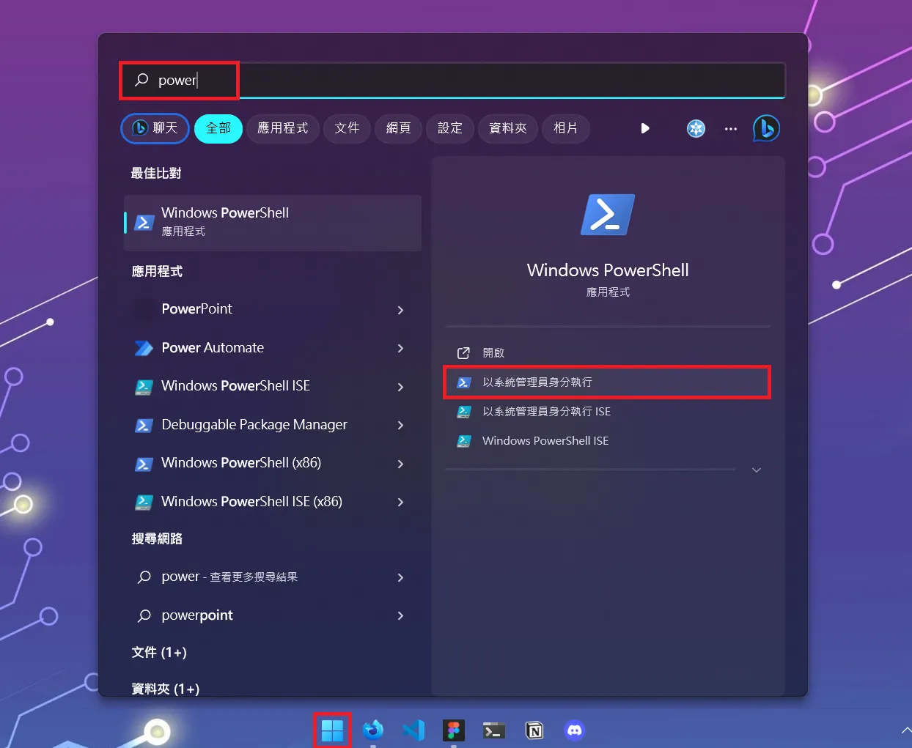
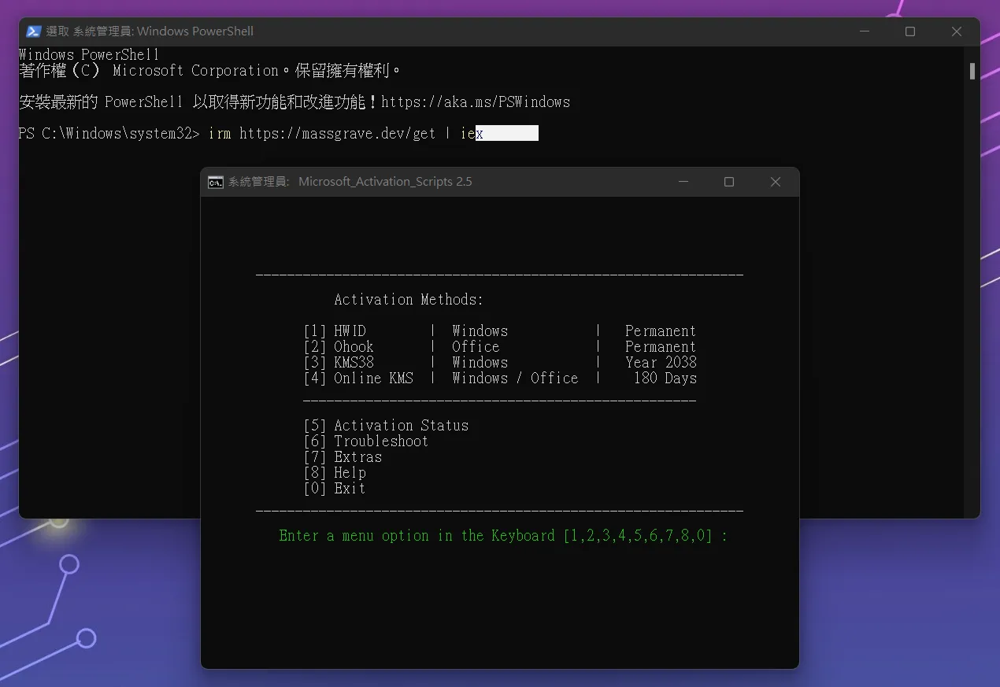

# 【開源】快速免費啟用 Office 及 Windows

Office 雖然目前有提供免費線上版，但是都一定要使用線上版。除了十分不方便以外許多操作也都受到限制。因此這一篇文章我要來和大家分享一個可以安全啟動 Office 的工具，同時也可以啟用 Windows。適用於所有版本，包括最新的 Office 2024 及 Office 365。

## 步驟 1: 下載並安裝 Office

首先請先下載並安裝 Office，這裡提供 2024 官方載點。

- [專業增強版 – 繁體中文](https://officecdn.microsoft.com/db/492350f6-3a01-4f97-b9c0-c7c6ddf67d60/media/zh-tw/ProPlus2024Retail.img)
- [家用版 – 繁體中文](https://officecdn.microsoft.com/db/492350f6-3a01-4f97-b9c0-c7c6ddf67d60/media/zh-tw/Home2024Retail.img)
- [家庭企業版- 繁體中文](https://officecdn.microsoft.com/db/492350f6-3a01-4f97-b9c0-c7c6ddf67d60/media/zh-tw/HomeBusiness2024Retail.img)
- [Project 專業版 – 繁體中文](https://officecdn.microsoft.com/db/492350f6-3a01-4f97-b9c0-c7c6ddf67d60/media/zh-tw/ProjectPro2024Retail.img)
- [Project 標準版 – 繁體中文](https://officecdn.microsoft.com/db/492350f6-3a01-4f97-b9c0-c7c6ddf67d60/media/zh-tw/ProjectStd2024Retail.img)
- [Visio 專業版 – 繁體中文](https://officecdn.microsoft.com/db/492350f6-3a01-4f97-b9c0-c7c6ddf67d60/media/zh-tw/VisioPro2024Retail.img)
- [Visio 標準版 – 繁體中文](https://officecdn.microsoft.com/db/492350f6-3a01-4f97-b9c0-c7c6ddf67d60/media/zh-tw/VisioStd2024Retail.img)
- [Access 標準版 – 繁體中文](https://officecdn.microsoft.com/db/492350f6-3a01-4f97-b9c0-c7c6ddf67d60/media/zh-tw/Access2024Retail.img)
- [Outlook 標準版 – 繁體中文](https://officecdn.microsoft.com/db/492350f6-3a01-4f97-b9c0-c7c6ddf67d60/media/zh-tw/Outlook2024Retail.img)

如果需要下載 Windows 可以從官網。如果需要其他版本可以[參考這裡](https://massgrave.dev/genuine-installation-media)。

下載之後直接點擊`setup.exe`安裝。

安裝完之後會提示你可以免費試用或提供金鑰。當然如果你有的話就不會讀這篇文章了，因此我們先關閉軟體，並以**使用者管理員身分**打開 PowerShell。

## 步驟 2: 打開 PowerShell

請以**使用者管理員身分**打開 PowerShell。你可以在開始選單中找到它，或是在任何地方按下`Win+X`並選擇`Windows 終端機 (管理員)`。



## 步驟 3: 輸入指令

接著輸入這一串指令並按 enter 來打開這個軟體：

```bash
irm https://get.activated.win | iex
```

這樣就進到軟體介面了。如果因為被封鎖所以失敗可以嘗試：

```bash
iex (curl.exe -s --doh-url https://1.1.1.1/dns-query https://get.activated.win | Out-String)
```

我們要啟用 office 所以請按鍵盤上的 4，然後點擊 2 來啟用 office。如果你要啟用 Windows 可以按 4，如果失敗其他的選項也可以試試看。實際數字會根據版本有所不同，反正就是選要的 Windows 或 Office 就對了。

> Ohook 不需要網路就可以執行。



等幾秒就如果出現綠色的

`Product activation successful`

就代表啟動完成了。可以點擊 0 回到主選單並離開軟體（當然也可以直接關閉視窗）

再次打開 Office 軟體你就會發現驗證畫面不見了！到關於介面會看到已經成功啟動了。

如果又出現錯誤說授權到期了只需要再次執行指令就可以囉！
