# 使用 Notion 來準備辯論

身為一位 coder，我十分喜歡使用 Markdown 的格式來撰寫文章 (包括這篇文章也是)。這讓我可以專注在內容上面，而不是整天處理這個標題跟前面的標題大小一不一樣，標楷體為甚麼行距為甚麼那麼大等等爛問題。尤其是在準備資料量大的英文辯論時會特別明顯。在我高一的時候我~~強迫~~邀請我的組員一起嘗試了許多不同的軟體，最後 Notion 是我覺得非常穩定且高效的工具。

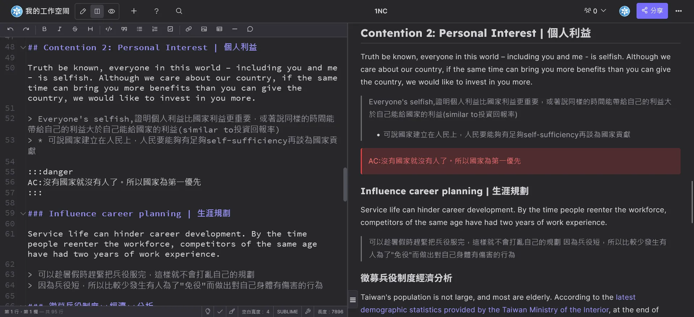

## Notion 的優點

在開始講如何使用之前我先簡單整理一下為甚麼要離開 Google Docs。

1. **分頁**：Google Docs 是最近才從 Notion 等軟體抄來分頁功能。以前每次辯論都需要開一個雲端硬碟資料夾，裡面有二三十份文件，然後每次都要在 Google Docs 裡面一個一個點開來看，要搜尋還需要一個個點開來找。
2. **Markdown**：Notion 支援 Markdown 語法，這讓我可以快速地撰寫格式化的文字，不需要 (也不能) 浪費時間去調整字型或是行距。但是需要的功能超齊全，從文字的各種樣式到表格、資料庫、應有盡有。
3. **資料庫**：Notion 的資料庫功能非常強大，可以輕鬆地建立各種不同的資料庫，並且可以使用不同的視圖來呈現資料，甚至可以寫公式以及程式控制。這讓我可以快速地整理和查找資料，特別是在準備辯論時，能夠快速找到需要的證據卡。
4. **搜尋功能**：按下 `ctrl` / `cmd` + `K` 就可以快速搜尋任何一頁的任何內容。
5. **輸出格式**：Notion 可以將頁面或是資料庫輸出成 PDF、Markdown、甚至是 HTML 等常見格式，不只方便而且非常好看。標題、封面圖、以及 emoji 也會出現在上面，不會像 Google Docs 如果你把標題寫在檔案名稱結果最後印出來沒有 (這是在今年還看到學弟妹遇到的問題。)
6. **留言、建議、以及修改版本**：Google Docs 有的這些功能 Notion 也都有，方便團隊溝通以及做版本控制。

> 畢竟現在學生都已經被 Canva 荼毒到不會用 PowerPoint 跟 Word 了。

當然如果你除了做文書處理以外還需要拿來記帳或整合其他服務的話 Notion 還有很多很厲害的功能。

以上的優點也適用於任何其他 Markdown 筆記軟體，像是 [Affine](https://affine.pro/)、[Obsidian](https://obsidian.md/) 等等。用習慣開心就好。

## 快速入門 Notion

接下來讓我來一步一步帶你使用 Notion，這裡主要介紹打英文辯論我會用到的功能，其他的功能你可以自己去探索。

### 註冊

當然，請你先 [註冊](https://www.notion.so/signup) 帳號。
Notion 免費版有很多限制，但是如果是使用教育的 email 就可以開無限的頁面還有使用各種功能。建議你可以使用教育雲帳號（[你連 eduroam Wi-Fi 那個](/p/edu-office-and-wifi)）註冊，這樣你可以從國小同一個帳號一路用到博士畢業。（畢業之後應該也可以繼續用，我還沒有畢業所以不確定。）

{{notice}}

Notion AI

不過 Notion AI 還是需要付費的。高一的時候試用我就覺得超好用了，但目前我沒有懶到不想複製貼上到 GPT。

{{noticed}}

註冊完成之後他會請你填寫一個你是誰、你想幹嘛的問卷，如果不想全部回答後面可以跳過。

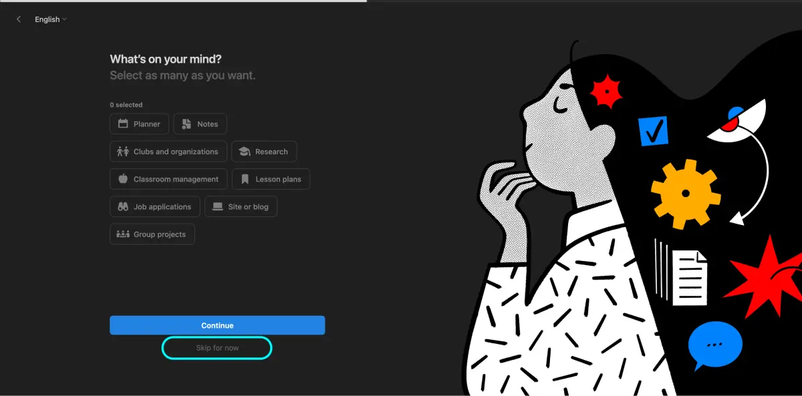

### Notion 的介面

我們來看一下 Notion 的介面。在左邊的選單你可以看到最上面是你的 Workspace（我的是 EM's Notion，你可以到設定改。）你可以簡單理解成選擇你的帳號。如果其他人有共用給你他的帳號或創的組織內容可以在左上角做切換。我們先暫時待在自己的 Workspace 就好。

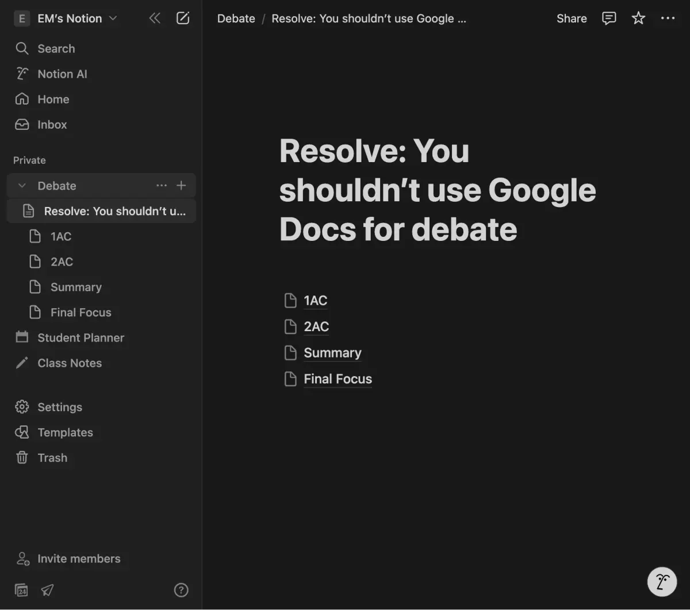

接下來往下你就可以把它當成一個資料夾來放各種檔案了。不同的是他不是實際意義上的資料夾，比較像是分頁或子頁面。比如說我們今天要準備英文辯論我們開一個頁面叫做 Debate，底下可以整理出你所有的辯論比賽經驗。你可以無限分頁開下去，這裡我簡單弄成一個常見的辯論架構。

## Markdown 語法

我們打開隨便一個頁面來開始編輯。你會發現沒有繁瑣的工具列，以及藏在很深層的選單，你打什麼出來就是什麼。原因是 Notion 是使用 Markdown 的語法來撰寫，你只需要加上一些簡單的符號就可以做出各種效果。

Markdown 是一種標記語言，你可以「簡單」想像成成一種程式語言。通常用於工程師寫說明文件，或是日常做筆記。你不要覺得聽起來很可怕，你看過基本上就會了。其實很多這些符號也是適用於 Google Docs、Word、甚至是 Apple 的備忘錄。

### 標題

首先是標題，你可以使用 `#` 來標記標題，`##` 來標記副標題，`###` 來標記小標題。這些符號的數量越多代表標題的層級越低。

```markdown
# 標題

## 副標題

### 小標題
```

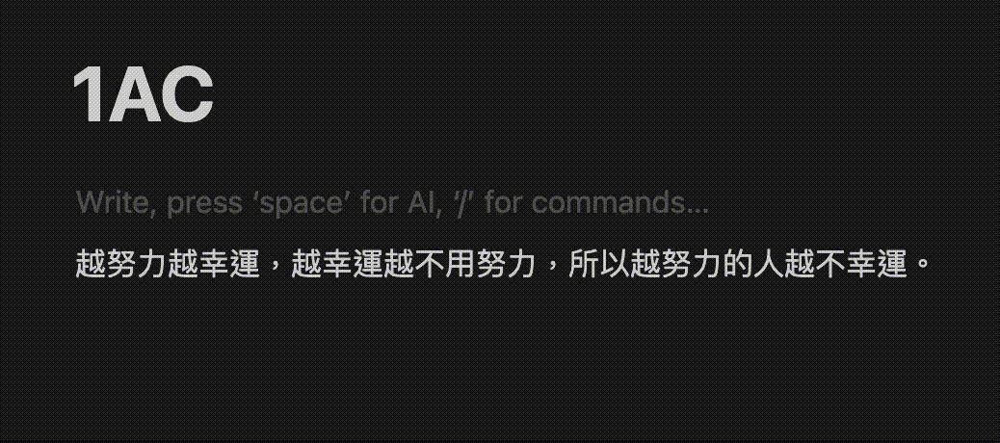

### 文字樣式

接下來我一次列出一些常見的文字樣式。如果你真的忘記了也不用擔心，你可以選擇文字就會出現一排選單，或是點擊 `/` 來搜尋選擇要的功能。

```markdown
_斜體_
**粗體**
~~刪除線~~
[] 勾選框
`code`

- 列表

1. 數字列表

---

分隔線
| 引言
```

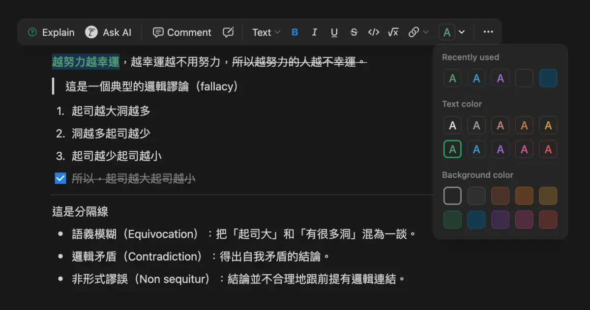

不過在文字樣式我通常會用快捷鍵更多，比如說選擇文字按 下 `cmd` + `B` 就可以變粗體，`cmd` + `I` 就可以變斜體。一樣，這些快捷鍵在 Google Docs、Word、甚至是 Apple 的備忘錄都可以用。

如果本本來就會使用 Markdown 語法的話，這裡唯一需要注意的是 Notion 的 quote 是用 `|` 而不是 `>`。因為 `>` 這個符號的意思是會變成可以摺疊的內容。我通常會用在很長的 Rebuttal 列表。

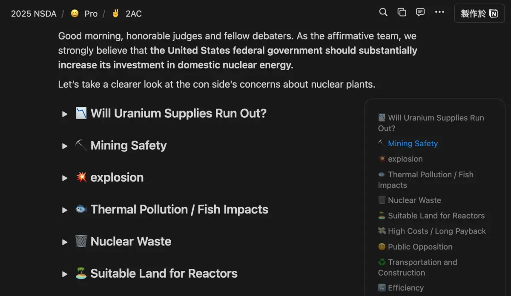

### 圖片 / 超連結等其他資源

複製，貼上，結束。

如果是貼上連結可以選擇要顯示的方式，你都可以點點看看你喜歡哪個。如果是要幫文字加上超連結你一樣可以選文字 `ctrl` + `K` 來貼上連結，或是 `ctrl` + `v` 在文字上就可以了。


## 資料庫

資料庫你可以簡單想像成就是一個 Excel 表格，裡面可以放各種資料。你可以選擇不同的視圖來呈現資料，像是表格、看板、日曆等等。比如說以下是我辯論的證據卡資料庫，裡面有各種不同的證據卡，還有分類、來源、作者、年份等等。

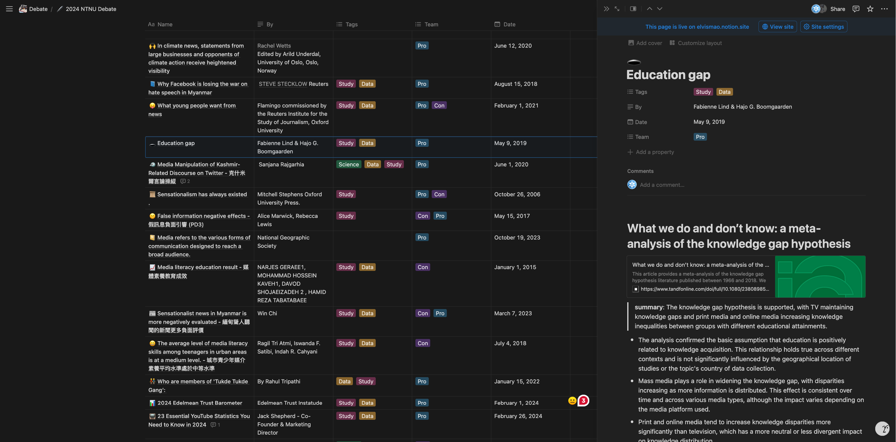

大多數情況我建議你可以選擇 inline, Table View 的 Database。

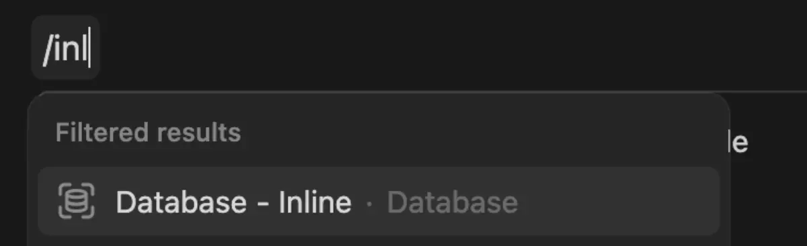

## 共享

接下來來講如何共享頁面給其他人。點擊右上角的 「Share」按鈕，輸入對方的 email 地址，然後選擇要共享的權限即可。同時底下也能設定成有連結的人都可以編輯或是檢視。相信用過 Google Docs 的人應該都知道怎麼做。

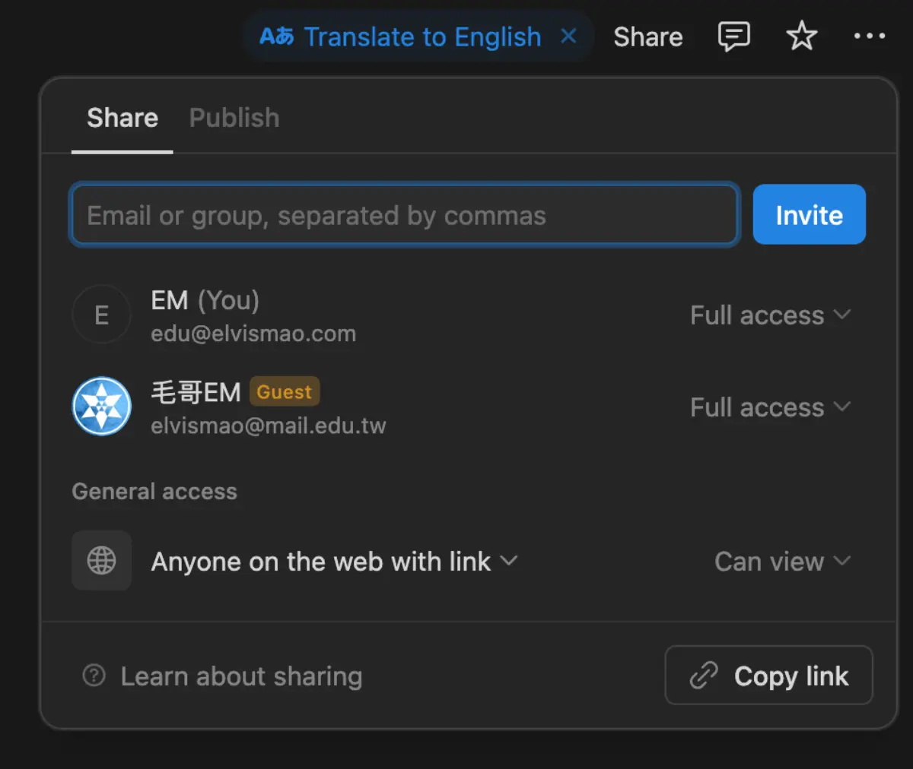

當你共用這個頁面之後裡面的分頁也會一併共用給對方。這樣你就可以把所有的資料都放在一個地方，然後跟組員一起編輯了。

這裡要注意他可能會問你是否要「Upgrade guest to member?」，**千萬不要，不然就是共用你所有檔案給他了。**這個功能只適合如果你是一個組織或社團要共用一整個 Notion Workspace。

## 設定圖示

我都會幫每個分頁（包括證據卡、稿）加上封面圖以及 emoji，這樣找稿會快很多，同時也可以給我很多[情緒價值](https://emtech.cc/p/furry-intro/)。像是去年同學找了很多看起來很 Rebuttal 的封面。

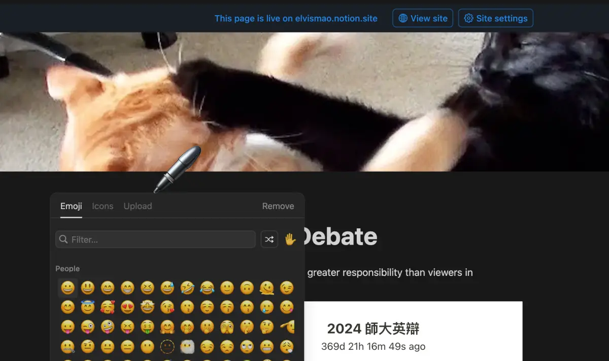

## 匯出

點擊右上角的三點選單，然後選擇 Export。這裡可以選擇要匯出的格式。通常印刷我會選擇 A4，然後縮放 80% 這樣字會比較小一點。出來的 PDF 大概長這樣。

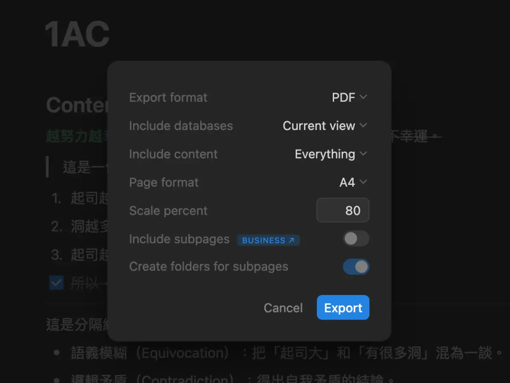

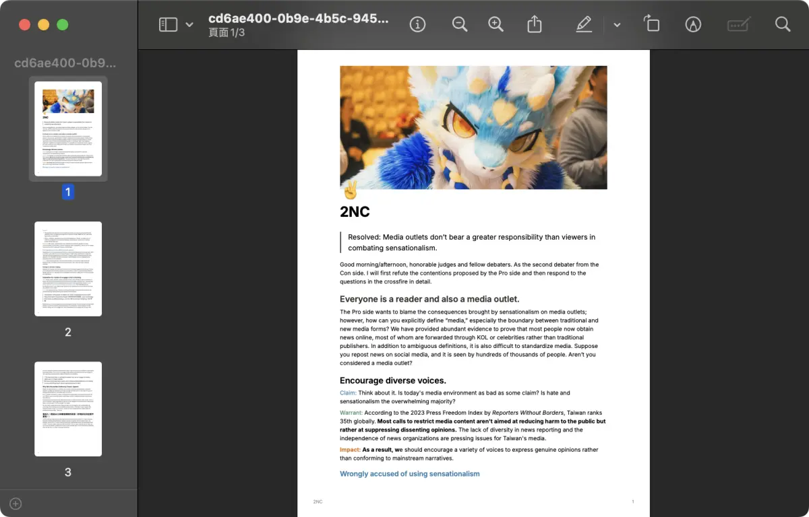

如果沒有付費的話一次只能匯出一頁，不過我寫了一個腳本來自動化批量一次輸出一個 Database 裡面的所有頁面並合併成一份 PDF，這樣就可以一次優雅的列印所有證據卡了。可以參考我之前寫的文章：[Notion 資料庫如何免費批量輸出 PDF，並且合併？](/p/notion-database)（不過裡面的程式有點怪怪的我這幾天檢查一下。）

## 其他資源

這裡有一些其他我打辯論會使用的小工具：

### 文本格式化大師

如果你從 PDF 複製文字下來你會發現格式會亂七八糟，這時候你可以使用我做的 [文本格式化大師](https://elvismao.com/code/format-text/) 來幫你處理。這個網站可以幫你去除多餘的空格、換行等等，讓你複製下來的文字變得乾淨整齊。

### 瀏覽器快捷鍵

你會發現當你習慣 Markdown 之後你的效率絕對會大幅提升，而且你幾 MB 的報告瞬間只剩十位數 KB。而如果你知道我們國小電腦課都學過的瀏覽器快捷鍵的話那你效率就更高了。比如說：

- `ctrl` + `K`：搜尋頁面
- `ctrl` + `T`：新增瀏覽器分頁
- `ctrl` + `W`：關閉瀏覽器分頁
- `ctrl` + `shift` + `T`：重新開啟關閉的分頁

以上是我使用 Notion 的方式。不過這些都只是我自己的習慣而已，重要的還是回到內容本身。希望這篇文章可以給你一些靈感。
