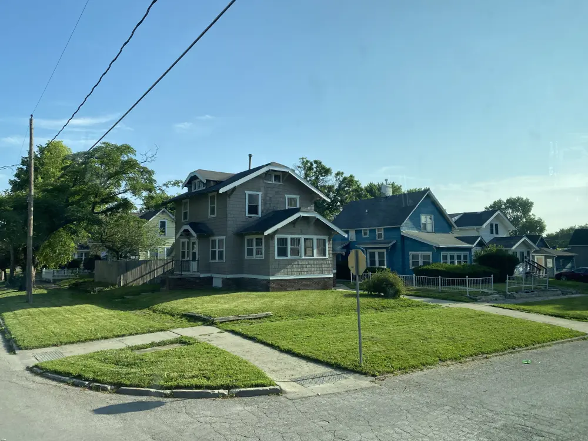
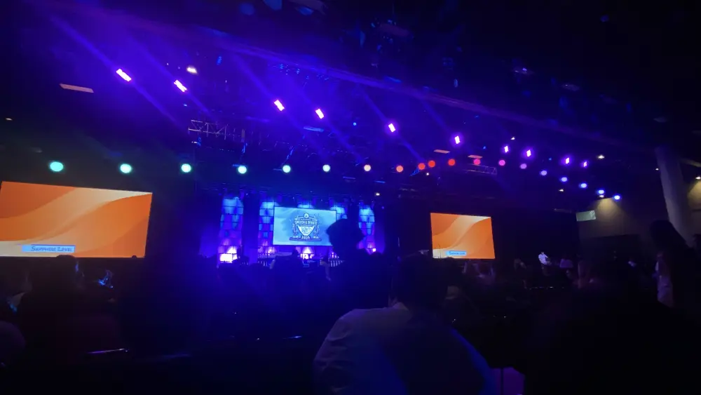

# 去美國辯論差點發生槍擊案？NSDA 2025 心得

這個月我們 5P.docx 代表台灣參與了美國全國中學生演講與辯論聯賽 (National Speech and Debate Tournament) 的 Worlds Schools 全國錦標賽。這是全球高中演講和辯論的最高殿堂，今年剛邁入 100 週年。這是我第一次去美國本土，以下是我過程中遇到有趣的故事：

> 如果你想直接看辯論和躁動的部分可以跳到 [NSDA 章節](##NSDA)。

## 搭飛機

這次的比賽在 Des Moines, IA（第蒙，美國愛荷華州的首府）。我們來回中間都需要轉機兩次，分別在 Seattle（華盛頓的西雅圖）和 Minneapolis（明尼蘇達的明尼亞波利斯）。

### Air Tag

我在桃園機場買了一個免稅的 AirTag，因為看到太多弄丟護照的故事，所以想說放一個在包包裡。這幾天雖然沒有弄丟，但因為比賽場地很大，有時候包包放在座位或是其他人那邊所以其實蠻有幫助的。

免稅店便宜了 50 塊，結果後來發現在美國超市因為匯率低所以其實更便宜。

我超級久沒搭飛機了，上一次應該是國一國二的事。以往都是跟著家人去，基本上跟著走就好了，但這次從買機票到實際搭都是自己處理，中間蠻多疑惑的。這次我們比賽的贊助商 Perplexity 送了三個月的 Perplexity Pro，一路上幫了我很多忙。

### 機票

現在機票都完全不用實體，用航空公司的 App 或是 Apple Wallet 都行，手機掃碼就可以直接進去了。去程他還有主動給我，回程他問我需不需要我就直接說不用。不用拿著一疊很長很難折的紙真的很方便，加上美國境內飛機都不用護照，所以整個都像搭高鐵一樣。

### 海關

海關小時候的印象都是要排很久，然後問題很多，但除了入美國時有被簡單問兩句掃個指紋以外其他都是走過就結束了，腳根本沒停下來。東西丟上去，走過，拿走。

出入境美國會有一個 3D 的掃描，其實就是那個金屬檢測器，不過他可以很精確知道那個金屬在哪。比如說螢幕顯示在我的右手上，就知道這是手錶所以放我走了。

出入境台灣海關都是掃描護照，拍張自拍照就可以過了。記得小時候就有看到這些機器但所有人都在排隊，但這次看絕大部分都是直接掃描自己過。不過因為我們老師 Mac 他美國護照弄丟了，臨時護照刷不過所以還是得人工排。

### Delta Airline

這次所有班次我們都是搭達美航空，今年剛好也是他們創立的一百週年。他們的服務真的很看個人，有的人服務超好有的就很兇很隨便。飛機餐...很抽象，小時候都覺得飛機餐很好吃但這次真的非常普通。

飲料他們沒有奶茶所以我要了一個盒裝牛奶，一杯茶，還有三杯糖自己加。很好喝。

從台灣到美國境內飛機會一台比一台小，每台的設施也不一樣。飛比較久前兩班都有螢幕，是一台 Android 機。回程還因為很多人當機所以集體重開機了 15 分鐘。

## 第蒙的街道

這裡的街道雖然有垃圾桶但路上真的很乾淨。而且不管建築還是招牌，甚至是賣房的廣告看起來都很有設計感。與中華民國街道美學行程鮮明的對比，我的鏡頭爛成這樣，邊走隨便拍都很好看，有種進入 [模擬市民](https://google.com/search?q=The+Sims) 的感覺。

第蒙的特色是建築之間的距離都很大，而且有很多的 skywalk 空中走廊，絕大部分的大樓都是串在一起的。連防火牆都超大，每個基本上跟台灣的巷子一樣寬。

因為這是很大的活動，所以從機場拿行李的地方、街道、甚至是旅館的玻璃上都有廣告。

### 公共自行車

這裡也有類似 YouBike 的公共自行車，不過密集程度非常低，很少看到。

### Single Family House

當然，有很多的獨棟 (Single family House)。因為這是這次其中一個辯題，我們花了很多時間準備所以很有感觸。

### Graffiti

不管是大牆還是小巷都能看到不少街頭塗鴉（Graffiti），但大多都很漂亮。

有趣的是經過一間學校他們的校門口的整片牆都被塗滿塗鴉和留言。

> "♥ yourself"

> "I like school"

> "It is FREE to be kind"

> "If you see someone without a smile, share yours!"

GPT 說這種塗鴉蠻正常且常見的，可能是校園活動。不過他們都是用粉筆所以是擦得掉的。

### YMCA

其中一天早上我們有去基督教青年會 (Young Men’s Christian Association)。原來 YMCA [不只是一首歌](https://www.youtube.com/watch?v=CS9OO0S5w2k)。純粹是因為裡面有手球桌，然後老師想秀一下，所以我們就進去玩了 15 分鐘。裡面有泳池，健身房等等許多設施和活動，有點像青年中心的概念。後來才知道原來台灣也有很多。

### Farmer market

第二天我們走在路上看到很多人在聚集，原本以為是遇到遊行，因為那天剛好全美在進行 [No Kings protests](https://zh.wikipedia.org/zh-tw/%E7%84%A1%E7%8E%8B%E6%8A%97%E8%AD%B0) 反川普遊行，不過後來發現只是一個農市而已。還好行程都沒受到影響。

## 食物

在美國的食物都很貴，都是餐廳，每餐花個四百多塊是非常正常的，因此聽說大多人不會外食。

貴就算了，但你至少把價格寫在上面吧。卡刷完之後突然多跟你收 **20% 服務費**，然後再加個稅，再加個小費（所有機器都是先刷再選小費）。不過份量都很大，我平常算是食量很大的人，不知道是我生病還是真的很大但幾乎每餐都會有點吃不完。

在第蒙不知道為什麼基本上所有店都有酒吧，供餐到八點，然後之後就只供酒，不過其實接近晚上九點天都還是亮的。

這次去美國我澄清了很多食物應該有的味道：

### 麥當勞

台灣真的比較好吃。薯條顏色暗又不脆，也不飽滿。台灣的點數不知道為什麼不能累積，如果不能通用的話幹嘛換一個國際 APP。

沒有麥脆雞，但有一些不同口味的漢堡。我點了一個不辣的勁辣雞腿堡，很普通，但很貴。勁辣雞腿堡或帕馬森都便宜好多但好吃很多。飲料有很多，但大多不知道是賣完了還是怎麼樣沒販售。鮮檸檬紅茶不錯。美國檸檬水跟培根真的很常見，幾乎所有地方都有。

麥當勞早餐美國豐富很多，我點了一個上下是鬆餅的豬肉滿福堡（台灣好像最近也有賣？），很好吃。

### 漢堡

在台灣大家常常會抱怨麥當勞漢堡越來越小，料很少。

但他至少好吃。在美國這幾天，尤其是 NSDA 提供的午餐：

- Hamburger：兩片乾扁的麵包，中間幾片火腿片。
- Cheeseburger：兩片乾扁的麵包，中間幾片起司片。

最後一天這樣還要自己付錢，11 塊美金。

要蔬菜？給你兩根芹菜。就真的完整的兩根，吃起來很新鮮，像是剛從土裡拔除來的。旁邊你可以自己拿美乃滋。

不過如果去好一點餐廳也是還不錯的漢堡，料很多需要先壓扁才吃得了。

### 薯條

薯條很多人都是不沾醬的，這裡要嘛爆鹹要麼完全沒味道。

台灣麥當勞的最好吃。

### Cane's

這是一個很好吃的炸雞店。他的炸雞都是沒有骨頭的雞柳，軟軟嫩嫩的。他們最有名的是他們的醬汁，具體味道我有點忘記但不管炸雞、薯條、麵包全部丟進去就對了。

然後不知道為什麼這幾天吃到的高麗菜都要切成細絲，然後弄成酸的。真的沒有很好吃。

### 奶昔

晚餐 Uber Eats 點快餐店 Arby's 的。好喝。綿密但清爽，不會有吃解凍冰淇淋的感覺。

### 汽水

很多飲料像是芬達、可口可樂、美粒果都有不同的口味，但都一樣難喝。簡單來說都是超爆甜糖漿水。

### 起司

起司是我最喜歡的食物，在這裡吃的很爽，很多東西都有，而且加的很多，幾乎每餐都有，甚至難吃的 NSDA 午餐都會副起司條。副餐我常常就直接選起司或起司通心粉。

### 培根

高一辯論課時老師說國外的培根比台灣好吃太多了，因為他們是拿我們拿來做滷肉的部位來做。事實上確實如此，有吃到很好吃，很多汁但又不肥的培根。早餐的培根跟想像中不同，是像是魷魚乾一樣乾扁而且很薄的，但也不錯吃。

### insomnia

這是一家連鎖的冰淇淋店。口味跟台灣好一點的冰淇淋沒有差太多，但更大更濃更甜更好吃，沒有很濃的化學味。可以選擇把冰淇淋夾在布朗尼或是餅乾之間，我是單獨吃就覺得很好吃了。

國小老師說 Häagen-Dazs 是超市最便宜，沒人在買的。

### 墨西哥捲餅

第二天老師點了 Uber 請我們吃 Taco Bell，類似墨西哥選餅的麥當勞連鎖餐廳。我點的是 Supreme® Luxe Box，裡面有 Burrito, Taco, Twist 和飲料。上一次吃墨西哥捲餅是小學五年級的事，真的很好吃，感動到要哭。

Baja Blast 很好喝，是他們家獨有的飲料。當下覺得喝起來很像 Mountain Dew 結果還真的是他們家改造的，他還有出能量飲料和酒精版的。

後來兩天交到的美國朋友跟我們說要吃那種看起來隔天就要倒了的小店，那種最好吃了。大該就跟台灣要阿麼把手放到湯裡味道才對是一樣的概念。最後一天晚上我們在 Uber 訂了一間獨立的小店 [Maria's Mexican Food](https://www.ubereats.com/tw/store/marias-mexican-food-douglas-ave/EQ9fcsWFXfuRDiTCW7T2OQ?diningMode=DELIVERY)，連圖片都沒放，跟 Taco Bell 差很多，簡單很多。我點了 Burrito & Taco，還有附一點 Mexican rice。Burrito 除了一點點青菜、起司、和其他料以外裡面全是炒得很香的炒牛肉，塞到快爆出來。

### 德式香腸

我是不確定在美國吃到的德式香腸道不道地，但跟台灣吃到的差很多。我和隊友 Jamie 點了六種不同的德式香腸套餐，每種都很特別，但又有點說不出來是什麼。有的很有香氣，有的是煙燻，有的吃起來像午餐肉。

### 日式料理

[Blue Sushi Sake Gril](https://www.bluesushisakegrill.com/)。很美式，很甜，擺盤也很漂亮，是我喜歡的風格。我點的是 Crunchy Red，炸蝦天婦羅 + 蟹肉 + 塞拉諾辣椒 + 酪梨 + 甜菜天婦羅脆片壽司 + 鰻魚醬，跟 Costco 的有點像，很好吃。

### 牧羊人派

就一坨東西，沒有很好吃。這家店我們來的時候大概下午兩點，大家都很餓，三點老師還要回去評審訓練。但我們等了大概一個半小時才送上來，而且每個人的都很難吃。

### 中式料理

在機場吃了一次，然後中間去吃了 Panda Express。

店員看起來都像中國或是不知道哪國來的大媽。吃起來很難受，沒有到難以下嚥但這完全不是中式料理。看得出來很努力的想模仿但完全不像。

Panda Express 還不錯但橘子雞我真的不行。你就想像是糖醋排骨沒有醋，然後換成雞。又軟又不香，就是滿滿的死甜還有...橘子味。

炒飯我吃到的都不好吃，又冷又軟。牛肉炒麵也完全是甜的。

吃了之後你會更想家。因此如果你在美國想念家鄉的味道建議不要去吃中國菜。

## 水

在美國很難找到不冰的水，老實說連乾淨得水都很難找。

旅館、機場、學校都會有飲水機，都是「冰水」。唯一有熱水的地方是在我們中間住的旅館裡面的健身房裡面有一台小小的有熱水的飲水機，讓我這個感冒的人能活著撐過一整個禮拜。

他們的飲水機冷水也都很難喝，查了一下才知道原來飲水機出來的也是自來水！可以喝嗎？可以，但好不好喝是另外一回事。很多的飲水機後面都會有很大的廣告，仔細看才會發現是濾芯水壺。說可以移除塑膠微粒、細菌和其他東西。覺得飲水機水很難喝？這裡有解決方案。如同你去遊樂園門口有保險廣告。

看到之後很難受，我跑去廁所喝了一口洗手台的水看看，結果比飲水機還好喝。

更難受了。還好已經在機場要回台灣了。

## 旅館

旅館的早餐都很好吃。有麥片、燕麥、Begel、吐司、司康、歐姆蛋、香腸、早餐培根、肉餅、牛奶、巧克力牛奶、優格、果汁、咖啡、茶等等。

巧克力牛奶我會拿一兩瓶到樓上，這樣可以用房間的微波爐加熱晚上喝熱可可。

打掃房間的中間都沒來，就算有放「請打掃」的標誌，有跟樓下櫃檯講。後來我是把垃圾都放在門口，結果他們到倒數一天才來稍微一點點打掃。就是換個毛巾鋪個床就走了。

## NSDA

來講講辯論。

### Day -1 ~ 0

我們在比賽兩天前就先到美國了，比大多數人早到一天。除了可以調時差以外也可以逛逛，以及趕稿，同時也避開了很多的人潮。第一天、最後一天、和中間住不同的旅館，因為中間的是 TAS 幫我們一起訂的。

我們花很多時間在旅館準備。因為後來人越來越多，有一個少棒的球隊也在那個旅館，所以整個大廳很吵。後來我們大家一起跑去健身房寫稿，剛好晚上沒有人。就這樣寫一下，累倒的睡一下，就這樣我們把稿子的架構大改了一遍。

我們參加的賽事叫做 World Schools Debate，至少要打 6 場。其中分別是一個辯題會打正反兩方，一個辯題會當場抽正反方，還有三個即席賽。即席賽會在比賽前一個小時把正方跟反方關到兩個不同的體育館，然後一一點名，最後公布題目和 info slide（辯題資訊，名詞解釋）。過程中不能使用任何電子設備或是翻自己的筆記，只能用紙本字典、單卷百科、或是年鑑（Almanac）。一個小時後就會各自去比賽的場地比賽。

> 延伸閱讀：[World Schools Debate: 不只要證據，我要你解釋為什麼](https://emtech.cc/p/debate-wsd)

在比賽的前一天在主會場 Expo 有攤位擺攤。有一些組織、企業、大學辯論社團、或是大學來來招生。像是哈佛大學、國家地理頻道都有來，我拿了很多的貼紙。

### Day 1 ~ Day2 - 電影裡的高中

第一天到第二天我們在 East High School (Des Moines, Iowa)。這就是一間很像電影裡會看到的美國學校。有好幾棟，結構很複雜，所以很容易迷路找不到路。因為幾棟大樓之前是用走廊連起來，但是他們的每層樓不一樣高所以你現在在三樓，你可能要往上走樓梯才會到另一棟的三樓。而且每層樓裡面的指標都很不明確，廁所也很難找，都要一直繞。

### Day 3 - 老虎高中

第三天因為 World Schools 打到一個段落了所以我們開始打 Extemp Debate。場地在 Valley High School，吉祥物是老虎。整間學校的的設計很有創意，很漂亮。他們的福利社叫做 「Tiger Perk」，看起來有種籠子的感覺。

午餐一樣很簡陋，但是今天的蔬菜有菜還有蕃茄可以包在漢堡裡，加上點番茄醬或美乃滋還不錯。

> 延伸閱讀：[Extemporaneous Debate - 台上兩分鐘，台下半小時](https://emtech.cc/p/debate-extemp/)

很多人抱怨網路很爛但我用 [fast.com](https://fast.com) 可以跑到三四百。不理解。準備過程可以上網，而且我們這次的贊助商有 Perplexity，幫了很大的忙。很好笑比賽準備時間到一半這次活動用的 App 跳出通知說「歡迎用 Perplexity 查資料喔！」他們贊助的主要是 Nats25 Guidebook app，簡單來說就是 [OPass](https://opass.app/)，或是再簡單點就是線上 PDF。

### Day 4 - 狼狼高中

最後兩天已經是半決賽和決賽了，我們已經沒事了，就是到處看比賽玩。我們先是到了 North West High School。這間學校真的超漂亮，超有設計感，是那種如果我進這間學校我每天都會想認真讀書的。網路跑起來有 780 mbps，很讚。他們的吉祥物是狼，還蠻帥的。

學校外面也很漂亮，是一個超大的湖泊和公園。對面還有一個 Playgound，非常好玩。

我們在這裡看了中國打了複賽跟半決賽，真的很好看。我很喜歡他們的風格，很風趣，專業，聽起來也很舒服。他們很常會拿自己中國當例子，講到任何人權或政治問題都直接拿自己出來狂罵，聽起來很有說服力。

到了下午之後我們就打算回到 expo 主會館，因為下午有一些 speech 的比賽項目已經在比決賽了，有一些很有趣的站立喜劇 Humorous Interpretation（幽默詮釋）和 Duo Interpretation（雙人詮釋）因此我們就搭巴士回來了。因為我們忘記跟司機先說所以他是把我們先載回旅館然後再載回去。下車往會場走的時候發現有一群人在往外跑，看起來像是在玩所以我們不以為意，結果越來越多人開始往外衝。我們發現不對勁了，於是跟著走，然後一邊問：

「嘿我們在跑什麼？」

「裡面有一位射手！」

#### National Shoot and Defense Competition

好吧我們看來真的該跑一下。不過我蠻冷靜的~~因為這太符合我對美國的刻板印象了，在電影裡的話這根本不算什麼吧~~，但大部分的人都怕爆。路上有一位老師因為趕著逃出來連鞋子都沒穿，她哭的超大聲超難過因為她完全聯絡不上她的學生。

後來在前面的路口右轉後看到了一間像工廠的公司，我們跟外面的人員說明了情況，他讓我們進去公司裡面躲一下。進去之後才發現這是一間保全公司，而且他有會場裡面的監視器錄影帶。等待警察來確認沒事之後我們叫了一輛 Uber 回家，結果沒想到那台車快到時看到情況就取消離開了，所以我們只好再叫一輛等十五分鐘。幸好後來都平安無事。當天後來的比賽就都延期到隔天舉行。

聽朋友（這幾天認識的新朋友）講他們當時的情況是在幽默註釋的決賽時有一個人突然走上台然後講 "Knock knock!“，然後台下有觀眾，嗯就是我們其中一個朋友回 "Whose there?"，因為他以為是表演的一部分。然後他說：「你想聽炸彈的聲音嗎？」，接著把手放進塑膠袋裡。這時有人大喊「快逃！」，然後大家就開始往外衝。

後來才知道這個人身上跟本沒有武器，只是嗑了藥在鬧。而且他也是演講者，以前還拿過幾次獎。

### Day 5 - expo

隔天的活動正常舉行，不過就是昨天下午的決賽被擠在一起同步進行。能看到各個項目的頂尖對決真的很有趣，這幾天一路能看到每個地區的人有不同的文化，不同的表達方式與風格，也認識很多新的賽事。Debate 的大多都看過，各種國會式（Congressional）的、世界學校（WSDC）、公共論壇（PF）、政策性（Policy）、林肯-道格拉斯（LD）等等。Speech 就很有趣了，有一些我有看到，有一些是上網查或教練說的：

- Informative Speaking：資訊演講，就是上台報告。
- Humorous Interpretation：幽默註釋，改編別人寫的故事。
- Dramatic Interpretation：戲劇詮釋，通常後面都很難過。
- Program Oral Interpretation：節目口頭詮釋，需要把至少兩種不同文學體裁（散文、詩歌、戲劇）混在一起談一個主題。
- Duo Interpretation：雙人詮釋，雙人喜劇。但我是覺得還好沒有很好笑。
- Original Oratory：原創演說決賽。

然後還有一些補充賽事（就是輸了沒事可以比的）：

- 說故事決賽 Storytelling
- 解說演講決賽 Expository
- 詩歌朗讀決賽 Poetry Reading
- 即興演講決賽 Impromptu
- 散文朗讀決賽 Prose Reading
- 評論決賽 Commentary
- 原創口語詩歌決賽 Original Spoken Word Poetry
- 即席辯論決賽 Extemporaneous Debate
- 大問題辯論決賽 Big Questions Debate

我在去美國之前我在我的筆電上面貼了中電喵和 GitHub 的貼紙。一方面是覺得 Coder 跑去這種地方蠻有趣的，另一方面是因為基本上所有人都用 MacBook 所以也比較好辨認。結果沒想到在某一場（應該是 PF）的決賽看到其中一位辯士的筆電上也有 GitHub 的貼紙。在 Perplexity 的信件上面也有提到他們很多的業務、產品、甚至是工程團隊以前也很多是辯士。

## Day 6 - Wonderland

比賽完之後我們還有多待一天。我們去了 Wonderland，是在附近的一間遊樂園。如果是這次 NSDA 的參賽者的話可以有優惠。這應該是數一數二好玩的遊樂園了，有很多好玩的雲霄飛車，然後也有水樂園。在路上本來我是想分享我的位置給我們幾位朋友，結果因為英文名是一樣的所以我不小心分享給這幾天認識的美國新朋友。正好他們也在那邊玩，所以我們就一起玩了一天。雲霄飛車有一些因為風速太快的關係所以玩不到，但我們已經玩到兩個了，很好玩。

我們很多人都有帶泳衣但沒有想到會下水所以放在行李箱，因此女生穿牛仔褲所以有買泳褲，一群男生就把衣服脫了就衝下去了。我們玩了很久的漂漂河，然後體驗了一些看起來很可怕，應該有四層樓高的直線滑水道。看起來很可怕但所有人都要去你也不敢不去，但實際上其實還好沒有到那麼可怕，非常好玩。

晚上在旅館我們和老師 Mac 在玩 GeoGuessr。我們都知道他很會玩，甚至在 NSDA 台灣賽練習的時候他也在玩。我從他那邊學到很多的技巧。也透過這個方式更理解美國各個地方的自然景觀。

## 商店

接下來講一下商店。我們有去一些超市和...加油站。

在美國和台灣不太一樣的是便利商店不常見，而且都是各品牌很獨立分散的。有趣的是很多加油站會有他們自己的便利商店，而且裡面甚至有賣現煮的熟食，像是捲餅，pizzs 等等。我們去的是 Casey's，我也順便買了些零食。

對了他們的加油站不會寫 95、98，會寫 Super (Premium, 約 98) / Plus (Mid-grade, 約 95)。就算看到 87 / 89 / 91 是 RON 與 MON 的平均值（AKI），和台灣的辛烷值標準不同。而且我們去的這家就只有兩種油：Super (98) 還有 Diesel（柴油），柴油甚至比汽油還貴。

我們去到的超市很大，基本上感覺像是 Costco 的大小，但賣的東西大概就是全聯會賣的。然後還去 Target，感覺像是一間 Costco 和 IKEA 融合在一起。就是什麼都賣，衣服，日常用品，電子產品等等什麼都有。

還有去一間叫做 Dollar Tree 的一元商店，以前叫 Only $1.00。就是一間比較小的小北百貨的概念，所有東西都很便宜。我買了一副一塊錢的迷你 UNO。

## 心得

能夠有機會參加這次的全國賽真的十分意外，也是一段難得且珍貴的旅程。畢竟即將進入大學主修資工，下次辯論不知道是什麼時候。這三年來的努力，最終能踏上這個被譽為國際最高殿堂的舞台，與世界各地最頂尖的高中辯手交鋒，實在感到無比榮幸。

能親眼見證那些曾經學到的技巧在實戰中被靈活運用，如何讓論點更具說服力、如何從立場中找出縫隙反擊，以及如何一本正經地胡說八道。

感謝我最愛的母校西苑高中，感謝 Tr. Terrence 和 Fullbright Taiwan 的全力支持，感謝 Taipei American School 的 Mr. Cook、Mr. Williams 還有 Mac，給予我們幾個月免費又紮實的訓練，更在比賽現場全程照顧我們。當然也要謝謝我的隊友們：Jessica、Ben、Jamie、Joanne，大家都投入了大量時間和各自的專業，才成就了今天的我們。

回到台灣，依舊忙碌。這篇文章回來了一個多月才寫完。

早餐買了一個早安美芝城的卡拉雞腿堡。

嗯，這才是真正的漢堡。

