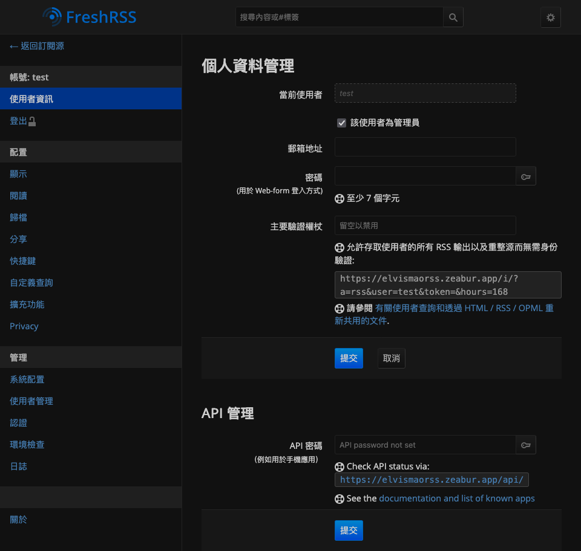
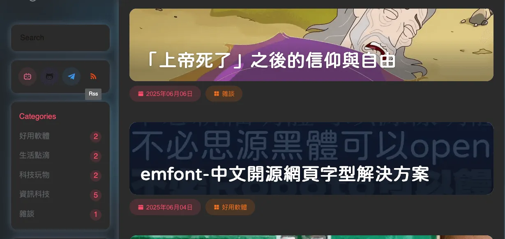

# 你應該開始使用 RSS！Zeabur + FreshRSS 架設教學

在這網路世代大多數的人都離不開社群媒體，只能被動式的接收演算法所提供的內容，不管是娛樂還是新聞。但我身邊的朋友都知道我明明是一個走資工，整天搞網頁和最新科技的人，但幾乎不會滑 Threads 跟 Instagram。那我是如何接收這些資訊以及朋友的動態呢？那就是 RSS 和電子報。

## 什麼是 RSS

首先先來簡單介紹一下。RSS（Really Simple Syndication）是一種資訊訂閱格式，它讓你可以即時接收網站的新內容，而不需要每次都手動去檢查網站是否有更新。只需要一個 RSS 閱讀器你就可以訂閱新聞網站、部落格、YouTube 頻道、Podcast，甚至論壇和 GitHub 專案，讓所有更新集中顯示在同一個地方。基本上你想得到的平台全部都有支援 RSS，沒有的話也可以使用 [RSSHub](https://rsshub.app/) 這個工具來訂閱。

簡單說，RSS 就像是你的 email，每天幫你把世界上你在乎的內容一條條整理好、排隊送到你面前，不被演算法干擾、不被廣告包圍，你只需要關心你真正想看的東西。

> 過陣子有空我會再寫一封關於我是怎麼用 email 的文章，不過應該是很久之後，而且內容應該蠻複雜的。

## 為什麼我要用 RSS

我會使用 RSS 主要有以下幾個原因：

- **不被演算法控制**：避免被社群平台控制資訊來源。我只看我在乎的新聞，我只看我信任的來源。
- **不錯過重要資訊**：我可以訂閱我的校園公告，這樣就不用每天上校網查，還不小心錯過補考和重補修時間。
- **訂閱制自由**：自己決定看什麼、看多少、什麼時候看。
- **All in One**：我所有想看的內容都在同一個畫面，在有限的時間我可以快速決定我要看哪些內容，也知道哪些我看過。
- **心情不會受網路風氣影響**：Threads 在吵什麼都不關我的事，反正我的備審都是寫真的。
- **內容品質篩選**：身邊很多朋友都有自己個人 blog，而一篇文章的品質和完整性大多都比你隨手發的推文和串文高。
- 如果你是自己架設的話，資訊更私密、更可控。
- 沒有廣告，永遠免費。

簡單來說，我可以決定我要看什麼。

## 好用的 RSS 平台

這裡列出幾個有名的跨平台 RSS 閱讀器：

- [Feedly](https://feedly.com/)
- [Inoreader](https://www.inoreader.com/)
- [The Old Reader](https://theoldreader.com/)

他們都不錯用。不過畢竟人家也有成本，這種線上服務大多需要付費，免費版都有許多限制。我使用的是 FreshRSS 部署在 Zeabur 上面來訂閱，而在手機上使用 Fluent Reader 來看。如果你沒有同步需求的話也可以直接使用 Fluent Reader 電腦版或其他的平台來看。

像是我的朋友 Each 是使用 Newsboat 來在電腦用 CLI 訂閱：


## 使用 Fluent Reader（單獨）

首先先來講如何單獨使用 [Fluent Reader](https://hyliu.me/fluent-reader/) 來訂閱，不過只有電腦版能這麼做，手機版需要連到其他伺服器。

你可以直接從 [GitHub](https://github.com/yang991178/fluent-reader) 或是其他平台下載。

- 電腦：可以從 [App Store](https://apps.apple.com/app/id1520907427), [Microsoft Store](https://www.microsoft.com/store/apps/9P71FC94LRH8?cid=github), 或是 [GitHub](https://github.com/yang991178/fluent-reader) 下載。
- iPhone: 可以直接從 [App Store](https://apps.apple.com/app/id1549611796) 下載。
- Android: 可以從 [GitHub](https://github.com/yang991178/fluent-reader-lite/releases) 免費下載，或是從 [Google Play](https://play.google.com/store/apps/details?id=me.hyliu.fluent_reader_lite) 商店用 $1.99 美金支持作者。

這裡我用 Mac 來示範，打開來是空的，點擊右上角的齒輪設定。


我們輸入毛哥 EM 資訊密技的 RSS 網址：<https://emtech.cc/rss.xml>


點擊左上角返回之後就可以看到我所有的文章了。


> 我得部落格縮圖在逐漸往動物園發展

有的部落格可以直接點開來閱讀，有的則需要你連接到他原始的網站（如 YouTube）。以我的部落格為例，前五篇文章會可以點開，而更舊的則需要回到網站來查看。


可以直接在 RSS 閱讀器閱讀的文章畫面會十分簡潔，不會有煩人的彈出式廣告（對不起。）

## 架設 FreshRSS

[FreshRSS](https://freshrss.org/index.html) 是一個免費開源 RSS 閱讀器，支援多帳戶、OPML 匯入、外掛與主題等許多功能。很輕量，使用起來非常好用，部署起來也很簡單。


### 使用 Zeabur 架設 FreshRSS

Zeabur 是一個非常好用的部署平台，可以不用寫程式用手指按一按就完成部署。

這裡我們直接點開 [Template](https://zeabur.com/zh-TW/templates/MD4TRW) 然後點擊部署。如果你有 [註冊過帳號](https://zeabur.com/referral?referralCode=Edit-Mr) 的話直接選擇你的伺服器即可。


接下來等個十秒就部署完成了，如果你想要的話可以自訂網域。


### 初始設定

進入之後你需要進行一些初始設定。


- 選擇語言並點提交
- 給他檢查確認安裝成功點下一步
- 資料庫類型可維持 SQLite 並提交
- 設定你的帳號密碼
- 完成安裝

完成設定之後他會請你重新登入。

### 添加訂閱

我們點擊左上角的 + 號來添加一個訂閱項目


這裡我建議大家可以先創立一個分類，比如說科技，生活，Podcast 等等。接著我們來加入一個訂閱源，一樣拿毛哥 EM 資訊密技來當範例。

輸入網址並點擊新增：


接下來他會讓你輸入一些自訂選項，像是標題等等。通常直接點擊下方的提交即可不用做任何設定。


這樣你的 RSS 就設定完成囉。如果你想要和其他朋友分享可以在設定裡面新增其他使用者。

## 使用第三方閱讀器讀取 FreshRSS 的內容

FreshRSS 支援 Google Reader API，讓你可以使用第三方的閱讀器來閱讀。比如說我在手機上都會使用 Fluent Reader 來閱讀。

### 開啟 API 功能

首先我們需要先在 FreshRSS 上面開啟 API 功能。請到「設定 > 驗證」開啟允許 API 存取，並點擊提交儲存。


接下來請你在「使用者資訊 > API 管理」設定一個 API 密碼，建議可以直接使用跟登入密碼相同的。



### 連接 Fluent Reader

這裡我使用 iPhone 為例，其他的平台方式也類似。

選擇 Google Reader API，並依序填入 Endpoint 以及你的帳號密碼。

- Endpoint: `https://你的網域/api/greader.php`
- Username: `你的帳戶`
- Password: `剛才設定的 API 密碼`


這樣在首頁你就可以看到所有你訂閱的文章囉。

## 怎麼找 RSS？

### /rss

部落格或一般網站通常會把 RSS 放在 `/rss`，如 <https://www.iach.cc/rss.xml>。

### 找按鈕

很多網站你會看到 RSS 的 Logo，點擊進去之後就是 RSS 網址了。



### 從 HTML 搜尋

有一些網站的 RSS 藏得比較深一點或是根本沒寫，這時你可以點擊 F12 打開開發者工具搜尋 RSS 來找到。

比如說 Apple Newsroom 的 RSS 是：<https://www.apple.com/tw/newsroom/rss-feed.rss>


### YouTube

YouTube 的 RSS 網址是：

<https://www.youtube.com/feeds/videos.xml?channel_id=頻道 ID>。

頻道 ID 可能是網址後面那一段：

<https://www.youtube.com/channel/UCksDP7GImFEZyAIwJk_QxLw>

中的 `UCksDP7GImFEZyAIwJk_QxLw`

也有可能你需要自己從 HTML 或用網路上的工具找。

比如說如果你看到的網址是：

<https://www.youtube.com/@妙妙男爵>

那你可以從 HTML 中直接尋找 RSS，就可以得到 RSS 網址了。

```html
<link rel="alternate" type="application/rss+xml" title="RSS" href="https://www.youtube.com/feeds/videos.xml?channel_id=UCksDP7GImFEZyAIwJk_QxLw" />
```

### Podcast

Podcast 本身其實就是 RSS 網址，只不過你平常習慣使用 Spotify、Apple Podcast 這些幫你整理好的「RSS 閱讀器」。如果你想要自己訂閱的話你可以 Google 那個 Podcast 的名稱，找到他部署的平台的頁面，就可以找到 RSS 網址了。

比如說博恩的 Podcast 博音是部署在 Firstory，上面就直接有 RSS Feed 的連結。


### 其他

想要訂閱其他的網址找不到的話可以到 [RSSHub](https://rsshub.app/) 的說明文件看看他們有沒有整理出來，或是你也可以直接部署使用這個爬蟲工具來訂閱。

## 總結

還記得以前 YouTuber 還會說訂閱開啟小鈴噹的時代嗎？現在 YouTube 根本不管你有沒有訂閱誰，只會推給你他想給你看的內容。RSS 是一個從 1999 到現在已經出現 26 年的東西，以前的人是沒有選擇只能用 RSS 訂閱，現在也許許多年輕人不知道，或著你也許以前沒有找到好用的方法，那希望這篇文章對你有幫助，讓你可以重新奪回資訊的掌控權。
