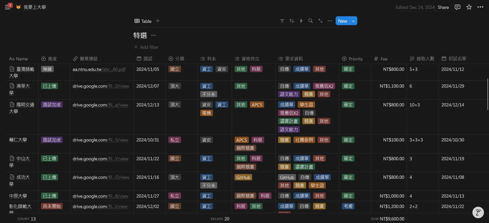
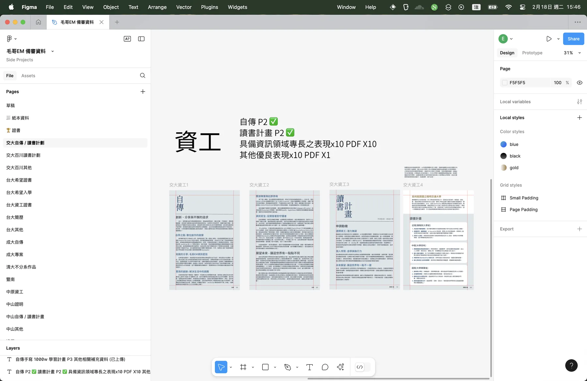
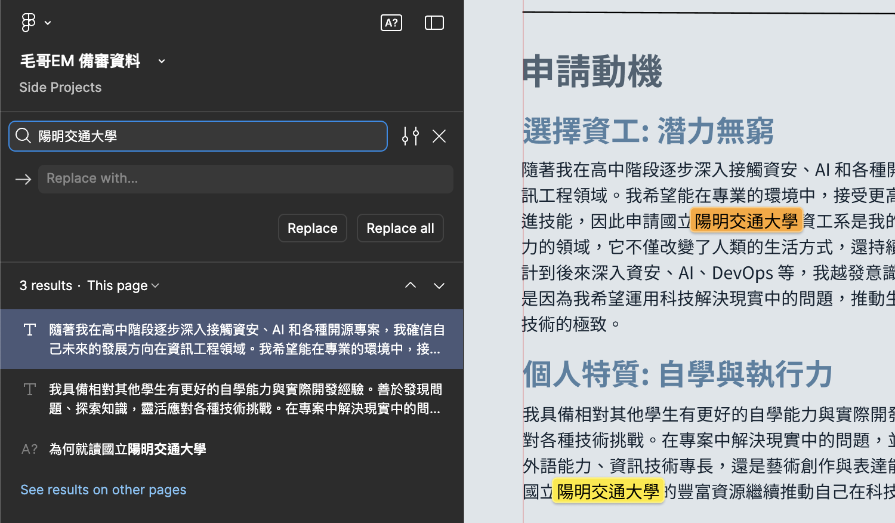
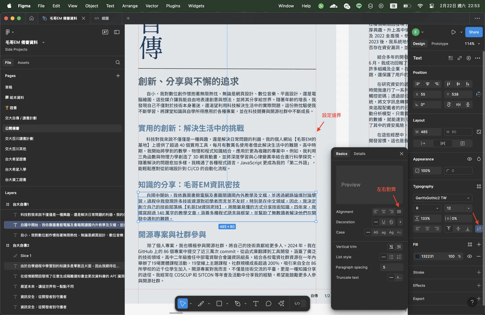

# 特殊選才備審資料／學習歷程檔案怎麼做？

特選終於到一個段落了，靠著我的備審也是混進台大面試、正取交大，今天我想要來和你分享一下我自己製作備審的心得還有一些我自己的小技巧。雖然我做的是特殊選才的備審，但這個方式與邏輯同樣也適用於學習歷程檔案或是任何的報告。

{{notice}}

也許你想直接下載我的備審資料？

此公開版備審資料由毛哥EM設計與製作，以 CC BY-NC 4.0 姓名標示─非商業性 4.0 國際授權釋出，供後輩們參考。轉貼時請標註來來源，並請勿擅⾃作為商業使用。由於每間學校的要求不同，此公開版本由個學校的資料整合而成，且並非完整版本，請自行依照各校要求調整。

下載連結：[毛哥EM備審資料-公開版](https://cdn.emtech.cc/em/%E6%AF%9B%E5%93%A5EM%20%E5%82%99%E5%AF%A9%E8%B3%87%E6%96%99.pdf)

{{noticed}}

## 我使用的工具

我先使用 Notion（Word / Google 文件）打草稿並與老師討論，再使用 Figma 進行排版。[pdftk](https://emtech.cc/p/pdftk) 用來合併分割 PDF，然後你很有可能會用到一些 PDF 壓縮工具。如果你不怕你的身分證那些的外洩的話可以直接使用線上工具，[iLovePDF](https://www.ilovepdf.com/zh-tw/compress_pdf) 跟 [Adobe](https://acrobat.adobe.com/link/acrobat/compress-pdf) 的線上壓縮工具都不錯，你可以都試試看。

### Notion

簡單來說這是我的備忘錄。這個工具我在我的備審心得：[專案仔上交大？2025 資工特殊選才完全指南](https://emtech.cc/p/srecruit) 裡面就有提到我是怎麼在特殊選才中使用的。像是整理各個學校的報名資訊、時間線等等。那麼在備審方面平常我經歷各種活動的筆記跟心得都會留著，這樣比較好寫履歷。同時在寫申請動機等等的時候建議你要先去校網或論壇搜集資料，這時候就可以先把資料放在 Notion 上。

> 我現在已經從 Notion 轉移到自己架設的 Affine 了，但一般使用我還是比較推薦 Notion，也有人喜歡用 Obsidian。如果你要用 Google 文件比較習慣也行。

### Figma

Figma 是一個 UI 設計師們很愛用的強大設計軟體，跟 Adobe Illustrator 類似，你可以理解成專業的人使用的 Canva。我自己因為平常用的很習慣所以使用。因為是設計軟體所以處理這種非常多頁，非常多東西的資料很方便，很直覺，周圍空白也都可以給你拿來做筆記。在備審製作方面除了工具直覺強大以外，分頁管理，留言討論，用瀏覽器就能開，一鍵匯出 PDF 也很方便。

{{notice}}

小提醒

這次在申請特殊選才的時候有遇到成大因為系統又老又醜又難用。有一些軟體輸出的 PDF 雖然可以上傳但合併會有問題（應該是套件太老的關係）。如果遇到的話打電話或是寫一封 Email 跟他們說就可以了，教務處小姐是出了名的跩但他們會幫你處理。

{{noticed}}

## 怎麼做出好備審？

做學習歷程檔案的說明跟教學大家應該從國中一直聽到高三，平台多難用大家應該也體驗過。這裡那些大家都知道的流水帳我這裡就不贅述了。這裡我就簡單列一些我自己會特別注意的事。

### 文案方面

很多人在特選時會遇到明明覺得自己的專案很厲害，甚至是比賽成績也很優異但是連複試都進不去的窘境。從前人的經驗也可以大量看出專案仔在特選有多麼不吃相。

> 通常在高中年紀做的作品——比如自己寫的內核、寫的網站服務、寫的系統，都是垃圾。教授早已閱歷無數，你引以為傲的作品，可能對他們來說就是 print("Hello, World") 而已。除非你的作品真的很知名——就比如說你造出了一個每個月使用人次高達 10 萬的東西，要不然說實話，你只是證明「你對這個領域有很淺薄的研究」——但一點都不特殊。所以既然大家都是菜雞，那教授要怎麼選出「特殊」的？當然是量化下來的能力。不要看不起 APCS 還有一堆競賽：這個是你唯一可以拿來說嘴的了。 —— [Pan in the Nutshell 特殊選才踩雷心得](https://blog.pan93.com/posts/srecruit-opinions/)

但你可以以我的經歷來看，高中生主流的大比賽我大多~~懶得參加~~沒什麼亮眼的成績，APCS 我只有三級分（因為後面兩提交反答案）一樣一堆學校正取，一個 CTF 競賽都沒得獎，甚至是進入複賽過，但我能得前十進入台大資安面試。

> 額，還是因為我做了一個一個禮拜就有十萬人使用的[心理測驗](https://www.youtube.com/watch?v=WbUWv8FEPLA&t=0s)？

你的作品和經歷其實是有機會的。只是你要能夠正確的表達自己的優勢，讓教授看到你的價值。

#### 思考教授在乎什麼

教授不會在乎你的血型、星座等等資料。Instagram..._這我不確定，他可能會想做些學術研究_。我想說得是你在撰寫文案時要能凸顯你的優勢，你的個性如何？你有什麼不同？為什麼要選你？

你可以從自傳和其他地方塞各種教授可能會感興趣的問題來寫。當然這也說明了你一定要透徹了解你的備審內容，還有要先想好教授可能會問的問題，以及你的一些觀點。

> 我的台大面試：「你說你結合多年的開發經驗與生成式 AI 技術讓我迅速掌握了多種資安漏洞的特性與風險。請問你是怎麼做的？」

#### 量化成果

將你的成果量化。比如說參加了一個比賽你可以寫你的成績，做出了一個網頁你可以說有多少人使用過。這樣比較容易讓人理解你的能力。讓你的這次經驗有意義。

#### 不要太多頁

延續上面說的，教授要看的資料很多，時間有限。自傳建議兩頁，活動專案最多也不要超過 15 頁。如果你的專案很多，可以選擇性的放一些，或是用一些簡單的圖表來表示。

### 不要寫錯學校

**這個超級重要！** 因為如果通常一份備審需要送好幾間學校，送之前一定要檢查一下整份文件裡面有沒有提到任何錯誤的學校名稱。建議你可以直接搜尋「大」、「大學」、「國立」這些*敏感*的關鍵字。

### 好好講中文

都高三了，請好好講中文。無論是在寫備審還是寫電子郵件時請自己檢查一下，也建議可以給身邊得朋友師長看看他們會不會覺得你哪些地方寫的不夠清楚，或是用語不當。

#### 這不是你跟捧油的聊天訊息 w

> ❌ 都給你們躺分，全組擺爛就我一個人在肝，誰還想跟你們一組啊，笑死 XD

> ✅ 這段經歷讓我學習到如何在資源有限的情況下，合理安排時間與任務，並嘗試主動與組員溝通，協調工作內容。雖然過程充滿挑戰，但也讓我更加理解團隊管理、責任分配與合作精神對專案成功的關鍵性。這次經驗促使我在後續的團隊合作中，更加重視事前規劃、有效溝通與團隊激勵，確保每位成員都能發揮所長，共同達成目標。

當然也不要寫得太攏長太官方沒人性，你可以用你自己的話講，不要 GPT 味很重。

#### 你們為什麼就不能加個空格呢？

中英文之間需要增加空格，建議你可以好好閱讀 [中文文案排版指北](https://github.com/sparanoid/chinese-copywriting-guidelines)，一生受用。

> 漢學家稱這個空白字元為「盤古之白」，因為它劈開了全形字和半形字之間的混沌。另有研究顯示，打字的時候不喜歡在中文和英文之間加空格的人，感情路都走得很辛苦，有七成的比例會在 34 歲的時候跟自己不愛的人結婚，而其餘三成的人最後只能把遺產留給自己的貓。畢竟愛情跟書寫都需要適時地留白。
>
> 與大家共勉之。 ——[vinta/paranoid-auto-spacing](https://github.com/vinta/pangu.js)

### 檢查專有名詞與常見錯字

在講到軟體名稱或是專有名詞前建議都搜尋確認一下拼法是否正確，大小寫是否正確。這樣閱讀起來會舒服很多，也不會讓人覺得你是個不認真、不專業的人。

#### 專有名詞

- ❌ 這是我的哀鳳
- ❌ 這是我的 Iphone
- ✅ 這是我的 iPhone

#### 常見錯字

都讓你打字了還能有錯字。

- ❌ 身份證
- ✅ 身分證
- ❌ 優惠卷
- ✅ 優惠券

#### 檢查中國用語

之後我會來寫一篇文章解釋為什麼你該避免，或是至少能分辨中國用語。這裡簡單講是因為有些中國用語是台灣不使用的，甚至是有政治或政策性原因者，因此建議盡量避免比較好。

- ❌ 優化我們的數據分析配置
- ✅ 最佳化我們的資料分析設定

{{notice}}

WinstonBot

你有使用 Discord 嗎？歡迎在伺服器中加入 [WinstonBot](https://discord.com/oauth2/authorize?client_id=1342364253486846032) 來幫你檢查有沒有人使用支語！

GitHub: [WinstonBot](https://github.com/Edit-Mr/WinstonBot)

{{noticed}}

### 設計方面

以乾淨簡潔為主。你可以隨便拿幾論文來看看。比如說這是一份大名鼎鼎的論文 [Attention Is All You Need](https://arxiv.org/pdf/1706.03762)。白底黑字，看起來很清楚，對於教授一天要閱讀大量的備審資料來說乾淨簡潔最舒服。

在我們講以下幾個點之前，你只需要知道你拿一個科展冠軍、APCS 六級分、文案好好寫且只要不要看起來像 [麥當勞 NeoVim 主題](https://github.com/dundargoc/fakedonalds.nvim) 應該成績都不會太差。

今天不講設計的細節，簡單講幾個很好掌握讓你的版面看起來舒服的小技巧。

#### 紙張尺寸

備審 A4 就好，不要在那裡打開 Canva 開一個 16:9 簡報。學習歷程我自己做的時候也都是 A4，因為這樣閱讀起來比較舒服也比較有效率，同時排版也比較簡單。

#### 印出來看看

每間學校的做法不同，有的會直接透過電腦閱讀 PDF，有的會印出來，甚至台大是在上面用筆先畫出重點和要寫下要問的問題。所以你可以印出來看看，看看有沒有哪裡不順眼，背景會不會太暗，字體會不會太小等等。這裡簡單講幾個最基本的注意事項。

#### 顏色選擇

正如上面所說的，因為備審可能會被印出來所以強烈建議你以淺色系來做設計。

看過很多學長的備審都是白底黑字然後用紅色來標示重點，這樣雖然看起來很俗很醜很清楚。如果你想要稍微好看點就背景選白色或是很接近白色的顏色來做選擇，字體顏色深淺對比做出來就好了。不會選的話找一份你喜歡的網頁、報告、或貼文之類的吸一下喜歡的配色就好。[TailwindInk](https://tailwind.ink/) 也是一個很好用的選顏色工具。

> 你要直接吸我的*顏色*我是也沒有意見啦。

#### 字體選擇

原則上不要選太藝術的，你喜歡就好。Canva 大家超愛用的[芫荽](https://github.com/ButTaiwan/iansui)雖然是開源免費的繁體中文楷體，但就像 [Google 思源宋體](https://fonts.google.com/noto/specimen/Noto+Serif+TC)會被一些教授認成新細明體一樣，芫荽我自己是覺得看起來有點手寫，對於長文閱讀不太適合。

我是使用從[思源黑體](https://github.com/adobe-fonts/source-han-sans/)改建的[源樣黑體](https://github.com/ButTaiwan/genyog-font)，因為我很喜歡它傳統印刷的味道。如果你不知道怎麼選就直接用 [思源黑體](https://github.com/adobe-fonts/source-han-sans/) 或是微軟正黑體就好。

#### 統一

統一你的字型大小（標題、內文、標點符號）、行距、段距、邊距。這樣看起來比較舒服。

#### 對齊

你都在用電腦了你還對不齊那你真的很對不起你的電腦，還有所有看你文件的人。注意一下圖文、邊界、段落的對齊。

文字如果是自傳這樣的內文建議你可以開左右對齊，這樣每行最左跟最右都會靠邊，閱讀起來會比較舒服。

{{notice}}

Figma 小提醒

水平對齊：`alt` + `H`、垂直對齊：`alt` + `V`。（Mac 上是 `option`）。

沒事可以就按一按。設定 Grid 編框不用錢，非常建議你可以設定一下對齊會方便許多。

{{noticed}}

#### 頁碼

如果你的備審有很多頁，建議你加上頁碼，這樣教授看起來會比較方便。不過要小心因為很多學校是分開上傳或是是由系統合併的，所以你要檢查一下你的頁碼是不是正確的。

我的標法蠻特別的，都是寫這個單元的第幾頁/總共有幾頁。當時一開始的想法是教授如果用電腦看的話那本來就會知道總頁碼，那這樣標比較有意義。在印出來看和老師討論的時候中間亂掉有頁碼的話也比較好整理。

> 碎碎念：以上簡單來說跟網頁開發一樣，你直接 markdown 轉 PDF 或是純 HTML 出來的網頁自然就已經取好大小且做好 RWD 了，不寫 CSS 也不會醜。

## 總結

這篇文章公開的時候正是身邊同學們努力做學習歷程檔案的時間了。祝福各位都可以順利進入自己理想的學校，也希望這篇文章對你有所幫助。如果你有任何問題都歡迎透過右邊我的 Dicord 社群與我們一起討論。
