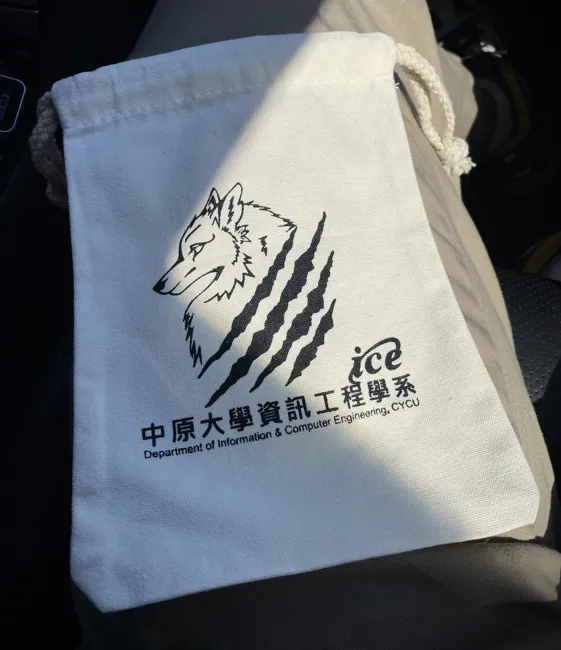
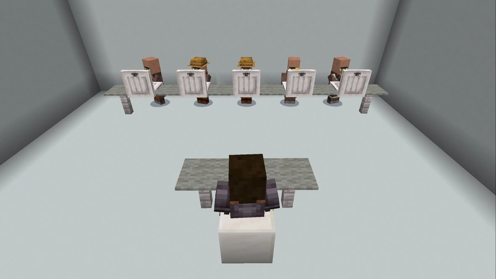

# 中原資工 特選面試心得

## 前言

中原大學資工系的面試剛好卡到段考，所以提前請了公假，隔天再來補考。面試是早上十點半，因此早上七點媽媽就載我一起出門了。高速公路交流道剛好在施工所以中間稍微繞了點路，差點開到桃園機場。

### 休息室

中原要等前二十分鐘才能報到。等待的時間可以在走廊的沙發、椅子坐著等。中原資工送了一個他們的袋子，蠻喜歡的。

## 面試過程

整個過程 8 分鐘，前兩分鐘是自我介紹，後面六分鐘問答。前面有五位教授，每位都拿了一台筆電看資料。有螢幕但沒有開來給我們投影，就直接坐在對面。

### 自我介紹

(自我介紹略)

教授：好，謝謝

(空氣安靜了十秒鐘，所有教授滑鼠瘋狂滾動)

### 資工 vs 資安

教授：你做了很多跟資安有關的東西，但你也還是有一些其他類型資訊相關的專案，所以我有點想好奇說你自己個人的偏好。

我：我覺得資訊工程跟資訊安全是相輔相成的，因為你看其實開發這麼多的網站或是軟體等等，其實中間都會牽扯到資訊安全。那麼我對於資訊安全的了解除了的 CTF 競賽以外，也會把它直接應用在實際上的開發，比如說在資料庫的防護，像是基本的 SQL Injection 或是在部署伺服器的時候，不會直接暴露 IP 會加 proxy 等等的，就是希望透過這些資訊安全的知識，實際上來幫助開發的專案能夠更安全。

### 時間管理

教授：基本上你做了很多的事情，我想知道一下你是怎麼做時間管理？

我：我會把事情列出來，當然是會先以學業為重把時間空出來，然後剩下的時間再去分配給社群或是我自己有興趣的專案。根據時間的急迫性來做排列。

教授：所以一般來說平均你在學業上花多少時間？

我大部分開發的工作，盡量都把它留在學校來完成，就是用午休或是下課時間完成。然後回家比較安靜、完整的時間留下來給讀書。

(沉默，瘋狂滾滑鼠)

### APCS

教授：那我有個好奇喔。因為看起來你的開發經驗很多，然後那個對於的程式了解也夠，為什麼你 APCS 只有三級分？

> 中原資工申請對 APCS 沒有要求。有辦法證明自己是個乖學生都可以報。

我：那一次比較可惜的是我其實四題最後都有解出來，題目的測資都對，但我好像最後繳交的時候時間壓太緊，後面兩題我好像交錯版本了。

(沉默，瘋狂滾滑鼠)

### 社群參與

教授：你當講師的的那些，其實也是其他學校的高中，好奇你們是怎麼交流這件事情。

我：一方面是我有加入中電會，結合台灣各個地方的高中生的社團。然後其他像是開源人年會還有學生計算機年會，這兩個比較多是大學生甚至是企業，但因為有參加這些活動並有擔任講者，所以就有機會可以接觸到更多不同的人。

教授：哦，哇

(沉默)

教授：這些課程的內容，對，講師課程的內容，在教材範圍，這些安排是要你自己處理的還是？

都是都是由我自己處理，然後我在課程安排上面不管是做怎樣的教學，無論是程式語言或是開發，我一定都會讓課程是有成果產出的。因為這樣你在學習的時候，你可以知道我學這個幹嘛？為什麼要學這個學演算法、學這個資料結構？我學 DFS、BFS 這些它不只是拿來解題目，它是可以實際解決開發中或甚至是生活中的問題。

教授：好，差不多了，謝謝。

我：好，謝謝教授。

## 心得

中原的教授都很和善，且問的問題都是我希望他們問的，感覺蠻好的。

## 後記

面試完之後開出去路上其實蠻多吃的。路上買了個 SUBWAY，應該是我人生中吃過最好吃的一次。接著我們就繼續北上開去山上逛逛。

> 封面圖：毛哥EM 攝於前往中原大學的路上
