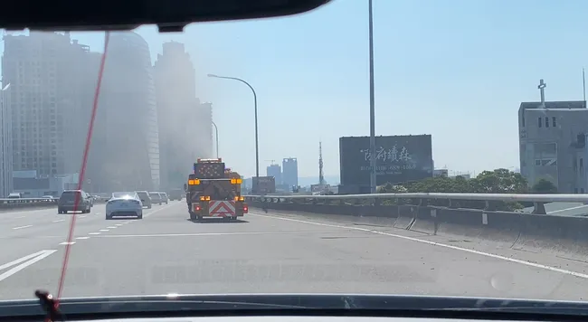

# 逢甲資工/資安 特選面試心得

## 前言

逢甲大學這是今天特殊選才面試的第二間學校。因為下午還要趕去台大因此教授溝通討論決定同時面試資工與資安。因為早上要先去暨南所以已經有延後到 11 點了，結果沒想到來的路上有一台卡車可能太累了側躺睡了一下 (應該是輪胎爆胎) 造成大塞車，只好打過去再延後半小時。打電話的時候旁邊還有一台救護車、三台拖吊車經過的聲音幫我證明。

### 休息室

休息室就在面試間斜對面，裡面有幾台 iMac、桌機、還有 3D 列印機，非常逢甲。裡面幾個人似乎是早上從宜蘭大學趕過來了，大概等了兩位就輪到我了。

## 面試過程

座位是最常見的三個教授對面坐。距離只有一個電視的寬度，非常近。

教授:「哦，毛哥嘛」

「還毛哥勒，你甚麼時候跟他變那麼熟？」

「沒有啊他自傳自己寫的」

「那可以先請你做一個簡單的自我介紹嗎？」

(自我介紹略)

教授：好，四平八穩的簡介。

### 時間分配

教授：我問你喔，像你課外活動這麼豐富，啊那你平常都不用讀書嗎？

我：平常我在時間上的安排是會把開發還有其他的工作在學校還有周末完成，回家以後比較完整、安靜的時間再留給讀書，

教授：所以就把時間先給專案，所以成績這樣嘛！

> 確實。

我：高一跟高二確實是比花比較多心思在我感興趣的資訊工程領域，但是在高二下之後因為學測所以有慢慢拉回來，所以連續多次拿到段考的最佳進步獎。

教授：是這樣📈然後📉📈📉📈📉 嗎？

「沒有啦他是說連續所以是📈這樣📈這樣📈這樣啦!」

「哦哦哦是👆這樣👆這樣👆這樣哦!」

「哦我還以為是👆這樣👇這樣👆這樣」

「欸回來繼續問」

「你要問嗎？」

「你要問的啊！這兩個面向都要問」

「你先問啦」

「你先啦你資安的先問」

### 資安研究

教授：看你有做一個陀螺儀資安的研究，那你可以跟我們分享一下嗎？

我：是的，我們有研究幾個面向：

- 第一個是我們發現特定頻率的聲音會造成手機陀螺儀的機械震盪，所以這樣子比如說你電腦有個很重要的個資，然後他是完全隔離網路、隔離藍芽的。但是我們可以用喇叭來播放超音波，然後這樣子把資料用二進制的方式傳到手機裡面，這樣就可以把資料帶出來。
- 然後另一個是我們是科學仰望盃做的實驗，我們開發了一個手環會一整天一直去追蹤你的陀螺儀數據，然後從陀螺儀數據就可以判斷出你一整天很詳細的行蹤，就是你在做什麼運動都可以分析出來。然後同時我們也把它跟心率結合來判斷出你一整天的壓力變化，來做日常的健康追蹤。

教授：用的陀螺儀需要很高級嗎？

我：沒有，就是隔壁光華 (口誤，應該是元華) 賣那種就是 100 多塊的，那種就可以了。

> 元華一百多超貴的。沒辦法，比賽前一天買的兩個都燒掉了。

教授：所以你是用人工智慧把陀螺儀的三軸變化轉換成人的講話嗎？

教授 2: 沒有啦他是拿到電腦的那個時間點...

我：對，不是。因為陀螺儀誤差的角度都超過聲音震動偏移的程度。他只有在完全靜止的情況下在某些頻率會很明顯，大概會有 0.1 度的偏移，然後二進制的方式來傳輸資料。日常追蹤是把陀螺數據丟去 TensorFlow 裡面做深度學習做出來的模型來判斷你在做什麼動作。

### 專案連結點不開

教授：毛哥你知道你有一些專案的連結打不開嗎？

我：哦，請問是哪一個。大部分的專案你直接用 Google 搜尋也都可以找到。

> 我猜有可能是食物探悉。因為蘇裔非不想繼續繳網域錢，然後備審還沒改連結。

### 漏洞通報

教授：你在通報的過程中最多的問題是什麼樣的類型？

我：最多的是 XSS。但有一些還蠻特別的，比如說像是因材網它比較不是直接的 XSS。他有一個留言區，雖然它已經會把 JavaScript 過濾掉，但是我發現你只要把它經過 JSFuck 以及雙重 URL 編碼，然後把它藏在比如說像是圖片的 onload 屬性裡面等等的就可以繞過它的監測。

### 推薦信

教授：請問你是怎麼拿到 XXX 教授的推薦信的？

(略)

教授：因為我們資安圈都很小。那你有看過逢甲資安的教授嗎？

我：我跟逢甲的教授比較沒有那麼熟。但我有認識蠻多逢甲的學長...

### 資工 VS 資安

教授：你以後會比較偏向資訊還是資安？

我：我覺得它兩邊是蠻相輔相成的..

教授：對我知道可能就資工你去開發應用，當然有資安的概念是很重要的。但你會比較想走開發還是打 CTF 那種資安的那邊？

我：那我可能是比較偏資工一點這邊

教授：你不要想要走資安嗎？🥺

我：但也很感興趣啦，但就相對來說，我更喜歡喜歡開發這邊。

教授：

「那我們就讓他在資工這邊就好，因為都進，就會變成重榜，所以我們其實有一點點在想，就是分數要怎麼分配。」

「本來是想說讓你在資安，如果你說比較想要走資工那我們就把妳放在那邊」

「因為以你的資歷應該不是學校在選你，是你在選學校。」

### 其他學校

教授：那你有報其他學校嗎？

我：因為很確定對資訊工程感興趣，所以蠻多學校都報名。

教授：有哪些有進面試的？

我：(稍微列了一下)

教授對另一個教授說：交大的學長，有什麼意見？

教授：(閒聊)

### 選擇

教授：我覺得你應該就是那種，高中以前就已經做夠多你本來應該、大家大學才在做的事情。所以反而是你選學校要比我們選你有意義。

教授：你的東西其實都可以去，但你要想你比較想要在哪個環境念書，還有你想學的東西到底哪一間學校比較能幫到你。

我：我覺得逢甲特別的在於蘋果開發以及創客資源比較多，而且產業合作非常的緊密。同時因為我高中是就讀西苑，除了可以把更多資源帶回到高中，也比較能照顧家人。

教授：那如果你上了交大你媽會不讓你去讀嗎？

我：這部分到時候我們可能還要再討論一下。

教授：你自己再決定，以你的能力，反正我們這邊應該都歡迎你。

我：謝謝教授。

## 後記

今天好像剛好是社團成果發表還有甚麼講座所以整間學校非常熱鬧，有很多攤位還有活動。不過沒什麼時間慢慢逛，擠出校門之後就趕回學校吃午餐了。下午還要去台大，希望能順利。

對了，去高鐵站的路上又遇到了車禍。

> 封面圖：炎火山攝於逢甲大學，以 [CC-BY-NC-SA](https://creativecommons.org/licenses/by-nc-sa/4.0/deed.zh-hant) 授權。經毛哥EM 後製合成處裡。
