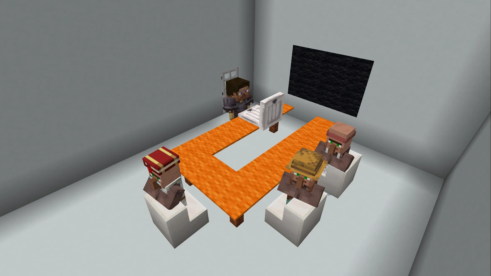
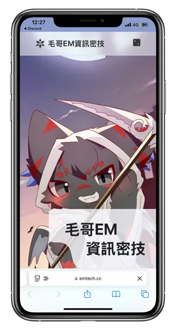

# 輔仁資工資安組 特選面試心得

輔仁大學與我頗有緣分。因為鐵人賽頒獎典禮來過，這次的路線頗為熟悉。只是從捷運站到校區的路上需要轉乘兩次，不僅路途較長、樓梯多且陡，連手扶梯也在維修 (縮圖圖片)。再加上高鐵和捷運站空調未開啟，使得行程稍顯疲憊。在高鐵上聽著 Minecraft, Volume Alpha 稍寢片刻，一路上除了緊張更多的是期待。

輔仁大學是我面試的第一間大學，過程還算順利。大部分的人都是有印紙本書審但沒帶。有的人帶三折頁，甚至是組裝的機器人車子，我當下決定用 iPad 把備審、網站專案整理出來，進去時遞給教授如果想要的話可以自己翻閱。教授面試時手上沒有拿備審，有的人感覺教授有看過有的人感覺教授完全沒看過，我的感覺是教授都順著我的介紹問。

以下是面試的過程還有我的心得。面試時間 12 分半（表定 10 分鐘。）

### 休息室

我大約十二點到到，小逛了一下樓下敦南書局、玩了一下 iPhone 16 的照相按鈕就上樓到休息室了。休息室是一間電腦教室可以自由座，有幾個熟面孔。螢幕重複播放資工系和社團的介紹，順便複習一下輔仁的特色。因為排在比較後面所以可以先打聽前面人的流程以及教室的環境。下午兩點被叫離開休息室，在門口等了 40 分鐘才輪到我。等的時候有和學長稍微尬聊。

輔仁資安分成三組、而我報的資工系資安組人最多，又分成兩間教室。另外一間面試教室聽說裡面有一個會說中文的國外黑哥，有的人被用英文問什麼是 XSS，有的人説他是被用中文問，不過我那間教室沒有。

## 面試過程

進去的時候他們還在聊上一個人的專題（好像是做遊戲代打之類的），我順便投影了一下設備。是和教授圍著兩張併排的桌子坐，和網路上學長的經驗相同。

### 自介

我：教授們好，很榮幸可以參加這次的面試，這裡是我的一些專案，可以給你們做參考。

教授：（看螢幕上的部落格）喔可以介紹一下嗎？

我：額我先簡單自我介紹一下，我是毛宥鈞，善長進行全端開發、數位藝術以及資訊安全，擅長透過科技解決生活中現實的問題，比如說像是個人網站「毛哥EM 的基地」裡面有超過四十個實用的工具，每個月有超過數萬名的使用者，希望可以幫忙解決生活中的問題。

教授：所以你是網紅囉

我：沒有啦，比較算是全端的開發者這樣子。在資訊安全方面，我在 HITCON ZeroDay 提交超過四十五個資訊漏洞，達到了總積分年排前十，然後其中包括一些政府部門，還有 Discord 等大型企業的資安漏洞。一直以來我依靠圖書館的資源來學習，因為是自學的關係，所以我發現網路上很多的教學資源中文資源比較少，因此我開創了我自己的資訊部落格「毛哥EM 資訊密技」，四年來已經累積超過一百四十萬字，用簡單易懂的方式分享各種技術的教學，還有開發的專案。也協助了無數的學生老師，甚至是企業來幫助他們解決開發上的困難，所以經常會收到他們的來信詢問。

在社群參與方面呢，我身為中電會的資訊組組長，還有西苑高中資訊志工隊的隊長，這一年來舉辦超過四十場的工作坊，同時我也在 SITCON 還有 COSCUP 等大型年會中擔任講者來分享我的經驗還有成果。

與傳統的競程與資安的學生不同，我具備更多實務開發的經驗，擅長透過科技來解決現實中發生的問題。所以期許能夠透過輔仁大學豐富的資源來繼續推動自己在資訊工程，還有數位創新上面的發展。

### 教學

教授：哇已經是講者了喔。

我：就是有學會的東西喜歡跟大家分享，因為跟其他人分享的同時也是在重新反芻，讓自己對知識有更全面的理解。

### 申請動機

教授：那你覺得輔仁能夠帶給你什麼？

（一開始我回答的很通俗，所以被聚焦問每間大學不都在 AI，輔仁能帶給你什麼。）

我：我覺得輔仁大學跟其他學校不一樣的地方是除了資工以外，文理法商都是全台非常頂尖的。包括我自己的父親也是輔仁大學企管系畢業的。然後同時輔仁大學跟國外也有很多的產學合作，或者五年碩的計畫等等都讓我覺得輔仁大學很吸引。

### iTHome 鐵人賽

我：然後加上輔仁大學的交通十分方便，而且我每年都有參加的 iTHome 鐵人賽頒獎典禮，其實也都是在輔仁大學的百鍊聽舉行的。

教授：你說你有參加鐵人賽，你最好的成績是什麼？

我：我參加這兩年，去年是鐵人，然後受出版社的邀請出版書籍，目前還在整理撰寫中。

教授：有出版了嗎？

我：因為現在進入到高三，我把重心先放回到學業上面，所以這個東西目前是先暫緩。去年是在講如何不用函式庫，就是用一些基本的數學來製作各種的網頁特效。那麼今年我是在講 DevOps，講如何使用 GitHub Actions 做自動化。因為加入中電會之後有非常多的開發和部署，但每個人其實都很忙，那麼交給人力來部署中間可能會遇到很多的問題，所以我開始研究各種如何集成服務並自動化部署。我們也可以將我們的代辦事項整合在一起，然後進行工作分配，來提高我們的效率。

### 資工 vs 資安

教授：你比較聚焦在資訊工程還是資訊安全？

我：我覺得資訊工程跟資訊安全是相輔相成的，比如說我進行這麼多網頁開發，資訊安全也是非常重要的。我在資訊安全的理解會直接把它應用在我的開發上，比如說像是資安的防護如 SQL Injection、XSS 等等的，或者像部署伺服器時會添加 proxy 不會直接把伺服器的 IP 暴露等等。

### 部落格（毛哥EM資訊密技）

（教授用手機 Google 毛哥EM，同時看到毛哥EM資訊密技和毛哥EM的基地問我是哪一個）

{{notice}}

By the Way,

我有部屬一個沒有廣告的版本，而教授從搜尋找到的版本除了有廣告以外，因為是萬聖節隔一天所以教授點開應該長這樣。

額，希望他喜歡黑曜石。

{{noticed}}

教授：可以講一下你的個人專案嗎？

我：既然講到毛哥EM資訊密集就可以先講一下，這個網站，比較特別，就是他的整個部落格，生成框架都是我自己寫的，而且他是1個spa應用程式，什麼意思比如說我點1個文章，你可以發現他載入的方式是這樣子，你會發現它頁面切換是有過渡、很流暢的動畫。我沒有使用任何框架是從底層開始自己手寫的，所以可以維持很高的性能，然後可以完全符合我自己的需求，然後那麼往下看你可以看一下它在頁面的切換當中，他是會像那種抖音一樣，你可以一直往下滑下去，中間是有很流暢的動畫，這也是一些基本的三角函數等等的一些數學計算，然後搭配定位來做到網頁效果。基本上我可以對這些技術有很深的認識，所以這樣子可以很自由的來做開發這樣子。

教授：你是使用什麼技術寫的？

這整個網頁從他的後端的生成器都說我從頭開始寫的。它是一個靜態網頁，會用靜態網頁是為了希望可以提高它的效能，然後同時也可以減少伺服器的負擔。後端是使用 Node.js 是用寫的，前端沒有使用傳統的框架，像是 Vue, React, 或是像 Tailwind, Bootstrap 等等的模板。像是我知道輔仁大學輔仁大學資工系特選的網站是使用 Webpack。這裡我一定要提一下輔仁大學特選的網站 UI UX 絕對是所有學校當中最好的。

教授：哦，怎麼說？

我：就是整個報名的體驗非常流暢，而且看得出來是用特別設計過，的沒有模板味。

> 輔仁大學的網站真的有讓我驚艷到，但檔案大小限制 10MB 有把我驚嚇到。他乾脆規定繳交格式 .txt 算了。

教授：哦我們資工系的網站是用 Vue… 哦你是說資工系的還是一半申請的？
另外一位教授：他應該是在說學校他們的…

> 這裡補充一下，後來回想發現這一段其實蠻尷尬的。我說成輔仁大學「資工系」的特選網站，教授以為我是在講他們系的網站好看所以他看起來很激動。然後我確實忘記輔仁資工系的網站是用什麼寫的所以當時有點尷尬。他們的網頁設計的蠻用心的，蠻多細節和動畫，害我還以為是 Wordpress，事後一看不得了，後段 Node.js 前端 Vue + Bootstrap 就算了，還來 GSAP。非常有料的操作，完全符合所有我前面提到我熟悉但選擇不使用的技術。教授看起來蠻有興趣聊的但被其他兩個教授打斷說讓我講。

另外一位教授：你讓他講啦！你繼續說。

我：（突然丟回來給我害我愣了一下，還在回憶他們的網站是用什麼寫的）對就是，所以就是覺得這也是蠻特別。

### Gemini

教授請我講一下我的專案，突然不知道講什麼所以我問教授有沒有那個特別感興趣的。這時我突然想到仰望盃還沒講所以我說或者我就繼續講。

教授手上沒有拿備審也不知道問什麼，就隨手指了我螢幕上部落格的文章。

教授：就講這個 Gemini 吧

{{notice}}

備註

如果你不知道的話，Gemini 簡單來說就是 Google 的 ChatGPT

{{noticed}}

這裡我看起來很淡定但心裡滿滿問號，我有那麼多專題從來沒想過這個會被拿來講（可能看縮圖還不錯看又是 AI 吧）。那篇文章就只是一個簡單的 API 介紹，根本稱不上專案。

我：這個還蠻簡單的，就只是一個 API 教學。因為那個時候 Gemini 來剛出，所以我就是教大家如何使用他的如何 API 這樣子一路的設定，然後讓大家在網頁上面來製作自己的這個聊天的機器人。

教授：那就可以寫書了對吧

我：其實文章寫那麼多，大家還是看得出來的。

教授：那你可以 Demo 嗎？把它叫出來跟他聊天之類的。

我心裡想這就只是一個軟體介紹而已哪有什麼實作。但不想讓教授失望所以我簡單介紹中電會，然後說我們把 Gemini 串在中電喵上回答我們的問題。

教授：可以把它叫出來嗎？

這時候我突然想到這個想法拖了半年了好像根本還沒串，於是我 Demo 了我們用 AI 幫我們 GitHub PR 做 Code Review。總結做的編輯，順別扣回資安展示它如何幫我們找到資安漏洞。

> 這裡有點小尷尬。一個是 Pull Request 全部被版本更新塞滿，本來想要用留言跟他對話但知道他回覆會很久，而且根本不知道要問什麼。然後好不容易找到的編輯，結果只是一個學弟的小修改，Coderabbit 根本沒有任何意見。退一萬步講，Coderrabbit 跟 Gemini 其實一點毛關係都沒有（好啦兔子有毛，Gemini 毛很多 API 很不穩），不過教授們看起來是蠻滿意的。

### 時間分配

教授：你做這麼多事，那你有時間讀書嗎？

（所有教授大笑）

在時間規劃方面，我是以學業為核心，然後在剩下的時間再去做分配。在前面高一高二的時間，我確實花比較多的精力在資訊工程方面，那麼在高二下之後就開始比較收心了，所以連續多次段考拿到最佳進步獎。現在就是先把重心放回到學業上面，因為其實可以看到我前面做很多的網頁或深度學習，其實他們的核心都還是一些基礎的物理，還有數學等等的，所以就是把重心重新拉回來，希望也可以掌握好理論的基礎。

### 盈利

教授：你這樣子有盈利嗎？

我：個人部落格有，其實也不多啦。因為是以技術為主所以流量不會有娛樂新聞等等這麼高。每年大概就一兩千塊，但其實已經足夠伺服器和網域的開銷，所以是可以達到完全的自主運營。
然後有一些的專案是有收到贊助的。比如說 emfont 是我做的免費中文 Webfont 服務，就是因為中文字體很大。那他其實就是受到 OSS Planet 還有 Zeabur 等等的贊助。那麼這樣子可以我有想法，然後他們可以提供資源來讓這些東西實現。

### 開源

教授：你有參與開源專案嗎？

（這裡剛好補上我前面自我介紹忘記講到的。）

我：有喔，今年 COSCUP 開源者年會，我有在裡面分享議程，分享中電會我們今年做的各種這樣開源專案。然後 emfont、emblog 部落格生成器其實也是完全開源的。

我今年在 GitHub 提交超過八十個 Pull Request，包括技術開發以及翻譯工作。像是 Fullpage.js、facebook 的 Lexical 的官網還有文檔都是由我維護，還有進行翻譯的這樣子。

教授：還想再繼續聊但我們時間差不多了。

我：好，謝謝教授。

教授；對了請問你是什麼高中的？

我：西苑高中、台中市的

教授：中部的對吧

我：對，謝謝教授。

## 心得

從外頭聽到其他同學的經驗，教授的問題似乎多半圍繞在申請者的專案上。只有在申請者沒有專案時，才會深入詢問學業或理論問題。這次因為談論的內容與我的專業密切相關，對話進行得非常流暢，雖然沒有按照原本計畫好的順序，但重要的細節也都順利呈現了。回想時，發現自己在緊張中不自覺地重複「然後」、「這樣」這些語助詞。整體來說，我給自己 80 分，感覺教授對我的分享有濃厚的興趣，甚至親自查了資料，還詢問了我的學校背景。

中午沒什麼胃口沒吃午餐，回程時在板橋高鐵站順手買了十幾年沒嚐過的呱呱包。還是一如既往地走錯路，這次又不小心走到高鐵的出口，再繞回進站入口，最後才找到售票口的正確方向。台北車站我從來不會迷路，但這裡的路線真是曲折。回到台中，搭捷運返家時剛好碰上明道中學放學的人潮，第一次見到這樣的熙攘場面。

隨著捷運站內輕柔的爵士樂調結束了輔仁的篇章，但面試的旅程才剛剛開始。未來還有許多可以調整的地方，期待迎接接下來的挑戰。

> 封面圖：毛哥EM 攝於板橋車站
