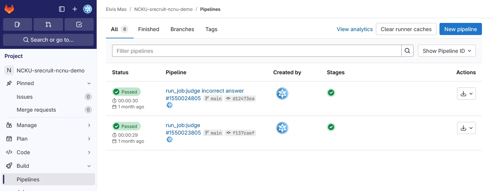
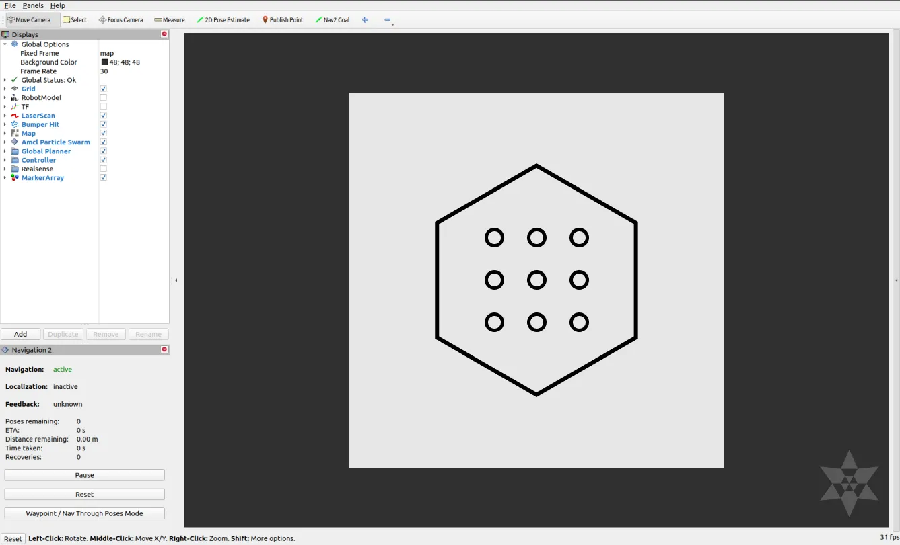
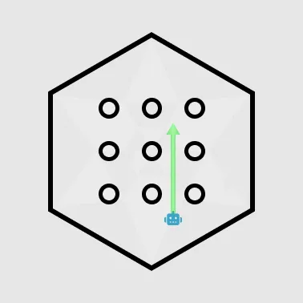
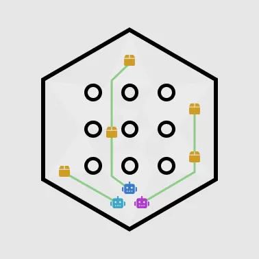

# 2024 成大資工特選乙組 上機考考題及心得

> 上圖背景為我高一時參加成大*大學科系探索課程【工學與資訊】課程*第五天的課程：桌球正手拍動作量測與訊號分析體驗，剛好是在資工系新館，。這五天的課程都很有趣。  
> 學生提問：「未來在科技業要培養甚麼樣的能力才能避免成為碼農？」  
> 教授：「當碼農沒有甚麼不好啊，當碼農很好啊！」

成功大學特殊選才乙組上機考考題分享。

{{notice}}

注意事項

以下題目根據我和好幾位朋友的記憶[蒸餾](https://en.wikipedia.org/wiki/Knowledge_distillation)而成，內容可能有些許出入 (聽起來比較簡潔且像人話)，僅供參考。

{{noticed}}

## 前情提要

這次的考試是 2024 年 11 月 16 日舉行的。8:20 開始入座，入座之後可以先登入你習慣的帳號 (如你買了 ChatGPT Plus)。到九點公布題目，會要求把手機關機，考試過程中禁止安裝軟體 (包括 VS Code 套件) 及對外通訊，但全程有對外網路可以搜尋資料。禁止安裝軟體我猜是因為有一些套件有現成的演算法可以直接解決問題。

助教在公布題目後會稍微講解一下題目，你可以廳或是直接開始操作。中間看大家解不出來助教有再給幾次提示。從九點開始寫提一路到下午四點，中間 12 點把所有人帶去房間吃便當，過程禁止交談。吃到 12:30 就可以回去繼續寫。

### ⽰範程式測試

考試前一個禮拜 (11 ⽉ 08 ⽇) 時有寄給我們一份⽰範程式測試。裡面有考試相關資訊還有一個⽰範的題目。考前一天他們晚上有把系統 (他們自架的 GitLab) 開一下。登入信箱收到的帳號與密碼就可以練習上傳看看。

## 考試環境

### 語言

- C ([C99](https://zh.wikipedia.org/zh-tw/C99))
- Python 3.10

### 開發環境

| 軟體               | 版本 備註                                      |
| ------------------ | ---------------------------------------------- |
| Ubuntu             | 22.04 LTS (作業系統)                           |
| VS Code            | 整合式開發環境                                 |
| GNU C Compiler     | C 語言編譯器                                   |
| Zenoh              | 資料傳輸                                       |
| Docker             | 每題的機器人環境，使用 osrf/ros:humble-desktop |
| Bourne-Again Shell | bash                                           |
| ROS2 Humble        | 機器人操作系統                                 |
| Rvis2              | 監控和調整                                     |
| Gazebo             | 物理環境模擬                                   |
| Navigation 2       | 自主導航                                       |

### 測驗系統

我們要寫程式控制機器人在 3D 物理模擬環境 (Gazebo) 中完成指定動作。整理架構如下：

- Server
    - Master
        - Client
            - Slave
    - Master
        - Client
            - Slave
        - Client
            - Slave

* Master: 傳輸資料，記錄過程。
* Client: 溝通橋梁，對機器人下指令。
* Slave: 一個個 ROS2 機器人系統。可以根據指示移動。

### 評分系統

每題寫完之後後我們要把指定的檔案 push 到 GitLab，

接著 GitLab CI (Judge) 就會根據你的 commit message 來判斷要改哪一題，檢查你的錄影並進行評分。評分後把分數上傳到他們的 Google Sheets 讓他們即時查看。你可以在 CI 的 Log 裡面看到你的分數或其他錯誤。



## 試題

你會拿到一份試題的 PDF，以及一個 GitLab Repo。Repo 的結構大致如下 (印象中大致為這樣):

```
│  .gitignore
│  .gitlab-ci.yml
│  cleanup.sh
│  judge
│  README.md
│  verify.py
├─baseline
│  ├─1  (用來上錄影的資料夾)
│  ├─2
│  ├─3
│  ├─4
│  planner
│      └─nav2_planner
│          │ CMakeLists.txt
│          │ plugin.xml
│          │ package.xml
│          │ planner.hpp
│          └─planner.cpp
└─improved
    │  algorithm.c
    │  algorithm.h
    │  calculate_distance.c
    │  CLIENT.json5
    │  client.py
    │  crossover.c
    │  MASTER.json5
    │  master.py
    │  mutate.c
    │  plot_path.py
    │  SERVER.json5
    │  server.py
    │  server_send.py
    └─ros2_ws
        └─略 (ROS2 workspace)
```

### 評分方式

分數 = 解題分數 + (1 - 完成次序/考生人數)

(簡單來說就是比解題分數，如果分數相同先完成的人分數會比較高。)

原本是規定要解完第一大題前兩題才能解第二大題，但看我們分數太低了就取消了這個規定。

### 第一大題：自動駕駛

這一大題你需要逐步建立一個自動駕駛系統。你會拿到一個寫到一半有 bug 的程式，你要當作 Copilot

每次考試寫完程式之後需要跑一次 demo，過程需要用 rosbag 錄下來 (類似螢幕錄影的概念)。完成後把錄好的檔案 push 到你的專屬 Repo。

修改完成程式首先你需要啟動錄影：

```
ros bag record -o baseline_1 /map /odom
```

然後再開一個 terminal 使用以下指令來啟動模擬器：

```
ros2 launch turtlebot3_navigation2 navigation2.launch.py map:=/maps/map.yaml
```

(後面根據情況需要加一些參數，像是指定地圖等等。)

等全部錄製完之後回到回到原本的 terminal `ctrl + c` 停止錄影：

#### 第一小題：啟動 Nav2 (15 分)

有一個 `SERVER` 負責傳送資料 (它其實是一個執行檔，會定時丟資料出來)， `storage.py` 則負責接受資料並產生地圖。你要修復程式讓 `storage.py` 能夠正確接收資料並產生地圖。問題是 `storage.py` 並不知道 `SERVER` 會資料到哪個頻道，所以你需要修改程式全部接收。拿到地圖後啟動即可。



#### 第二小題：設定目標點 (10 分)

將 [Planner Server](https://docs.nav2.org/configuration/packages/configuring-planner-server.html) 掛接至 Nav2 系統中，並往前移動到指定範圍內。Planner Server 裡面有幾個語法錯誤需要修正。你需要使用 2D Pose Estimate 按鈕控制讓他往前一個單位。也可以使用 [Simple Commander API](https://docs.nav2.org/commander_api/index.html) 來控制它移動。



#### 第三小題：尋找最短路徑 (10 分)

更改機器人的啟動位置，讓起點和終點之間的路徑最短。

#### 第四小題：自動駕駛 (15 分)

讓機器人在給定起點和終點的情況下自動駕駛。修改 Nav2 裡面的 Planner Server 路徑規劃演算法，讓機器人能夠自動駕駛到終點。

### 第二大題：一堆機器人

我們要一次控制一堆機器人，每個機器人建立專屬的 Topic 來接收訊號。

> 可以參考這篇文章：[An Adaptable Approach to Multi-Robot Navigation in ROS2: Utilizing Turtlebot3 and Nav2](https://medium.com/@arshad.mehmood/a-guide-to-multi-robot-navigation-utilizing-turtlebot3-and-nav2-cd24f96d19c6)

你需要實現一個排程演算法，有點像做一套 Uber Eats。系統會告訴你有哪些點需要經過，然後你要分配不同機器人去不同點，在最短時間內完成任務。

具體流程是 Server 會告訴你目標點，然後你要通知各個主人 (Master) 去請他負責傳話的 (clinet) 去通知機器人~~奴隸~~ (Slave) 去完成任務。



#### 第一大題：實現排程演算法 (22 分)

你要當 Google Maps 幫機器人們規畫路徑。

可以參考基因遺傳演算法 (Genetic Algorithm) 或其他演算法。程式分為三個區塊，裡面分別都有一些小問題要修復。每個區塊五分共十五分。接著你可以嘗試優化它，依照速度最高可以再獲得 7 分。

{{notice}}
小提示

一些語法錯誤直接 GPT 解就可以了。
{{noticed}}

#### 第二大題：讓機器人跑起來 (28 分)

範例程式裡面只有負責規劃路徑跟控制機器人。除了有一些邏輯跟語法錯誤需要修正，把 Master 規劃好的路徑告訴 Client 這部分還需要自己實作。你可以觀察模擬器畫面來判斷是否正確。(11 分)

但有移動不代表走的路是對的。裡面還有一些語法跟邏輯錯誤需要修正，根據完成數量和時間來計算分數 (17 分)。

## 心得

好啦，以上就是這次的考試內容。它是一個非常有趣且綜合的測驗，你除了需要熟悉程式語言、各種演算法、以及 git、Docker 等工具以外，還需要了解機器人的運作原理，很考驗短時間內自學的能力。是一個蠻好的綜合程式能力測驗。

成大特選沒有面試，且分為甲乙組。甲組聚焦在競程而乙組聚焦在開發，在申請時就要求提供 GitHub 作品。以往是考試過程可以去找教授聊聊，但這次是移動到考試結束之後可以再去找教授。 (這部分不計分)

聽說這個主題就是現在大一的學生在學的，所以如果你有興趣的話可以多多研究。每年得題目跟規則都不太一樣，像是去年是可以裝軟體的但今年就是完全不行，所以也不用從今天開始就開始專研 ROS。成大雖然從課程安排、行政處理、到教育理念與我不太相同，但這次的考試我覺得是個有趣難忘的體驗。如果你對特殊選才有興趣的話可以參考看看我的[特殊選才心得](/p/srecruit)。
